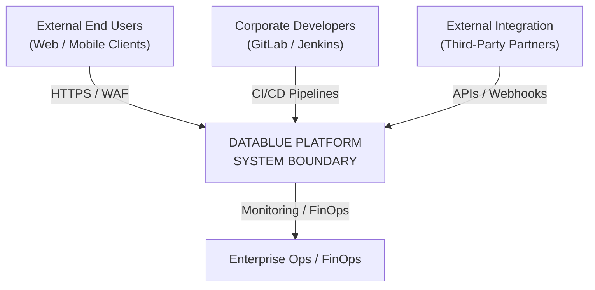
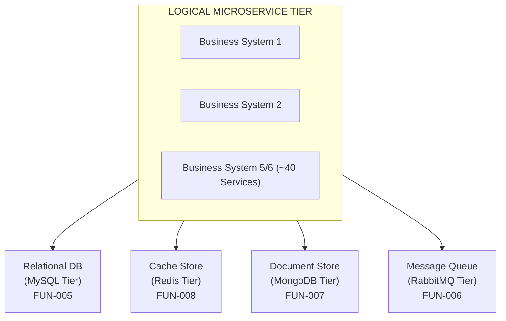
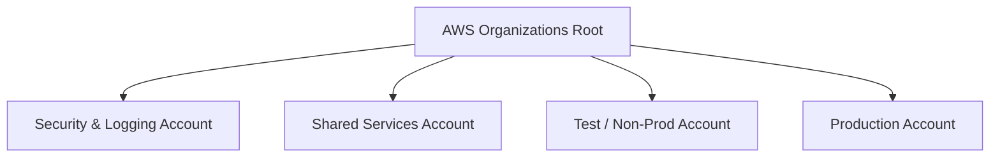
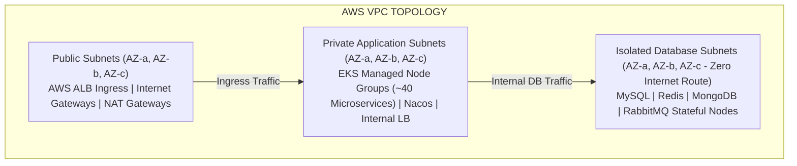
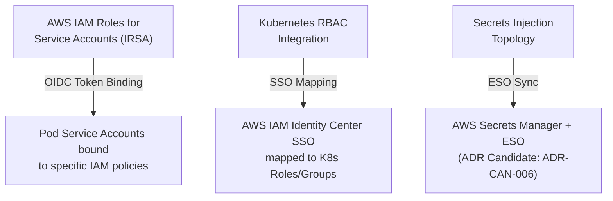
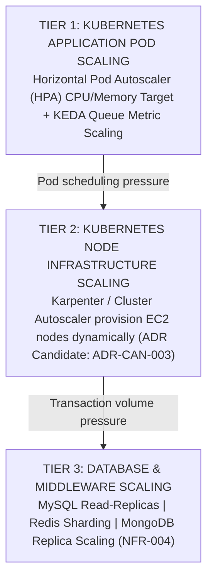
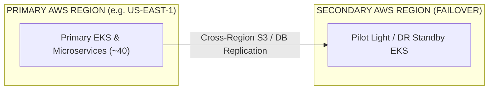
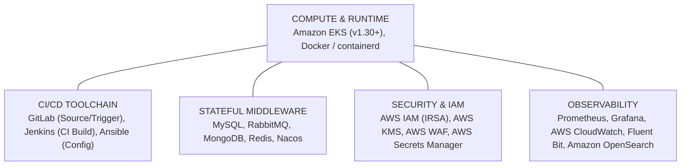

# Architecture Specification: DataBlue Next-Gen Infrastructure Platform

> **IMPORTANT STAGE 2 NOTICE**: This document defines the Target Architecture Specification for the **DataBlue Next-Gen Infrastructure Platform** (`datablue-nextgen-infra-platform`). In accordance with Stage 2 rules, **no implementation code (Terraform, Helm charts, Kubernetes YAML, or AWS CLI commands) is generated herein**. Major architectural decisions are cataloged as **ADR Candidates**, and missing sizing metrics are recorded as **Architecture Assumptions**.

---

## 1. Architecture Principles

* **Tracing Requirements**: Mapped to [`BUS-001`](../01-requirements/REQUIREMENTS-REGISTER.md), [`BUS-002`](../01-requirements/REQUIREMENTS-REGISTER.md), [`BUS-003`](../01-requirements/REQUIREMENTS-REGISTER.md), [`BUS-004`](../01-requirements/REQUIREMENTS-REGISTER.md), [`AGENTS.md`](../../AGENTS.md).

The architecture of the DataBlue Next-Gen Infrastructure Platform is governed by six core principles:

1. **Decoupled Architectural Boundaries**: Maintain explicit separation between Logical Architecture, Physical Deployment, Network Infrastructure, and Operations. Never blur runtime boundaries.
2. **Blast Radius Minimization**: Enforce physical isolation between Test and Production workloads at the AWS Account and EKS Cluster level. Shared cluster multi-tenancy across environments is strictly prohibited without formal executive sign-off (`ADR Candidate: ADR-CAN-001`).
3. **Zero Hardcoded Secrets & Least Privilege**: All container workloads must authenticate to AWS services using IAM Roles for Service Accounts (IRSA). No long-lived security credentials or static API keys are allowed inside containers or repositories (`SEC-001`).
4. **Declarative Immutable Infrastructure**: 100% of cloud resources, cluster state, and configuration management must be driven declaratively via version-controlled IaC and GitOps pipelines (`BUS-002`). Manual AWS Console tweaks are forbidden.
5. **Decoupled Resiliency Models**: High Availability (Multi-AZ redundancy), Point-in-Time Backup, and Disaster Recovery (Cross-Region failover) must be treated as independent design domains with separate SLA/SLO metrics (`NFR-001`, `NFR-003`).
6. **Reversibility under Uncertainty**: Where customer workload metrics are unavailable, choices must prefer loose coupling and reversible abstractions (`Architecture Assumption: ASM-006`).

---

## 2. System Context

* **Tracing Requirements**: Mapped to [`BUS-001`](../01-requirements/REQUIREMENTS-REGISTER.md), [`FUN-001`](../01-requirements/REQUIREMENTS-REGISTER.md)–[`FUN-009`](../01-requirements/REQUIREMENTS-REGISTER.md).

### 2.1 System Boundary & External Actors
The DataBlue Next-Gen Infrastructure Platform serves as the container orchestration, messaging, state persistence, and operational backbone for approximately 5–6 business systems comprising ~40 microservices.

### 2.2 System Interoperability
* **Inbound Traffic**: External web/mobile users enter via **Cloudflare Enterprise Edge (Cloudflare DNS, CDN & WAF)**, routing through AWS Application Load Balancers (ALB) into the EKS ingress layer.
* **Developer & CI/CD Pipeline**: Developers commit code to GitLab, triggering Jenkins CI jobs for image compilation and security scanning, followed by Ansible/GitOps deployment into EKS.
* **Third-Party Gateways**: Secured egress connectivity via NAT Gateways and AWS Network Firewall for external banking/payment integration.

---

## 3. Logical Architecture

* **Tracing Requirements**: Mapped to [`FUN-001`](../01-requirements/REQUIREMENTS-REGISTER.md), [`FUN-005`](../01-requirements/REQUIREMENTS-REGISTER.md)–[`FUN-009`](../01-requirements/REQUIREMENTS-REGISTER.md).

### 3.1 Logical Microservice Tier
The application domain consists of ~40 stateless microservices grouped logically into 5–6 business domains (e.g. Core Banking/Payment, User Identity, Order Processing, Notification Engine, Analytics, Partner API Gateway).

* **Microservice Runtime**: Stateless Docker containers managed by Kubernetes Deployments across dedicated namespaces per business domain.
* **Service Registration & Configuration**: Nacos provides centralized service discovery, dynamic configuration management, and health checking (`FUN-009`).

### 3.2 Logical Data & Middleware Tier
The logical data flow decouples transient state, relational storage, unstructured data, and event streaming:

* `ADR Candidate: ADR-CAN-002`: Stateful Middleware Architecture Strategy under evaluation (AWS Managed RDS/ElastiCache/MSK vs. Self-Hosted Middleware Operators on EKS).
* `Architecture Assumption: ASM-001`: Microservices are assumed to be 12-factor compliant, storing state exclusively in the database/cache tiers.

---

## 4. Deployment Architecture

* **Tracing Requirements**: Mapped to [`BUS-003`](../01-requirements/REQUIREMENTS-REGISTER.md), [`SEC-002`](../01-requirements/REQUIREMENTS-REGISTER.md), [`NFR-001`](../01-requirements/REQUIREMENTS-REGISTER.md).

### 4.1 Physical AWS Account Structure
To satisfy strict environment isolation (`BUS-003`, `SEC-002`), the physical deployment uses an AWS Organizations multi-account landing zone topology:

1. **Security & Logging Account**: Centralized AWS CloudTrail, AWS Config, GuardDuty, and S3 Log Archive bucket (`OPS-002`).
2. **Shared Services Account**: Hosts GitLab repositories, Jenkins master/build nodes, Ansible automation server, and private AWS ECR container registry (`FUN-002`–`FUN-004`).
3. **Test / Non-Production Account**: Dedicated EKS Test Cluster, non-prod database instances, isolated VPC (`BUS-003`).
4. **Production Account**: Dedicated EKS Production Cluster, multi-AZ production database instances, isolated VPC (`SEC-002`).

* `ADR Candidate: ADR-CAN-001`: Physical Account & Cluster Isolation confirmed as baseline architecture candidate.

### 4.2 Multi-AZ Cluster Layout
Within each environment AWS Account, worker nodes are distributed across 3 Availability Zones (AZ-a, AZ-b, AZ-c) to prevent zone outage downtime (`NFR-001`).

---

## 5. Network Architecture

* **Tracing Requirements**: Mapped to [`SEC-002`](../01-requirements/REQUIREMENTS-REGISTER.md), [`SEC-003`](../01-requirements/REQUIREMENTS-REGISTER.md), [`FUN-002`](../01-requirements/REQUIREMENTS-REGISTER.md)–[`FUN-004`](../01-requirements/REQUIREMENTS-REGISTER.md).

### 5.1 VPC Subnet Topology
Each VPC is carved into three distinct subnet tiers across 3 Availability Zones:

1. **Public Subnets**: AWS Application Load Balancers, NAT Gateways for outbound egress.
2. **Private Application Subnets**: EKS Worker Nodes hosting microservices and Nacos. Private access only; internet egress routed via NAT Gateways.
3. **Isolated Database Subnets**: Dedicated for MySQL, Redis, MongoDB, and RabbitMQ stateful instances. No direct internet ingress or egress routes permitted.

* `ADR Candidate: ADR-CAN-004`: Ingress Controller Architecture under evaluation (AWS ALB Controller + NGINX Ingress vs AWS VPC Lattice).

---

## 6. Platform Components & LLD Execution Targets

* **Tracing Requirements**: Mapped to [`FUN-001`](../01-requirements/REQUIREMENTS-REGISTER.md)–[`FUN-009`](../01-requirements/REQUIREMENTS-REGISTER.md).

### 6.1 High-Level Component Summary
| Platform Component | Functional Scope | Deployment Target | Architectural Role |
| :--- | :--- | :--- | :--- |
| **Amazon EKS** | Kubernetes Runtime Engine (v1.30+) | **AWS Managed Service** | Compute orchestration for ~40 microservices (`FUN-001`). |
| **GitLab** | Source Control & Pipeline Triggers | **EC2 Instance** (Standalone) | Code repositories, merge requests, Webhook triggers (`FUN-002`). |
| **Jenkins** | CI Build & Package Orchestrator | **EC2 Instance** (Standalone/Dynamic) | Docker build, test execution, image scan, ECR push (`FUN-003`). |
| **Ansible** | Drift Management & Deployment | **EC2 Instance** (Standalone) | Infrastructure configuration, playbook deployment (`FUN-004`). |
| **MySQL** | Relational Database Tier | **AWS Managed Service** (RDS) | High-availability transactional storage (`FUN-005`). |
| **RabbitMQ** | Message Broker & Event Streaming | **AWS Managed Service** (Amazon MQ) | Asynchronous inter-service event communication (`FUN-006`). |
| **MongoDB** | Document Database Store | **AWS Managed Service** (DocumentDB) | High-performance unstructured data store (`FUN-007`). |
| **Redis** | In-Memory Cache | **AWS Managed Service** (ElastiCache) | Low-latency session caching (`FUN-008`). |
| **Nacos** | Service Discovery & Dynamic Config | **EKS Pod** (`StatefulSet`) | Microservice registration and dynamic config (`FUN-009`). |

### 6.2 Low-Level Design (LLD) Component Target Matrix
For maximum clarity and readability, the Low-Level Design (LLD) is structured into 3 distinct category tables:

#### Group 1: EKS Cluster Workloads (Kubernetes Pods)
| Component Name | Workload Type | Compute & Pod Spec | Subnet & Volume Spec | High Availability & Backup |
| :--- | :--- | :--- | :--- | :--- |
| **40 Microservices** | `Deployment` | XS–XL (0.1–1 vCPU, 0.25–2GB RAM) | Private App Subnet \| Ephemeral / PVC | HPA (70% CPU) + Karpenter JIT \| Velero S3 Snapshot |
| **Nacos Cluster** | `StatefulSet` | 3 Replicas (0.5 vCPU / 1GB RAM) | Private App Subnet \| 10 GB EBS `gp3` PVC | 3-Node Raft Cluster (3 AZs) \| Backed by RDS MySQL |
| **ArgoCD Controller** | `Deployment` | 2 Replicas (0.5 vCPU / 1GB RAM) | Private App Subnet \| Stateless | Multi-AZ Pod Anti-Affinity \| Git History |
| **External Secrets (ESO)** | `Deployment` | 2 Replicas (0.1 vCPU / 256MB RAM)| Private App Subnet \| Stateless | Multi-AZ Pod Anti-Affinity \| Velero Manifest Backup |
| **Prometheus & Grafana** | `StatefulSet` | Prom (1vCPU/4GB), Grafana (0.5vCPU/1GB) | Private App Subnet \| 50 GB EBS `gp3` PVC | Multi-AZ Pod Anti-Affinity \| EBS Snapshot + S3 Export |
| **Fluent Bit Logging** | `DaemonSet` | 1 Pod / EKS Worker Node | Local Node Buffer | Automatic per-node \| Streams to OpenSearch & S3 |
| **Velero Operator** | `Deployment` | 1 Replica (0.2 vCPU / 512MB RAM) | Private App Subnet \| Stateless | Single pod auto-restart \| S3 Evidence Vault |

#### Group 2: AWS Managed Services
| AWS Service | Service Class | Instance / Sizing Class | Subnet Boundary | High Availability & Backup Policy |
| :--- | :--- | :--- | :--- | :--- |
| **EKS Control Plane** | Amazon EKS | Managed EKS Control Plane (`v1.30+`) | AWS Managed VPC Boundary | Multi-AZ etcd Quorum \| AWS Managed Continuous Backup |
| **MySQL Database** | Amazon RDS | RDS MySQL (`db.m6g.xlarge` Multi-AZ) | Isolated Database Subnet | Primary/Standby (< 60s failover) \| Snapshots + 30-Day PITR |
| **Redis Cache** | Amazon ElastiCache | ElastiCache Redis (`cache.m6g.large`) | Isolated Database Subnet | 2-Node Multi-AZ Group \| Daily RDB Snapshot to S3 |
| **RabbitMQ Broker** | Amazon MQ | Amazon MQ RabbitMQ (`mq.m6g.large`) | Isolated Database Subnet | 3-Node Multi-AZ Quorum Broker \| Automated EBS Snapshots |
| **MongoDB Store** | Amazon DocumentDB | DocumentDB (`db.r6g.xlarge` 3-Node) | Isolated Database Subnet | 3-Node Cluster (3 AZs) \| 30-Day Continuous PITR |
| **AWS Secrets Manager** | Secrets Manager | Managed Key-Value Vault | Security Account / Private Access | Multi-Region VPC Endpoint Access \| AWS Managed Replication |
| **Amazon OpenSearch** | OpenSearch Service | `2-node r6g.large.search` Cluster | Private Application Subnet | 2-AZ Search Distribution \| Automated Daily Snapshots |
| **Amazon S3 / Glacier** | S3 / Glacier | Standard & Glacier Flexible | Regional Endpoint | Multi-AZ Regional Durability \| S3 Versioning & Lock |
| **App Load Balancer** | Application Load Balancer| Managed ALB Ingress Controller | Public Internet Subnet | Active-Active Multi-AZ Routing \| AWS Infrastructure Managed |

#### Group 3: Standalone & Dynamic EC2 Toolchain Instances

| EC2 Server | Component Role | Instance Type / Compute | Subnet & Storage Spec | High Availability & Backup Policy |
| :--- | :--- | :--- | :--- | :--- |
| **Karpenter Worker Nodes** | Dynamic EKS Worker Nodes | `m6g.large`, `c6g.large`, `r6g.large` | Private App Subnet \| 50 GB EBS `gp3` | Karpenter JIT NodePools (3 AZs) \| Stateless Replacement |
| **GitLab Enterprise** | Source Control & Webhooks | `m6g.xlarge` (4 vCPU / 16GB RAM) | Shared Services Private \| 200 GB EBS `gp3`| Standby AMI Snapshot Recovery \| Daily AWS Backup AMI |
| **Jenkins Master Server** | CI Build Orchestration | `m6g.xlarge` (4 vCPU / 16GB RAM) | Shared Services Private \| 100 GB EBS `gp3`| Single-Node Auto-Recovery ASG \| Daily AWS Backup AMI |
| **Jenkins Dynamic Workers**| Ephemeral Build Agents | `c6g.large` EC2 Spot Instances | Shared Services Private \| 30 GB Ephemeral | Auto-terminated upon job completion \| Stateless |
| **Ansible Control Engine** | Configuration & Playbooks | `t3.medium` (2 vCPU / 4GB RAM) | Shared Services Private \| 30 GB EBS `gp3`| Standby AMI Snapshot Recovery \| Git Repository Backup |

---

## 7. Security Architecture

* **Tracing Requirements**: Mapped to [`SEC-001`](../01-requirements/REQUIREMENTS-REGISTER.md), [`SEC-002`](../01-requirements/REQUIREMENTS-REGISTER.md), [`SEC-003`](../01-requirements/REQUIREMENTS-REGISTER.md).

### 7.1 Defense-in-Depth Model
The security architecture implements a 4-tier security perimeter:

1. **Perimeter Edge**: AWS WAF rules protecting ALB against OWASP Top 10 vulnerabilities, rate-limiting HTTP floods.
2. **Network Perimeter**: Security Groups acting as stateful firewalls; NetworkPolicies restricting pod-to-pod east-west traffic (`ADR Candidate: ADR-CAN-005`).
3. **Host & Container Guardrails**: EKS node OS hardened with Amazon Linux 2 / Bottlerocket; read-only root filesystems enforced for container pods.
4. **Data Encryption Layer**: Envelope encryption using AWS KMS for all EBS volumes, RDS storage, ElastiCache, S3 buckets, and EKS etcd secrets (`SEC-003`).

* `Architecture Assumption: ASM-002`: AWS KMS customer-managed key (CMK) rotation enabled automatically on an annual cycle.

---

## 8. Identity & Access Management (IAM)

* **Tracing Requirements**: Mapped to [`SEC-001`](../01-requirements/REQUIREMENTS-REGISTER.md).

### 8.1 Fine-Grained Least Privilege
IAM & RBAC governance is established via three decoupled authentication/authorization mechanisms:

1. **IAM Roles for Service Accounts (IRSA)**: Kubernetes Service Accounts bound directly to scoped AWS IAM Roles via OIDC. Microservice pods obtain ephemeral AWS credentials without static keys (`SEC-001`).
2. **Cluster RBAC**: Enterprise SSO / AWS IAM Identity Center mapped to native Kubernetes Role-Based Access Control (`admin`, `developer`, `auditor` personas).
3. **Secrets Management**: Secrets injected dynamically at runtime (`ADR Candidate: ADR-CAN-006`).

---

## 9. High Availability (HA)

* **Tracing Requirements**: Mapped to [`NFR-001`](../01-requirements/REQUIREMENTS-REGISTER.md).

### 9.1 Multi-AZ Redundancy Baseline
High Availability guarantees continuous operation during individual instance, pod, or Availability Zone failures:

* **Control Plane HA**: AWS EKS managed control plane provisioned across 3 AZs with automated etcd quorum management.
* **Worker Node HA**: Node pools configured across AZ-a, AZ-b, and AZ-c using Kubernetes Topology Spread Constraints (`topologyKey: topology.kubernetes.io/zone`).
* **Database & Middleware HA**:
  * Relational MySQL: Multi-AZ primary/standby failover (`FUN-005`).
  * Redis: Multi-AZ replication groups with automatic primary failover (`FUN-008`).
  * MongoDB: Replica set across 3 AZs (`FUN-007`).
  * RabbitMQ: Cluster mode with mirrored/quorum queues across 3 AZs (`FUN-006`).

* `Architecture Assumption: ASM-003`: AWS regional Availability Zone connectivity latency is assumed < 2ms, supporting synchronous multi-AZ database replication.

---

## 10. Scalability

* **Tracing Requirements**: Mapped to [`NFR-002`](../01-requirements/REQUIREMENTS-REGISTER.md), [`NFR-004`](../01-requirements/REQUIREMENTS-REGISTER.md).

### 10.1 Decoupled 3-Tier Scaling Architecture

* `ADR Candidate: ADR-CAN-003`: Node Autoscaler Engine selection under evaluation (Karpenter vs. Cluster Autoscaler).
* `Architecture Assumption: ASM-006`: Initial pod autoscaling metrics assume CPU target 70%, Memory target 80% baseline.

---

## 11. Observability

* **Tracing Requirements**: Mapped to [`OPS-001`](../01-requirements/REQUIREMENTS-REGISTER.md), [`OPS-002`](../01-requirements/REQUIREMENTS-REGISTER.md).

### 11.1 Monitoring & Telemetry Architecture
The observability platform combines metrics, centralized logging, and distributed tracing:

1. **Metrics Collection**: Prometheus scraping EKS kube-state-metrics, node-exporter, and application endpoints; Grafana providing operational dashboards (`OPS-001`).
2. **Centralized Log Aggregation**: Fluent Bit container log forwarder streaming stdout/stderr to Amazon OpenSearch Service / CloudWatch Logs, with S3 lifecycle archive (`OPS-002`).
3. **Distributed Tracing**: OpenTelemetry / AWS X-Ray collectors tracing microservice API requests end-to-end across the ~40 microservices.

---

## 12. Backup Strategy

* **Tracing Requirements**: Mapped to [`NFR-003`](../01-requirements/REQUIREMENTS-REGISTER.md), [`OPS-002`](../01-requirements/REQUIREMENTS-REGISTER.md).

### 12.1 Decoupled State Backup Lifecycle
Backups operate independently from High Availability to protect against data corruption or accidental deletion:

* **Stateful Database Snapshots**: Automated daily automated snapshots of MySQL, MongoDB, and Redis with 30-day point-in-time recovery (PITR) retention.
* **Kubernetes Cluster State**: Velero backup operator capturing EKS custom resource definitions (CRDs), volume snapshots, and application manifests to encrypted S3.
* **Backup Copy Isolation**: Cross-account AWS Backup copy pushed to the isolated Security & Logging AWS Account (`OPS-002`).

---

## 13. Disaster Recovery Strategy

* **Tracing Requirements**: Mapped to [`NFR-003`](../01-requirements/REQUIREMENTS-REGISTER.md).

### 13.1 Regional Failover Architecture
Disaster Recovery protects against catastrophic total AWS Region failure:

* `ADR Candidate: ADR-CAN-007`: Disaster Recovery Failover Architecture under evaluation (Multi-Region Pilot Light vs. Warm Standby vs. Backup Restore).
* `Architecture Assumption: ASM-007`: Disaster Recovery target parameters set to provisional defaults until business SLA sign-off (RTO < 4 hours, RPO < 15 minutes for DR failover scenario).

---

## 14. Cost Architecture

* **Tracing Requirements**: Mapped to [`BUS-004`](../01-requirements/REQUIREMENTS-REGISTER.md), [`CST-001`](../01-requirements/REQUIREMENTS-REGISTER.md), [`CST-002`](../01-requirements/REQUIREMENTS-REGISTER.md).

### 14.1 FinOps Governance Framework
AWS cloud expenditure is controlled through a four-part FinOps architecture:

1. **Compute Optimization Tiering**: Mix of EC2 Savings Plans / Compute Savings Plans for baseline EKS worker nodes, with Spot instances utilized for non-production Test environments (`CST-001`).
2. **Automated Non-Prod Scale-Down**: Scheduled scaling down of Test EKS worker nodes outside business hours (reducing node count by 70% during night/weekends).
3. **Storage Lifecycle Tiering**: Log and backup retention policy archiving data from gp3/OpenSearch to S3 Standard, transitioning to S3 Glacier Flexible Retrieval after 30 days.
4. **Tagging & Cost Allocation**: Mandatory tags (`Environment`, `BusinessSystem`, `CostCenter`) enforced via AWS Organizations SCPs (`CST-002`).

---

## 15. Technology Stack

* **Tracing Requirements**: Mapped to [`FUN-002`](../01-requirements/REQUIREMENTS-REGISTER.md)–[`FUN-009`](../01-requirements/REQUIREMENTS-REGISTER.md).

---

## 16. Risks

* **Tracing Requirements**: Mapped to [`REQUIREMENTS-REGISTER.md`](../01-requirements/REQUIREMENTS-REGISTER.md) Risk Column.

| Risk ID | Architecture Risk Description | Likelihood | Impact | Architectural Mitigation |
| :--- | :--- | :--- | :--- | :--- |
| `RSK-001` | **Unvalidated Microservice Sizing**: Over/under provisioning EC2 nodes due to missing customer CPU/memory data (`OPEN-001`). | High | High | Implement Karpenter dynamic autoscaling (`ADR Candidate: ADR-CAN-003`) and parametric FinOps sizing model. |
| `RSK-002` | **Middleware Operational Burden**: Self-hosting complex stateful databases on EKS increases administrative overhead. | Medium | High | Evaluate AWS Managed Services vs. EKS Operators via formal ADR (`ADR Candidate: ADR-CAN-002`). |
| `RSK-003` | **Cross-AZ Data Transfer Spending**: Heavy intra-cluster microservice communications across AZs incurs AWS network egress fees. | Medium | Medium | Implement Kubernetes topology-aware routing (`topologyKeys`) to prefer same-AZ microservice traffic. |
| `RSK-004` | **Secrets Leakage in Pipelines**: CI/CD pipelines exposing static cloud credentials during builds. | Low | High | Enforce AWS IRSA OIDC authentication and secrets injection via AWS Secrets Manager (`SEC-001`). |

---

## 17. Architecture Constraints

* **Tracing Requirements**: Mapped to [`PROJECT-CHARTER.md`](../00-governance/PROJECT-CHARTER.md), [`AGENTS.md`](../../AGENTS.md).

1. **Constraint 1 (No Live Provisioning)**: Phase 0 and Stage 2 strictly prohibit executing live Terraform, Helm, or AWS resource provisioning (`AGENTS.md`).
2. **Constraint 2 (Target AWS Ecosystem)**: Platform must run natively within AWS Cloud infrastructure.
3. **Constraint 3 (Multi-Environment Isolation)**: Test and Production workloads must remain physically separated at the AWS Account level (`BUS-003`).
4. **Constraint 4 (Middleware Stack Compatibility)**: Platform must natively support MySQL, RabbitMQ, MongoDB, Redis, and Nacos as specified by customer requirements (`FUN-005`–`FUN-009`).
5. **Constraint 5 (CI/CD Multi-Tool Alignment)**: Workflow must integrate GitLab, Jenkins, and Ansible without overlapping pipeline responsibilities (`FUN-002`–`FUN-004`).
