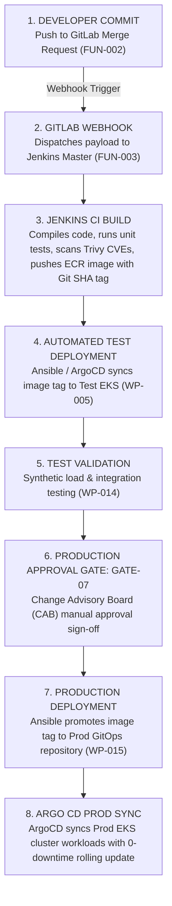

# CI/CD Delivery Plan: DataBlue Next-Gen Infrastructure Platform

---

## 1. Overview

This document specifies the pipeline workflow, security gates, artifact promotion, and rollback automation for the **DataBlue Next-Gen Infrastructure Platform** (`datablue-nextgen-infra-platform`).

Governed by [`ADR-004`](../03-decisions/ADR-004-cicd-operating-model.md) (Hybrid Overlay Model):
* **GitLab**: Source control, Merge Request triggers, Webhook dispatch (`FUN-002`).
* **Jenkins**: CI container build, unit testing, image vulnerability scan, ECR push (`FUN-003`).
* **Ansible**: Environment configuration management and deployment automation (`FUN-004`).
* **ArgoCD / GitOps**: In-cluster state synchronization for Kubernetes manifests (`BUS-002`).

---

## 2. End-to-End Pipeline Architecture Flow

---

## 3. Pipeline Security Gates

1. **Gate A — Pre-Commit Secret Scan**: Automated `git-leaks` scan blocking commits containing plain-text API keys or credentials (`SEC-001`).
2. **Gate B — Container Vulnerability Scan**: Trivy image scan failing Jenkins build if `CRITICAL` CVE vulnerabilities are detected (`RSK-SEC-001`).
3. **Gate C — Automated Test Gate**: End-to-end integration test execution in Test environment before Production promotion (`GATE-06`).
4. **Gate D — CAB Production Sign-off**: Human approval requirement (`GATE-07`) before promoting image tags to Production GitOps repositories.

---

## 4. Artifact Promotion & Rollback Flow

### Artifact Promotion Protocol
1. Microservice images compiled by Jenkins are tagged with immutable Git commit SHAs (e.g. `ecr.aws/microservice-a:a1b2c3d`).
2. Once validated in Test, Ansible updates the image tag inside the Production GitOps manifest repository.
3. ArgoCD detects the Git tag change and performs a zero-downtime rolling update (`maxSurge: 25%`, `maxUnavailable: 0`).

### Automated Rollback Protocol
1. If Production pod health checks or HTTP 5xx error rates exceed 1% within 10 minutes of deployment, ArgoCD / Ansible triggers automated rollback (`ROLLBACK-STRATEGY.md`).
2. ArgoCD reverts the manifest image tag to the previous stable Git commit SHA (`ecr.aws/microservice-a:previous-sha`).
