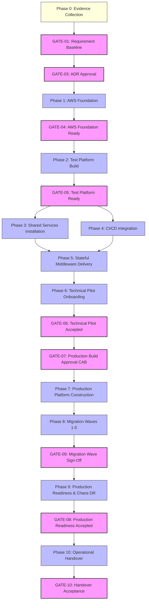

# Dependency Map: DataBlue Next-Gen Infrastructure Platform

---

## 1. Overview

This document specifies technical, organizational, evidence, and governance dependencies for the **DataBlue Next-Gen Infrastructure Platform** (`datablue-nextgen-infra-platform`).

Dependencies are classified into five categories:
1. **Hard Dependencies**: Technical prerequisites that physically block downstream execution.
2. **Soft Dependencies**: Best-practice sequences that improve efficiency but do not strictly prevent execution.
3. **External Dependencies**: Customer inputs, third-party vendor APIs, or organizational approvals.
4. **Human Approval Dependencies**: Governance gates requiring formal human sign-off (`ACCEPTANCE-GATES.md`).
5. **Evidence Dependencies**: Empirical benchmarks, profiling data, or audits required to unblock decisions.

---

## 2. Master Dependency Graph (Mermaid)

---

## 3. Detailed Dependency Matrix

### 1. Evidence Dependencies
* `DEP-EVD-001`: **Microservice Sizing Profiling Data** (`OPEN-001`) → Required to unblock [`ADR-006`](../03-decisions/ADR-006-mysql-deployment.md) (MySQL), [`ADR-007`](../03-decisions/ADR-007-redis-deployment.md) (Redis), [`ADR-008`](../03-decisions/ADR-008-rabbitmq-deployment.md) (RabbitMQ), and `WP-011`–`WP-012`.
* `DEP-EVD-002`: **DocumentDB MongoDB Wire Compatibility Audit** (`RSK-DAT-001`) → Required to unblock [`ADR-009`](../03-decisions/ADR-009-mongodb-deployment.md) (MongoDB).
* `DEP-EVD-003`: **Business Continuity RTO/RPO Sign-off** (`OPEN-003`) → Required to unblock [`ADR-014`](../03-decisions/ADR-014-disaster-recovery.md) (Disaster Recovery).

### 2. Human Approval Dependencies
* `DEP-HUM-001`: [`GATE-03`](ACCEPTANCE-GATES.md) **ADR Sign-off** → Human review of Proposed ADRs (`ADR-001`..`015`) required before Phase 1 foundation execution (`WP-002`).
* `DEP-HUM-002`: [`GATE-07`](ACCEPTANCE-GATES.md) **CAB Production Approval** → Change Advisory Board authorization required before creating `DataBlue-Prod-Account` (`WP-015`).
* `DEP-HUM-003`: [`GATE-10`](ACCEPTANCE-GATES.md) **Handover Acceptance** → Operations Lead sign-off required for project completion (`WP-020`).

### 3. Hard Technical Dependencies
* `DEP-TRC-001`: **Multi-Account Landing Zone (`WP-002`)** → Hard prerequisite for VPC Networking (`WP-004`) and Test EKS cluster (`WP-005`).
* `DEP-TRC-002`: **Test EKS Cluster (`WP-005`)** → Hard prerequisite for Shared Platform Services (`WP-007`..`WP-009`) and CI/CD pipelines (`WP-010`).
* `DEP-TRC-003`: **MySQL Database Tier (`WP-011`)** → Hard prerequisite for Nacos Cluster deployment (`WP-013`).
* `DEP-TRC-004`: **Test Environment Validation (`WP-014`)** → Hard prerequisite for Production Cluster Construction (`WP-015`).

### 4. External Dependencies
* `DEP-EXT-001`: **AWS Account Quotas & Domain Registrations** → Customer AWS Organizations root permission and Cloudflare public domain & DNS access.
* `DEP-EXT-002`: **GitLab & Jenkins Legacy Repositories** → Customer developer access permissions to source code repositories.
