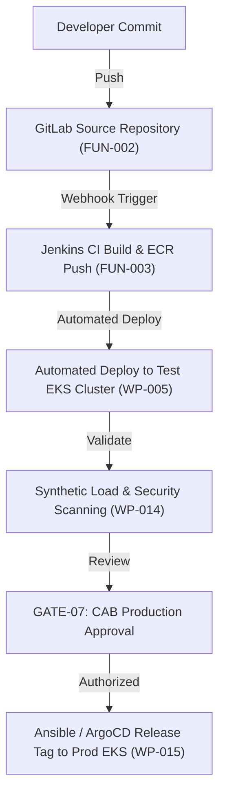

# Environment Delivery Plan: DataBlue Next-Gen Infrastructure Platform

---

## 1. Overview

This document specifies the governance, infrastructure differences, and environment isolation rules separating the **Test (Non-Production)** and **Production** environments for the **DataBlue Next-Gen Infrastructure Platform** (`datablue-nextgen-infra-platform`).

In accordance with requirement `BUS-003` and [`ADR-002`](../03-decisions/ADR-002-environment-isolation.md):
* **Test and Production must never share an AWS Account or Kubernetes cluster**.
* **Production must not be built by copying Test configurations without formal architectural review (`GATE-07`)**.

---

## 2. Test vs. Production Governance Matrix

| Governance Dimension | Test / Non-Production Environment | Production Environment | Architectural Rationale |
| :--- | :--- | :--- | :--- |
| **AWS Account Boundary** | Dedicated `DataBlue-Test-Account` | Dedicated `DataBlue-Prod-Account` | Complete blast-radius & billing isolation (`BUS-003`, `SEC-002`). |
| **EKS Cluster Footprint** | Dedicated `datablue-test-eks` Cluster | Dedicated `datablue-prod-eks` Cluster | Prevents noisy-neighbor resource contention (`NFR-001`). |
| **VPC & Subnet Isolation** | `10.100.0.0/16` (Isolated VPC) | `10.200.0.0/16` (Isolated VPC) | Zero VPC peering between Test and Production VPCs. |
| **Node Instance Mix** | 70% EC2 Spot / 30% On-Demand (`c6i`/`m6i`) | 100% On-Demand / Savings Plans (`c6i`/`m6i`) | Optimizes Test cost while guaranteeing Prod capacity (`CST-001`). |
| **High Availability Topology** | 2 Availability Zones (AZ-a, AZ-b) | 3 Availability Zones (AZ-a, AZ-b, AZ-c) | Protects Production against multi-AZ zone failures (`NFR-001`). |
| **Database Multi-AZ Mode** | Single-AZ / Dev Multi-AZ | Mandatory Multi-AZ Primary/Standby | Guarantees 99.95% database uptime SLA in Production (`FUN-005`). |
| **Automated Scale-Down** | Nightly/Weekend scale-down (70% node drop) | Continuous 24/7 dynamic Karpenter scaling | Reduces Test compute waste outside business hours (`CST-001`). |
| **Secrets Management** | AWS Secrets Manager (`/test/...`) | AWS Secrets Manager (`/prod/...`) | Strict IAM IRSA policy scoping per account (`SEC-001`). |
| **Backup & Vault Lock** | Daily DB snapshots (7-day retention) | Daily DB PITR + Velero S3 Vault Lock (30-day) | Enforces cross-account ransomware protection (`OPS-002`). |
| **Change Control** | Automated GitOps sync on `main` merge | Mandatory CAB approval + GitOps tag release | Prevents un-reviewed production deployments (`AGENTS.md`). |
| **Deletion Protection** | Disabled for temporary sandbox resources | **ENABLED** on all EKS clusters, VPCs, & DBs | Prevents accidental production resource destruction (`AGENTS.md`). |
| **Deployment Duration** | **5 Business Days** (`TERRAFORM_TEST_PLANNING`) | **5 Business Days** (`TERRAFORM_PROD_EARLYSTART_PLANNING`) | Standardized 5-day infrastructure provisioning and verification window. |

---

## 3. Environment Promotion Flow

---

## 4. Environment Delivery Principles

1. **Test-First Validation**: All Terraform modules, Helm charts, and IAM policies must be fully deployed and tested in `DataBlue-Test-Account` before applying to `DataBlue-Prod-Account`.
2. **Zero Shared Stateful Services**: Test microservices must never connect to Production database or cache endpoints.
3. **Data Scrubbing**: Production database dumps copied to Test for debugging must undergo automated PII (Personally Identifiable Information) data scrubbing (`SEC-001`).
