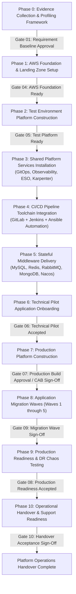

# Implementation Roadmap: DataBlue Next-Gen Infrastructure Platform

---

## 1. Governance & Delivery Philosophy

This document outlines the relative delivery roadmap for the **DataBlue Next-Gen Infrastructure Platform** (`datablue-nextgen-infra-platform`).

In accordance with Stage 4 principles:
* **No infrastructure implementation code or AWS resources are provisioned during this planning phase.**
* Schedules use **relative phase sequencing** rather than arbitrary calendar dates.
* **Test environment delivery and validation strictly precedes Production environment buildout**.
* Every phase transition is guarded by a formal human approval gate (`ACCEPTANCE-GATES.md`).

---

## 2. 11-Phase Relative Delivery Roadmap

---

## 3. Phase-by-Phase Detailed Specifications

### Phase 0 — Evidence Collection & Workload Profiling
* **Objective**: Gather empirical CPU, RAM, IOPS, RPS, and query compatibility metrics to resolve deferred ADRs.
* **Dependencies**: None (`BUS-001`, `OPEN-001`).
* **Key Activities**: Deploy profiling sidecars in legacy/test environments; scan MongoDB queries for DocumentDB compatibility (`RSK-DAT-001`); obtain business RTO/RPO targets (`OPEN-003`).
* **Blockers**: Lack of access to customer legacy application code or traffic logs.
* **Human Approval Gate**: [`GATE-01`](ACCEPTANCE-GATES.md).
* **Expected Output**: Verified Workload Profiling Report & Resolved Middleware ADRs (`ADR-006`..`009`, `ADR-014`).

---

### Phase 1 — AWS Foundation & Landing Zone Setup
* **Objective**: Establish multi-account AWS Organization structure, IAM identity center, KMS keys, and VPC networking.
* **Dependencies**: Phase 0 completion, [`ADR-001`](../03-decisions/ADR-001-aws-account-strategy.md), [`ADR-015`](../03-decisions/ADR-015-infrastructure-as-code.md).
* **Key Activities**: Provision AWS Control Tower Landing Zone (`DataBlue-Test`, `DataBlue-Prod`, `Shared-Services`, `Security`); deploy S3 state backends; configure 3-tier VPC subnets across 3 AZs.
* **Blockers**: AWS Organization root account permissions pending.
* **Human Approval Gate**: [`GATE-04`](ACCEPTANCE-GATES.md).
* **Expected Output**: Foundation Terraform state, VPC subnets, NAT gateways, and KMS encryption keys.

---

### Phase 2 — Test Environment Platform Construction (`TERRAFORM_TEST_PLANNING`)
* **Planning Identifier**: `TERRAFORM_TEST_PLANNING`
* **Objective**: Deploy dedicated Test EKS cluster, worker node groups, ingress, and pod identity boundaries.
* **Deployment Duration**: **5 Business Days** (5 Days).
* **Dependencies**: Phase 1 completion, [`ADR-002`](../03-decisions/ADR-002-environment-isolation.md), [`ADR-003`](../03-decisions/ADR-003-kubernetes-platform.md).
* **Key Activities**: Provision Test EKS cluster (`v1.30+`); configure IAM IRSA OIDC endpoint; deploy AWS Load Balancer Controller and Cloudflare DNS / GTM integration.
* **Blockers**: Test AWS account quota limits.
* **Human Approval Gate**: [`GATE-05`](ACCEPTANCE-GATES.md).
* **Expected Output**: Operational Test EKS cluster with functional ingress routing and IRSA identity integration.

---

### Phase 3 — Shared Platform Services Installation
* **Objective**: Install core cluster management services into Test EKS cluster.
* **Dependencies**: Phase 2 completion, [`ADR-005`](../03-decisions/ADR-005-node-autoscaling.md), [`ADR-011`](../03-decisions/ADR-011-secrets-management.md), [`ADR-012`](../03-decisions/ADR-012-observability.md).
* **Key Activities**: Install ArgoCD GitOps engine; deploy Karpenter JIT autoscaler; deploy External Secrets Operator (ESO); install Prometheus/Grafana and Fluent Bit to OpenSearch log forwarder.
* **Expected Output**: Fully bootstrapped cluster management stack operating under GitOps control.

---

### Phase 4 — CI/CD Pipeline Automation
* **Objective**: Automate end-to-end container build, image scanning, and deployment pipelines.
* **Dependencies**: Phase 3 completion, [`ADR-004`](../03-decisions/ADR-004-cicd-operating-model.md).
* **Key Activities**: Configure GitLab webhooks; build Jenkins CI worker nodes; write Ansible deployment automation playbooks; configure AWS ECR container image scanning.
* **Expected Output**: Operational pipeline (GitLab Trigger → Jenkins Build → ECR Push → Ansible/ArgoCD Deploy).

---

### Phase 5 — Stateful Middleware Delivery
* **Objective**: Deploy and validate MySQL, Redis, RabbitMQ, MongoDB, and Nacos stateful services.
* **Dependencies**: Phase 4 completion, [`ADR-006`](../03-decisions/ADR-006-mysql-deployment.md)–[`ADR-010`](../03-decisions/ADR-010-nacos-deployment.md), [`ADR-013`](../03-decisions/ADR-013-backup-strategy.md).
* **Key Activities**: Deploy multi-AZ database instances; configure PITR backup lifecycle policies; deploy Nacos cluster on EKS; validate failover and backup restore procedures.
* **Expected Output**: Verified middleware endpoints with automated multi-AZ failover and 30-day PITR backup.

---

### Phase 6 — Technical Pilot Application Onboarding
* **Objective**: Deploy and benchmark a representative 5-service pilot suite under synthetic load.
* **Dependencies**: Phase 5 completion.
* **Key Activities**: Onboard 1 API, 1 worker, 1 DB service, 1 cache service, and 1 ingress service; execute synthetic load testing; validate Karpenter node scaling and Grafana dashboards.
* **Human Approval Gate**: [`GATE-06`](ACCEPTANCE-GATES.md).
* **Expected Output**: Pilot Acceptance Benchmark Report verifying scaling, logging, security, and cost metrics.

---

### Phase 7 — Production Platform Construction (`TERRAFORM_PROD_EARLYSTART_PLANNING`)
* **Planning Identifier**: `TERRAFORM_PROD_EARLYSTART_PLANNING`
* **Objective**: Provision isolated Production AWS Account and Production EKS cluster.
* **Deployment Duration**: **5 Business Days** (5 Days).
* **Dependencies**: Phase 6 completion, Change Advisory Board (CAB) sign-off.
* **Key Activities**: Provision Production AWS Account via Terraform; deploy Production EKS multi-AZ cluster; configure AWS Backup Vault Lock and cross-account S3 backup copy.
* **Human Approval Gate**: [`GATE-07`](ACCEPTANCE-GATES.md).
* **Expected Output**: Hardened, production-ready AWS account and EKS cluster infrastructure.

---

### Phase 8 — Application Migration Waves (Waves 1 through 5)
* **Objective**: Systematically migrate ~40 microservices into Production across 5 phased waves.
* **Dependencies**: Phase 7 completion.
* **Key Activities**: Execute Wave 1 (Low-risk stateless) through Wave 5 (Business-critical payment services) following strict entry and exit verification criteria.
* **Human Approval Gate**: [`GATE-09`](ACCEPTANCE-GATES.md) (per wave).
* **Expected Output**: 100% of microservices running successfully in Production environment.

---

### Phase 9 — Production Readiness & DR Chaos Testing
* **Objective**: Validate platform resilience via chaos engineering, failover simulations, and DR exercises.
* **Dependencies**: Phase 8 completion, [`ADR-014`](../03-decisions/ADR-014-disaster-recovery.md).
* **Key Activities**: Execute simulated node crashes, Availability Zone outages, database master failovers, backup restores, and cross-region DR failover drills.
* **Human Approval Gate**: [`GATE-08`](ACCEPTANCE-GATES.md).
* **Expected Output**: Production Readiness & Disaster Recovery Verification Report.

---

### Phase 10 — Operational Handover & Support Readiness
* **Objective**: Transition platform operational responsibility to enterprise Operations/SRE team.
* **Dependencies**: Phase 9 completion.
* **Key Activities**: Deliver operational runbooks, conduct SRE training, execute access handover, configure FinOps cost tracking dashboards.
* **Human Approval Gate**: [`GATE-10`](ACCEPTANCE-GATES.md).
* **Expected Output**: Signed Operational Handover Certificate.
