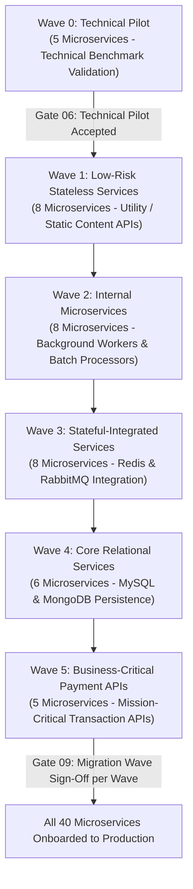

# Migration & Application Onboarding Plan: DataBlue Next-Gen Infrastructure Platform

---

## 1. Overview

This document specifies the migration wave structure, service readiness framework, entry/exit criteria, and hypercare support model for onboarding approximately 40 microservices across 5-6 business systems to the **DataBlue Next-Gen Infrastructure Platform** (`datablue-nextgen-infra-platform`).

---

## 2. Microservice Inventory Template

Every microservice must complete this inventory template prior to onboarding assignment:

```markdown
### Microservice Onboarding Profile
* **Service Name**: `[service-name]`
* **Business System Domain**: `[Business System 1..6]`
* **Criticality Tier**: `[Tier 1: Critical / Tier 2: Standard / Tier 3: Batch]`
* **Provisional Sizing Class**: `[Class XS / S / M / L / XL]`
* **Stateless / Stateful**: `[Stateless / Requires DB / Requires Cache / Requires Queue]`
* **Middleware Dependencies**: `[MySQL / Redis / RabbitMQ / MongoDB / Nacos]`
* **Container Readiness**: `[12-Factor Compliant / Dockerfile Verified]`
* **Health Check Endpoints**: `[/healthz Liveness / /ready Readiness]`
```

---

## 3. Migration Wave Structure (Waves 0 through 5)

Microservices will be assigned to 6 sequential onboarding waves based on business criticality and stateful risk:




---

## 4. Wave Entry & Exit Criteria

### Wave Entry Criteria
1. Microservice Dockerfile security scan passed with zero `CRITICAL` vulnerabilities (`RSK-SEC-001`).
2. Liveness (`/healthz`) and Readiness (`/ready`) HTTP probes configured.
3. Microservice configuration injected dynamically via Nacos or environment variables (`FUN-009`).
4. Automated unit tests passing in Jenkins CI (`FUN-003`).

### Wave Exit Criteria
1. 100% of microservice pods running in `Ready` status across 3 AZs.
2. HTTP 5xx error rate < 0.01% under normal production traffic volume.
3. Prometheus metrics scraping verified in Grafana dashboards (`OPS-001`).
4. Logs successfully indexed in Amazon OpenSearch and S3 Glacier archive (`OPS-002`).
5. Formal [`GATE-09`](ACCEPTANCE-GATES.md) sign-off from Business Product Owner.

---

## 5. Hypercare Support Protocol

* **Duration**: 14 calendar days of dedicated SRE/DevOps hypercare support per migration wave.
* **Escalation**: Dedicated 24/7 Slack / PagerDuty escalation channel for onboarded microservice teams.
* **Monitoring**: Real-time APM tracing and 5-minute metric anomaly review.
* **Handover**: Microservice transitions to standard operational support upon completing 14 days with zero Sev-1/Sev-2 incidents (`SUPPORT-READINESS-PLAN.md`).
