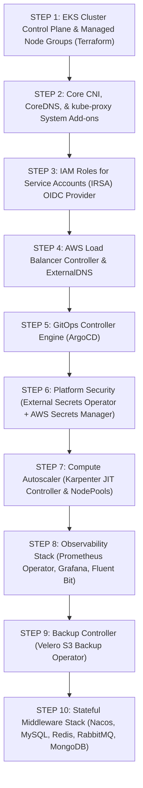

# Platform Bootstrap Plan: DataBlue Next-Gen Infrastructure Platform

---

## 1. Overview

This document specifies the exact installation order and bootstrapping sequence for core cluster capabilities inside Amazon EKS clusters for the **DataBlue Next-Gen Infrastructure Platform** (`datablue-nextgen-infra-platform`).

---

## 2. Bootstrapping Sequence

---

## 3. Detailed Step Specifications

### Step 1 & Step 2 — Base EKS & Core Add-ons
* **Scope**: AWS EKS control plane (`v1.30+`), default node groups, AWS VPC CNI plugin, CoreDNS, and kube-proxy (`ADR-003`).
* **Validation**: `kubectl get nodes` returns `Ready` status across 3 AZs.

### Step 3 & Step 4 — IRSA & Ingress Controller
* **Scope**: EKS OIDC identity provider binding; AWS Load Balancer Controller Helm release (`ADR-004`).
* **Validation**: ALB controller creates target groups successfully upon Ingress CRD creation.

### Step 5 — GitOps Engine (ArgoCD)
* **Scope**: ArgoCD core components installed in `argocd` namespace (`BUS-002`).
* **Validation**: ArgoCD server UI accessible; `App-of-Apps` pattern initialized.

### Step 6 — External Secrets Operator (ESO)
* **Scope**: ESO controller installed in `external-secrets` namespace; ClusterSecretStore created with IRSA IAM role (`ADR-011`).
* **Validation**: ESO successfully fetches test secret from AWS Secrets Manager.

### Step 7 — Karpenter Autoscaler
* **Scope**: Karpenter controller installed in `karpenter` namespace; `NodePool` and `EC2NodeClass` CRDs configured (`ADR-005`).
* **Validation**: Karpenter provisions worker node within < 60 seconds upon unschedulable pod trigger.

### Step 8 — Observability Stack
* **Scope**: kube-prometheus-stack Helm chart installed in `monitoring` namespace; Fluent Bit DaemonSet deployed (`ADR-012`).
* **Validation**: Grafana renders node CPU metrics; Fluent Bit streams logs to Amazon OpenSearch.

### Step 9 — Velero Backup Operator
* **Scope**: Velero installed in `velero` namespace pointing to encrypted S3 backup bucket (`ADR-013`).
* **Validation**: `velero backup create test-backup` completes with status `Completed`.

### Step 10 — Stateful Middleware Layer
* **Scope**: Nacos, MySQL, Redis, RabbitMQ, and MongoDB instances provisioned (`FUN-005`..`009`).
* **Validation**: Microservice pods connect to middleware endpoints successfully.
