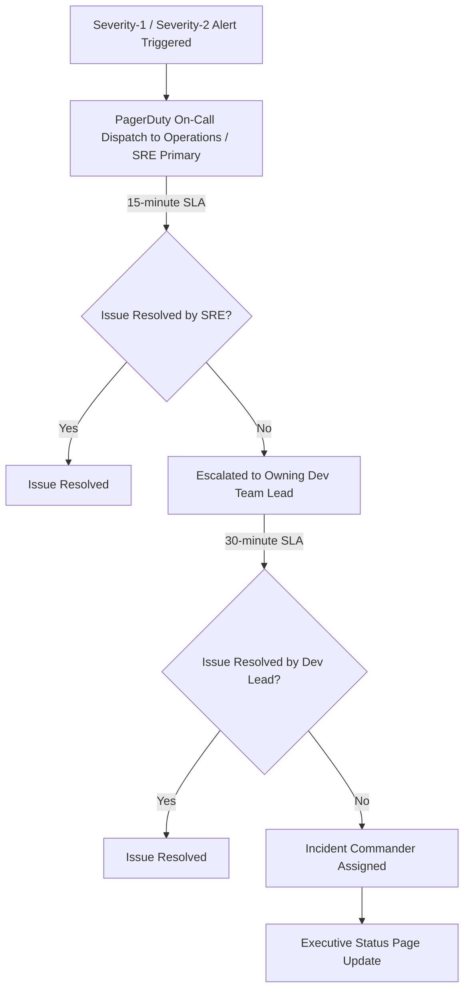

# Service Ownership Framework: DataBlue Next-Gen Infrastructure Platform

---

## 1. Overview

This document specifies the **Service Ownership Framework** for the **DataBlue Next-Gen Infrastructure Platform** (`datablue-nextgen-infra-platform`).

It provides standardized service registration templates and operational escalation paths without using individual personal names.

---

## 2. Service Ownership Profile Template

Every platform component and microservice must maintain a completed Service Ownership Profile in Git:

```markdown
### Service Ownership Profile
* **Service Name**: `[service-name]`
* **Business System Domain**: `[Business System 1..6]`
* **Primary Owning Team**: `[Team Name - e.g. Payment Engineering Team]`
* **Technical Lead Role**: `[Lead Software Engineer Role]`
* **SRE Primary Contact**: `[Primary SRE On-Call Lead]`
* **Git Repository URI**: `[GitLab Repository URI]`
* **PagerDuty Service ID**: `[PagerDuty Integration Key]`
* **Slack Support Channel**: `#support-[service-name]`
* **Target Availability SLA**: `[99.9% / 99.95%]`
* **Target RTO / RPO**: `[RTO < 2 hrs / RPO < 15 mins]`
* **Operational Runbook URI**: `[Runbook Markdown Link]`
```

---

## 3. Standard Operational Escalation Path


