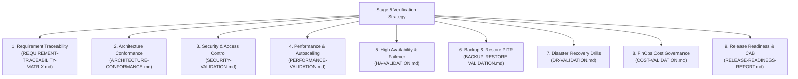

# Verification Strategy: DataBlue Next-Gen Infrastructure Platform

---

## 1. Overview & Verification Philosophy

This document defines the master **Verification Strategy & Governance Framework** for Stage 5 of the **DataBlue Next-Gen Infrastructure Platform** (`datablue-nextgen-infra-platform`).

In accordance with Stage 5 rules:
* **Infrastructure provisioned does not equal platform validation**.
* Every system capability must undergo formal evidence collection across 9 validation domains before operational acceptance.
* **No test results are fabricated or pre-marked as passed**. All verification items remain in `Pending` or `Not Executed` status awaiting empirical test execution.

---

## 2. 9 Validation Domains & Verification Scope

---

## 3. Verification Environment & Tooling Specifications

| Validation Domain | Primary Verification Tooling | Target Execution Environment | Mandatory Evidence Requirement | Responsible Role | Current Status |
| :--- | :--- | :--- | :--- | :--- | :--- |
| **Requirements** | Automated Traceability Audit | Test / Prod Spec | 100% Requirement-to-Test Mapping | Enterprise Architect | `Pending` |
| **Architecture** | Terraform Compliance / Sonobuoy | EKS Test Cluster | Conformance Report & 0 Drift | Infrastructure Architect | `Pending` |
| **Security** | Trivy, Checkov, Kube-bench | Security AWS Account | 0 Critical Vulnerabilities / 0 Wildcards | Cloud Security Lead | `Pending` |
| **Performance** | Locust, k6 Load Generators | Test EKS Cluster | P95 < 200ms & Karpenter < 60s | SRE Lead / Performance Lead | `Pending` |
| **High Availability**| Chaos Mesh, AWS FIS | Test / Prod Multi-AZ | Zero Data Loss Failover (< 60s) | SRE Lead | `Pending` |
| **Backup & Restore** | Velero CLI, AWS RDS Restore | Test Isolated Subnets | Verified 30-Day PITR Recovery | DBA Lead / Storage Lead | `Pending` |
| **Disaster Recovery**| Cloudflare GTM / DNS Failover Simulator | Secondary AWS Region | Verified RTO < 4h & RPO < 15m | Lead Cloud Architect | `Pending` |
| **FinOps Cost** | AWS Cost Explorer / AWS Config | All AWS Accounts | 100% Resource Tag Compliance | FinOps Lead | `Pending` |
| **Release Readiness**| CAB Authorization Ticket | Governance Board | Signed CAB Certificate (`GATE-07`) | Project Sponsor | `Pending` |

---

## 4. Evidence Collection & Gate Governance Rules

1. **Empirical Evidence Required**: Every validation item requires an attached artifact in [`TEST-EVIDENCE-REGISTER.md`](TEST-EVIDENCE-REGISTER.md) (e.g. execution log file, raw json output, benchmark chart).
2. **Dual Sign-Off**: Verification items require joint sign-off from the Technical Owner and the Independent Quality/Security Auditor.
3. **No Unearned Pass**: Items remain marked `Pending` or `Awaiting Evidence` until test execution logs are attached.
