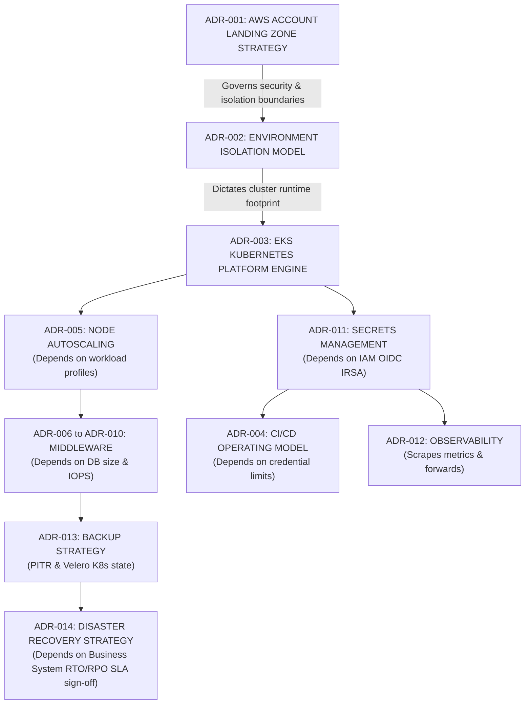

# Decision Dependencies: DataBlue Next-Gen Infrastructure Platform

---

## 1. Overview

This document maps the interdependencies and structural relationships between Architecture Decision Records (ADRs), requirement registers, and risk taxonomies for the **DataBlue Next-Gen Infrastructure Platform** (`datablue-nextgen-infra-platform`).

Architectural decisions do not exist in isolation. A decision in one domain (e.g. AWS Account Strategy) constrains and governs choices in downstream domains (e.g. Security IAM, Networking, CI/CD Credential Boundaries, and FinOps Cost Attribution).

---

## 2. Core Decision Dependency Network

---

## 3. Detailed Inter-Decision Dependency Matrix

### 1. Cost Architecture Depends on Workload Profiles
* **Prerequisite Decision / Input**: `OPEN-001` (Microservice CPU, Memory, IOPS, and network throughput metrics).
* **Dependent ADRs**: [`ADR-005`](../03-decisions/ADR-005-node-autoscaling.md) (Karpenter instance sizing), [`ADR-006`](../03-decisions/ADR-006-mysql-deployment.md)–[`ADR-009`](../03-decisions/ADR-009-mongodb-deployment.md) (Managed DB vs Self-Hosted Operators).
* **Relationship & Impact**: FinOps cost estimation (`CST-001`) cannot be mathematically finalized without empirical sizing inputs. Managed AWS service selections depend directly on whether workload volume justifies the AWS managed instance price premium.

---

### 2. Node Autoscaling Strategy Depends on Workload Scheduling Characteristics
* **Prerequisite Decision / Input**: Microservice container resource requests/limits (`ASM-006`) and pod disruption budgets.
* **Dependent ADRs**: [`ADR-005`](../03-decisions/ADR-005-node-autoscaling.md) (Karpenter JIT autoscaler).
* **Relationship & Impact**: Karpenter node selection efficiency depends on microservices defining accurate CPU/memory request bounds. Omitted pod limits cause node bin-packing failure and uncontrolled node scaling spend (`RSK-CST-001`).

---

### 3. Database Selection Depends on Wire Protocol Compatibility, Data Size, RPO, and RTO
* **Prerequisite Decision / Input**: [`ADR-009`](../03-decisions/ADR-009-mongodb-deployment.md) (MongoDB vs DocumentDB compatibility audit), database size, and transaction IOPS.
* **Dependent ADRs**: [`ADR-006`](../03-decisions/ADR-006-mysql-deployment.md), [`ADR-007`](../03-decisions/ADR-007-redis-deployment.md), [`ADR-008`](../03-decisions/ADR-008-rabbitmq-deployment.md), [`ADR-009`](../03-decisions/ADR-009-mongodb-deployment.md), [`ADR-013`](../03-decisions/ADR-013-backup-strategy.md).
* **Relationship & Impact**: Selecting Amazon DocumentDB is blocked until microservice queries are verified against DocumentDB syntax limits (`RSK-DAT-001`). Relational database engine choices govern backup snapshot mechanics and recovery speed.

---

### 4. Disaster Recovery Selection Depends on Business System Criticality (RTO / RPO)
* **Prerequisite Decision / Input**: `OPEN-003` (Business Product Owner sign-off on target RTO and RPO metrics).
* **Dependent ADRs**: [`ADR-014`](../03-decisions/ADR-014-disaster-recovery.md) (DR Failover Model), [`ADR-013`](../03-decisions/ADR-013-backup-strategy.md) (Cross-region backup copy).
* **Relationship & Impact**: Cross-region Pilot Light vs. Warm Standby cannot be chosen without knowing acceptable downtime. High Availability (Multi-AZ within 1 region) handles local failures, but DR requires explicit RTO/RPO targets to justify secondary region expenditure (`RSK-AVL-001`).

---

### 5. Account Strategy Affects IAM, Network Architecture, Logging, and Cost Allocation
* **Prerequisite Decision / Input**: [`ADR-001`](../03-decisions/ADR-001-aws-account-strategy.md) (Multi-Account Landing Zone).
* **Dependent ADRs**: [`ADR-002`](../03-decisions/ADR-002-environment-isolation.md) (Cluster Isolation), [`ADR-011`](../03-decisions/ADR-011-secrets-management.md) (IAM IRSA OIDC), [`ADR-012`](../03-decisions/ADR-012-observability.md) (Centralized Log Account), [`ADR-015`](../03-decisions/ADR-015-infrastructure-as-code.md).
* **Relationship & Impact**: Establishing multi-account boundaries (`DataBlue-Test-Account`, `DataBlue-Prod-Account`, `Shared-Services-Account`, `Security-Account`) dictates VPC network CIDR planning, centralized CloudTrail log aggregation routing, and cross-account IAM trust relationships.

---

### 6. CI/CD Operating Model Affects Credential Boundaries and Production Change Control
* **Prerequisite Decision / Input**: [`ADR-004`](../03-decisions/ADR-004-cicd-operating-model.md) (Hybrid Overlay Model).
* **Dependent ADRs**: [`ADR-011`](../03-decisions/ADR-011-secrets-management.md) (AWS Secrets Manager + ESO), [`ADR-015`](../03-decisions/ADR-015-infrastructure-as-code.md) (Terraform execution pipeline).
* **Relationship & Impact**: Decoupling Jenkins (build/test) from Ansible/GitOps (deployment execution) prevents storing long-lived cloud infrastructure credentials on build runners (`RSK-SEC-001`), enforcing least-privilege IAM IRSA execution boundaries across environments.
