# Executive Architecture & Cost Proposal: DataBlue Next-Gen Infrastructure Platform

**Project Identifier**: `datablue-nextgen-infra-platform`  
**Document Version**: 2.5 (Unified SRE & DevSecOps RACI Proposal)  
**Governance Standard**: Architecture-First Governance Standard

---

## 1. Executive Summary

This proposal presents the complete technical, operational, and financial specifications for building the **DataBlue Next-Gen Infrastructure Platform** (`datablue-nextgen-infra-platform`).

The customer requires an enterprise-grade, cloud-native Kubernetes platform designed to host approximately **40 microservices** across **5 to 6 business systems**, featuring strict isolation between **Test** and **Production** environments, automated CI/CD deployments using GitLab, Jenkins, and Ansible, and robust middleware infrastructure (MySQL, RabbitMQ, MongoDB, Redis, and Nacos).

### Key Architectural Highlights
* **Multi-Account Landing Zone**: Physical account isolation across `DataBlue-Test-Account`, `DataBlue-Prod-Account`, `Shared-Services-Account`, and `Security-Account` (`ADR-001`, `ADR-002`).
* **Master 5-Layer Platform Architecture**: Single unified end-to-end architecture diagram integrating Edge Traffic, Shared CI/CD, EKS Compute, Isolated Database Tier, and Central Security/Observability.
* **Unified Cloud Platform SRE & DevSecOps Governance**: Combined operational ownership under a single Cloud Platform SRE & DevSecOps engineering team in Section 10.
* **Normalized 4 Enterprise Financial Scenarios**: Standardized 4-scenario financial breakdown (Scenarios 1 through 4) covering Non-Prod, Prod Baseline, Prod Enhanced HA, and Cross-Region DR.
* **Categorized LLD Execution Target Matrix**: Clear 3-group architectural classification separating **EKS Pod Workloads**, **AWS Managed Services**, and **Standalone EC2 Instances**.
* **Managed EKS Engine with Karpenter**: Amazon EKS (`v1.30+`) control plane combined with Karpenter Just-in-Time node autoscaling, enabling node provisioning in under 60 seconds (`ADR-003`, `ADR-005`).
* **Hybrid Overlay CI/CD Model**: Secure multi-tool deployment workflow integrating GitLab source control, Jenkins container CI scanning (Trivy), Ansible configuration playbooks, and ArgoCD GitOps cluster synchronization (`ADR-004`).
* **Zero Static Credentials**: Enforced IAM Roles for Service Accounts (IRSA) with OIDC federation and AWS Secrets Manager integration via External Secrets Operator (`ADR-011`).

---

## 2. Project Context & Requirement Baseline

The system requirements have been normalized into standardized requirement taxonomies (`BUS`, `FUN`, `NFR`, `SEC`, `OPS`, `CST`) in [`REQUIREMENTS-REGISTER.md`](01-requirements/REQUIREMENTS-REGISTER.md):

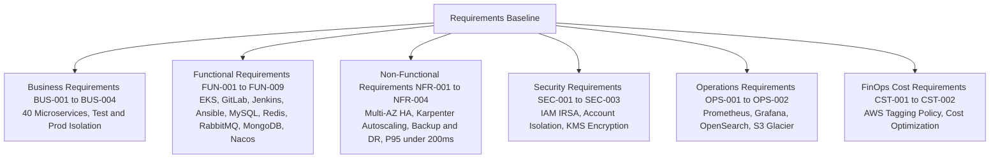

---

## 3. Master End-to-End 5-Layer Platform Architecture

### 3.1 Unified Master Architecture Diagram
The master diagram below unifies the entire AWS cloud platform across all 5 architectural layers:

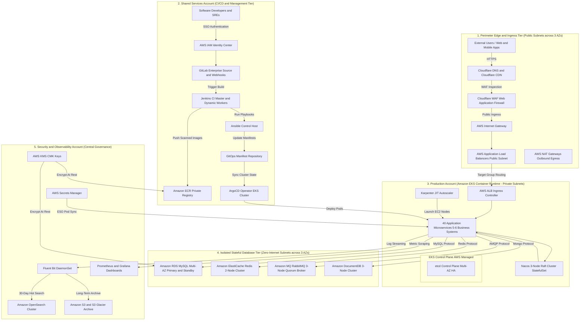

---

### 3.2 Master System Interaction & Flow Matrix

| Flow Category | Origin / Trigger | Intermediate Path & Processing | Destination / Target | Security & Resiliency Mechanisms |
| :--- | :--- | :--- | :--- | :--- |
| **1. User Request Flow** | External Web / Mobile Client | Cloudflare DNS → Cloudflare CDN → Cloudflare WAF → Public ALB → ALB Ingress Controller | 40 Microservice Pods (Private Subnet) | Guarded by Cloudflare WAF OWASP rules; TLS 1.3 encryption in transit |
| **2. CI/CD Deployment Flow** | Developer Commit / MR | GitLab → Jenkins Master → Dynamic Worker (Trivy Scan) → ECR → Ansible | GitOps Repo → ArgoCD → EKS Pod Deployment | Zero static credentials; short-lived OIDC tokens via IRSA |
| **3. Microservice Data Flow** | Microservice Pod | Internal Cluster Routing / Nacos Service Discovery | RDS MySQL / ElastiCache / RabbitMQ / DocumentDB | Database subnets isolated with ZERO internet egress routes |
| **4. Secrets Injection Flow** | Pod Initialization | External Secrets Operator (ESO Pod) sync | AWS Secrets Manager (Security Account) | Pods receive ephemeral secrets; encrypted at rest with KMS CMK |
| **5. Observability & Log Flow** | Pod stdout / stderr | Fluent Bit DaemonSet on EC2 Node | OpenSearch (30 days hot) → S3 Glacier (Long term) | Encrypted S3 buckets with AWS Backup Vault Lock immutability |
| **6. Dynamic Scaling Flow** | Pod Load (CPU > 70%) | HPA scales replicas → Pods enter Pending state | Karpenter JIT launches EC2 Worker Nodes (< 60s) | Balances EC2 instances across 3 AZs using TopologySpread |

---

## 4. Low-Level Design (LLD) Modular Architecture Diagrams

### 4.1 Module 1: Ingress Routing & Dynamic Pod Scaling Topology
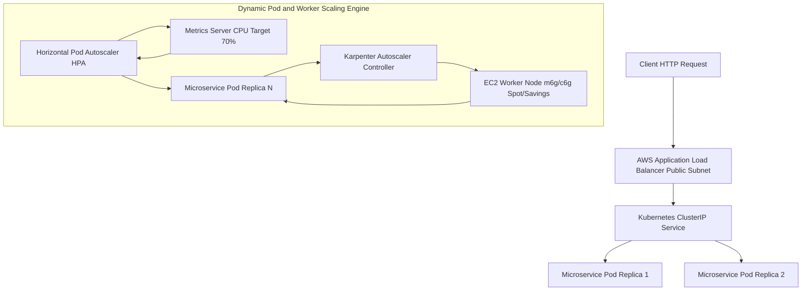

---

### 4.2 Module 2: CI/CD Toolchain & GitOps Deployment Topology
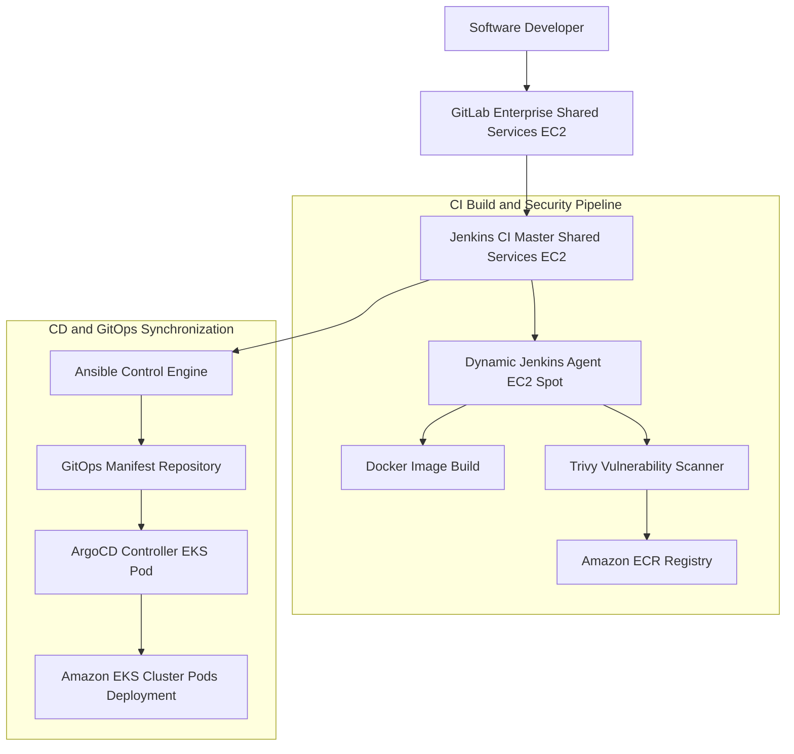

---

### 4.3 Module 3: Stateful Middleware & Secrets Injection Topology
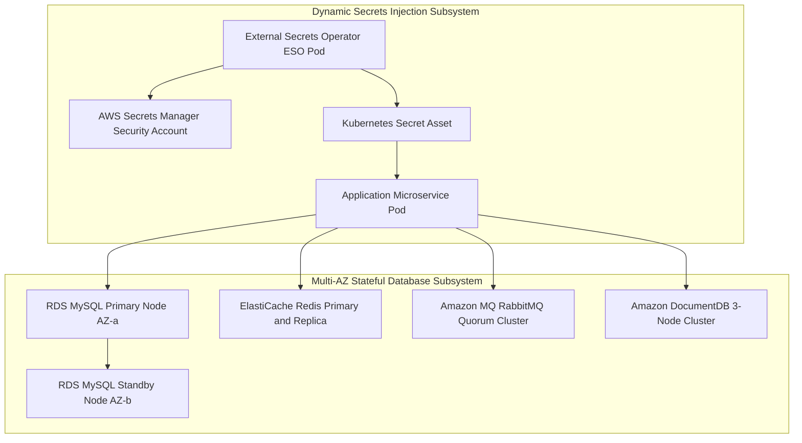

---

### 4.4 Module 4: Observability, Log Archiving & Metrics Pipeline
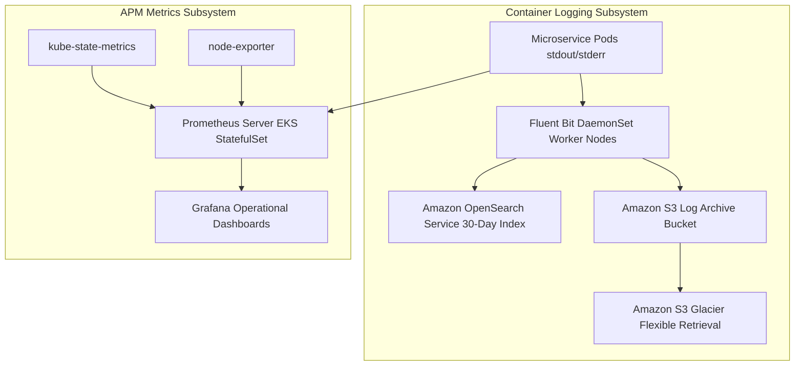

---

## 5. Low-Level Design (LLD) Component Deployment Tables

### 5.1 Group 1: EKS Cluster Workloads (Kubernetes Pods)

| Component Name | Workload Type | Compute & Pod Spec | Subnet & Volume Spec | High Availability & Backup |
| :--- | :--- | :--- | :--- | :--- |
| **40 Microservices** | `Deployment` | XS–XL (0.1–1 vCPU, 0.25–2GB RAM) | Private App Subnet \| Ephemeral / PVC | HPA (70% CPU) + Karpenter JIT \| Velero S3 Snapshot |
| **Nacos Cluster** | `StatefulSet` | 3 Replicas (0.5 vCPU / 1GB RAM) | Private App Subnet \| 10 GB EBS `gp3` PVC | 3-Node Raft Cluster (3 AZs) \| Backed by RDS MySQL |
| **ArgoCD Controller** | `Deployment` | 2 Replicas (0.5 vCPU / 1GB RAM) | Private App Subnet \| Stateless | Multi-AZ Pod Anti-Affinity \| Git History |
| **External Secrets (ESO)** | `Deployment` | 2 Replicas (0.1 vCPU / 256MB RAM)| Private App Subnet \| Stateless | Multi-AZ Pod Anti-Affinity \| Velero Manifest Backup |
| **Prometheus & Grafana** | `StatefulSet` | Prom (1vCPU/4GB), Grafana (0.5vCPU/1GB) | Private App Subnet \| 50 GB EBS `gp3` PVC | Multi-AZ Pod Anti-Affinity \| EBS Snapshot + S3 Export |
| **Fluent Bit Logging** | `DaemonSet` | 1 Pod / EKS Worker Node | Local Node Buffer | Automatic per-node \| Streams to OpenSearch & S3 |
| **Velero Operator** | `Deployment` | 1 Replica (0.2 vCPU / 512MB RAM) | Private App Subnet \| Stateless | Single pod auto-restart \| S3 Evidence Vault |

---

### 5.2 Group 2: AWS Managed Services

| AWS Service | Service Class | Instance / Sizing Class | Subnet Boundary | High Availability & Backup Policy |
| :--- | :--- | :--- | :--- | :--- |
| **EKS Control Plane** | Amazon EKS | Managed EKS Control Plane (`v1.30+`) | AWS Managed VPC Boundary | Multi-AZ etcd Quorum \| AWS Managed Continuous Backup |
| **MySQL Database** | Amazon RDS | RDS MySQL (`db.m6g.xlarge` Multi-AZ) | Isolated Database Subnet | Primary/Standby (< 60s failover) \| Snapshots + 30-Day PITR |
| **Redis Cache** | Amazon ElastiCache | ElastiCache Redis (`cache.m6g.large`) | Isolated Database Subnet | 2-Node Multi-AZ Group \| Daily RDB Snapshot to S3 |
| **RabbitMQ Broker** | Amazon MQ | Amazon MQ RabbitMQ (`mq.m6g.large`) | Isolated Database Subnet | 3-Node Multi-AZ Quorum Broker \| Automated EBS Snapshots |
| **MongoDB Store** | Amazon DocumentDB | DocumentDB (`db.r6g.xlarge` 3-Node) | Isolated Database Subnet | 3-Node Cluster (3 AZs) \| 30-Day Continuous PITR |
| **AWS Secrets Manager** | Secrets Manager | Managed Key-Value Vault | Security Account / Private Access | Multi-Region VPC Endpoint Access \| AWS Managed Replication |
| **Amazon OpenSearch** | OpenSearch Service | `2-node r6g.large.search` Cluster | Private Application Subnet | 2-AZ Search Distribution \| Automated Daily Snapshots |
| **Amazon S3 / Glacier** | S3 / Glacier | Standard & Glacier Flexible | Regional Endpoint | Multi-AZ Regional Durability \| S3 Versioning & Lock |
| **App Load Balancer** | Application Load Balancer| Managed ALB Ingress Controller | Public Internet Subnet | Active-Active Multi-AZ Routing \| AWS Infrastructure Managed |

---

### 5.3 Group 3: Standalone & Dynamic EC2 Toolchain Instances

| EC2 Server | Component Role | Instance Type / Compute | Subnet & Storage Spec | High Availability & Backup Policy |
| :--- | :--- | :--- | :--- | :--- |
| **Karpenter Worker Nodes** | Dynamic EKS Worker Nodes | `m6g.large`, `c6g.large`, `r6g.large` | Private App Subnet \| 50 GB EBS `gp3` | Karpenter JIT NodePools (3 AZs) \| Stateless Replacement |
| **GitLab Enterprise** | Source Control & Webhooks | `m6g.xlarge` (4 vCPU / 16GB RAM) | Shared Services Private \| 200 GB EBS `gp3`| Standby AMI Snapshot Recovery \| Daily AWS Backup AMI |
| **Jenkins Master Server** | CI Build Orchestration | `m6g.xlarge` (4 vCPU / 16GB RAM) | Shared Services Private \| 100 GB EBS `gp3`| Single-Node Auto-Recovery ASG \| Daily AWS Backup AMI |
| **Jenkins Dynamic Workers**| Ephemeral Build Agents | `c6g.large` EC2 Spot Instances | Shared Services Private \| 30 GB Ephemeral | Auto-terminated upon job completion \| Stateless |
| **Ansible Control Engine** | Configuration & Playbooks | `t3.medium` (2 vCPU / 4GB RAM) | Shared Services Private \| 30 GB EBS `gp3`| Standby AMI Snapshot Recovery \| Git Repository Backup |

---

## 6. Key Architectural Decisions (ADR Package Summary)

The architecture is governed by 15 Architecture Decision Records ([`ADR-REGISTER.md`](03-decisions/ADR-REGISTER.md)):

| ADR ID | Decision Subject | Selected Architectural Option | Rationale & Key Trade-Off |
| :--- | :--- | :--- | :--- |
| [`ADR-001`](03-decisions/ADR-001-aws-account-strategy.md) | AWS Account Structure | Multi-Account Landing Zone | Strict isolation of blast radius & distinct billing boundaries |
| [`ADR-002`](03-decisions/ADR-002-environment-isolation.md) | Environment Isolation | Physical Account & EKS Isolation | Eliminates shared cluster risk between Test and Production |
| [`ADR-003`](03-decisions/ADR-003-kubernetes-platform.md) | K8s Engine Choice | Amazon EKS (`v1.30+`) | AWS-managed control plane etcd HA with native IRSA/VPC support |
| [`ADR-004`](03-decisions/ADR-004-cicd-operating-model.md) | CI/CD Operating Model | Hybrid Overlay Model | GitLab trigger → Jenkins build → Ansible → ArgoCD GitOps sync |
| [`ADR-005`](03-decisions/ADR-005-node-autoscaling.md) | Node Autoscaling Engine | Karpenter JIT Autoscaler | Sub-minute EC2 provisioning without pre-allocated ASG waste |
| [`ADR-006`](03-decisions/ADR-006-mysql-deployment.md) | Relational Database | Amazon RDS MySQL Multi-AZ | Fully managed automated failover & 30-day PITR retention |
| [`ADR-007`](03-decisions/ADR-007-redis-deployment.md) | In-Memory Cache | Amazon ElastiCache Redis | Sub-millisecond latency with automated primary failover |
| [`ADR-008`](03-decisions/ADR-008-rabbitmq-deployment.md) | Message Queue Broker | Amazon MQ for RabbitMQ | Managed Multi-AZ quorum queue broker offloading maintenance |
| [`ADR-009`](03-decisions/ADR-009-mongodb-deployment.md) | Document Store DB | Amazon DocumentDB (Pending Audit)| Managed MongoDB API compatibility; subject to query audit |
| [`ADR-010`](03-decisions/ADR-010-nacos-deployment.md) | Service Discovery/Config | Nacos StatefulSet on EKS | 3-node Raft cluster on EKS backed by MySQL storage |
| [`ADR-011`](03-decisions/ADR-011-secrets-management.md) | Secrets Management | AWS Secrets Manager + ESO | Zero plain-text secrets in Git; automated pod synchronization |
| [`ADR-012`](03-decisions/ADR-012-observability.md) | Observability Stack | Prometheus/Grafana + OpenSearch | Metric dashboards + hot log search with 30-day S3 Glacier archiving |
| [`ADR-013`](03-decisions/ADR-013-backup-strategy.md) | Backup & Retention | Database PITR + Velero S3 | 30-day continuous DB recovery + cluster manifest Velero snapshots |
| [`ADR-014`](03-decisions/ADR-014-disaster-recovery.md) | Disaster Recovery | Regional Pilot Light / Standby | Cross-region failover targeting RTO < 4h and RPO < 15m |
| [`ADR-015`](03-decisions/ADR-015-infrastructure-as-code.md) | Infrastructure as Code | Modular Terraform + Helm | Declarative AWS infrastructure provisioning with `terraform plan` audit |

---

## 7. Security, High Availability & Disaster Recovery

### 7.1 Security Architecture
1. **Zero Static Credentials**: Developer and pipeline access is federated via AWS IAM Identity Center (SSO). EKS pod permissions utilize IAM Roles for Service Accounts (IRSA) with short-lived OIDC tokens (`SEC-001`).
2. **Network Perimeter Defense**: Database subnets are completely isolated with zero route paths to the internet (`SEC-002`). Public traffic enters strictly via AWS Application Load Balancers (ALB) guarded by AWS WAF.
3. **Data Encryption Standard**: 100% of EBS volumes, RDS instances, S3 buckets, and Secrets Manager entries are encrypted at rest using AWS KMS Customer-Managed Keys (CMK) with enforced TLS 1.3 in transit (`SEC-003`).

### 7.2 High Availability & Resiliency
- **Control Plane**: Managed Amazon EKS control plane replicated across 3 Availability Zones.
- **Worker Nodes**: Karpenter balances EC2 instance allocation across 3 AZs using Kubernetes `topologySpreadConstraints`.
- **Database HA**: Multi-AZ Primary/Standby synchronous replication with automated failover in under 60 seconds (`NFR-001`).

### 7.3 Backup & Disaster Recovery Strategy
- **Point-in-Time Recovery (PITR)**: Amazon RDS continuous transaction logging enables database restoration to any exact second over the preceding 30 days (`ADR-013`).
- **Cluster State Backups**: Automated daily Velero snapshots back up Kubernetes manifests, CRDs, and EBS volume states to encrypted, cross-account S3 buckets with AWS Backup Vault Lock (`SEC-003`).
- **Disaster Recovery SLA Targets**: Pilot Light / Standby cross-region architecture designed to achieve **RTO < 4 hours** and **RPO < 15 minutes** (`ADR-014`).

---

## 8. Implementation Delivery Roadmap & Governance Gates

The implementation plan ([`IMPLEMENTATION-ROADMAP.md`](04-planning/IMPLEMENTATION-ROADMAP.md)) spans **11 relative phases** containing **20 Work Packages (`WP-001` to `WP-020`)**, guarded by **10 Acceptance Gates (`GATE-01` to `GATE-10`)**:

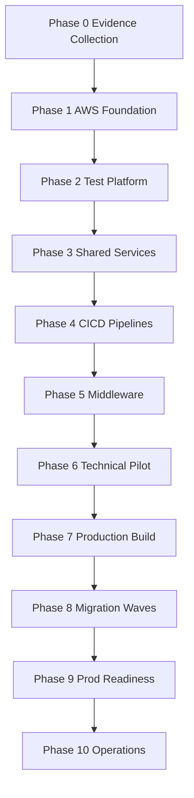

---

## 9. FinOps Cost Architecture & Normalized 4 Financial Scenarios

In accordance with requirement `BUS-004` and [`COST-SCENARIOS.md`](05-cost/COST-SCENARIOS.md), cloud expenditure is modeled across **4 normalized enterprise financial scenarios**:

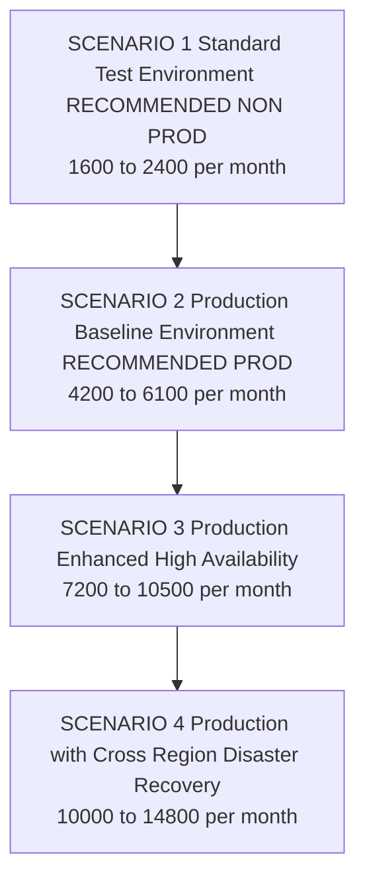

---

### 9.1 Scenario 1: Standard Test Environment — RECOMMENDED NON-PROD (`~$1,600 – $2,400 / month`)
* **Objective**: 2-AZ High-Availability Non-Production Environment with Karpenter Autoscaling, Dedicated CI/CD & Managed Services.

*Figure 9.1: Scenario 1 Architecture Diagram — Standard Test Environment ($1,600 – $2,400 / month).*

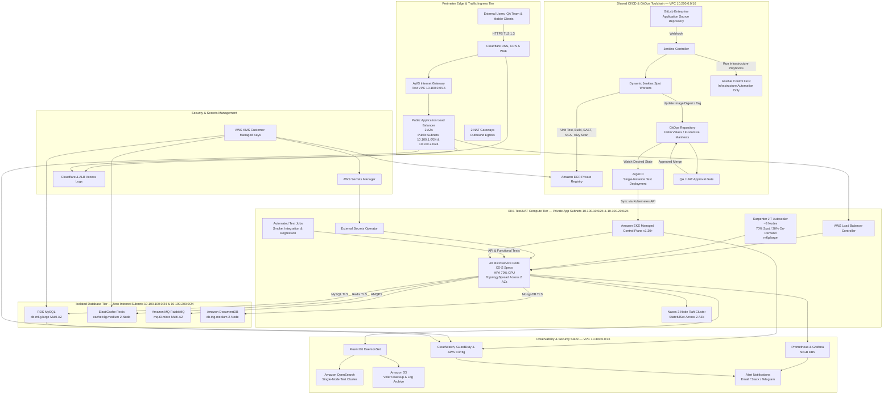

| AWS Component Category | Instance / Resource Class | Quantity / Allocation | Unit Sizing & Pricing | Monthly Subtotal |
| :--- | :--- | :--- | :--- | :--- |
| **EKS Control Plane** | Amazon EKS Cluster (`v1.30+`) | 1 Cluster | $0.10 / hr | $73 / month |
| **Worker Compute Nodes** | EC2 Spot (70%) & On-Demand (30%) (`m6g.large`) | ~8 Node Instances (Dynamic) | ~$0.023 / hr (Spot Mix) | $450 / month |
| **Relational Database** | Amazon RDS MySQL (`db.m6g.large` Multi-AZ) | 2 Instances (Primary + Standby)| $0.24 / hr | $240 / month |
| **In-Memory Cache** | Amazon ElastiCache Redis (`cache.t4g.medium`) | 2 Nodes (2 AZs) | $0.034 / hr | $50 / month |
| **Message Queue** | Amazon MQ RabbitMQ (`mq.t3.micro` Multi-AZ) | 2 Broker Nodes | $0.03 / hr | $45 / month |
| **Document Store** | Amazon DocumentDB (`db.t4g.medium` 2-Node) | 2 Replica Nodes | $0.078 / hr | $110 / month |
| **CI/CD Toolchain Stack** | GitLab Host ($60) + Jenkins Master/Workers ($70) + Ansible ($30) + ECR ($20) | 3 EC2 Instances + ECR Storage | Standalone EC2 + ECR | **$180 / month** |
| **Observability & Security**| OpenSearch (`search.m6g.large` $120) + Prom PVC ($16) + CloudWatch ($35) + GuardDuty ($30) | OpenSearch + EBS + CloudWatch | Managed Observability | **$201 / month** |
| **Network & Egress** | NAT Gateways (2 AZs) + Inter-AZ Traffic | 2 NAT Gateways | $0.045/hr x 2 | $99 / month |
| **Storage & Backups** | EBS `gp3` (500GB) + S3 Velero Backups | 500 GB Storage + S3 | $0.08 / GB | $120 / month |
| **Estimated Total Spend** | **Standard Non-Prod Baseline** | — | — | **~$1,600 – $2,400 / month** |

---

### 9.2 Scenario 2: Production Baseline Environment — RECOMMENDED PROD (`~$4,200 – $6,100 / month`)
* **Objective**: 3-AZ Enterprise Production Environment with Compute Savings Plans, Enterprise CI/CD & Full Observability Stack.

*Figure 9.2: Scenario 2 Architecture Diagram — Production Baseline Environment ($4,200 – $6,100 / month).*

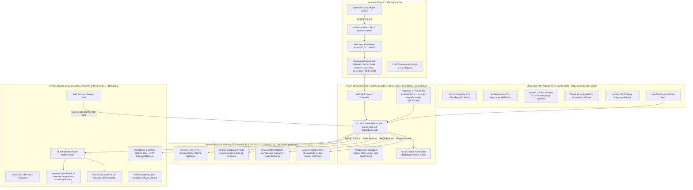

| AWS Component Category | Instance / Resource Class | Quantity / Allocation | Unit Sizing & Pricing | Monthly Subtotal |
| :--- | :--- | :--- | :--- | :--- |
| **EKS Control Plane** | Amazon EKS Cluster (`v1.30+`) | 1 Cluster | $0.10 / hr | $73 / month |
| **Worker Compute Nodes** | EC2 Karpenter JIT (3-Yr Savings Plan `m6g.xlarge`)| ~16 Node Instances | ~$0.084 / hr (3-Yr SP) | $1,800 / month |
| **Relational Database** | Amazon RDS MySQL (`db.m6g.xlarge` Multi-AZ) | 2 Instances (Primary + Standby)| $0.48 / hr | $700 / month |
| **In-Memory Cache** | Amazon ElastiCache Redis (`cache.m6g.large` Multi-AZ)| 2 Nodes (Multi-AZ Group) | $0.136 / hr | $200 / month |
| **Message Queue** | Amazon MQ RabbitMQ (`mq.m6g.large` Quorum) | 3 Broker Nodes | $0.26 / hr | $280 / month |
| **Document Store** | Amazon DocumentDB (`db.r6g.xlarge` 3-Node Cluster) | 3 Nodes (3 AZs) | $0.46 / hr | $680 / month |
| **CI/CD Toolchain Stack** | GitLab Enterprise (`m6g.xlarge` $136) + Jenkins Master (`m6g.xlarge` $128) + Spot Workers ($25) + Ansible ($32) + ECR ($50) | 4 EC2 Servers + ECR Registry | Dedicated Shared Services | **$371 / month** |
| **Observability & Security**| OpenSearch (`2-node r6g.large` $360) + Prom PVC ($40) + CloudWatch ($120) + X-Ray ($40) + GuardDuty/Config ($90) | 2 OpenSearch Nodes + APM | Full Stack Observability | **$650 / month** |
| **Network & Egress** | NAT Gateways (3 AZs) + VPC Data Transfer | 3 NAT Gateways | $0.045/hr x 3 | $99 / month |
| **Storage & Backups** | EBS `gp3` (1.5TB) + RDS Snapshots + Velero S3 | 1.5 TB Storage + AWS Backup | $0.08 / GB | $350 / month |
| **Estimated Total Spend** | **Production Baseline Standard** | — | — | **~$4,200 – $6,100 / month** |

---

### 9.3 Scenario 3: Production Enhanced High Availability (`~$7,200 – $10,500 / month`)

*Figure 9.3: Scenario 3 Architecture Diagram — Production Enhanced High Availability ($7,200 – $10,500 / month).*

* **Objective**: High-Throughput 3-AZ Production Environment with Amazon Aurora, HA CI/CD Cluster & Full Security Audit Stack.

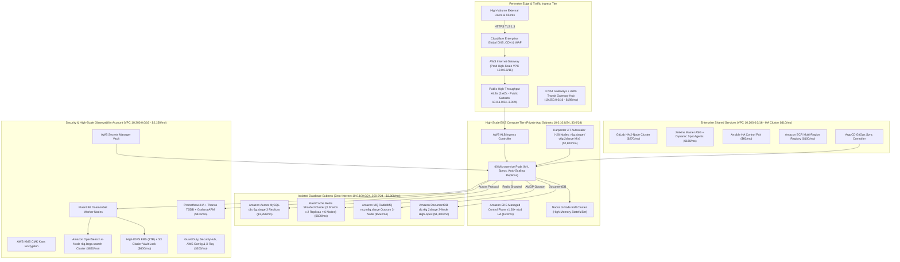

| AWS Component Category | Instance / Resource Class | Quantity / Allocation | Unit Sizing & Pricing | Monthly Subtotal |
| :--- | :--- | :--- | :--- | :--- |
| **EKS Control Plane** | Amazon EKS Cluster (`v1.30+`) | 1 Cluster | $0.10 / hr | $73 / month |
| **Worker Compute Nodes** | EC2 Karpenter JIT (`r6g.xlarge` / `c6g.2xlarge`) | ~28 Node Instances | Savings Plan + On-Demand | $2,800 / month |
| **Relational Database** | Amazon Aurora MySQL Multi-AZ (`db.r6g.xlarge`) | 3 Replicas (Auto-scaling) | $0.52 / hr | $1,350 / month |
| **In-Memory Cache** | Amazon ElastiCache Redis Cluster (Multi-Node Sharded)| 6 Nodes (3 Shards x 2 Replicas)| $0.136 / hr x 6 | $600 / month |
| **Message Queue** | Amazon MQ RabbitMQ (`mq.m6g.xlarge` Quorum Broker)| 3 High-Memory Nodes | $0.52 / hr | $550 / month |
| **Document Store** | Amazon DocumentDB (`db.r6g.2xlarge` 3-Node) | 3 High-Spec Nodes | $0.92 / hr | $1,300 / month |
| **CI/CD Toolchain Stack** | GitLab HA Cluster ($270) + Jenkins Master ASG ($180) + Ansible HA ($60) + ECR Multi-Region ($100) | Enterprise CI/CD Cluster | Multi-Instance HA Stack | **$610 / month** |
| **Observability & Security**| OpenSearch (`4-node r6g.large` $850) + Prom HA/Thanos ($120) + CloudWatch ($280) + X-Ray ($120) + SecurityHub/GuardDuty ($180) | 4 OpenSearch Nodes + APM | High-Scale Observability | **$1,550 / month** |
| **Network & Egress** | Multi-VPC Transit Gateway + NAT Gateways (3 AZs) | Transit Gateway + 3 NATs | AWS Transit Network | $198 / month |
| **Storage & Backups** | High-IOPS EBS `gp3` (3TB) + AWS Backup Vault Lock | 3 TB High-IOPS Storage | $0.12 / GB + IOPS | $600 / month |
| **Estimated Total Spend** | **Enhanced High-Throughput Prod** | — | — | **~$7,200 – $10,500 / month** |

---

### 9.4 Scenario 4: Production with Cross-Region Disaster Recovery (`~$10,000 – $14,800 / month`)

*Figure 9.4: Scenario 4 Architecture Diagram — Production Cross-Region Disaster Recovery ($10,000 – $14,800 / month).*

* **Objective**: Primary Region Production + Secondary Region Pilot Light Disaster Recovery (RTO < 4h, RPO < 15m).

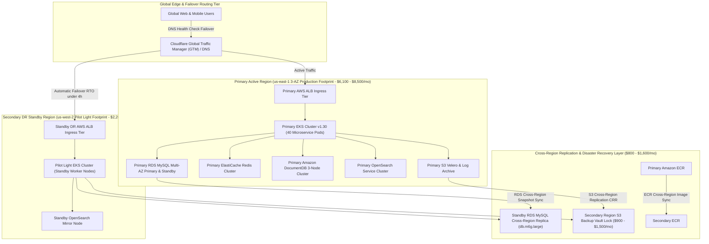

| AWS Region Domain | Resource & Component Breakdown | Hosting Model / SLA | Monthly Subtotal |
| :--- | :--- | :--- | :--- |
| **Primary Region (`us-east-1`)**| Scenario 2 / Scenario 3 Production Baseline Infrastructure (Compute + DB + CI/CD + Observability) | Active 3-AZ Production | $6,100 – $8,500 / month |
| **Secondary DR Region (`us-west-2`)**| Standby EKS Control Plane + Standby RDS Replica (`db.m6g.large`) + Standby OpenSearch Mirror | Pilot Light DR Standby | $2,200 – $3,200 / month |
| **Cross-Region Replication** | S3 Cross-Region Replication (CRR) + Snapshot RDS Cross-Region + ECR Image Sync | Continuous Asynchronous Sync | $800 – $1,600 / month |
| **DR Observability & Vault** | Secondary Region AWS Backup Vault + S3 Evidence Backup + Secondary CloudWatch | Cross-Region Immutable Backup | $900 – $1,500 / month |
| **Estimated Total Spend** | **Multi-Region Disaster Recovery Footprint** | **RTO < 4h \| RPO < 15m** | **~$10,000 – $14,800 / month** |

---

## 10. Operational Model & Service Ownership

The operational governance ([`OPERATING-MODEL.md`](06-operations/OPERATING-MODEL.md)) establishes a unified RACI ownership matrix combining SRE, DevOps, and Security under a single **Cloud Platform SRE & DevSecOps Team**:

| Operational Domain & Scope | Cloud Platform SRE & DevSecOps Team | Database Administration Team (DBA) | Application Development Teams (App Dev) | Enterprise Operations & Support (Ops) |
| :--- | :--- | :--- | :--- | :--- |
| **AWS Landing Zone & VPC Subnets** | **Accountable / Responsible** | Informed | Informed | Informed |
| **EKS Control Plane & Worker Nodes** | **Accountable / Responsible** | Informed | Informed | Informed |
| **CI/CD Pipelines & GitOps ArgoCD** | **Accountable / Responsible** | Informed | Consulted | Informed |
| **Database & Stateful Tier (RDS/Redis/DocumentDB/RabbitMQ)**| Consulted | **Accountable / Responsible** | Consulted | Informed |
| **Microservice Application Code & Pod Specs** | Consulted | Informed | **Accountable / Responsible** | Informed |
| **Observability, Security Audit & Logging Pipeline** | **Accountable / Responsible** | Informed | Informed | Informed |
| **24/7 Incident Response & Emergency Escalation** | **Accountable / Responsible** | Consulted | Consulted | **Responsible** |

---

## 11. Risk Management & Production Blockers

Prior to CAB approval (`GATE-07`) for provisioning `DataBlue-Prod-Account`, the following **5 Critical Production Blockers** must be resolved during Phase 0 & Phase 1:

1. **`RSK-UNC-001`**: Solicit and verify microservice CPU and Memory sizing profiles from application teams.
2. **`RSK-DAT-001`**: Complete MongoDB wire-protocol query compatibility audit against Amazon DocumentDB.
3. **`RSK-UNC-003`**: Secure formal business Product Owner sign-off on target RTO (< 4h) and RPO (< 15m) SLA metrics.
4. **`RSK-SEC-003`**: Audit and verify Landing Zone multi-account boundary with zero cross-account VPC peering.
5. **`RSK-SCL-001`**: Complete Technical Pilot load testing benchmark accepted at `GATE-06`.

---

## 12. Conclusion & Recommendation

The **DataBlue Next-Gen Infrastructure Platform** proposal provides a fully traceable, defensible, and modular architecture designed for high availability, security, and financial predictability. 

We recommend approving **Stage 3 ADR Package** and authorizing **Phase 0 Evidence Collection** to resolve open workload profiling parameters and unblock Phase 1 AWS Landing Zone construction.
