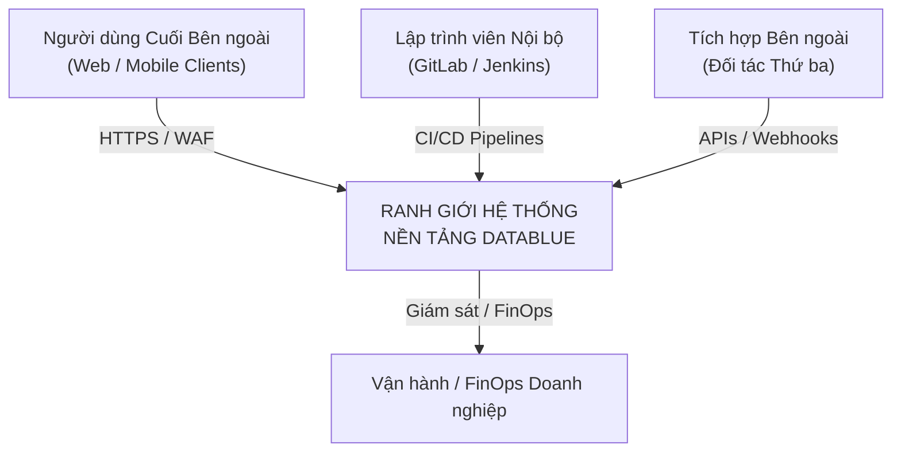
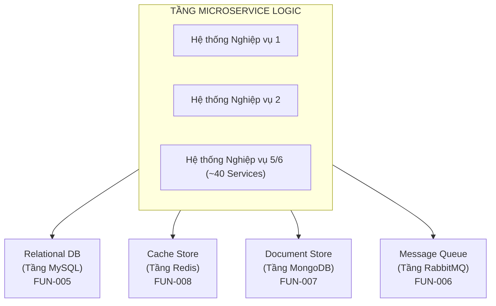
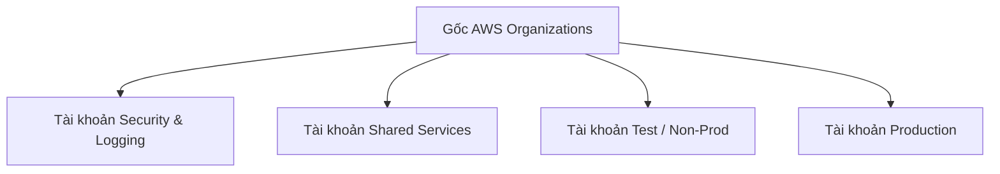
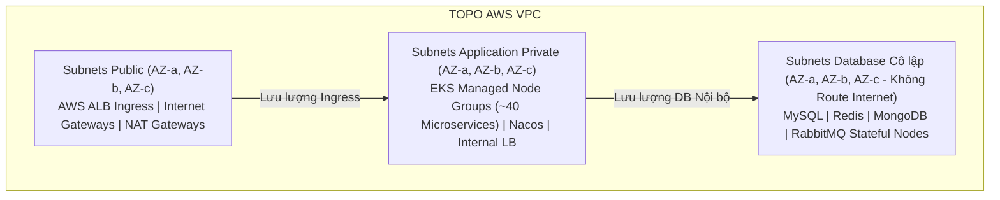
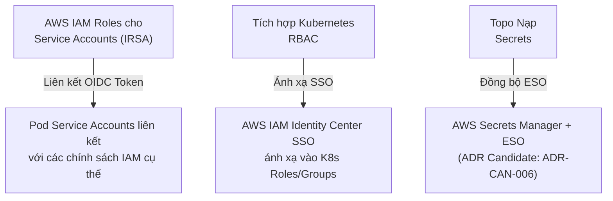
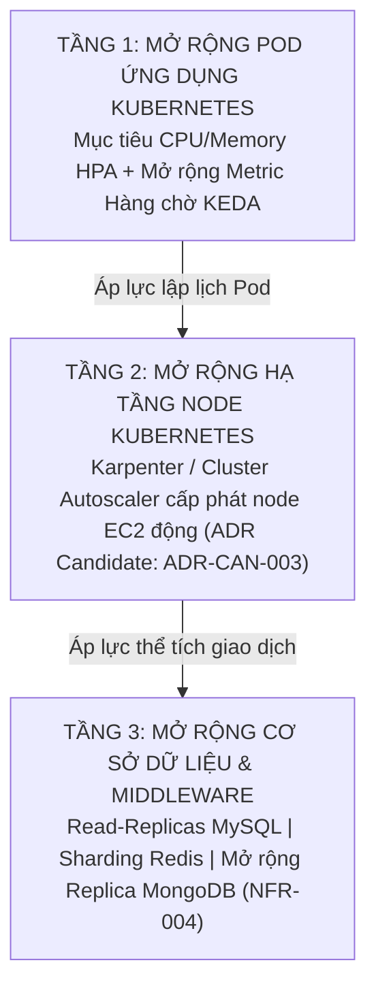
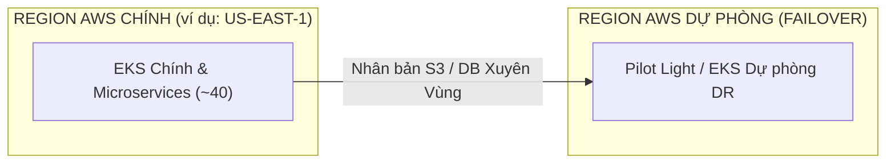
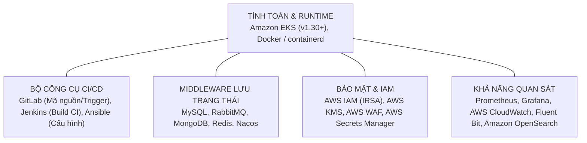

# Đặc tả Kiến trúc: Nền tảng AWS Kubernetes DataBlue

> **THÔNG BÁO QUAN TRỌNG STAGE 2**: Tài liệu này định nghĩa Đặc tả Kiến trúc Mục tiêu cho **Nền tảng AWS Kubernetes DataBlue** (`datablue-nextgen-infra-platform`). Theo các quy tắc quản trị Stage 2, **không có mã nguồn triển khai nào (Terraform, Helm charts, Kubernetes YAML hoặc câu lệnh AWS CLI) được sinh ra tại đây**. Các quyết định kiến trúc lớn được danh mục hóa dưới dạng **ADR Candidates**, và các chỉ số kích thước còn thiếu được ghi nhận dưới dạng **Giả định Kiến trúc (Architecture Assumptions)**.

---

## 1. Các Nguyên tắc Kiến trúc

* **Truy xuất Yêu cầu**: Ánh xạ tới [`BUS-001`](../01-requirements/REQUIREMENTS-REGISTER.md), [`BUS-002`](../01-requirements/REQUIREMENTS-REGISTER.md), [`BUS-003`](../01-requirements/REQUIREMENTS-REGISTER.md), [`BUS-004`](../01-requirements/REQUIREMENTS-REGISTER.md), [`AGENTS.md`](../../AGENTS.md).

Kiến trúc của Nền tảng AWS Kubernetes DataBlue được quản trị bởi 6 nguyên tắc cốt lõi:

1. **Ranh giới Kiến trúc Tách biệt**: Duy trì sự phân tách rõ ràng giữa Kiến trúc Logic, Triển khai Vật lý, Hạ tầng Mạng và Vận hành. Không bao giờ làm mờ ranh giới runtime.
2. **Giảm thiểu Bán kính Ảnh hưởng Sự cố**: Thực thi cô lập vật lý giữa tải công việc Test và Production ở cấp độ Tài khoản AWS và Cluster EKS. Đặt chung nhiều môi trường trong một cluster bị nghiêm cấm nếu không có phê duyệt chính thức (`ADR Candidate: ADR-CAN-001`).
3. **Không Hardcode Secret & Truy cập Đặc quyền Tối thiểu**: Tất cả tải container phải xác thực tới dịch vụ AWS bằng IAM Roles for Service Accounts (IRSA). Không cho phép thông tin đăng nhập tĩnh hoặc API key tĩnh bên trong container hay repository (`SEC-001`).
4. **Hạ tầng Bất biến Khai báo**: 100% tài nguyên đám mây, trạng thái cluster và quản lý cấu hình phải được điều khiển theo phương pháp khai báo qua IaC có phiên bản và GitOps pipelines (`BUS-002`). Nghiêm cấm chỉnh sửa thủ công trên AWS Console.
5. **Mô hình Độ Bền vững Tách biệt**: Khả năng Sẵn sàng Cao (Dư thừa Multi-AZ), Sao lưu Point-in-Time và Khôi phục Thảm họa (Failover Xuyên Vùng) phải được xử lý như các miền thiết kế độc lập với chỉ số SLA/SLO riêng (`NFR-001`, `NFR-003`).
6. **Khả năng Đảo ngược khi Có Biến số**: Nơi chỉ số tải của khách hàng chưa có sẵn, các lựa chọn phải ưu tiên kết nối lỏng lẻo (loose coupling) và trừu tượng có thể đảo ngược (`Giả định Kiến trúc: ASM-006`).

---

## 2. Bối cảnh Hệ thống (System Context)

* **Truy xuất Yêu cầu**: Ánh xạ tới [`BUS-001`](../01-requirements/REQUIREMENTS-REGISTER.md), [`FUN-001`](../01-requirements/REQUIREMENTS-REGISTER.md)–[`FUN-009`](../01-requirements/REQUIREMENTS-REGISTER.md).

### 2.1 Ranh giới Hệ thống & Tác nhân Bên ngoài
Nền tảng AWS Kubernetes DataBlue đóng vai trò là xương sống điều phối container, truyền tin nhắn, lưu trữ trạng thái và vận hành cho khoảng 5–6 hệ thống nghiệp vụ bao gồm ~40 microservices.

### 2.2 Khả năng Tương tác Hệ thống
* **Lưu lượng Luồng vào**: Người dùng web/mobile bên ngoài đi qua **Cloudflare Enterprise Edge (Cloudflare DNS, CDN & WAF)**, định tuyến qua AWS Application Load Balancers (ALB) vào tầng ingress EKS.
* **Lập trình viên & Pipeline CI/CD**: Lập trình viên commit code lên GitLab, trigger các job Jenkins CI để biên dịch ảnh và quét bảo mật, sau đó triển khai Ansible/GitOps vào EKS.
* **Cổng Kết nối Bên thứ ba**: Kết nối luồng ra bảo mật qua NAT Gateways và AWS Network Firewall cho tích hợp ngân hàng/thanh toán bên ngoài.

---

## 3. Kiến trúc Logic

* **Truy xuất Yêu cầu**: Ánh xạ tới [`FUN-001`](../01-requirements/REQUIREMENTS-REGISTER.md), [`FUN-005`](../01-requirements/REQUIREMENTS-REGISTER.md)–[`FUN-009`](../01-requirements/REQUIREMENTS-REGISTER.md).

### 3.1 Tầng Microservice Logic
Miền ứng dụng bao gồm ~40 microservices không lưu trạng thái được nhóm logic thành 5–6 miền nghiệp vụ (ví dụ: Core Banking/Thanh toán, Định danh Người dùng, Xử lý Đơn hàng, Engine Thông báo, Phân tích, Cổng API Đối tác).

* **Runtime Microservice**: Container Docker không lưu trạng thái được quản lý bởi Kubernetes Deployments trên các namespace riêng biệt theo từng miền nghiệp vụ.
* **Đăng ký & Cấu hình Dịch vụ**: Nacos cung cấp phát hiện dịch vụ tập trung, quản lý cấu hình động và kiểm tra sức khỏe (`FUN-009`).

### 3.2 Tầng Dữ liệu & Middleware Logic
Luồng dữ liệu logic tách biệt trạng thái tạm thời, lưu trữ quan hệ, dữ liệu phi cấu trúc và luồng sự kiện:

* `ADR Candidate: ADR-CAN-002`: Chiến lược Kiến trúc Middleware Lưu trạng thái đang được đánh giá (AWS Managed RDS/ElastiCache/MSK vs. Middleware Operators Self-Hosted trên EKS).
* `Giả định Kiến trúc: ASM-001`: Các microservices được giả định tuân thủ 12-factor, lưu trữ trạng thái duy nhất ở các tầng cơ sở dữ liệu/cache.

---

## 4. Kiến trúc Triển khai (Deployment Architecture)

* **Truy xuất Yêu cầu**: Ánh xạ tới [`BUS-003`](../01-requirements/REQUIREMENTS-REGISTER.md), [`SEC-002`](../01-requirements/REQUIREMENTS-REGISTER.md), [`NFR-001`](../01-requirements/REQUIREMENTS-REGISTER.md).

### 4.1 Cấu trúc Tài khoản AWS Vật lý
Để đáp ứng cô lập môi trường nghiêm ngặt (`BUS-003`, `SEC-002`), triển khai vật lý sử dụng topo multi-account landing zone AWS Organizations:

1. **Tài khoản Security & Logging**: Tập trung AWS CloudTrail, AWS Config, GuardDuty, và S3 Log Archive bucket (`OPS-002`).
2. **Tài khoản Shared Services**: Lưu trữ repository GitLab, Jenkins master/build nodes, máy chủ tự động hóa Ansible, và AWS ECR container registry riêng (`FUN-002`–`FUN-004`).
3. **Tài khoản Test / Non-Production**: EKS Test Cluster riêng, các instance cơ sở dữ liệu non-prod, VPC cô lập (`BUS-003`).
4. **Tài khoản Production**: EKS Production Cluster riêng, các instance cơ sở dữ liệu multi-AZ production, VPC cô lập (`SEC-002`).

* `ADR Candidate: ADR-CAN-001`: Cô lập Tài khoản & Cluster Vật lý được xác nhận là ứng viên kiến trúc cơ sở.

### 4.2 Cấu trúc Cluster Multi-AZ
Trong mỗi Tài khoản AWS môi trường, các worker node được phân bổ trên 3 Availability Zones (AZ-a, AZ-b, AZ-c) để ngăn ngừa gián đoạn do sự cố zone (`NFR-001`).

---

## 5. Kiến trúc Mạng (Network Architecture)

* **Truy xuất Yêu cầu**: Ánh xạ tới [`SEC-002`](../01-requirements/REQUIREMENTS-REGISTER.md), [`SEC-003`](../01-requirements/REQUIREMENTS-REGISTER.md), [`FUN-002`](../01-requirements/REQUIREMENTS-REGISTER.md)–[`FUN-004`](../01-requirements/REQUIREMENTS-REGISTER.md).

### 5.1 Topo Subnet VPC
Mỗi VPC được chia thành ba tầng subnet riêng biệt trên 3 Availability Zones:

1. **Subnets Public**: AWS Application Load Balancers, NAT Gateways cho luồng ra egress.
2. **Subnets Application Private**: EKS Worker Nodes lưu trữ microservices và Nacos. Chỉ truy cập nội bộ; luồng ra internet định tuyến qua NAT Gateways.
3. **Subnets Database Cô lập**: Dành riêng cho các instance lưu trạng thái MySQL, Redis, MongoDB và RabbitMQ. Không cho phép tuyến đường ingress hoặc egress internet trực tiếp.

* `ADR Candidate: ADR-CAN-004`: Kiến trúc Ingress Controller đang được đánh giá (AWS ALB Controller + NGINX Ingress vs AWS VPC Lattice).

---

## 6. Thành phần Nền tảng & Mục tiêu Thực thi LLD (Platform Components & LLD Targets)

* **Truy xuất Yêu cầu**: Ánh xạ tới [`FUN-001`](../01-requirements/REQUIREMENTS-REGISTER.md)–[`FUN-009`](../01-requirements/REQUIREMENTS-REGISTER.md).

### 6.1 Tóm tắt Thành phần Mức Cao
| Thành phần Nền tảng | Phạm vi Chức năng | Mục tiêu Triển khai | Vai trò Kiến trúc |
| :--- | :--- | :--- | :--- |
| **Amazon EKS** | Engine Runtime Kubernetes (v1.30+) | **AWS Managed Service** | Điều phối tính toán cho ~40 microservices (`FUN-001`). |
| **GitLab** | Quản lý Mã nguồn & Trigger Pipeline | **Instance EC2** (Độc lập) | Mã nguồn, merge requests, Webhook triggers (`FUN-002`). |
| **Jenkins** | Điều phối Build CI & Đóng gói | **Instance EC2** (Độc lập/Động) | Build Docker, chạy kiểm thử, quét ảnh, push ECR (`FUN-003`). |
| **Ansible** | Quản lý Sai lệch Cấu hình & Triển khai | **Instance EC2** (Độc lập) | Cấu hình hạ tầng, tự động hóa playbook triển khai (`FUN-004`). |
| **MySQL** | Tầng Cơ sở Dữ liệu Quan hệ | **AWS Managed Service** (RDS) | Lưu trữ giao dịch sẵn sàng cao (`FUN-005`). |
| **RabbitMQ** | Message Broker & Luồng Sự kiện | **AWS Managed Service** (Amazon MQ) | Giao tiếp sự kiện bất đồng bộ inter-service (`FUN-006`). |
| **MongoDB** | Kho Dữ liệu Tài liệu | **AWS Managed Service** (DocumentDB) | Lưu trữ dữ liệu phi cấu trúc hiệu năng cao (`FUN-007`). |
| **Redis** | Bộ nhớ đệm In-Memory | **AWS Managed Service** (ElastiCache) | Cache session độ trễ thấp (`FUN-008`). |
| **Nacos** | Phát hiện Dịch vụ & Cấu hình Động | **EKS Pod** (`StatefulSet`) | Đăng ký microservice và nạp cấu hình động (`FUN-009`). |

### 6.2 Ma trận Mục tiêu Thực thi Thiết kế Mức Thấp (LLD)
Để đảm bảo khả năng theo dõi trực quan và dễ đọc nhất, Thiết kế Mức thấp (LLD) được chia nhỏ thành 3 Bảng Phân nhóm Trực quan:

#### Nhóm 1: Các Component chạy trên EKS (Container Workloads / Pods)
| Thành phần | Loại Workload | Cấu hình Compute / Pod | Subnet & Volume Spec | Cơ chế HA & Sao lưu |
| :--- | :--- | :--- | :--- | :--- |
| **40 Application Microservices** | `Deployment` | XS–XL (0.1–1 vCPU, 0.25–2GB RAM) | Private App Subnet \| Ephemeral / PVC | HPA (70% CPU) + Karpenter JIT \| Snapshot S3 Velero |
| **Nacos Cluster** | `StatefulSet` | 3 Replicas (0.5 vCPU / 1GB RAM) | Private App Subnet \| 10 GB EBS `gp3` PVC | Raft Cluster 3-Node (3 AZs) \| Backup từ RDS MySQL |
| **ArgoCD Controller** | `Deployment` | 2 Replicas (0.5 vCPU / 1GB RAM) | Private App Subnet \| Stateless | Multi-AZ Pod Anti-Affinity \| Lịch sử Git Repository |
| **External Secrets (ESO)** | `Deployment` | 2 Replicas (0.1 vCPU / 256MB RAM)| Private App Subnet \| Stateless | Multi-AZ Pod Anti-Affinity \| Velero Manifest Backup |
| **Prometheus & Grafana** | `StatefulSet` | Prom (1vCPU/4GB), Grafana (0.5vCPU/1GB) | Private App Subnet \| 50 GB EBS `gp3` PVC | Multi-AZ Pod Anti-Affinity \| EBS Snapshot + S3 Export |
| **Fluent Bit Logging Agent** | `DaemonSet` | 1 Pod / EKS Worker Node | Local Node Buffer | Tự động chạy theo node \| Stream log OpenSearch & S3 |
| **Velero Backup Operator** | `Deployment` | 1 Replica (0.2 vCPU / 512MB RAM) | Private App Subnet \| Stateless | Single pod auto-restart \| Store trạng thái S3 Vault |

#### Nhóm 2: Các Dịch vụ AWS Managed (AWS Managed Services)
| Dịch vụ AWS | Loại Service | Cấu hình Service Class | Subnet Mạng | Cơ chế HA & Chính sách Sao lưu |
| :--- | :--- | :--- | :--- | :--- |
| **EKS Control Plane** | Amazon EKS | EKS Managed (`v1.30+`) | AWS Managed VPC Boundary | Multi-AZ etcd Quorum \| AWS Continuous Backup |
| **MySQL Database** | Amazon RDS | RDS MySQL (`db.m6g.xlarge` Multi-AZ) | Isolated Database Subnet | Primary/Standby (< 60s failover) \| Snapshots + PITR 30 ngày |
| **Redis Cache** | Amazon ElastiCache | ElastiCache Redis (`cache.m6g.large`) | Isolated Database Subnet | Group Nhân bản 2-Node Multi-AZ \| Snapshot RDB S3 hàng ngày |
| **RabbitMQ Broker** | Amazon MQ | Amazon MQ RabbitMQ (`mq.m6g.large`) | Isolated Database Subnet | 3-Node Multi-AZ Quorum Broker \| Snapshots EBS tự động |
| **MongoDB Store** | Amazon DocumentDB | DocumentDB (`db.r6g.xlarge` 3-Node) | Isolated Database Subnet | 3-Node Cluster (3 AZs) \| PITR 30 ngày liên tục |
| **AWS Secrets Manager** | Secrets Manager | Key-Value Vault Managed | Security Account / Private | Multi-Region VPC Endpoint Access \| AWS Managed Replication |
| **Amazon OpenSearch** | OpenSearch Service | `2-node r6g.large.search` Cluster | Private Application Subnet | Phân bổ Search Node 2-AZ \| OpenSearch Snapshots hàng ngày |
| **Amazon S3 / Glacier** | S3 / Glacier | Standard & Glacier Flexible | Regional Endpoint | Multi-AZ Durability (99.999999999%) \| S3 Versioning & Lock |
| **App Load Balancer** | Application Load Balancer| Managed ALB Ingress Controller | Public Internet Subnet | Active-Active Multi-AZ Routing \| AWS Infrastructure Managed |

#### Nhóm 3: Các Máy chủ EC2 Độc lập (Standalone & Dynamic EC2 Instances)

| Máy chủ EC2 | Vai trò / Chức năng | Cấu hình Instance | Subnet & Volume Spec | Cơ chế HA & Chính sách Sao lưu |
| :--- | :--- | :--- | :--- | :--- |
| **Karpenter Worker Nodes** | Worker Node EKS Động | `m6g.large`, `c6g.large`, `r6g.large` | Private App Subnet \| 50 GB EBS `gp3` | Karpenter JIT NodePools (3 AZs) \| Thay thế stateless |
| **GitLab Enterprise** | Quản lý Mã & Webhooks | `m6g.xlarge` (4 vCPU / 16GB RAM) | Shared Services Private \| 200 GB EBS `gp3`| Standby AMI Snapshot Recovery \| Daily AWS Backup AMI |
| **Jenkins Master Server** | Điều phối Build CI | `m6g.xlarge` (4 vCPU / 16GB RAM) | Shared Services Private \| 100 GB EBS `gp3`| Single-Node Auto-Recovery ASG \| Daily AWS Backup AMI |
| **Jenkins Dynamic Workers**| Ephemeral Build Agents | `c6g.large` EC2 Spot Instances | Shared Services Private \| 30 GB Ephemeral | Auto-terminated khi xong job \| Stateless execution |
| **Ansible Control Engine** | Cấu hình & Playbooks | `t3.medium` (2 vCPU / 4GB RAM) | Shared Services Private \| 30 GB EBS `gp3`| Standby AMI Snapshot Recovery \| Git Repository Backup |

---

## 7. Kiến trúc Bảo mật (Security Architecture)

* **Truy xuất Yêu cầu**: Ánh xạ tới [`SEC-001`](../01-requirements/REQUIREMENTS-REGISTER.md), [`SEC-002`](../01-requirements/REQUIREMENTS-REGISTER.md), [`SEC-003`](../01-requirements/REQUIREMENTS-REGISTER.md).

### 7.1 Mô hình Phòng thủ Phân tầng (Defense-in-Depth)
Kiến trúc bảo mật triển khai ranh giới bảo mật 4 tầng:

1. **Ranh giới Vành đai (Edge)**: Các quy tắc AWS WAF bảo vệ ALB khỏi các lỗ hổng OWASP Top 10, giới hạn tỷ lệ chống tấn công HTTP flood.
2. **Ranh giới Mạng**: Security Groups đóng vai trò là firewall lưu trạng thái; NetworkPolicies giới hạn lưu lượng đông-tây pod-to-pod (`ADR Candidate: ADR-CAN-005`).
3. **Giới hạn Host & Container**: OS node EKS được gia cố với Amazon Linux 2 / Bottlerocket; thực thi root filesystem read-only cho các container pod.
4. **Tầng Mã hóa Dữ liệu**: Mã hóa phong bì (Envelope encryption) sử dụng AWS KMS cho toàn bộ EBS volumes, RDS storage, ElastiCache, S3 buckets, và EKS etcd secrets (`SEC-003`).

* `Giả định Kiến trúc: ASM-002`: Xoay vòng key AWS KMS Customer-Managed Key (CMK) được bật tự động theo chu kỳ hàng năm.

---

## 8. Quản lý Định danh & Truy cập (IAM)

* **Truy xuất Yêu cầu**: Ánh xạ tới [`SEC-001`](../01-requirements/REQUIREMENTS-REGISTER.md).

### 8.1 Phân quyền Chi tiết Đặc quyền Tối thiểu
Quản trị IAM & RBAC được thiết lập qua ba cơ chế xác thực/phân quyền tách biệt:

1. **IAM Roles for Service Accounts (IRSA)**: Kubernetes Service Accounts được liên kết trực tiếp với các AWS IAM Role được giới hạn phạm vi qua OIDC. Các pod microservice lấy thông tin đăng nhập AWS tạm thời mà không cần key tĩnh (`SEC-001`).
2. **Cluster RBAC**: Enterprise SSO / AWS IAM Identity Center được ánh xạ vào phân quyền Kubernetes Role-Based Access Control (`admin`, `developer`, `auditor`).
3. **Quản lý Secrets**: Secrets được nạp động tại thời điểm runtime (`ADR Candidate: ADR-CAN-006`).

---

## 9. Khả năng Sẵn sàng Cao (HA)

* **Truy xuất Yêu cầu**: Ánh xạ tới [`NFR-001`](../01-requirements/REQUIREMENTS-REGISTER.md).

### 9.1 Cơ sở Dư thừa Multi-AZ
Khả năng Sẵn sàng Cao đảm bảo vận hành liên tục khi có sự cố instance, pod hoặc Availability Zone đơn lẻ:

* **Control Plane HA**: Control plane EKS do AWS quản lý được cấp phát trên 3 AZs với quản lý etcd quorum tự động.
* **Worker Node HA**: Node pools được cấu hình trên AZ-a, AZ-b, và AZ-c sử dụng Kubernetes Topology Spread Constraints (`topologyKey: topology.kubernetes.io/zone`).
* **Database & Middleware HA**:
  * MySQL Quan hệ: Failover primary/standby Multi-AZ (`FUN-005`).
  * Redis: Replication groups Multi-AZ với failover primary tự động (`FUN-008`).
  * MongoDB: Replica set trên 3 AZs (`FUN-007`).
  * RabbitMQ: Chế độ Cluster với hàng chờ mirrored/quorum trên 3 AZs (`FUN-006`).

* `Giả định Kiến trúc: ASM-003`: Độ trễ kết nối Availability Zone AWS theo vùng được giả định < 2ms, hỗ trợ nhân bản cơ sở dữ liệu đồng bộ multi-AZ.

---

## 10. Khả năng Mở rộng (Scalability)

* **Truy xuất Yêu cầu**: Ánh xạ tới [`NFR-002`](../01-requirements/REQUIREMENTS-REGISTER.md), [`NFR-004`](../01-requirements/REQUIREMENTS-REGISTER.md).

### 10.1 Kiến trúc Mở rộng 3 Tầng Tách biệt

* `ADR Candidate: ADR-CAN-003`: Lựa chọn Engine Node Autoscaler đang được đánh giá (Karpenter vs. Cluster Autoscaler).
* `Giả định Kiến trúc: ASM-006`: Metric tự động mở rộng pod ban đầu giả định mục tiêu CPU 70%, Memory 80%.

---

## 11. Khả năng Quan sát (Observability)

* **Truy xuất Yêu cầu**: Ánh xạ tới [`OPS-001`](../01-requirements/REQUIREMENTS-REGISTER.md), [`OPS-002`](../01-requirements/REQUIREMENTS-REGISTER.md).

### 11.1 Kiến trúc Giám sát & Telemetry
Nền tảng quan sát kết hợp các metric, gom log tập trung và tracing phân tán:

1. **Thu thập Metrics**: Prometheus thu thập EKS kube-state-metrics, node-exporter và các endpoint ứng dụng; Grafana cung cấp các dashboard vận hành (`OPS-001`).
2. **Gom Log Tập trung**: Container log forwarder Fluent Bit đẩy luồng stdout/stderr về Amazon OpenSearch Service / CloudWatch Logs, với lưu trữ vòng đời S3 (`OPS-002`).
3. **Distributed Tracing**: Bộ thu OpenTelemetry / AWS X-Ray trace các yêu cầu API microservice end-to-end trên ~40 microservices.

---

## 12. Chiến lược Sao lưu (Backup Strategy)

* **Truy xuất Yêu cầu**: Ánh xạ tới [`NFR-003`](../01-requirements/REQUIREMENTS-REGISTER.md), [`OPS-002`](../01-requirements/REQUIREMENTS-REGISTER.md).

### 12.1 Vòng đời Sao lưu Trạng thái Tách biệt
Sao lưu hoạt động độc lập với Khả năng Sẵn sàng Cao để bảo vệ khỏi hư hỏng dữ liệu hoặc xóa nhầm:

* **Snapshot Cơ sở Dữ liệu Lưu trạng thái**: Snapshot tự động hàng ngày cho MySQL, MongoDB và Redis với thời gian lưu trữ point-in-time recovery (PITR) 30 ngày.
* **Trạng thái EKS Cluster**: Operator Velero chụp các custom resource definitions (CRDs), volume snapshots, và manifest ứng dụng về S3 mã hóa.
* **Cô lập Bản sao Sao lưu**: Bản sao AWS Backup xuyên tài khoản được đẩy về Tài khoản AWS Security & Logging cô lập (`OPS-002`).

---

## 13. Chiến lược Khôi phục Thảm họa (Disaster Recovery)

* **Truy xuất Yêu cầu**: Ánh xạ tới [`NFR-003`](../01-requirements/REQUIREMENTS-REGISTER.md).

### 13.1 Kiến trúc Failover Vùng
Khôi phục Thảm họa bảo vệ khỏi sự cố mất hoàn toàn một Region AWS:

* `ADR Candidate: ADR-CAN-007`: Kiến trúc Failover DR đang được đánh giá (Multi-Region Pilot Light vs. Warm Standby vs. Backup Restore).
* `Giả định Kiến trúc: ASM-007`: Tham số mục tiêu DR được thiết lập theo mặc định tạm thời cho đến khi có phê duyệt SLA nghiệp vụ (RTO < 4 giờ, RPO < 15 phút cho kịch bản failover DR).

---

## 14. Kiến trúc Chi phí (Cost Architecture)

* **Truy xuất Yêu cầu**: Ánh xạ tới [`BUS-004`](../01-requirements/REQUIREMENTS-REGISTER.md), [`CST-001`](../01-requirements/REQUIREMENTS-REGISTER.md), [`CST-002`](../01-requirements/REQUIREMENTS-REGISTER.md).

### 14.1 Khung Quản trị FinOps
Chi tiêu đám mây AWS được kiểm soát qua kiến trúc FinOps 4 phần:

1. **Phân tầng Tối ưu Tính toán**: Kết hợp EC2 Savings Plans / Compute Savings Plans cho worker node EKS cơ sở, với Spot instances cho môi trường Test non-production (`CST-001`).
2. **Tự động Giảm quy mô Non-Prod**: Lên lịch tự động giảm node EKS Test ngoài giờ làm việc (giảm 70% số lượng node ban đêm/cuối tuần).
3. **Phân tầng Vòng đời Lưu trữ**: Chính sách lưu trữ log và sao lưu chuyển dữ liệu từ gp3/OpenSearch sang S3 Standard, chuyển sang S3 Glacier Flexible Retrieval sau 30 ngày.
4. **Gán thẻ & Phân bổ Chi phí**: Thẻ bắt buộc (`Environment`, `BusinessSystem`, `CostCenter`) được thực thi qua AWS Organizations SCPs (`CST-002`).

---

## 15. Bộ Công nghệ (Technology Stack)

* **Truy xuất Yêu cầu**: Ánh xạ tới [`FUN-002`](../01-requirements/REQUIREMENTS-REGISTER.md)–[`FUN-009`](../01-requirements/REQUIREMENTS-REGISTER.md).

---

## 16. Danh mục Rủi ro (Risks)

* **Truy xuất Yêu cầu**: Ánh xạ tới Cột Rủi ro trong [`REQUIREMENTS-REGISTER.md`](../01-requirements/REQUIREMENTS-REGISTER.md).

| Mã Rủi ro | Mô tả Rủi ro Kiến trúc | Khả năng | Tác động | Biện pháp Giảm thiểu Kiến trúc |
| :--- | :--- | :--- | :--- | :--- |
| `RSK-001` | **Chưa Xác minh Kích thước Microservice**: Cấp phát thừa/thiếu node EC2 do thiếu dữ liệu CPU/memory từ khách hàng (`OPEN-001`). | Cao | Cao | Triển khai tự động mở rộng động Karpenter (`ADR Candidate: ADR-CAN-003`) và mô hình chi phí tham số FinOps. |
| `RSK-002` | **Gánh nặng Vận hành Middleware**: Self-host các cơ sở dữ liệu phức tạp trên EKS làm tăng chi phí quản trị. | Trung bình | Cao | Đánh giá AWS Managed Services vs. Operators trên EKS qua quy trình ADR chính thức (`ADR Candidate: ADR-CAN-002`). |
| `RSK-003` | **Chi phí Truyền Dữ liệu Xuyên AZ**: Giao tiếp microservice nội bộ cluster nặng xuyên AZ làm phát sinh phí egress mạng AWS. | Trung bình | Trung bình | Triển khai định tuyến nhận biết topo Kubernetes (`topologyKeys`) ưu tiên lưu lượng cùng AZ. |
| `RSK-004` | **Rò rỉ Secrets trong Pipelines**: Pipeline CI/CD làm lộ thông tin đăng nhập đám mây tĩnh trong quá trình build. | Thấp | Cao | Thực thi xác thực AWS IRSA OIDC và nạp secret qua AWS Secrets Manager (`SEC-001`). |

---

## 17. Các Hạn chế Kiến trúc (Architecture Constraints)

* **Truy xuất Yêu cầu**: Ánh xạ tới [`PROJECT-CHARTER.md`](../00-governance/PROJECT-CHARTER.md), [`AGENTS.md`](../../AGENTS.md).

1. **Hạn chế 1 (Không Triển khai Thực tế)**: Phase 0 và Stage 2 nghiêm cấm chạy Terraform, Helm hoặc cấp phát tài nguyên AWS thực tế (`AGENTS.md`).
2. **Hạn chế 2 (Hệ sinh thái AWS Mục tiêu)**: Nền tảng phải chạy natively bên trong hạ tầng Đám mây AWS.
3. **Hạn chế 3 (Cô lập Đa Môi trường)**: Tải công việc Test và Production phải phân tách vật lý ở cấp độ Tài khoản AWS (`BUS-003`).
4. **Hạn chế 4 (Tương thích Bộ Middleware)**: Nền tảng phải hỗ trợ native MySQL, RabbitMQ, MongoDB, Redis và Nacos theo yêu cầu của khách hàng (`FUN-005`–`FUN-009`).
5. **Hạn chế 5 (Đồng bộ Đa Công cụ CI/CD)**: Luồng công việc phải tích hợp GitLab, Jenkins và Ansible mà không trùng lặp trách nhiệm pipeline (`FUN-002`–`FUN-004`).
