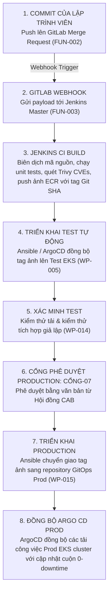

# Kế hoạch Triển khai CI/CD (CI/CD Delivery Plan): Nền tảng Hạ tầng Thế hệ mới DataBlue (DataBlue Next-Gen Infrastructure Platform)

---

## 1. Tổng quan

Tài liệu này quy định luồng công việc pipeline, các cổng bảo mật, chuyển giao artifact, và tự động hóa rollback cho **Nền tảng Hạ tầng Thế hệ mới DataBlue (DataBlue Next-Gen Infrastructure Platform)** (`datablue-nextgen-infra-platform`).

Được quản trị theo [`ADR-004`](../03-decisions/ADR-004-cicd-operating-model.md) (Mô hình Phủ Phân tầng Lai):
* **GitLab**: Quản lý mã nguồn, kích hoạt Merge Request, điều phối Webhook (`FUN-002`).
* **Jenkins**: CI container build, unit testing, quét lỗ hổng ảnh container, push ECR (`FUN-003`).
* **Ansible**: Quản lý cấu hình môi trường và tự động hóa triển khai (`FUN-004`).
* **ArgoCD / GitOps**: Đồng bộ trạng thái nội bộ cluster cho các Kubernetes manifest (`BUS-002`).

---

## 2. Kiến trúc Luồng Pipeline End-to-End

---

## 3. Các Cổng Bảo mật Pipeline

1. **Cổng A — Quét Secret Pre-Commit**: Quét `git-leaks` tự động chặn các commit chứa API keys hoặc thông tin đăng nhập dạng plain-text (`SEC-001`).
2. **Cổng B — Quét Lỗ hổng Container**: Quét ảnh Trivy đánh thất bại Jenkins build nếu phát hiện các lỗ hổng CVE mức `CRITICAL` (`RSK-SEC-001`).
3. **Cổng C — Cổng Kiểm thử Tự động**: Thực thi kiểm thử tích hợp end-to-end trên môi trường Test trước khi thăng cấp lên Production (`GATE-06`).
4. **Cổng D — Ký duyệt Production từ CAB**: Yêu cầu phê duyệt từ con người (`GATE-07`) trước khi thăng cấp tag ảnh sang các repository GitOps Production.

---

## 4. Quy trình Thăng cấp Artifact & Rollback

### Giao thức Thăng cấp Artifact
1. Các ảnh microservice được biên dịch bởi Jenkins được gắn tag với các Git commit SHA bất biến (ví dụ: `ecr.aws/microservice-a:a1b2c3d`).
2. Sau khi được xác minh trên Test, Ansible cập nhật tag ảnh bên trong repository manifest GitOps Production.
3. ArgoCD phát hiện thay đổi tag Git và thực hiện cập nhật cuộn zero-downtime (`maxSurge: 25%`, `maxUnavailable: 0`).

### Giao thức Rollback Tự động
1. Nếu kiểm tra sức khỏe pod Production hoặc tỷ lệ lỗi HTTP 5xx vượt quá 1% trong vòng 10 phút sau triển khai, ArgoCD / Ansible sẽ kích hoạt rollback tự động (`ROLLBACK-STRATEGY.md`).
2. ArgoCD khôi phục tag ảnh manifest về Git commit SHA ổn định trước đó (`ecr.aws/microservice-a:previous-sha`).
