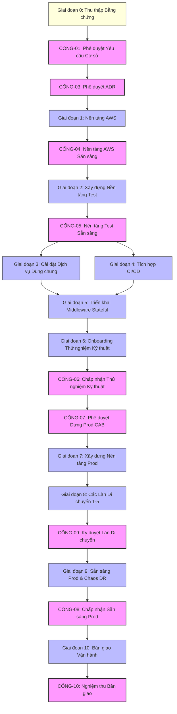

# Bản đồ Phụ thuộc (Dependency Map): Nền tảng Hạ tầng Thế hệ mới DataBlue (DataBlue Next-Gen Infrastructure Platform)

---

## 1. Tổng quan

Tài liệu này quy định các phụ thuộc về kỹ thuật, tổ chức, bằng chứng và quản trị cho **Nền tảng Hạ tầng Thế hệ mới DataBlue (DataBlue Next-Gen Infrastructure Platform)** (`datablue-nextgen-infra-platform`).

Các phụ thuộc được phân thành năm loại:
1. **Phụ thuộc Cứng (Hard Dependencies)**: Các điều kiện tiên quyết kỹ thuật bắt buộc chặn trực tiếp việc thực thi phía sau.
2. **Phụ thuộc Mềm (Soft Dependencies)**: Trình tự thực thi tốt nhất giúp cải thiện hiệu quả nhưng không nghiêm ngặt chặn việc thực thi.
3. **Phụ thuộc Bên ngoài (External Dependencies)**: Đầu vào từ khách hàng, APIs nhà cung cấp bên thứ ba, hoặc phê duyệt tổ chức.
4. **Phụ thuộc Phê duyệt Con người (Human Approval Dependencies)**: Các cổng quản trị yêu cầu ký duyệt chính thức từ con người (`ACCEPTANCE-GATES.md`).
5. **Phụ thuộc Bằng chứng (Evidence Dependencies)**: Các benchmark thực nghiệm, dữ liệu đo đạc tải, hoặc kiểm toán cần thiết để giải phóng các quyết định.

---

## 2. Đồ thị Phụ thuộc Tổng thể (Mermaid)

---

## 3. Ma trận Phụ thuộc Chi tiết

### 1. Phụ thuộc Bằng chứng (Evidence Dependencies)
* `DEP-EVD-001`: **Dữ liệu Đo đạc Tải Microservice** (`OPEN-001`) → Cần thiết để mở khóa [`ADR-006`](../03-decisions/ADR-006-mysql-deployment.md) (MySQL), [`ADR-007`](../03-decisions/ADR-007-redis-deployment.md) (Redis), [`ADR-008`](../03-decisions/ADR-008-rabbitmq-deployment.md) (RabbitMQ), và `WP-011`–`WP-012`.
* `DEP-EVD-002`: **Kiểm toán Tương thích Wire DocumentDB MongoDB** (`RSK-DAT-001`) → Cần thiết để mở khóa [`ADR-009`](../03-decisions/ADR-009-mongodb-deployment.md) (MongoDB).
* `DEP-EVD-003`: **Ký duyệt RTO/RPO Tính Liên tục Nghiệp vụ** (`OPEN-003`) → Cần thiết để mở khóa [`ADR-014`](../03-decisions/ADR-014-disaster-recovery.md) (Khôi phục Thảm họa).

### 2. Phụ thuộc Phê duyệt Con người (Human Approval Dependencies)
* `DEP-HUM-001`: [`GATE-03`](ACCEPTANCE-GATES.md) **Ký duyệt ADR** → Xem xét chính thức các ADR Đề xuất (`ADR-001`..`015`) cần thiết trước khi thực thi nền tảng Giai đoạn 1 (`WP-002`).
* `DEP-HUM-002`: [`GATE-07`](ACCEPTANCE-GATES.md) **Phê duyệt Production từ CAB** → Ủy quyền của Hội đồng Phê duyệt Thay đổi (CAB) cần thiết trước khi tạo `DataBlue-Prod-Account` (`WP-015`).
* `DEP-HUM-003`: [`GATE-10`](ACCEPTANCE-GATES.md) **Nghiệm thu Bàn giao** → Ký duyệt từ Trưởng nhóm Vận hành cần thiết để hoàn thành dự án (`WP-020`).

### 3. Phụ thuộc Kỹ thuật Cứng (Hard Technical Dependencies)
* `DEP-TRC-001`: **AWS Landing Zone Đa Tài khoản (`WP-002`)** → Điều kiện tiên quyết cứng cho Mạng VPC (`WP-004`) và EKS Test cluster (`WP-005`).
* `DEP-TRC-002`: **EKS Test Cluster (`WP-005`)** → Điều kiện tiên quyết cứng cho Dịch vụ Nền tảng Dùng chung (`WP-007`..`WP-009`) và Pipelines CI/CD (`WP-010`).
* `DEP-TRC-003`: **Tầng Cơ sở Dữ liệu MySQL (`WP-011`)** → Điều kiện tiên quyết cứng cho triển khai Nacos Cluster (`WP-013`).
* `DEP-TRC-004`: **Xác minh Môi trường Test (`WP-014`)** → Điều kiện tiên quyết cứng cho Xây dựng Cluster Production (`WP-015`).

### 4. Phụ thuộc Bên ngoài (External Dependencies)
* `DEP-EXT-001`: **Hạn ngạch Tài khoản AWS & Đăng ký Tên miền** → Quyền root AWS Organizations của khách hàng và quyền truy cập domain public Cloudflare DNS/GTM.
* `DEP-EXT-002`: **Repositories Legacy GitLab & Jenkins** → Quyền truy cập lập trình viên khách hàng vào các repository mã nguồn.
