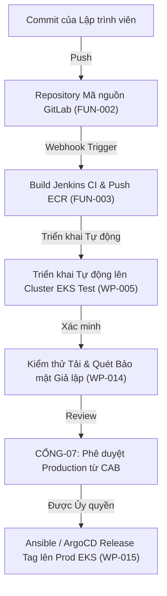

# Kế hoạch Triển khai Môi trường (Environment Delivery Plan): Nền tảng Hạ tầng Thế hệ mới DataBlue (DataBlue Next-Gen Infrastructure Platform)

---

## 1. Tổng quan

Tài liệu này quy định chi tiết về quản trị, sự khác biệt hạ tầng, và các quy tắc cô lập môi trường phân tách môi trường **Test (Non-Production)** và **Production** cho **Nền tảng Hạ tầng Thế hệ mới DataBlue (DataBlue Next-Gen Infrastructure Platform)** (`datablue-nextgen-infra-platform`).

Theo đúng yêu cầu `BUS-003` và [`ADR-002`](../03-decisions/ADR-002-environment-isolation.md):
* **Môi trường Test và Production không bao giờ được dùng chung Tài khoản AWS hoặc Kubernetes cluster**.
* **Môi trường Production không được phép xây dựng bằng cách copy cấu hình từ Test mà không qua review kiến trúc chính thức (`GATE-07`)**.

---

## 2. Ma trận Quản trị Test vs. Production

| Chiều Quản trị | Môi trường Test / Non-Production | Môi trường Production | Lý do Kiến trúc |
| :--- | :--- | :--- | :--- |
| **Ranh giới AWS Account** | `DataBlue-Test-Account` Chuyên trách | `DataBlue-Prod-Account` Chuyên trách | Cô lập bán kính ảnh hưởng sự cố & hóa đơn (`BUS-003`, `SEC-002`). |
| **Dấu chân EKS Cluster** | Cluster `datablue-test-eks` Chuyên trách | Cluster `datablue-prod-eks` Chuyên trách | Ngăn ngừa tranh chấp tài nguyên noisy-neighbor (`NFR-001`). |
| **Cô lập VPC & Subnet** | `10.100.0.0/16` (VPC Cô lập) | `10.200.0.0/16` (VPC Cô lập) | 0 VPC peering giữa các VPC Test và Production. |
| **Cấu trúc Instance Node** | 70% EC2 Spot / 30% On-Demand (`c6i`/`m6i`) | 100% On-Demand / Savings Plans (`c6i`/`m6i`) | Tối ưu chi phí Test đồng thời đảm bảo dung lượng Prod (`CST-001`). |
| **Topo Sẵn sàng Cao (HA)** | 2 Availability Zones (AZ-a, AZ-b) | 3 Availability Zones (AZ-a, AZ-b, AZ-c) | Bảo vệ Production khỏi sự cố vùng Multi-AZ (`NFR-001`). |
| **Chế độ Multi-AZ Database** | Single-AZ / Dev Multi-AZ | Bắt buộc Multi-AZ Primary/Standby | Đảm bảo SLA uptime cơ sở dữ liệu 99.95% ở Production (`FUN-005`). |
| **Tự động Co giảm Quy mô** | Co giảm ban đêm/cuối tuần (giảm 70% node) | Tự động mở rộng Karpenter động 24/7 liên tục | Giảm lãng phí tính toán Test ngoài giờ làm việc (`CST-001`). |
| **Quản lý Secrets** | AWS Secrets Manager (`/test/...`) | AWS Secrets Manager (`/prod/...`) | Giới hạn chính sách IAM IRSA nghiêm ngặt theo tài khoản (`SEC-001`). |
| **Sao lưu & Vault Lock** | Snapshot DB hàng ngày (lưu trữ 7 ngày) | DB PITR hàng ngày + Velero S3 Vault Lock (30 ngày) | Thực thi bảo vệ chống ransomware xuyên tài khoản (`OPS-002`). |
| **Kiểm soát Thay đổi** | Tự động đồng bộ GitOps khi merge `main` | Bắt buộc phê duyệt CAB + release tag GitOps | Ngăn ngừa triển khai production chưa qua review (`AGENTS.md`). |
| **Bảo vệ Chống Xóa** | Tắt đối với tài nguyên sandbox tạm thời | **BẬT** trên tất cả EKS clusters, VPCs, & DBs | Ngăn ngừa vô tình xóa phá hủy tài nguyên production (`AGENTS.md`). |
| **Thời lượng Triển khai** | **5 ngày làm việc** (`TERRAFORM_TEST_PLANNING`) | **5 ngày làm việc** (`TERRAFORM_PROD_EARLYSTART_PLANNING`) | Lộ trình cấp phát hạ tầng, cấu hình và xác minh tiêu chuẩn 5 ngày. |

---

## 3. Luồng Chuyển giao Môi trường (Environment Promotion Flow)

---

## 4. Các Nguyên tắc Triển khai Môi trường

1. **Xác minh Ưu tiên trên Test**: Tất cả các module Terraform, Helm charts, và chính sách IAM phải được triển khai và kiểm thử hoàn chỉnh trên `DataBlue-Test-Account` trước khi áp dụng lên `DataBlue-Prod-Account`.
2. **Không Dùng chung Dịch vụ Stateful**: Các microservice Test tuyệt đối không bao giờ được kết nối tới các endpoint cơ sở dữ liệu hoặc cache của Production.
3. **Làm sạch Dữ liệu (Data Scrubbing)**: Các bản dump cơ sở dữ liệu Production được copy về Test để debug bắt buộc phải qua quy trình tự động làm sạch dữ liệu PII (Personally Identifiable Information) (`SEC-001`).
