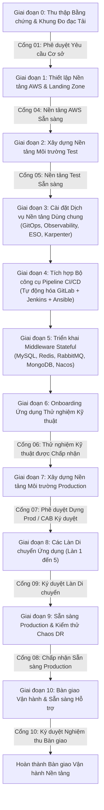

# Lộ trình Triển khai: Nền tảng Hạ tầng Thế hệ mới DataBlue (DataBlue Next-Gen Infrastructure Platform)

---

## 1. Quản trị & Triết lý Triển khai

Tài liệu này trình bày chi tiết lộ trình triển khai theo trình tự cho **Nền tảng Hạ tầng Thế hệ mới DataBlue (DataBlue Next-Gen Infrastructure Platform)** (`datablue-nextgen-infra-platform`).

Theo đúng các nguyên tắc Phase 4:
* **Không triển khai mã nguồn hạ tầng hoặc cấp phát tài nguyên AWS trong giai đoạn lập kế hoạch này.**
* Lịch trình sử dụng **trình tự giai đoạn tương đối** thay vì các ngày lịch cố định.
* **Triển khai và xác minh môi trường Test bắt buộc phải hoàn thành trước khi dựng môi trường Production**.
* Mỗi đợt chuyển giao giai đoạn đều được bảo vệ bởi cổng phê duyệt chính thức bằng văn bản (`ACCEPTANCE-GATES.md`).

---

## 2. Lộ trình Triển khai Tương đối 11 Giai đoạn

---

## 3. Quy cách Chi tiết từng Giai đoạn

### Giai đoạn 0 — Thu thập Bằng chứng & Đo đạc Tải công việc
* **Mục tiêu**: Thu thập các chỉ số thực nghiệm CPU, RAM, IOPS, RPS và tính tương thích truy vấn để giải quyết các ADR đang tạm hoãn.
* **Phụ thuộc**: Không (`BUS-001`, `OPEN-001`).
* **Hoạt động Chính**: Triển khai sidecar đo đạc tải trong môi trường legacy/test; quét các truy vấn MongoDB tìm tính tương thích DocumentDB (`RSK-DAT-001`); lấy các mục tiêu RTO/RPO nghiệp vụ (`OPEN-003`).
* **Vấn đề Chặn (Blockers)**: Thiếu quyền truy cập vào mã nguồn ứng dụng legacy hoặc log lưu lượng của khách hàng.
* **Cổng Phê duyệt**: [`GATE-01`](ACCEPTANCE-GATES.md).
* **Đầu ra Mong đợi**: Báo cáo Đo đạc Tải công việc được Xác minh & Các ADR Middleware được Giải quyết (`ADR-006`..`009`, `ADR-014`).

---

### Giai đoạn 1 — Thiết lập Nền tảng AWS & Landing Zone
* **Mục tiêu**: Thiết lập cấu trúc AWS Organization đa tài khoản, trung tâm định danh IAM, các key KMS, và mạng VPC.
* **Phụ thuộc**: Hoàn thành Giai đoạn 0, [`ADR-001`](../03-decisions/ADR-001-aws-account-strategy.md), [`ADR-015`](../03-decisions/ADR-015-infrastructure-as-code.md).
* **Hoạt động Chính**: Cấp phát AWS Control Tower Landing Zone (`DataBlue-Test`, `DataBlue-Prod`, `Shared-Services`, `Security`); triển khai S3 state backends; cấu hình các subnet VPC 3 phân tầng trên 3 AZs.
* **Vấn đề Chặn (Blockers)**: Quyền tài khoản root AWS Organization đang chờ duyệt.
* **Cổng Phê duyệt**: [`GATE-04`](ACCEPTANCE-GATES.md).
* **Đầu ra Mong đợi**: State Terraform nền tảng, các VPC subnets, NAT gateways, và các key mã hóa KMS.

---

### Giai đoạn 2 — Xây dựng Nền tảng Môi trường Test (`TERRAFORM_TEST_PLANNING`)
* **Mã Kế hoạch**: `TERRAFORM_TEST_PLANNING`
* **Mục tiêu**: Triển khai EKS cluster Test chuyên trách, worker node groups, ingress, và ranh giới định danh pod identity.
* **Thời lượng Triển khai**: **5 ngày làm việc** (5 Days).
* **Phụ thuộc**: Hoàn thành Giai đoạn 1, [`ADR-002`](../03-decisions/ADR-002-environment-isolation.md), [`ADR-003`](../03-decisions/ADR-003-kubernetes-platform.md).
* **Hoạt động Chính**: Cấp phát EKS cluster Test (`v1.30+`); cấu hình endpoint IAM IRSA OIDC; triển khai AWS Load Balancer Controller và tích hợp Cloudflare DNS / GTM.
* **Vấn đề Chặn (Blockers)**: Hạn ngạch (quota) tài khoản AWS Test.
* **Cổng Phê duyệt**: [`GATE-05`](ACCEPTANCE-GATES.md).
* **Đầu ra Mong đợi**: EKS cluster Test vận hành mượt mà với định tuyến ingress và tích hợp định danh IRSA.

---

### Giai đoạn 3 — Cài đặt Dịch vụ Nền tảng Dùng chung
* **Mục tiêu**: Cài đặt các dịch vụ quản trị cluster cốt lõi vào EKS cluster Test.
* **Phụ thuộc**: Hoàn thành Giai đoạn 2, [`ADR-005`](../03-decisions/ADR-005-node-autoscaling.md), [`ADR-011`](../03-decisions/ADR-011-secrets-management.md), [`ADR-012`](../03-decisions/ADR-012-observability.md).
* **Hoạt động Chính**: Cài đặt GitOps engine ArgoCD; triển khai engine tự động mở rộng Karpenter JIT; triển khai External Secrets Operator (ESO); cài đặt Prometheus/Grafana và bộ chuyển tiếp log Fluent Bit sang OpenSearch.
* **Đầu ra Mong đợi**: Stack quản trị cluster hoàn chỉnh vận hành dưới sự kiểm soát của GitOps.

---

### Giai đoạn 4 — Tự động hóa Pipeline CI/CD
* **Mục tiêu**: Tự động hóa pipeline build container end-to-end, quét ảnh, và triển khai.
* **Phụ thuộc**: Hoàn thành Giai đoạn 3, [`ADR-004`](../03-decisions/ADR-004-cicd-operating-model.md).
* **Hoạt động Chính**: Cấu hình GitLab webhooks; dựng các worker node Jenkins CI; viết playbook tự động hóa triển khai Ansible; cấu hình quét ảnh container AWS ECR.
* **Đầu ra Mong đợi**: Pipeline vận hành chuẩn (GitLab Trigger → Jenkins Build → ECR Push → Ansible/ArgoCD Deploy).

---

### Giai đoạn 5 — Triển khai Middleware Stateful
* **Mục tiêu**: Triển khai và xác minh các dịch vụ stateful MySQL, Redis, RabbitMQ, MongoDB, và Nacos.
* **Phụ thuộc**: Hoàn thành Giai đoạn 4, [`ADR-006`](../03-decisions/ADR-006-mysql-deployment.md)–[`ADR-010`](../03-decisions/ADR-010-nacos-deployment.md), [`ADR-013`](../03-decisions/ADR-013-backup-strategy.md).
* **Hoạt động Chính**: Triển khai các instance cơ sở dữ liệu multi-AZ; cấu hình chính sách vòng đời sao lưu PITR; triển khai Nacos cluster trên EKS; xác minh quy trình failover và khôi phục sao lưu.
* **Đầu ra Mong đợi**: Các endpoint middleware được xác minh với failover multi-AZ tự động và sao lưu PITR 30 ngày.

---

### Giai đoạn 6 — Onboarding Ứng dụng Thử nghiệm Kỹ thuật
* **Mục tiêu**: Triển khai và benchmark bộ 5 dịch vụ đại diện thử nghiệm dưới tải giả lập.
* **Phụ thuộc**: Hoàn thành Giai đoạn 5.
* **Hoạt động Chính**: Onboard 1 API, 1 worker, 1 DB service, 1 cache service, và 1 ingress service; thực thi kiểm thử tải giả lập; xác minh mở rộng node Karpenter và các dashboard Grafana.
* **Cổng Phê duyệt**: [`GATE-06`](ACCEPTANCE-GATES.md).
* **Đầu ra Mong đợi**: Báo cáo Benchmark Nghiệm thu Thử nghiệm xác minh các chỉ số mở rộng, logging, bảo mật và chi phí.

---

### Giai đoạn 7 — Xây dựng Nền tảng Môi trường Production (`TERRAFORM_PROD_EARLYSTART_PLANNING`)
* **Mã Kế hoạch**: `TERRAFORM_PROD_EARLYSTART_PLANNING`
* **Mục tiêu**: Cấp phát tài khoản AWS Production cô lập và EKS cluster Production.
* **Thời lượng Triển khai**: **5 ngày làm việc** (5 Days).
* **Phụ thuộc**: Hoàn thành Giai đoạn 6, Ký duyệt từ Hội đồng Phê duyệt Thay đổi (CAB).
* **Hoạt động Chính**: Cấp phát tài khoản AWS Production qua Terraform; triển khai EKS cluster Production multi-AZ; cấu hình AWS Backup Vault Lock và bản sao S3 backup xuyên tài khoản.
* **Cổng Phê duyệt**: [`GATE-07`](ACCEPTANCE-GATES.md).
* **Đầu ra Mong đợi**: Hạ tầng tài khoản AWS và EKS cluster được gia cố bảo mật, sẵn sàng cho Production.

---

### Giai đoạn 8 — Các Làn Di chuyển Ứng dụng (Làn 1 đến 5)
* **Mục tiêu**: Di chuyển hệ thống ~40 microservices vào Production theo 5 làn phân tầng.
* **Phụ thuộc**: Hoàn thành Giai đoạn 7.
* **Hoạt động Chính**: Thực thi Làn 1 (Stateless rủi ro thấp) tới Làn 5 (Dịch vụ thanh toán cốt lõi) tuân thủ nghiêm ngặt các tiêu chí đầu vào và đầu ra.
* **Cổng Phê duyệt**: [`GATE-09`](ACCEPTANCE-GATES.md) (mỗi làn).
* **Đầu ra Mong đợi**: 100% microservices vận hành thành công trên môi trường Production.

---

### Giai đoạn 9 — Sẵn sàng Production & Kiểm thử Chaos DR
* **Mục tiêu**: Xác minh độ bền vững nền tảng qua chaos engineering, diễn tập failover, và diễn tập DR.
* **Phụ thuộc**: Hoàn thành Giai đoạn 8, [`ADR-014`](../03-decisions/ADR-014-disaster-recovery.md).
* **Hoạt động Chính**: Thực thi giả lập node crash, sự cố Availability Zone, failover master cơ sở dữ liệu, khôi phục sao lưu, và diễn tập failover DR xuyên vùng.
* **Cổng Phê duyệt**: [`GATE-08`](ACCEPTANCE-GATES.md).
* **Đầu ra Mong đợi**: Báo cáo Xác minh Sẵn sàng Production & Khôi phục Thảm họa.

---

### Giai đoạn 10 — Bàn giao Vận hành & Sẵn sàng Hỗ trợ
* **Mục tiêu**: Chuyển giao trách nhiệm vận hành nền tảng cho đội ngũ Vận hành/SRE doanh nghiệp.
* **Phụ thuộc**: Hoàn thành Giai đoạn 9.
* **Hoạt động Chính**: Bàn giao runbook vận hành, tổ chức đào tạo SRE, thực thi bàn giao quyền truy cập, cấu hình dashboard theo dõi chi phí FinOps.
* **Cổng Phê duyệt**: [`GATE-10`](ACCEPTANCE-GATES.md).
* **Đầu ra Mong đợi**: Biên bản Nghiệm thu Bàn giao Vận hành đã ký.
