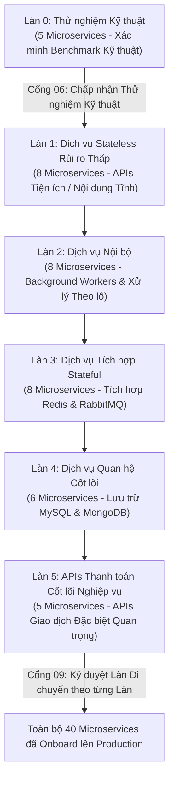

# Kế hoạch Di chuyển & Onboarding Ứng dụng: Nền tảng Hạ tầng Thế hệ mới DataBlue (DataBlue Next-Gen Infrastructure Platform)

---

## 1. Tổng quan

Tài liệu này quy định cấu trúc làn di chuyển, khung sẵn sàng của dịch vụ, các tiêu chí đầu vào/đầu ra, và mô hình hỗ trợ hypercare để onboard khoảng 40 microservices trên 5-6 hệ thống nghiệp vụ lên **Nền tảng Hạ tầng Thế hệ mới DataBlue (DataBlue Next-Gen Infrastructure Platform)** (`datablue-nextgen-infra-platform`).

---

## 2. Template Danh mục Microservice

Mỗi microservice bắt buộc phải hoàn thành template danh mục này trước khi được phân công làn onboarding:

```markdown
### Hồ sơ Onboarding Microservice
* **Tên Dịch vụ**: `[service-name]`
* **Miền Hệ thống Nghiệp vụ**: `[Hệ thống Nghiệp vụ 1..6]`
* **Phân tầng Mức độ Quan trọng**: `[Tier 1: Cốt lõi / Tier 2: Tiêu chuẩn / Tier 3: Xử lý theo lô]`
* **Hạng Định kích thước Dự kiến**: `[Hạng XS / S / M / L / XL]`
* **Stateless / Stateful**: `[Stateless / Yêu cầu DB / Yêu cầu Cache / Yêu cầu Queue]`
* **Phụ thuộc Middleware**: `[MySQL / Redis / RabbitMQ / MongoDB / Nacos]`
* **Sẵn sàng Container**: `[Tuân thủ 12-Factor / Đã xác minh Dockerfile]`
* **Endpoints Kiểm tra Sức khỏe**: `[/healthz Liveness / /ready Readiness]`
```

---

## 3. Cấu trúc Làn Di chuyển (Làn 0 đến Làn 5)

Các microservice sẽ được phân công vào 6 làn onboarding nối tiếp dựa trên mức độ quan trọng nghiệp vụ và rủi ro stateful:



---

## 4. Tiêu chí Đầu vào & Đầu ra Làn Di chuyển

### Tiêu chí Đầu vào Làn Di chuyển
1. Dockerfile của microservice qua kiểm tra quét bảo mật với 0 lỗ hổng `CRITICAL` (`RSK-SEC-001`).
2. Các HTTP probe Liveness (`/healthz`) và Readiness (`/ready`) đã được cấu hình.
3. Cấu hình microservice được nạp động qua Nacos hoặc biến môi trường (`FUN-009`).
4. Các unit test tự động chạy qua thành công trong Jenkins CI (`FUN-003`).

### Tiêu chí Đầu ra Làn Di chuyển
1. 100% pod microservice chạy ở trạng thái `Ready` trên cả 3 AZs.
2. Tỷ lệ lỗi HTTP 5xx < 0.01% dưới thể tích lưu lượng production bình thường.
3. Thu thập metrics Prometheus được xác minh hiển thị trên các dashboard Grafana (`OPS-001`).
4. Log được đánh chỉ mục thành công trong Amazon OpenSearch và lưu trữ S3 Glacier (`OPS-002`).
5. Đạt ký duyệt [`GATE-09`](ACCEPTANCE-GATES.md) chính thức từ Chủ sở hữu Sản phẩm Nghiệp vụ.

---

## 5. Giao thức Hỗ trợ Hypercare

* **Thời lượng**: 14 ngày lịch hỗ trợ hypercare chuyên trách từ đội SRE/DevOps cho mỗi làn di chuyển.
* **Thang Phản ứng Escalation**: Kênh liên lạc 24/7 Slack / PagerDuty chuyên trách cho các đội microservice đã onboard.
* **Giám sát**: Tracing APM thời gian thực và xem xét bất thường metric 5 phút một lần.
* **Bàn giao**: Microservice chuyển sang hỗ trợ vận hành tiêu chuẩn sau khi hoàn thành 14 ngày mà không gặp sự cố mức Sev-1/Sev-2 (`SUPPORT-READINESS-PLAN.md`).
