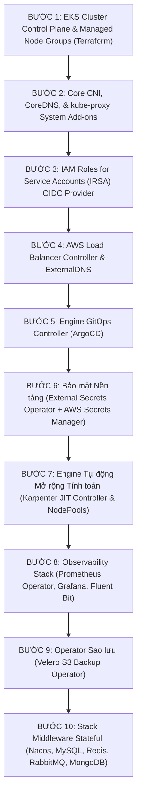

# Kế hoạch Bootstrap Nền tảng (Platform Bootstrap Plan): DataBlue Next-Gen Infrastructure Platform

---

## 1. Tổng quan

Tài liệu này quy định thứ tự cài đặt chính xác và trình tự bootstrap cho các năng lực cluster cốt lõi bên trong các Amazon EKS clusters cho **Nền tảng Hạ tầng Thế hệ mới DataBlue (DataBlue Next-Gen Infrastructure Platform)** (`datablue-nextgen-infra-platform`).

---

## 2. Trình tự Bootstrapping

---

## 3. Quy cách Chi tiết từng Bước

### Bước 1 & Bước 2 — EKS Cơ sở & Add-ons Cốt lõi
* **Phạm vi**: AWS EKS control plane (`v1.30+`), các default node groups, plugin AWS VPC CNI, CoreDNS, và kube-proxy (`ADR-003`).
* **Xác minh**: `kubectl get nodes` trả về trạng thái `Ready` trên cả 3 AZs.

### Bước 3 & Bước 4 — IRSA & Controller Ingress
* **Phạm vi**: Liên kết OIDC identity provider cho EKS; Helm release AWS Load Balancer Controller (`ADR-004`).
* **Xác minh**: Controller ALB tạo thành công các target group khi có Ingress CRD.

### Bước 5 — Engine GitOps (ArgoCD)
* **Phạm vi**: Các thành phần cốt lõi của ArgoCD được cài đặt trong namespace `argocd` (`BUS-002`).
* **Xác minh**: Truy cập được giao diện UI server ArgoCD; mô hình `App-of-Apps` được khởi tạo.

### Bước 6 — External Secrets Operator (ESO)
* **Phạm vi**: Controller ESO được cài đặt trong namespace `external-secrets`; ClusterSecretStore được tạo với IAM role IRSA (`ADR-011`).
* **Xác minh**: ESO lấy thành công secret thử nghiệm từ AWS Secrets Manager.

### Bước 7 — Engine Tự động Mở rộng Karpenter
* **Phạm vi**: Controller Karpenter được cài đặt trong namespace `karpenter`; các CRD `NodePool` và `EC2NodeClass` được cấu hình (`ADR-005`).
* **Xác minh**: Karpenter cấp phát worker node mới trong vòng < 60 giây khi có kích hoạt pod unschedulable.

### Bước 8 — Stack Observability
* **Phạm vi**: Helm chart kube-prometheus-stack được cài đặt trong namespace `monitoring`; Fluent Bit DaemonSet được triển khai (`ADR-012`).
* **Xác minh**: Grafana hiển thị metric CPU node; Fluent Bit chuyển tiếp luồng log sang Amazon OpenSearch.

### Bước 9 — Operator Sao lưu Velero
* **Phạm vi**: Velero được cài đặt trong namespace `velero` trỏ về S3 backup bucket mã hóa (`ADR-013`).
* **Xác minh**: `velero backup create test-backup` hoàn thành với trạng thái `Completed`.

### Bước 10 — Tầng Middleware Stateful
* **Phạm vi**: Các instance Nacos, MySQL, Redis, RabbitMQ, và MongoDB được cấp phát (`FUN-005`..`009`).
* **Xác minh**: Các pod microservice kết nối thành công tới các endpoint middleware.
