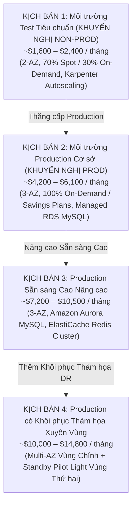
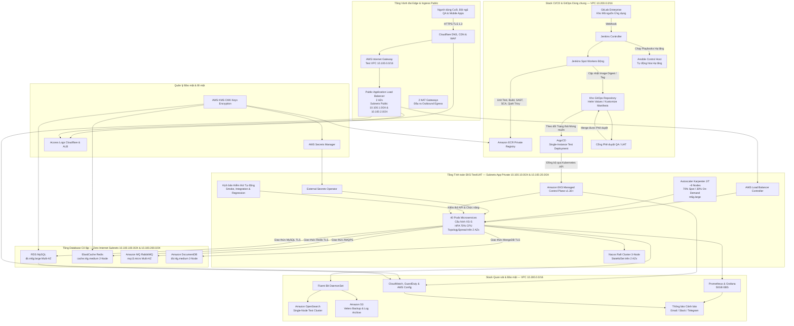
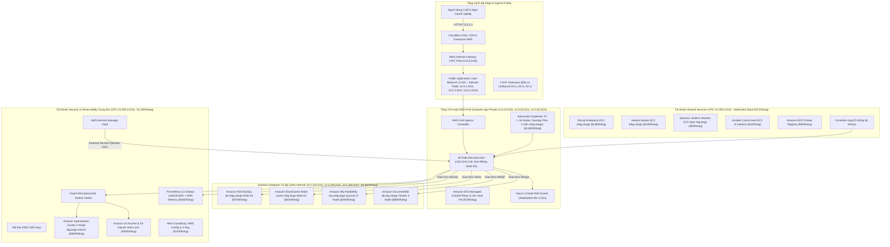
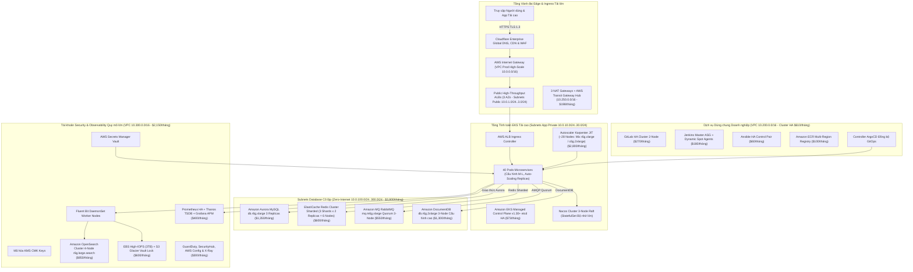
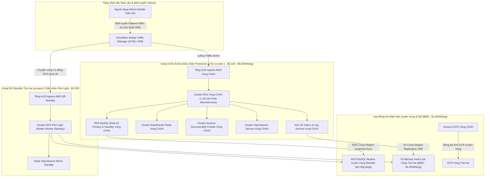

# Mô hình Chi phí Theo Kịch bản: Nền tảng Hạ tầng Thế hệ mới DataBlue (DataBlue Next-Gen Infrastructure Platform)

---

## 1. Tổng quan

Tài liệu này trình bày các dự báo tài chính theo kịch bản cho **Nền tảng Hạ tầng Thế hệ mới DataBlue (DataBlue Next-Gen Infrastructure Platform)** (`datablue-nextgen-infra-platform`).

Theo đúng yêu cầu `BUS-004` và các quy tắc quản trị:
* Các ước tính chi phí là **dự báo dựa trên kịch bản**, không phải cam kết cố định đơn lẻ.
* Các số liệu đóng vai trò là cơ sở lập kế hoạch cho đến khi việc đo đạc tải thực tế (`Giai đoạn 0`) hoàn tất.

---

## 2. Bốn Kịch bản Chi phí Tài chính Doanh nghiệp

---

## 3. Phân rã Chi phí Xuyên suốt 4 Kịch bản

| Danh mục Hạng mục Chi phí AWS | Kịch bản 1 (Test Tiêu chuẩn) | Kịch bản 2 (Prod Cơ sở) | Kịch bản 3 (Prod HA Nâng cao) | Kịch bản 4 (Prod DR Xuyên Vùng) |
| :--- | :--- | :--- | :--- | :--- |
| **EKS Control Plane** | $73 / tháng | $73 / tháng | $73 / tháng | $146 / tháng (2 Clusters) |
| **Nodes Tính toán Worker EC2** | $450 / tháng (70% Spot) | $1,800 / tháng (Savings Plan)| $2,800 / tháng | $4,200 / tháng |
| **Cơ sở Dữ liệu & Stateful** | $445 / tháng | $1,860 / tháng (Managed RDS)| $3,800 / tháng (Aurora) | $5,200 / tháng (Đa Vùng)|
| **Stack Công cụ CI/CD Dùng chung**| $180 / tháng (GitLab/Jenkins)| $371 / tháng | $610 / tháng (CI/CD HA) | $1,000 / tháng |
| **Bộ Quan sát & Kiểm toán Bảo mật**| $201 / tháng (OpenSearch/Prom)| $650 / tháng | $1,550 / tháng (APM Toàn diện) | $2,400 / tháng |
| **Mạng & NAT Gateways** | $99 / tháng (2 AZ NAT) | $99 / tháng (3 AZ NAT) | $198 / tháng (Transit GW) | $396 / tháng |
| **Lưu trữ & Sao lưu** | $120 / tháng | $350 / tháng | $600 / tháng | $900 / tháng (Cross-Region) |
| **Tổng Chi tiêu Ước tính** | **~$1,600 – $2,400/tháng**| **~$4,200 – $6,100/tháng**| **~$7,200 – $10,500/tháng**| **~$10,000 – $14,800/tháng**|

---

## 4. Các Sơ đồ Kiến trúc Hệ thống Chi tiết Theo Kịch bản

### 4.1 Kiến trúc Kịch bản 1: Môi trường Test Tiêu chuẩn (Non-Prod)

*Hình 4.1: Sơ đồ Kiến trúc Kịch bản 1 — Môi trường Test Tiêu chuẩn ($1,600 – $2,400 / tháng).*

---

### 4.2 Kiến trúc Kịch bản 2: Môi trường Production Cơ sở

*Hình 4.2: Sơ đồ Kiến trúc Kịch bản 2 — Môi trường Production Cơ sở ($4,200 – $6,100 / tháng).*

---

### 4.3 Kiến trúc Kịch bản 3: Production Sẵn sàng Cao Nâng cao

*Hình 4.3: Sơ đồ Kiến trúc Kịch bản 3 — Production Sẵn sàng Cao Nâng cao ($7,200 – $10,500 / tháng).*

---

### 4.4 Kiến trúc Kịch bản 4: Production có Khôi phục Thảm họa Xuyên Vùng

*Hình 4.4: Sơ đồ Kiến trúc Kịch bản 4 — Production Khôi phục Thảm họa Xuyên Vùng ($10,000 – $14,800 / tháng).*

