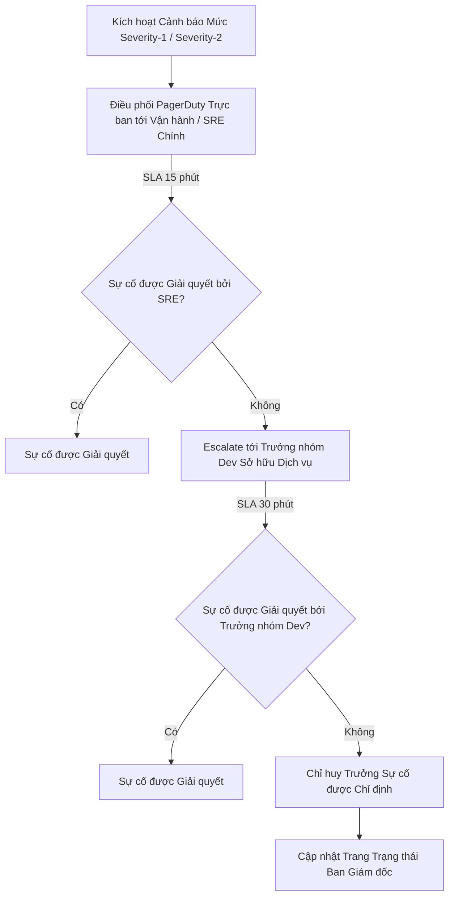

# Khung Quyền Sở hữu Dịch vụ (Service Ownership Framework): Nền tảng Hạ tầng Thế hệ mới DataBlue (DataBlue Next-Gen Infrastructure Platform)

---

## 1. Tổng quan

Tài liệu này quy định **Khung Quyền Sở hữu Dịch vụ** cho **Nền tảng Hạ tầng Thế hệ mới DataBlue (DataBlue Next-Gen Infrastructure Platform)** (`datablue-nextgen-infra-platform`).

Nó cung cấp các template đăng ký dịch vụ chuẩn hóa và các đường hướng phản ứng sự cố theo cấp (escalation) mà không sử dụng tên cá nhân riêng lẻ.

---

## 2. Template Hồ sơ Quyền Sở hữu Dịch vụ

Mỗi thành phần nền tảng và microservice bắt buộc phải duy trì một Hồ sơ Quyền Sở hữu Dịch vụ hoàn chỉnh trong Git:

```markdown
### Hồ sơ Quyền Sở hữu Dịch vụ
* **Tên Dịch vụ**: `[service-name]`
* **Miền Hệ thống Nghiệp vụ**: `[Hệ thống Nghiệp vụ 1..6]`
* **Đội Soạn thảo Chính**: `[Tên Đội - ví dụ Đội Kỹ thuật Thanh toán]`
* **Vai trò Trưởng nhóm Kỹ thuật**: `[Vai trò Kỹ sư Trưởng Phần mềm]`
* **Đầu mối SRE Trực ban**: `[Trưởng nhóm SRE Trực ban Chính]`
* **URI Git Repository**: `[URI Repository GitLab]`
* **Mã Dịch vụ PagerDuty**: `[Key Tích hợp PagerDuty]`
* **Kênh Hỗ trợ Slack**: `#support-[service-name]`
* **SLA Độ Sẵn sàng Mục tiêu**: `[99.9% / 99.95%]`
* **Mục tiêu RTO / RPO**: `[RTO < 2 giờ / RPO < 15 phút]`
* **URI Runbook Vận hành**: `[Link Markdown Runbook]`
```

---

## 3. Đường hướng Phản ứng Sự cố Tiêu chuẩn


