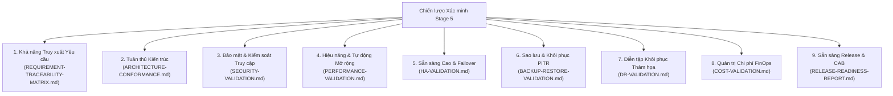

# Chiến lược Xác minh (Verification Strategy): Nền tảng Hạ tầng Thế hệ mới DataBlue (DataBlue Next-Gen Infrastructure Platform)

---

## 1. Tổng quan & Triết lý Xác minh

Tài liệu này định nghĩa **Chiến lược Xác minh & Khung Quản trị Master** cho Stage 5 của **Nền tảng Hạ tầng Thế hệ mới DataBlue (DataBlue Next-Gen Infrastructure Platform)** (`datablue-nextgen-infra-platform`).

Theo đúng các quy tắc quản trị Stage 5:
* **Cấp phát hạ tầng không đồng nghĩa với việc xác minh nền tảng thành công**.
* Mỗi năng lực hệ thống bắt buộc phải trải qua thu thập bằng chứng chính thức trên 9 miền xác minh trước khi chấp nhận vận hành.
* **Tất cả các kết quả kiểm thử không được giả lập hoặc đánh dấu trước là đã đạt (passed)**. Tất cả các mục xác minh duy trì trạng thái `Pending` hoặc `Not Executed` chờ thực thi kiểm thử thực nghiệm.

---

## 2. 9 Miền Xác minh & Phạm vi Xác minh

---

## 3. Quy cách Môi trường Xác minh & Công cụ

| Miền Xác minh | Công cụ Xác minh Chính | Môi trường Thực thi Mục tiêu | Yêu cầu Bằng chứng Bắt buộc | Vai trò Chịu trách nhiệm | Trạng thái Hiện tại |
| :--- | :--- | :--- | :--- | :--- | :--- |
| **Yêu cầu** | Kiểm toán Truy xuất Tự động | Quy cách Test / Prod | 100% Ánh xạ Yêu cầu-sang-Kiểm thử | Kiến trúc sư Doanh nghiệp | `Pending` |
| **Kiến trúc** | Tuân thủ Terraform / Sonobuoy | EKS Cluster Test | Báo cáo Tuân thủ & 0 Sai lệch | Kiến trúc sư Hạ tầng | `Pending` |
| **Bảo mật** | Trivy, Checkov, Kube-bench | Tài khoản AWS Security | 0 Lỗ hổng Mức Critical / 0 Wildcards | Trưởng nhóm Bảo mật Đám mây | `Pending` |
| **Hiệu năng** | Các bộ phát tải Locust, k6 | EKS Cluster Test | P95 < 200ms & Karpenter < 60s | Trưởng nhóm SRE / Trưởng nhóm Hiệu năng | `Pending` |
| **Sẵn sàng Cao**| Chaos Mesh, AWS FIS | Test / Prod Multi-AZ | Failover Zero Mất Dữ liệu (< 60s) | Trưởng nhóm SRE | `Pending` |
| **Sao lưu & Khôi phục** | Velero CLI, Khôi phục AWS RDS | Các Subnet Test Cô lập | Xác minh Khôi phục PITR 30 Ngày | Trưởng nhóm DBA / Trưởng nhóm Lưu trữ | `Pending` |
| **Khôi phục Thảm họa**| Công cụ Giả lập Failover Cloudflare GTM / DNS | Region AWS Thứ hai | Xác minh RTO < 4h & RPO < 15m | Kiến trúc sư Trưởng Đám mây | `Pending` |
| **Chi phí FinOps** | AWS Cost Explorer / AWS Config | Tất cả Tài khoản AWS | 100% Tuân thủ Tag Tài nguyên | Trưởng nhóm FinOps | `Pending` |
| **Sẵn sàng Release**| Ticket Ủy quyền từ CAB | Hội đồng Quản trị | Giấy chứng nhận CAB đã ký (`CỔNG-07`) | Nhà tài trợ Dự án | `Pending` |

---

## 4. Các Quy tắc Quản trị Cổng & Thu thập Bằng chứng

1. **Yêu cầu Bằng chứng Thực nghiệm**: Mỗi mục xác minh đòi hỏi một artifact đính kèm trong [`TEST-EVIDENCE-REGISTER.md`](TEST-EVIDENCE-REGISTER.md) (ví dụ: file log thực thi, đầu ra raw json, biểu đồ benchmark).
2. **Ký duyệt Kép**: Các mục xác minh yêu cầu đồng ký duyệt từ Chủ sở hữu Kỹ thuật và Kiểm toán viên Chất lượng/Bảo mật Độc lập.
3. **Không Đánh giá Đạt khi Chưa Kiểm thử**: Các mục duy trì trạng thái `Pending` hoặc `Awaiting Evidence` cho đến khi đính kèm log thực thi kiểm thử.
