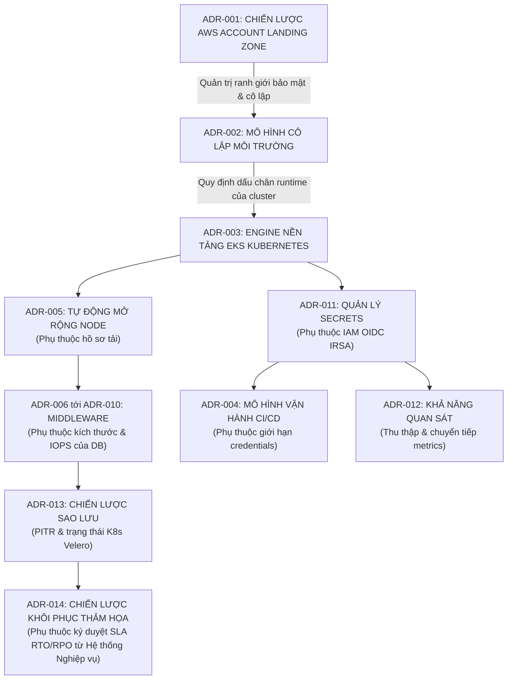

# Phụ thuộc Quyết định (Decision Dependencies): Nền tảng Hạ tầng Thế hệ mới DataBlue (DataBlue Next-Gen Infrastructure Platform)

---

## 1. Tổng quan

Tài liệu này ánh xạ các phụ thuộc chéo và mối quan hệ cấu trúc giữa các Hồ sơ Quyết định Kiến trúc (ADRs), danh mục yêu cầu, và phân loại rủi ro cho **Nền tảng Hạ tầng Thế hệ mới DataBlue (DataBlue Next-Gen Infrastructure Platform)** (`datablue-nextgen-infra-platform`).

Các quyết định kiến trúc không tồn tại độc lập. Một quyết định trong một miền (ví dụ Chiến lược Tài khoản AWS) sẽ giới hạn và quản trị các lựa chọn trong các miền hạ nguồn (ví dụ Security IAM, Mạng, Ranh giới Credentials CI/CD, và Phân bổ Chi phí FinOps).

---

## 2. Mạng lưới Phụ thuộc Quyết định Cốt lõi

---

## 3. Ma trận Phụ thuộc Chéo Giữa các Quyết định

### 1. Kiến trúc Chi phí Phụ thuộc vào Hồ sơ Tải công việc
* **Quyết định / Đầu vào Tiên quyết**: `OPEN-001` (Các metric CPU, Memory, IOPS, và băng thông mạng của microservice).
* **Các ADR Phụ thuộc**: [`ADR-005`](../03-decisions/ADR-005-node-autoscaling.md) (Định kích thước instance Karpenter), [`ADR-006`](../03-decisions/ADR-006-mysql-deployment.md)–[`ADR-009`](../03-decisions/ADR-009-mongodb-deployment.md) (Managed DB vs Operators Self-Hosted).
* **Mối quan hệ & Ảnh hưởng**: Ước tính chi phí FinOps (`CST-001`) không thể chốt về mặt toán học nếu thiếu các đầu vào định kích thước thực nghiệm. Lựa chọn dịch vụ Managed AWS phụ thuộc trực tiếp vào việc thể tích tải có xứng đáng với mức giá cao hơn của instance managed AWS hay không.

---

### 2. Chiến lược Tự động Mở rộng Node Phụ thuộc vào Đặc tính Lập lịch Tải
* **Quyết định / Đầu vào Tiên quyết**: Yêu cầu/Giới hạn tài nguyên container microservice (`ASM-006`) và pod disruption budgets.
* **Các ADR Phụ thuộc**: [`ADR-005`](../03-decisions/ADR-005-node-autoscaling.md) (Engine tự động mở rộng Karpenter JIT).
* **Mối quan hệ & Ảnh hưởng**: Hiệu quả lựa chọn node của Karpenter phụ thuộc vào việc các microservice định nghĩa chính xác giới hạn yêu cầu CPU/memory. Việc bỏ qua pod limits làm thất bại bin-packing node và gây phát sinh chi phí mở rộng node không kiểm soát (`RSK-CST-001`).

---

### 3. Lựa chọn Cơ sở Dữ liệu Phụ thuộc vào Tương thích Wire Protocol, Kích thước Dữ liệu, RPO, và RTO
* **Quyết định / Đầu vào Tiên quyết**: [`ADR-009`](../03-decisions/ADR-009-mongodb-deployment.md) (Kiểm toán tương thích MongoDB vs DocumentDB), kích thước cơ sở dữ liệu, và giao dịch IOPS.
* **Các ADR Phụ thuộc**: [`ADR-006`](../03-decisions/ADR-006-mysql-deployment.md), [`ADR-007`](../03-decisions/ADR-007-redis-deployment.md), [`ADR-008`](../03-decisions/ADR-008-rabbitmq-deployment.md), [`ADR-009`](../03-decisions/ADR-009-mongodb-deployment.md), [`ADR-013`](../03-decisions/ADR-013-backup-strategy.md).
* **Mối quan hệ & Ảnh hưởng**: Lựa chọn Amazon DocumentDB bị chặn cho đến khi các truy vấn microservice được xác minh tuân thủ các giới hạn cú pháp của DocumentDB (`RSK-DAT-001`). Lựa chọn engine cơ sở dữ liệu quan hệ quyết định cơ chế snapshot sao lưu và tốc độ khôi phục.

---

### 4. Lựa chọn Khôi phục Thảm họa Phụ thuộc vào Mức độ Quan trọng của Hệ thống Nghiệp vụ (RTO / RPO)
* **Quyết định / Đầu vào Tiên quyết**: `OPEN-003` (Ký duyệt từ Chủ sở hữu Sản phẩm Nghiệp vụ về các chỉ số RTO và RPO mục tiêu).
* **Các ADR Phụ thuộc**: [`ADR-014`](../03-decisions/ADR-014-disaster-recovery.md) (Mô hình Failover DR), [`ADR-013`](../03-decisions/ADR-013-backup-strategy.md) (Bản sao sao lưu xuyên vùng).
* **Mối quan hệ & Ảnh hưởng**: Lựa chọn Pilot Light vs Warm Standby xuyên vùng không thể quyết định nếu không biết thời gian gián đoạn chấp nhận được. Sẵn sàng Cao (Multi-AZ trong 1 vùng) xử lý các sự cố cục bộ, nhưng DR đòi hỏi các mục tiêu RTO/RPO rõ ràng để biện minh cho chi tiêu tại vùng thứ hai (`RSK-AVL-001`).

---

### 5. Chiến lược Tài khoản Ảnh hưởng tới IAM, Kiến trúc Mạng, Logging, và Phân bổ Chi phí
* **Quyết định / Đầu vào Tiên quyết**: [`ADR-001`](../03-decisions/ADR-001-aws-account-strategy.md) (Landing Zone Multi-Account).
* **Các ADR Phụ thuộc**: [`ADR-002`](../03-decisions/ADR-002-environment-isolation.md) (Cô lập Cluster), [`ADR-011`](../03-decisions/ADR-011-secrets-management.md) (IAM IRSA OIDC), [`ADR-012`](../03-decisions/ADR-012-observability.md) (Tài khoản Log Tập trung), [`ADR-015`](../03-decisions/ADR-015-infrastructure-as-code.md).
* **Mối quan hệ & Ảnh hưởng**: Việc thiết lập ranh giới đa tài khoản (`DataBlue-Test-Account`, `DataBlue-Prod-Account`, `Shared-Services-Account`, `Security-Account`) quy định việc lập kế hoạch CIDR mạng VPC, định tuyến gom log CloudTrail tập trung, và các mối quan hệ tin cậy IAM xuyên tài khoản.

---

### 6. Mô hình Vận hành CI/CD Ảnh hưởng tới Ranh giới Credentials và Kiểm soát Thay đổi Production
* **Quyết định / Đầu vào Tiên quyết**: [`ADR-004`](../03-decisions/ADR-004-cicd-operating-model.md) (Mô hình Phủ Phân tầng Lai).
* **Các ADR Phụ thuộc**: [`ADR-011`](../03-decisions/ADR-011-secrets-management.md) (AWS Secrets Manager + ESO), [`ADR-015`](../03-decisions/ADR-015-infrastructure-as-code.md) (Pipeline thực thi Terraform).
* **Mối quan hệ & Ảnh hưởng**: Việc tách biệt Jenkins (build/test) khỏi Ansible/GitOps (thực thi triển khai) ngăn ngừa lưu trữ credentials hạ tầng đám mây sống lâu dài trên các build runner (`RSK-SEC-001`), thực thi ranh giới thực thi IAM IRSA đặc quyền tối thiểu trên các môi trường.
