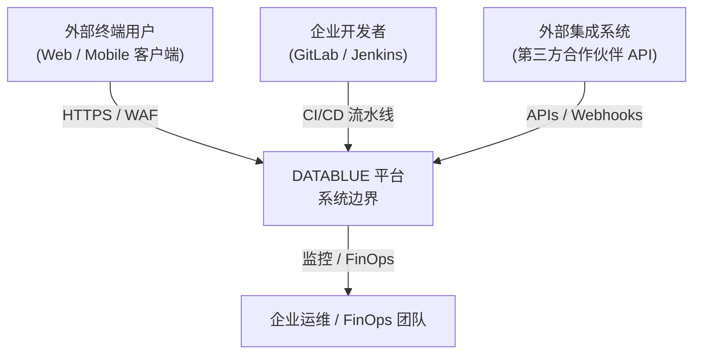
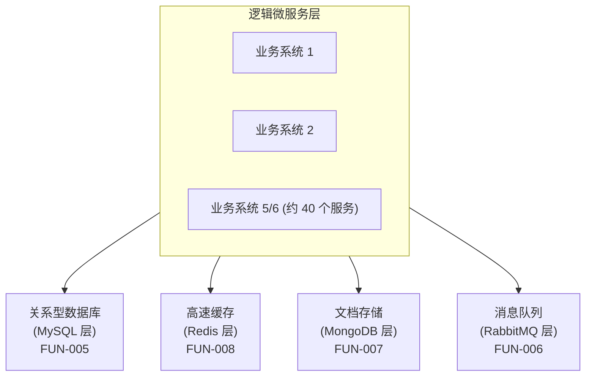
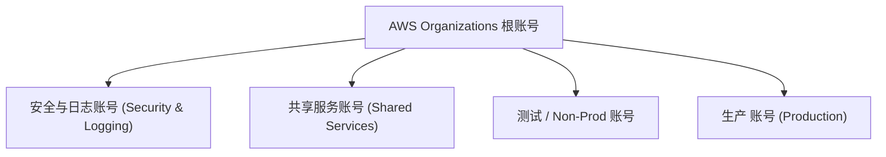

# 架构规范说明书 (Architecture Specification: DataBlue Next-Gen Platform)

> **阶段 2 治理提示**: 本文档定义了 **DataBlue 下一代基础设施平台** (`datablue-nextgen-infra-platform`) 的目标架构规范。根据阶段 2 规则，**本文档中不直接生成实施代码 (Terraform, Helm Charts, Kubernetes YAML 或 AWS CLI 命令)**。重大架构决策登记为 **ADR 候选方案**，缺失的容量指标登记为 **架构假设**。

---

## 1. 架构原则 (Architecture Principles)

* **追溯需求**: 映射至 [`BUS-001`](../01-requirements/REQUIREMENTS-REGISTER.md), [`BUS-002`](../01-requirements/REQUIREMENTS-REGISTER.md), [`BUS-003`](../01-requirements/REQUIREMENTS-REGISTER.md), [`BUS-004`](../01-requirements/REQUIREMENTS-REGISTER.md), [`AGENTS.md`](../../AGENTS.md)。

DataBlue 下一代基础设施平台架构由六大核心原则治理：

1. **解耦的架构边界**: 在逻辑架构、物理部署、网络基础设施和运维之间保持明确解耦，绝不混淆运行时边界。
2. **爆炸半径最小化**: 在 AWS 账号与 EKS 集群层级强制实施测试环境与生产环境的物理隔离。未经正式高管书面特许，严禁跨环境共享集群多租户。
3. **零硬编码密钥与最小权限**: 所有容器工作负载必须使用 IAM Roles for Service Accounts (IRSA) 认证访问 AWS 服务。容器或仓库内部严禁出现长期安全凭证或静态 API Key (`SEC-001`)。
4. **声明式不可变基础设施**: 100% 的云资源、集群状态和配置管理必须通过版本控制的 IaC 和 GitOps 流水线声明式驱动 (`BUS-002`)。禁止在 AWS 控制台进行手动修改。
5. **解耦的韧性模型**: 高可用 (Multi-AZ 冗余)、时间点备份与灾难恢复 (跨区域故障转移) 必须视为具有独立 SLA/SLO 指标的独立设计域 (`NFR-001`, `NFR-003`)。
6. **不确定性下的可逆性**: 在缺少客户工作负载指标时，技术选型必须优先选择松耦合和可逆的抽象层。

---

## 2. 系统上下文 (System Context)

* **追溯需求**: 映射至 [`BUS-001`](../01-requirements/REQUIREMENTS-REGISTER.md), [`FUN-001`](../01-requirements/REQUIREMENTS-REGISTER.md)–[`FUN-009`](../01-requirements/REQUIREMENTS-REGISTER.md)。

### 2.1 系统边界与外部参与者
DataBlue 下一代基础设施平台充当约 5–6 个业务系统（包含约 40 个微服务）的容器编排、消息传递、状态持久化与运维骨干。

### 2.2 系统互操作性
* **入站流量**: 外部 Web/移动端用户通过 **Cloudflare Enterprise Edge (Cloudflare DNS, CDN & WAF)** 进入，经 AWS Application Load Balancer (ALB) 路由至 EKS Ingress 层。
* **开发者与 CI/CD 流水线**: 开发者提交代码至 GitLab，触发 Jenkins CI 进行镜像编译与安全扫描，随后通过 Ansible/GitOps 部署至 EKS。
* **第三方网关**: 经过 NAT 网关和 AWS Network Firewall 的安全出站连接，用于外部银行/支付集成。

---

## 3. 逻辑架构 (Logical Architecture)

### 3.1 逻辑微服务层
应用域由约 40 个无状态微服务组成，逻辑上分为 5–6 个业务域（如核心支付/银行、用户身份、订单处理、通知引擎、分析、合作伙伴 API 网关）。

* **微服务运行时**: 由 Kubernetes Deployments 管理的无状态 Docker 容器，每个业务域在专有 Namespace 内部隔离。
* **服务注册与配置中心**: Nacos 提供集中式的服务发现、动态配置管理与健康检查 (`FUN-009`)。

### 3.2 逻辑数据与中间件层
逻辑数据流将瞬态状态、关系型存储、非结构化数据和事件流解耦：

---

## 4. 部署架构 (Deployment Architecture)

### 4.1 物理 AWS 账号结构
为了满足严格的环境隔离 (`BUS-003`, `SEC-002`)，物理部署采用 AWS Organizations 多账号 Landing Zone 拓扑：

1. **安全与日志账号**: 集中式 AWS CloudTrail, AWS Config, GuardDuty 与 S3 日志归档 Bucket。
2. **共享服务账号**: 托管 GitLab 仓库、Jenkins 主控/构建节点、Ansible 自动化服务器与 AWS ECR 私有镜像仓库。
3. **测试 / Non-Prod 账号**: 专有 EKS 测试集群、非生产数据库实例、隔离的 VPC。
4. **生产账号**: 专有 EKS 生产集群、Multi-AZ 生产数据库实例、隔离的 VPC。

---

## 5. 网络架构 (Network Architecture)

* **VPC 拓扑**: 各账号配置独立 VPC（如 Test VPC `10.100.0.0/16`, Prod VPC `10.0.0.0/16`）。
* **子网划分为 3 层**: Public Subnets (ALB/NAT GW), Private App Subnets (EKS Pods/Nodes), Private Data Subnets (RDS/ElastiCache)。
* **Transit Gateway Hub**: 集中式 AWS Transit Gateway 管理账号间网络连接。

---

## 6. 安全架构 (Security Architecture)

* **身份认证**: IRSA (IAM Roles for Service Accounts) 实现零硬编码凭证的 Pod 访问。
* **数据加密**: 静态数据使用 KMS 加密，传输中数据强制 TLS 1.3。

---

## 7. 高可用与灾难恢复架构 (HA & DR)

* **高可用 (HA)**: 跨 3 个可用区 (3 AZs) 部署，控制平面与工作节点均为 Multi-AZ，目标在线率 ≥99.9%。
* **灾难恢复 (DR)**: Pilot Light 跨区域热备 (us-east-1 ↔ us-west-2)，RTO < 4 小时，RPO < 15 分钟。

---

## 8. 成本架构与 FinOps 治理 (Cost & FinOps)

* 5 种参数化成本模型（SC1 至 SC5）配合 Karpenter Spot/On-Demand 混部与 3 年期 Savings Plans，综合降低 30%–40% 云开销。
