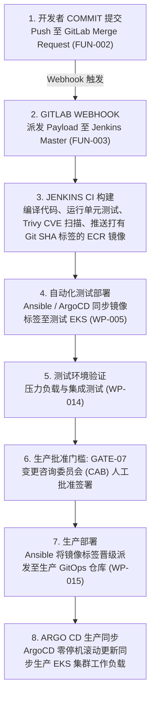

# CI/CD 流水线交付规划说明书 (CI/CD Delivery Plan: DataBlue Platform)

---

## 1. 概述 (Overview)

本文档指定了 **DataBlue 下一代基础设施平台** (`datablue-nextgen-infra-platform`) 的流水线工作流、安全门槛、构件晋级及自动回滚机制。

受 [`ADR-004`](../03-decisions/ADR-004-cicd-operating-model.md) (混合覆盖模型) 治理：
* **GitLab**: 源码控制、Merge Request 触发及 Webhook 派发 (`FUN-002`)。
* **Jenkins**: CI 容器构建、单元测试、镜像漏洞扫描及 ECR 推送 (`FUN-003`)。
* **Ansible**: 环境配置管理与部署自动化 (`FUN-004`)。
* **ArgoCD / GitOps**: Kubernetes Manifest 的集群内部声明式状态同步 (`BUS-002`)。

---

## 2. 端到端流水线架构工作流 (Pipeline Architecture Flow)

---

## 3. 流水线安全门槛 (Pipeline Security Gates)

1. **门槛 A — Pre-Commit 密钥扫描**: 自动化的 `git-leaks` 扫描，阻断包含明文 API Key 或凭据的 Commit 提交 (`SEC-001`)。
2. **门槛 B — 容器漏洞扫描**: Trivy 镜像扫描，若检测到 `CRITICAL` 严重 CVE 漏洞则阻断 Jenkins 构建 (`RSK-SEC-001`)。
3. **门槛 C — 自动化测试门槛**: 生产晋级前在测试环境中执行端到端集成测试 (`GATE-06`)。
4. **门槛 D — CAB 生产签署**: 镜像标签晋级至生产 GitOps 仓库前的人工审批要求 (`GATE-07`)。

---

## 4. 构件晋级与回滚工作流 (Artifact Promotion & Rollback Flow)

### 构件晋级协议 (Artifact Promotion Protocol)
1. 由 Jenkins 编译的微服务镜像打上不可变的 Git Commit SHA 标签（例如 `ecr.aws/microservice-a:a1b2c3d`）。
2. 一旦在测试环境中验证通过，Ansible 将更新生产 GitOps Manifest 仓库内部的镜像标签。
3. ArgoCD 检测到 Git Tag 变更，并执行零停机的滚动更新 (`maxSurge: 25%`, `maxUnavailable: 0`)。

### 自动化回滚协议 (Automated Rollback Protocol)
1. 如果部署后 10 分钟内生产 Pod 健康检查或 HTTP 5xx 错误率超过 1%，ArgoCD / Ansible 自动触发回滚 ([`ROLLBACK-STRATEGY.md`](ROLLBACK-STRATEGY.md))。
2. ArgoCD 将 Manifest 镜像标签回滚还原至上一个稳定的 Git Commit SHA (`ecr.aws/microservice-a:previous-sha`)。
