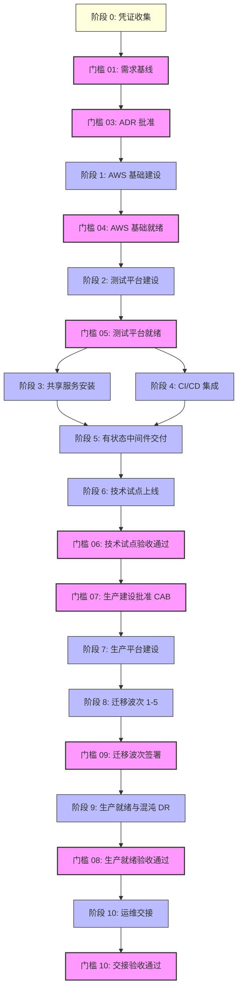

# 依赖关系映射图 (Dependency Map: DataBlue Platform)

---

## 1. 概述 (Overview)

本文档指明了 **DataBlue 下一代基础设施平台** (`datablue-nextgen-infra-platform`) 的技术、组织、凭证及治理依赖项。

依赖关系分为五大类：
1. **硬技术依赖 (Hard Dependencies)**: 物理上阻断后续执行的技术前置条件。
2. **软依赖 (Soft Dependencies)**: 提高效率但不会严格阻止执行的最佳实践顺序。
3. **外部依赖 (External Dependencies)**: 客户输入、第三方供应商 API 或组织批准。
4. **人工批准依赖 (Human Approval Dependencies)**: 需要正式人工签署的治理门槛 ([`ACCEPTANCE-GATES.md`](ACCEPTANCE-GATES.md))。
5. **凭证依赖 (Evidence Dependencies)**: 解锁决策所需的实测基准、剖析数据或审计。

---

## 2. 主依赖关系图 (Master Dependency Graph)

---

## 3. 详细依赖关系矩阵 (Detailed Dependency Matrix)

### 1. 凭证依赖 (Evidence Dependencies)
* `DEP-EVD-001`: **微服务容量剖析数据** (`OPEN-001`) $\rightarrow$ 用于解锁 [`ADR-006`](../03-decisions/ADR-006-mysql-deployment.md) (MySQL), [`ADR-007`](../03-decisions/ADR-007-redis-deployment.md) (Redis), [`ADR-008`](../03-decisions/ADR-008-rabbitmq-deployment.md) (RabbitMQ), 及 `WP-011`–`WP-012`。
* `DEP-EVD-002`: **DocumentDB 与 MongoDB 协议兼容性审计** (`RSK-DAT-001`) $\rightarrow$ 用于解锁 [`ADR-009`](../03-decisions/ADR-009-mongodb-deployment.md) (MongoDB)。
* `DEP-EVD-003`: **业务连续性 RTO/RPO 签署** (`OPEN-003`) $\rightarrow$ 用于解锁 [`ADR-014`](../03-decisions/ADR-014-disaster-recovery.md) (灾难恢复)。

### 2. 人工批准依赖 (Human Approval Dependencies)
* `DEP-HUM-001`: [`GATE-03`](ACCEPTANCE-GATES.md) **ADR 签署** $\rightarrow$ 在阶段 1 基础执行 (`WP-002`) 前需要对提议 ADRs (`ADR-001`..`015`) 进行人工审查。
* `DEP-HUM-002`: [`GATE-07`](ACCEPTANCE-GATES.md) **CAB 生产批准** $\rightarrow$ 在创建 `DataBlue-Prod-Account` (`WP-015`) 前需要变更咨询委员会授权。
* `DEP-HUM-003`: [`GATE-10`](ACCEPTANCE-GATES.md) **交接验收通过** $\rightarrow$ 项目结项完成 (`WP-020`) 需要运维 Lead 签署。

### 3. 硬技术依赖 (Hard Technical Dependencies)
* `DEP-TRC-001`: **多账号 Landing Zone (`WP-002`)** $\rightarrow$ VPC 网络 (`WP-004`) 与测试 EKS 集群 (`WP-005`) 的物理前置条件。
* `DEP-TRC-002`: **测试 EKS 集群 (`WP-005`)** $\rightarrow$ 共享平台服务 (`WP-007`..`WP-009`) 与 CI/CD 流水线 (`WP-010`) 的物理前置条件。
* `DEP-TRC-003`: **MySQL 数据库层 (`WP-011`)** $\rightarrow$ Nacos 集群部署 (`WP-013`) 的物理前置条件。
* `DEP-TRC-004`: **测试环境验证 (`WP-014`)** $\rightarrow$ 生产集群建设 (`WP-015`) 的物理前置条件。

### 4. 外部依赖 (External Dependencies)
* `DEP-EXT-001`: **AWS 账号配额与域名注册** $\rightarrow$ 客户 AWS Organizations 根账号权限及 Cloudflare 公网域名 & DNS 访问权限。
* `DEP-EXT-002`: **GitLab & Jenkins 现有仓库** $\rightarrow$ 客户开发者对源码仓库的访问权限。
