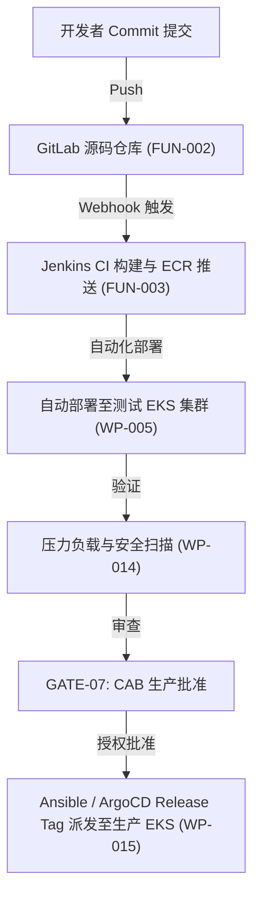

# 环境交付规划说明书 (Environment Delivery Plan: DataBlue Platform)

---

## 1. 概述 (Overview)

本文档指定了分隔 **DataBlue 下一代基础设施平台** (`datablue-nextgen-infra-platform`) 的 **测试 (非生产)** 环境与 **生产** 环境的治理规则、基础设施差异及环境隔离规范。

根据需求 `BUS-003` 及 [`ADR-002`](../03-decisions/ADR-002-environment-isolation.md)：
* **测试与生产环境严禁共享 AWS 账号或 Kubernetes 集群。**
* **未经正式的架构审查 ([`GATE-07`](ACCEPTANCE-GATES.md))，严禁通过直接复制测试环境配置来拉起生产环境。**

---

## 2. 测试环境 vs. 生产环境治理对比矩阵 (Governance Matrix)

| 治理维度 | 测试 / 非生产环境 | 生产环境 | 架构依据 |
| :--- | :--- | :--- | :--- |
| **AWS 账号边界** | 专有 `DataBlue-Test-Account` | 专有 `DataBlue-Prod-Account` | 完全的爆炸半径与账单隔离 (`BUS-003`, `SEC-002`)。 |
| **EKS 集群脚印** | 专有 `datablue-test-eks` 集群 | 专有 `datablue-prod-eks` 集群 | 防止嘈杂邻居资源抢占 (`NFR-001`)。 |
| **VPC & 子网隔离** | `10.100.0.0/16` (隔离 VPC) | `10.200.0.0/16` (隔离 VPC) | 测试与生产 VPC 之间零 VPC Peering 连接。 |
| **节点实例混部** | 70% EC2 Spot / 30% On-Demand (`c6i`/`m6i`) | 100% On-Demand / Savings Plans (`c6i`/`m6i`) | 优化测试成本的同时保障生产容量 (`CST-001`)。 |
| **高可用拓扑** | 2 个可用区 (AZ-a, AZ-b) | 3 个可用区 (AZ-a, AZ-b, AZ-c) | 保护生产环境免受多可用区停机影响 (`NFR-001`)。 |
| **数据库 Multi-AZ 模式** | Single-AZ / 开发版 Multi-AZ | 强制 Multi-AZ 主/备 | 保证生产环境 99.95% 数据库在线 SLA (`FUN-005`)。 |
| **夜间自动缩容** | 夜间/周末自动缩容 (节点下调 70%) | 连续 24/7 动态 Karpenter 扩缩容 | 减少非工作时间的测试计算浪费 (`CST-001`)。 |
| **密钥管理** | AWS Secrets Manager (`/test/...`) | AWS Secrets Manager (`/prod/...`) | 按账号严格限定范围的 IAM IRSA 策略 (`SEC-001`)。 |
| **备份与 Vault Lock** | 每日 DB 快照 (保留 7 天) | 每日 DB PITR + Velero S3 Vault Lock (30 天) | 强制执行跨账号勒索软件防护 (`OPS-002`)。 |
| **变更控制** | Merge 至 `main` 时自动 GitOps 同步 | 强制 CAB 批准 + GitOps Tag Release 发布 | 防止未经审查的生产部署 (`AGENTS.md`)。 |
| **删除保护** | 临时 Sandbox 资源禁用 | **启用** 于所有 EKS 集群、VPC 及 DB | 防止误删除生产资源 (`AGENTS.md`)。 |

---

## 3. 环境晋级流 (Environment Promotion Flow)

---

## 4. 环境交付原则 (Environment Delivery Principles)

1. **测试优先验证**: 所有 Terraform 模块、Helm Charts 和 IAM 策略在应用到 `DataBlue-Prod-Account` 之前，必须在 `DataBlue-Test-Account` 中完全部署并测试通过。
2. **零共享有状态服务**: 测试微服务严禁连接生产数据库或缓存端点。
3. **数据脱敏**: 复制到测试环境用于 Debug 调试的生产数据库 Dump 副本必须经过自动化的 PII (个人身份信息) 数据脱敏处理 (`SEC-001`)。
