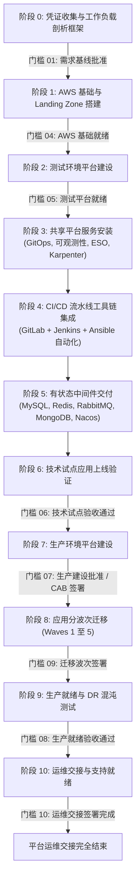

# 实施路线图 (Implementation Roadmap: DataBlue Next-Gen Platform)

---

## 1. 治理与交付哲学 (Governance & Delivery Philosophy)

本文档制定了 **DataBlue 下一代基础设施平台** (`datablue-nextgen-infra-platform`) 的相对交付路线图。

根据阶段 4 治理原则：
* **在本规划阶段，严禁编写任何基础设施实施代码或拉起 AWS 资源。**
* 计划使用 **相对阶段顺序**，而非任意的日历日期。
* **测试环境的交付与验证必须严格优先于生产环境的建设。**
* 每个阶段的过渡均由正式的人工签署门槛控制 ([`ACCEPTANCE-GATES.md`](ACCEPTANCE-GATES.md))。

---

## 2. 11 阶段相对交付路线图 (11-Phase Relative Delivery Roadmap)

---

## 3. 逐阶段详细说明 (Phase-by-Phase Detailed Specifications)

### 阶段 0 — 凭证收集与工作负载剖析 (Evidence Collection & Workload Profiling)
* **目标**: 收集 CPU、RAM、IOPS、RPS 及查询兼容性的实测指标，以解决暂缓/待定的 ADR。
* **依赖项**: 无 ([`BUS-001`](../01-requirements/REQUIREMENTS-REGISTER.md), [`OPEN-001`](../01-requirements/OPEN-QUESTIONS.md))。
* **核心活动**: 在现有/测试环境中部署 Sidecar 剖析工具；针对 DocumentDB 兼容性扫描 MongoDB 查询 (`RSK-DAT-001`)；获取业务 RTO/RPO 目标 (`OPEN-003`)。
* **阻塞因素**: 缺少对客户现有应用代码或流量日志的访问权限。
* **人工批准门槛**: [`GATE-01`](ACCEPTANCE-GATES.md)。
* **预期产出**: 验证通过的工作负载剖析报告及解决的中间件 ADRs (`ADR-006`..`009`, `ADR-014`)。

---

### 阶段 1 — AWS 基础与 Landing Zone 搭建 (AWS Foundation & Landing Zone Setup)
* **目标**: 建立多账号 AWS Organization 结构、IAM 身份中心、KMS 密钥及 VPC 网络。
* **依赖项**: 阶段 0 完成, [`ADR-001`](../03-decisions/ADR-001-aws-account-strategy.md), [`ADR-015`](../03-decisions/ADR-015-infrastructure-as-code.md)。
* **核心活动**: 搭建 AWS Control Tower Landing Zone (`DataBlue-Test`, `DataBlue-Prod`, `Shared-Services`, `Security`)；部署 S3 状态 Backend；跨 3 个可用区配置 3 层 VPC 子网。
* **人工批准门槛**: [`GATE-04`](ACCEPTANCE-GATES.md)。
* **预期产出**: 基础 Terraform 状态文件、VPC 子网、NAT 网关及 KMS 加密密钥。

---

### 阶段 2 — 测试环境平台建设 (Test Environment Platform Construction)
* **目标**: 部署专有的测试 EKS 集群、工作节点组、Ingress 及 Pod 身份边界。
* **依赖项**: 阶段 1 完成, [`ADR-002`](../03-decisions/ADR-002-environment-isolation.md), [`ADR-003`](../03-decisions/ADR-003-kubernetes-platform.md)。
* **核心活动**: 部署测试 EKS 集群 (`v1.30+`)；配置 IAM IRSA OIDC 端点；部署 AWS Load Balancer Controller 及 Cloudflare DNS / GTM 集成。
* **人工批准门槛**: [`GATE-05`](ACCEPTANCE-GATES.md)。
* **预期产出**: 具备功能性 Ingress 路由与 IRSA 身份集成的可运行测试 EKS 集群。

---

### 阶段 3 — 共享平台服务安装 (Shared Platform Services Installation)
* **目标**: 在测试 EKS 集群中安装核心集群管理服务。
* **依赖项**: 阶段 2 完成, [`ADR-005`](../03-decisions/ADR-005-node-autoscaling.md), [`ADR-011`](../03-decisions/ADR-011-secrets-management.md), [`ADR-012`](../03-decisions/ADR-012-observability.md)。
* **核心活动**: 安装 ArgoCD GitOps 引擎；部署 Karpenter JIT 自动扩缩容引擎；部署 External Secrets Operator (ESO)；安装 Prometheus/Grafana 及 Fluent Bit 至 OpenSearch 日志转发器。
* **预期产出**: 在 GitOps 控制下完全拉起的集群管理技术栈。

---

### 阶段 4 — CI/CD 流水线自动化 (CI/CD Pipeline Automation)
* **目标**: 自动化端到端容器构建、镜像扫描与部署流水线。
* **依赖项**: 阶段 3 完成, [`ADR-004`](../03-decisions/ADR-004-cicd-operating-model.md)。
* **核心活动**: 配置 GitLab Webhooks；搭建 Jenkins CI 构建节点；编写 Ansible 部署自动化 Playbooks；配置 AWS ECR 容器镜像扫描。
* **预期产出**: 可运行的流水线 (GitLab 触发 $\rightarrow$ Jenkins 构建 $\rightarrow$ ECR 推送 $\rightarrow$ Ansible/ArgoCD 部署)。

---

### 阶段 5 — 有状态中间件交付 (Stateful Middleware Delivery)
* **目标**: 部署并验证 MySQL、Redis、RabbitMQ、MongoDB 及 Nacos 有状态服务。
* **依赖项**: 阶段 4 完成, [`ADR-006`](../03-decisions/ADR-006-mysql-deployment.md)–[`ADR-010`](../03-decisions/ADR-010-nacos-deployment.md), [`ADR-013`](../03-decisions/ADR-013-backup-strategy.md)。
* **核心活动**: 部署多可用区数据库实例；配置 PITR 备份生命周期策略；在 EKS 上部署 Nacos 集群；验证故障转移与备份恢复流程。
* **预期产出**: 具备自动多可用区故障转移及 30 天 PITR 备份的验证中间件端点。

---

### 阶段 6 — 技术试点应用上线验证 (Technical Pilot Application Onboarding)
* **目标**: 在模拟压力负载下部署并基准测试代表性的 5 服务试点套件。
* **依赖项**: 阶段 5 完成。
* **核心活动**: 上线 1 个 API 服务、1 个 Worker 服务、1 个 DB 服务、1 个 Cache 服务及 1 个 Ingress 服务；执行压力测试；验证 Karpenter 节点扩展及 Grafana Dashboard。
* **人工批准门槛**: [`GATE-06`](ACCEPTANCE-GATES.md)。
* **预期产出**: 验证扩缩容、日志、安全与成本指标的试点验收基准报告。

---

### 阶段 7 — 生产环境平台建设 (Production Platform Construction)
* **目标**: 搭建隔离的生产 AWS 账号与生产 EKS 集群。
* **依赖项**: 阶段 6 完成, 变更咨询委员会 (CAB) 签署。
* **核心活动**: 通过 Terraform 拉起生产 AWS 账号；部署生产 EKS 多可用区集群；配置 AWS Backup Vault Lock 与跨账号 S3 备份副本。
* **人工批准门槛**: [`GATE-07`](ACCEPTANCE-GATES.md)。
* **预期产出**: 加固的、生产就绪的 AWS 账号与 EKS 集群基础设施。

---

### 阶段 8 — 应用分波次迁移 (Application Migration Waves 1 through 5)
* **目标**: 跨 5 个分阶段波次，系统化地将约 40 个微服务迁移至生产环境。
* **依赖项**: 阶段 7 完成。
* **核心活动**: 按照严格的准入和准出验证标准，执行波次 1（低风险无状态）至波次 5（业务关键支付服务）。
* **人工批准门槛**: [`GATE-09`](ACCEPTANCE-GATES.md) (每个波次)。
* **预期产出**: 100% 的微服务在生产环境中成功运行。

---

### 阶段 9 — 生产就绪与 DR 混沌测试 (Production Readiness & DR Chaos Testing)
* **目标**: 通过混沌工程、故障转移模拟及灾难恢复演练验证平台韧性。
* **依赖项**: 阶段 8 完成, [`ADR-014`](../03-decisions/ADR-014-disaster-recovery.md)。
* **核心活动**: 执行模拟节点崩溃、可用区停机、数据库主节点故障转移、备份恢复及跨区域 DR 故障转移演练。
* **人工批准门槛**: [`GATE-08`](ACCEPTANCE-GATES.md)。
* **预期产出**: 生产就绪与灾难恢复验证报告。

---

### 阶段 10 — 运维交接与支持就绪 (Operational Handover & Support Readiness)
* **目标**: 将平台运维职责交接至企业 Operations/SRE 团队。
* **依赖项**: 阶段 9 完成。
* **核心活动**: 交付运维 Runbooks；开展 SRE 培训；执行权限交接；配置 FinOps 成本跟踪 Dashboard。
* **人工批准门槛**: [`GATE-10`](ACCEPTANCE-GATES.md)。
* **预期产出**: 签署的运维交接证书。
