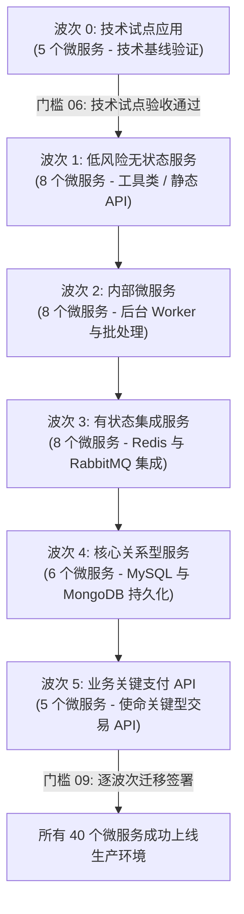

# 应用迁移与上线规划说明书 (Migration & Application Onboarding Plan: DataBlue Platform)

---

## 1. 概述 (Overview)

本文档指定了将 5-6 个业务系统的约 40 个微服务上线迁移至 **DataBlue 下一代基础设施平台** (`datablue-nextgen-infra-platform`) 的迁移波次结构、服务就绪框架、准入/准出标准及 Hypercare 重点保障支持模型。

---

## 2. 微服务盘点模板 (Microservice Inventory Template)

每个微服务在分配上线任务前必须完成以下盘点模板：

```markdown
### 微服务上线 Profile 档案
* **服务名称**: `[service-name]`
* **业务系统域**: `[业务系统 1..6]`
* **关键性分级**: `[Tier 1: 核心关键 / Tier 2: 标准 / Tier 3: 批处理]`
* **临时代号规格**: `[Class XS / S / M / L / XL]`
* **无状态 / 有状态**: `[无状态 / 需要 DB / 需要 Cache / 需要 Queue]`
* **中间件依赖**: `[MySQL / Redis / RabbitMQ / MongoDB / Nacos]`
* **容器就绪度**: `[符合 12-Factor 原则 / Dockerfile 已验证]`
* **健康检查端点**: `[/healthz Liveness 探针 / /ready Readiness 探针]`
```

---

## 3. 迁移波次结构 (Migration Wave Structure: Waves 0 至 5)

微服务将根据业务关键性及有状态风险，分配至 6 个顺序执行的上线波次中：



---

## 4. 波次准入与准出标准 (Wave Entry & Exit Criteria)

### 波次准入标准 (Entry Criteria)
1. 微服务 Dockerfile 安全扫描通过，零 `CRITICAL` 严重漏洞 (`RSK-SEC-001`)。
2. 配置了 Liveness (`/healthz`) 与 Readiness (`/ready`) HTTP 探针。
3. 微服务配置通过 Nacos 或环境变量动态注入 (`FUN-009`)。
4. Jenkins CI 中自动化单元测试通过 (`FUN-003`)。

### 波次准出标准 (Exit Criteria)
1. 100% 的微服务 Pod 在 3 个可用区中均处于 `Ready` 运行状态。
2. 正常生产流量下，HTTP 5xx 错误率 < 0.01%。
3. Grafana Dashboard 中验证通过 Prometheus 指标 Scrape 抓取 (`OPS-001`)。
4. 日志成功索引至 Amazon OpenSearch 及 S3 Glacier 归档库 (`OPS-002`)。
5. 获得来自业务产品负责人的正式 [`GATE-09`](ACCEPTANCE-GATES.md) 签署。

---

## 5. Hypercare 重点保障支持协议 (Hypercare Support Protocol)

* **时长**: 每个迁移波次提供为期 14 个日历天的专有 SRE/DevOps Hypercare 重点保障支持。
* **升级机制**: 为已上线的微服务团队提供专有 24/7 Slack / PagerDuty 升级通道。
* **监控**: 实时 APM 链路追踪与 5 分钟指标异常审查。
* **交接**: 微服务在完成 14 天保障且零 Sev-1/Sev-2 故障后，平滑过渡至标准运维支持。
