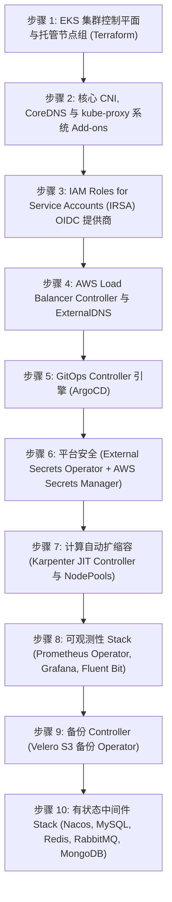

# 平台 Bootstrap 自举初始化规划说明书 (Platform Bootstrap Plan: DataBlue Platform)

---

## 1. 概述 (Overview)

本文档指定了 **DataBlue 下一代基础设施平台** (`datablue-nextgen-infra-platform`) 的 Amazon EKS 集群内部核心平台能力的精确安装顺序与 Bootstrap 自举初始化流程。

---

## 2. Bootstrap 自举初始化流程 (Bootstrapping Sequence)

---

## 3. 逐步骤详细说明 (Detailed Step Specifications)

### 步骤 1 & 步骤 2 — 基础 EKS 与核心 Add-ons
* **范围**: AWS EKS 控制平面 (`v1.30+`)、默认节点组、AWS VPC CNI 插件、CoreDNS 及 kube-proxy (`ADR-003`)。
* **验证**: `kubectl get nodes` 在 3 个可用区中均返回 `Ready` 状态。

### 步骤 3 & 步骤 4 — IRSA 与 Ingress Controller
* **范围**: EKS OIDC 身份提供商绑定；AWS Load Balancer Controller Helm Release (`ADR-004`)。
* **验证**: 创建 Ingress CRD 时，ALB Controller 成功创建目标组 Target Groups。

### 步骤 5 — GitOps 引擎 (ArgoCD)
* **范围**: 在 `argocd` Namespace 中安装 ArgoCD 核心组件 (`BUS-002`)。
* **验证**: ArgoCD Server UI 可访问；`App-of-Apps` 模式初始化完毕。

### 步骤 6 — External Secrets Operator (ESO)
* **范围**: 在 `external-secrets` Namespace 中安装 ESO Controller；创建绑定 IRSA IAM Role 的 ClusterSecretStore (`ADR-011`)。
* **验证**: ESO 成功从 AWS Secrets Manager 获取测试密钥。

### 步骤 7 — Karpenter 自动扩缩容引擎
* **范围**: 在 `karpenter` Namespace 中安装 Karpenter Controller；配置 `NodePool` 与 `EC2NodeClass` CRDs (`ADR-005`)。
* **验证**: 触发不可调度 Pod 时，Karpenter 在 < 60 秒内拉起工作节点。

### 步骤 8 — 可观测性 Stack
* **范围**: 在 `monitoring` Namespace 中安装 kube-prometheus-stack Helm Chart；部署 Fluent Bit DaemonSet (`ADR-012`)。
* **验证**: Grafana 渲染节点 CPU 指标；Fluent Bit 将日志流式传输至 Amazon OpenSearch。

### 步骤 9 — Velero 备份 Operator
* **范围**: 在 `velero` Namespace 中安装 Velero，指向加密的 S3 备份 Bucket (`ADR-013`)。
* **验证**: `velero backup create test-backup` 执行完成且状态为 `Completed`。

### 步骤 10 — 有状态中间件层
* **范围**: 部署 Nacos、MySQL、Redis、RabbitMQ 及 MongoDB 实例 (`FUN-005`..`009`)。
* **验证**: 微服务 Pod 成功连接至中间件端点。
