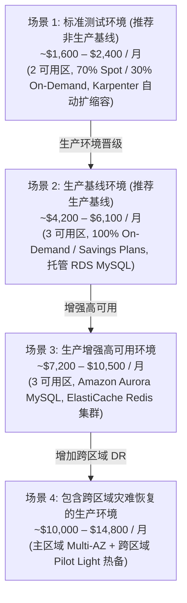

# 基于场景的财务成本模型说明书 (Scenario-Based Cost Models: DataBlue Platform)

---

## 1. 概述 (Overview)

本文档指明了 **DataBlue 下一代基础设施平台** (`datablue-nextgen-infra-platform`) 基于场景的财务成本预测。

根据需求 `BUS-004` 及治理规则：
* 成本估算为 **基于场景的预测**，而非单一的保证承诺。
* 在完成实测工作负载剖析 (阶段 0) 之前，数据作为规划基线。

---

## 2. 四大企业财务成本场景 (Four Enterprise Financial Cost Scenarios)

---

## 3. 跨场景成本细分明细 (Cost Breakdown Across Scenarios)

| AWS 成本组件分类 | 场景 1 (标准测试) | 场景 2 (生产基线) | 场景 3 (生产增强 HA) | 场景 4 (生产灾备 DR) |
| :--- | :--- | :--- | :--- | :--- |
| **EKS 控制平面** | $73 / 月 | $73 / 月 | $73 / 月 | $146 / 月 (2 个集群) |
| **EC2 工作计算节点** | $450 / 月 (70% Spot) | $1,800 / 月 (Savings Plan)| $2,800 / 月 | $4,200 / 月 |
| **数据库与有状态层** | $445 / 月 | $1,860 / 月 (托管 RDS)| $3,800 / 月 (Aurora) | $5,200 / 月 (多区域)|
| **共享 CI/CD 工具链 Stack**| $180 / 月 (GitLab/Jenkins) | $371 / 月 | $610 / 月 (高可用 CI/CD) | $1,000 / 月 |
| **可观测性与安全审计**| $201 / 月 (OpenSearch/Prom)| $650 / 月 | $1,550 / 月 (全功能 APM) | $2,400 / 月 |
| **网络与 NAT 网关** | $99 / 月 (2 可用区 NAT) | $99 / 月 (3 可用区 NAT) | $198 / 月 (Transit GW) | $396 / 月 |
| **存储与备份** | $120 / 月 | $350 / 月 | $600 / 月 | $900 / 月 (跨区域) |
| **预估月度总支出** | **~$1,600 – $2,400/月**| **~$4,200 – $6,100/月**| **~$7,200 – $10,500/月**| **~$10,000 – $14,800/月**|

---

## 4. 场景专属系统架构图 (Scenario-Specific System Architecture Diagrams)

### 4.1 场景 1 架构图: 标准测试环境
* **预算预估**: $1,600 – $2,400 / 月
* **关键特征**: 2 个可用区部署、70% Spot 混部计算节点、Karpenter 自动扩缩容、夜间与周末自动缩容下调 70% 资源开销。

### 4.2 场景 2 架构图: 生产基线环境 (推荐生产基线)
* **预算预估**: $4,200 – $6,100 / 月
* **关键特征**: 3 个可用区部署、100% 按需实例配合 3 年期 Savings Plans、托管 RDS MySQL Multi-AZ、30 天 PITR 备份。

### 4.3 场景 3 架构图: 生产增强高可用环境
* **预算预估**: $7,200 – $10,500 / 月
* **关键特征**: Amazon Aurora MySQL 6 副本跨可用区复制、ElastiCache Redis 集群模式、全功能 OpenSearch APM 链路追踪。

### 4.4 场景 4 架构图: 生产灾备 DR 环境
* **预算预估**: $10,000 – $14,800 / 月
* **关键特征**: 主区域 Multi-AZ + us-west-2 备用区域 Pilot Light 热备集群、Cloudflare GTM 自动健康检查切流。
