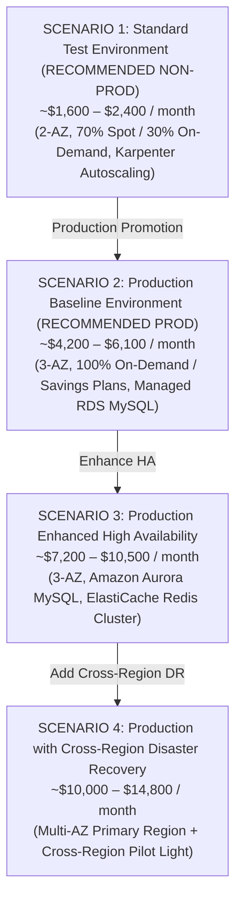
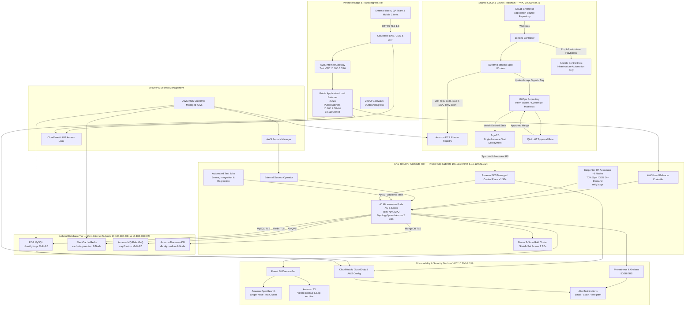
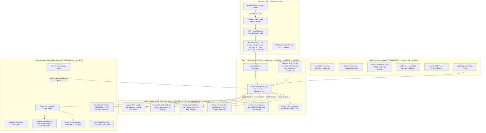
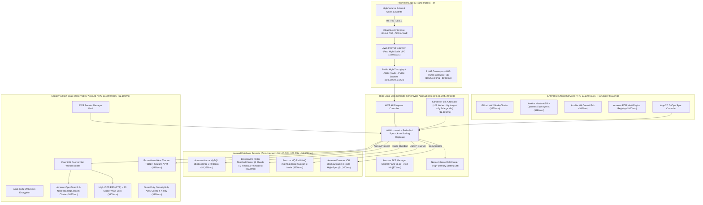
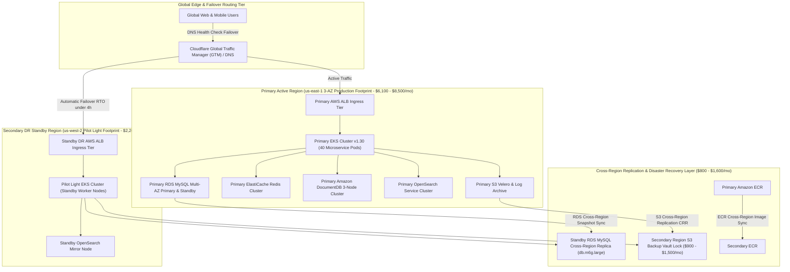
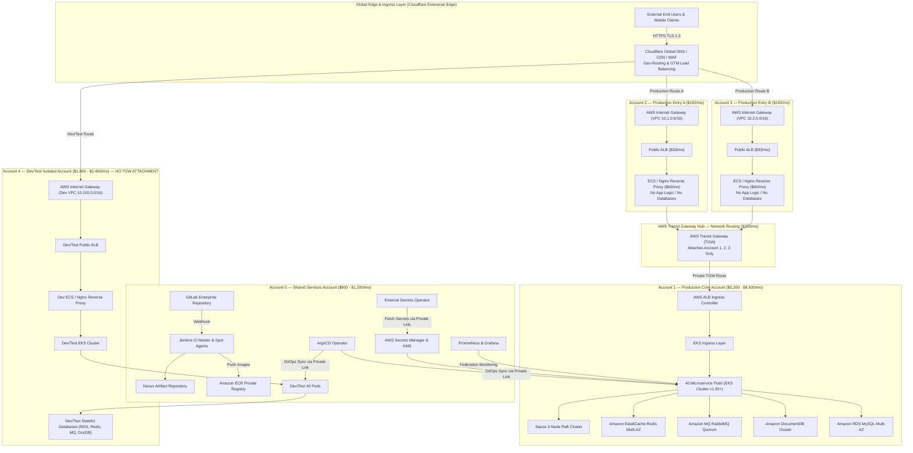

# Scenario-Based Cost Models: DataBlue Next-Gen Infrastructure Platform

---

## 1. Overview

This document presents scenario-based financial projections for the **DataBlue Next-Gen Infrastructure Platform** (`datablue-nextgen-infra-platform`).

In accordance with requirement `BUS-004` and governance rules:
* Cost estimates are **scenario-based projections**, not single guaranteed commitments.
* Figures serve as planning baselines until empirical workload profiling (`Phase 0`) is completed.

---

## 2. Four Enterprise Financial Cost Scenarios

---

## 3. Cost Breakdown Across Scenarios

| AWS Cost Component Category | Scenario 1 (Std Test) | Scenario 2 (Prod Base) | Scenario 3 (Prod HA) | Scenario 4 (Prod DR) |
| :--- | :--- | :--- | :--- | :--- |
| **EKS Control Plane** | $73 / mo | $73 / mo | $73 / mo | $146 / mo (2 Clusters) |
| **EC2 Worker Compute Nodes** | $450 / mo (70% Spot) | $1,800 / mo (Savings Plan)| $2,800 / mo | $4,200 / mo |
| **Database & Stateful Tier** | $445 / mo | $1,860 / mo (Managed RDS)| $3,800 / mo (Aurora) | $5,200 / mo (Multi-Region)|
| **Shared CI/CD Toolchain Stack**| $180 / mo (GitLab/Jenkins) | $371 / mo | $610 / mo (HA CI/CD) | $1,000 / mo |
| **Observability & Security Audit**| $201 / mo (OpenSearch/Prom)| $650 / mo | $1,550 / mo (Full APM) | $2,400 / mo |
| **Network & NAT Gateways** | $99 / mo (2 AZ NAT) | $99 / mo (3 AZ NAT) | $198 / mo (Transit GW) | $396 / mo |
| **Storage & Backups** | $120 / mo | $350 / mo | $600 / mo | $900 / mo (Cross-Region) |
| **Estimated Total Spend** | **~$1,600 – $2,400/mo**| **~$4,200 – $6,100/mo**| **~$7,200 – $10,500/mo**| **~$10,000 – $14,800/mo**|

---

## 4. Scenario-Specific System Architecture Diagrams

### 4.1 Scenario 1 Architecture: Standard Test Environment

*Figure 4.1: Scenario 1 Architecture Diagram — Standard Test Environment ($1,600 – $2,400 / month).*

---

### 4.2 Scenario 2 Architecture: Production Baseline Environment

*Figure 4.2: Scenario 2 Architecture Diagram — Production Baseline Environment ($4,200 – $6,100 / month).*

---

### 4.3 Scenario 3 Architecture: Production Enhanced High Availability

*Figure 4.3: Scenario 3 Architecture Diagram — Production Enhanced High Availability ($7,200 – $10,500 / month).*

---

### 4.4 Scenario 4 Architecture: Production with Cross-Region DR

*Figure 4.4: Scenario 4 Architecture Diagram — Production Cross-Region Disaster Recovery ($10,000 – $14,800 / month).*

---

### 4.5 Scenario 5 Architecture: Enterprise Multi-Account Isolation Architecture

*Figure 4.5: Scenario 5 Architecture Diagram — Enterprise Multi-Account Isolation Architecture ($12,000 – $18,500 / month).*

#### Detailed Sub-Scenario Cost Breakdown (Sub-Scenarios 5.2, 5.3, 5.4):

The fixed multi-account overhead cost (Accounts 2, 3, 4, 5 + TGW Hub) is **`~$3,634 / month`** (Account 2 Entry A `$192`, Account 3 Entry B `$192`, TGW Hub `$250`, Account 4 Dev/Test `$2,000`, Account 5 Shared Services `$1,000`).

The total monthly budget for Scenario 5 depends on the selected Core Infrastructure scale in Account 1:

| Scenario 5 Variation | Account 1 Core Stack Specification | Account 1 Core Cost | Multi-Account Fixed Cost | Estimated Total Monthly Spend |
| :--- | :--- | :--- | :--- | :--- |
| **Scenario 5.2 (Scenario 2 Core - Prod Baseline)** | 3 AZs, ~12 Worker Nodes, RDS MySQL Multi-AZ, OpenSearch 2-Node | $5,200 – $6,100 / month | $3,634 / month | **~$8,800 – $10,300 / month** |
| **Scenario 5.3 (Scenario 3 Core - High-Scale HA)** | 3 AZs, ~24 Worker Nodes, Aurora MySQL 3 Replicas, OpenSearch 4-Node | $7,200 – $10,500 / month | $3,634 / month | **~$10,800 – $14,100 / month** |
| **Scenario 5.4 (Scenario 4 Core - Cross-Region DR)** | Primary `us-east-1` + Standby Pilot Light `us-west-2` Cross-Region DR | $10,000 – $14,800 / month | $3,634 / month | **~$13,600 – $18,500 / month** |

---

#### 4.5.1 Detailed 12 Connectivity Flows & Security Boundary Rules:

1. **Edge Ingress Perimeter (Cloudflare Enterprise Edge)**:
   - `Internet` $\rightarrow$ `HTTPS TLS 1.3` $\rightarrow$ `Cloudflare DNS / CDN / WAF`.
   - Cloudflare distributes traffic via Geo-Routing / GTM Load Balancing to Account 2 (Prod Entry A), Account 3 (Prod Entry B), or Account 4 (Dev/Test Entry). **Strictly zero direct connection from the Internet to Production Core Account 1**.

2. **Production Entry A Ingress Tier (Account 2)**:
   - `Cloudflare` $\rightarrow$ `Internet Gateway` $\rightarrow$ `Public ALB` $\rightarrow$ `ECS / Nginx Reverse Proxy` $\rightarrow$ `Transit Gateway Attachment`.
   - Reverse Proxy performs TLS termination, header validation, and request forwarding ONLY. **Contains no application code and no databases**.

3. **Production Entry B Ingress Tier (Account 3)**:
   - `Cloudflare` $\rightarrow$ `Internet Gateway` $\rightarrow$ `Public ALB` $\rightarrow$ `ECS / Nginx Reverse Proxy` $\rightarrow$ `Transit Gateway Attachment`.
   - Functions as Active-Active or Active-Standby redundancy for Entry A. **Contains no application code and no databases**.

4. **AWS Transit Gateway Network Routing Hub**:
   - Transit Gateway attaches ONLY: **Account 2 (Entry A)** $\leftrightarrow$ **Account 1 (Prod Core)** $\leftrightarrow$ **Account 3 (Entry B)**.
   - **STRICT PROHIBITION**: Account 4 (Dev/Test) and Account 5 (Shared Services) are **NOT attached to Transit Gateway** for absolute network security isolation.

5. **Production Core Account Internal Traffic Flow (Account 1)**:
   - `AWS Transit Gateway` $\rightarrow$ `AWS Load Balancer Controller` $\rightarrow$ `EKS Ingress` $\rightarrow$ `40 Microservice Pods` $\rightarrow$ `Nacos Service Discovery` $\rightarrow$ `Stateful Databases` (`RDS MySQL`, `ElastiCache Redis`, `RabbitMQ`, `DocumentDB`).

6. **Production Core $\rightarrow$ Shared Services Private Connection**:
   - Account 1 (Prod Core) connects to Account 5 (Shared Services) ONLY via private connections (AWS PrivateLink / Private VPC Connection):
     - **ArgoCD**: Deploys GitOps Manifests to EKS Pods.
     - **Jenkins**: Compiles Docker Images and Pushes to ECR Private Registry.
     - **GitLab**: Triggers Code Push Webhooks to Jenkins.
     - **Nexus**: Supplies Dependency Packages for Jenkins Builds.
     - **External Secrets Operator (ESO)**: Automatically fetches secrets from AWS Secrets Manager for Pods.
     - **Monitoring**: Prometheus Federation pushes metrics to Central Grafana.

7. **Shared Services Account Security Principles (Account 5)**:
   - **Zero Internet Ingress**: Account 5 receives ZERO traffic directly from the Internet.
   - Accepts **Private Traffic ONLY** via internal private networks from developers and CI/CD build agents.

8. **Dev/Test Independent Environment Flow (Account 4)**:
   - `Cloudflare` $\rightarrow$ `Internet Gateway` $\rightarrow$ `Public ALB` $\rightarrow$ `ECS / Nginx Reverse Proxy` $\rightarrow$ `Dev EKS Cluster` $\rightarrow$ `Dev Pods` $\rightarrow$ `Dev Databases`. This is a complete standalone infrastructure stack identical to Scenario 1 footprint.

9. **Dev/Test Strict Isolation Matrix**:
   - Account 4 Dev/Test: **NO Transit Gateway Attachment**, **NO Production Core Connection**, **NO Production Database Access**, **NO Production VPC Peering**.
   - External access allowed ONLY via: `Internet` $\rightarrow$ `Cloudflare` $\rightarrow$ `Dev/Test Entry` $\rightarrow$ `Dev/Test Core`.

10. **Shared Services Build & Deployment Workflow**:
    - `Developer` $\rightarrow$ `GitLab Commit` $\rightarrow$ `Jenkins Webhook` $\rightarrow$ `Build & Test` $\rightarrow$ `Nexus Dependencies` $\rightarrow$ `Push ECR Image` $\rightarrow$ `ArgoCD Sync` $\rightarrow$ `Deploy EKS Prod (Account 1)` or `Deploy EKS Dev (Account 4)`.

11. **Security & Observability Pipeline**:
    - **Logs**: `Pods` $\rightarrow$ `Fluent Bit DaemonSet` $\rightarrow$ `OpenSearch Cluster` $\rightarrow$ `Grafana`.
    - **Metrics**: `Pods` $\rightarrow$ `Prometheus` $\rightarrow$ `Grafana`.
    - **Secrets**: `AWS Secrets Manager` $\rightarrow$ `External Secrets Operator (ESO)` $\rightarrow$ `Pods`.

12. **端到端流量总结矩阵**：
    - **生产流量**：`用户` $\rightarrow$ `Cloudflare` $\rightarrow$ `入口 A / 入口 B` $\rightarrow$ `AWS Transit Gateway` $\rightarrow$ `生产核心` $\rightarrow$ `数据库` $\leftarrow$ `共享服务`。
    - **开发/测试流量**：`用户` $\rightarrow$ `Cloudflare` $\rightarrow$ `开发/测试入口` $\rightarrow$ `开发/测试核心` (100% 完全隔离)。
