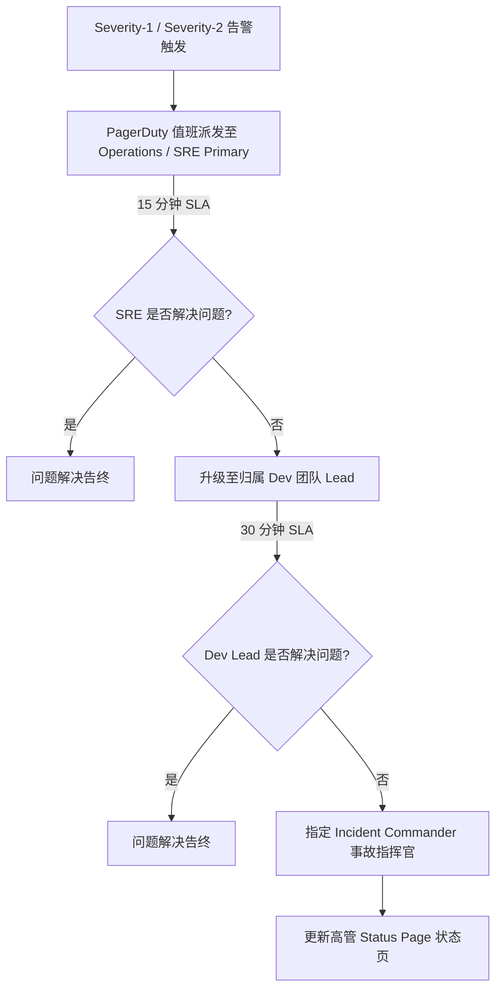

# 服务所有权与归属治理框架说明书 (Service Ownership Framework: DataBlue Platform)

---

## 1. 概述 (Overview)

本文档指定了 **DataBlue 下一代基础设施平台** (`datablue-nextgen-infra-platform`) 的 **服务所有权与归属治理框架 (Service Ownership Framework)**。

文档提供了标准化的服务注册模板与运维升级路径，且不依赖任何具体个人姓名。

---

## 2. 服务所有权 Profile 模板 (Service Ownership Profile Template)

每一个平台组件及微服务必须在 Git 中维护一份填写完整的服务所有权 Profile 档案：

```markdown
### 服务所有权 Profile 档案
* **服务名称**: `[service-name]`
* **业务系统域**: `[业务系统 1..6]`
* **主归属团队**: `[团队名称 - 例如：支付工程团队]`
* **技术 Lead 角色**: `[软件架构主工程师角色]`
* **SRE 主联系人**: `[SRE 值班 Primary Lead 角色]`
* **Git 仓库 URI**: `[GitLab 仓库 URI]`
* **PagerDuty 服务 ID**: `[PagerDuty 集成 Key]`
* **Slack 支持频道**: `#support-[service-name]`
* **目标可用性 SLA**: `[99.9% / 99.95%]`
* **目标 RTO / RPO**: `[RTO < 2 小时 / RPO < 15 分钟]`
* **运维 Runbook URI**: `[Runbook Markdown 链接]`
```

---

## 3. 标准运维升级路径 (Standard Operational Escalation Path)


