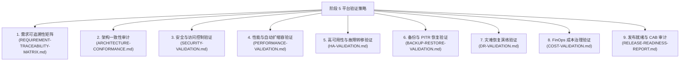

# 平台总体验证策略与治理框架说明书 (Verification Strategy: DataBlue Platform)

---

## 1. 概述与验证哲学 (Overview & Verification Philosophy)

本文档指明了 **DataBlue 下一代基础设施平台** (`datablue-nextgen-infra-platform`) 阶段 5 的 Master **验证策略与治理框架 (Verification Strategy & Governance Framework)**。

根据阶段 5 规则：
* **基础设施拉起完成并不等于平台验证通过**。
* 在进行运维验收前，每一个系统能力必须跨 9 个验证领域接受正式的凭证收集。
* **严禁虚构或预先将测试结果标记为通过**。所有的验证检查项目前均处于 `待定 (Pending)` 或 `未执行` 状态，等待实测执行。

---

## 2. 9 大验证领域与验证范围 (9 Validation Domains)

---

## 3. 验证环境与工具链规范 (Verification Environment & Tooling Specifications)

| 验证领域 | 主要验证工具链 | 目标执行环境 | 强制性凭证要求 | 负责角色 | 当前状态 |
| :--- | :--- | :--- | :--- | :--- | :--- |
| **需求** | 自动化可追溯性审计 | 测试 / 生产规范 | 100% 需求到测试映射 | 企业架构师 | `待定 (Pending)` |
| **架构** | Terraform 合规性 / Sonobuoy | EKS 测试集群 | 一致性报告与 0 漂移 | 基础设施架构师 | `待定 (Pending)` |
| **安全** | Trivy, Checkov, Kube-bench | 安全 AWS 账号 | 0 严重漏洞 / 0 通配符 `*` | 云安全 Lead | `待定 (Pending)` |
| **性能** | Locust, k6 负载生成器 | 测试 EKS 集群 | P95 < 200ms & Karpenter < 60s | SRE Lead / 性能 Lead | `待定 (Pending)` |
| **高可用**| Chaos Mesh, AWS FIS | 测试 / 生产 Multi-AZ | 零数据丢失故障转移 (< 60s) | SRE Lead | `待定 (Pending)` |
| **备份恢复** | Velero CLI, AWS RDS Restore | 测试隔离子网 | 验证 30 天 PITR 恢复 | DBA Lead / 存储 Lead | `待定 (Pending)` |
| **灾难恢复**| Cloudflare GTM / DNS 故障转移模拟器 | 备用 AWS 区域 | 验证 RTO < 4h & RPO < 15m | 云架构主工程师 | `待定 (Pending)` |
| **FinOps 成本** | AWS Cost Explorer / AWS Config | 所有 AWS 账号 | 100% 资源标签合规 | FinOps Lead | `待定 (Pending)` |
| **发布就绪**| CAB 授权 Ticket | 治理委员会 | 签署的 CAB 证书 (`GATE-07`) | 项目发起人 | `待定 (Pending)` |

---

## 4. 凭证收集与门槛治理规则 (Evidence Collection & Gate Governance Rules)

1. **需要实测凭证**: 每一项验证检查项均需要在 [`TEST-EVIDENCE-REGISTER.md`](TEST-EVIDENCE-REGISTER.md) 中附带一个具体的构件（如执行日志文件、原始 JSON 输出、基准测试图表）。
2. **双重签署**: 验证项目需要技术负责人与独立质量/安全审计员的联合签署。
3. **不得虚构通过**: 在附上实际测试执行日志前，检查项保持标记为 `待定 (Pending)` 或 `等待凭证`。
