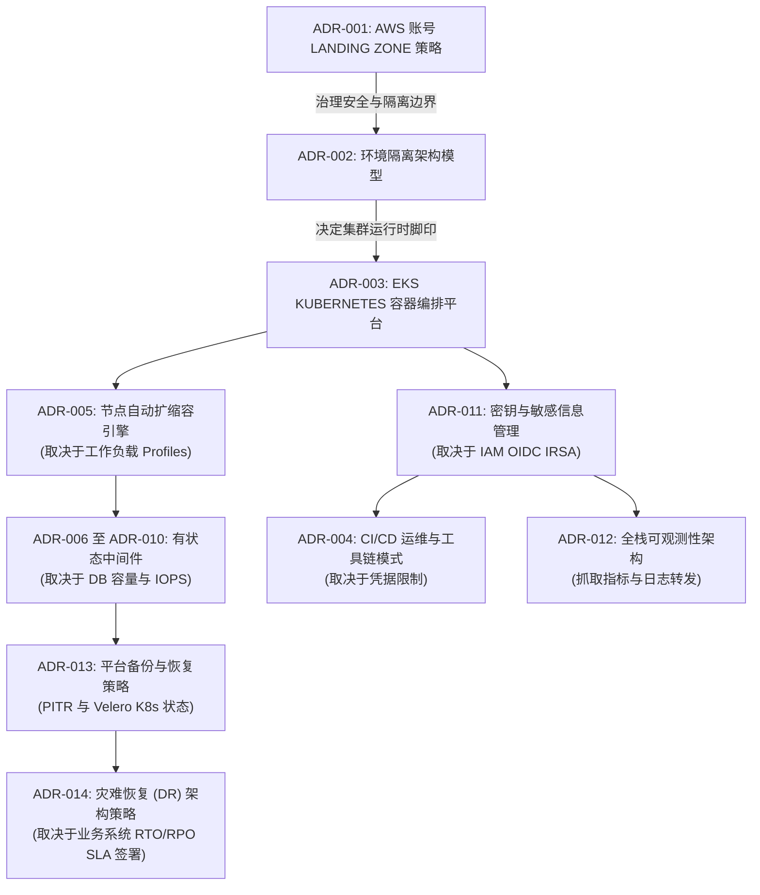

# 架构决策依赖关系网络说明书 (Decision Dependencies: DataBlue Platform)

---

## 1. 概述 (Overview)

本文档映射了 **DataBlue 下一代基础设施平台** (`datablue-nextgen-infra-platform`) 的架构决策记录 (ADRs)、需求登记册与风险分类法之间的相互依赖关系与结构化关联。

架构决策绝非孤立存在。某一领域（如 AWS 账号架构策略）的决策将约束并治理下游领域（如安全 IAM、网络架构、CI/CD 凭据边界及 FinOps 成本归因）的选择。

---

## 2. 核心决策依赖网络图 (Core Decision Dependency Network)

---

## 3. 详细决策间依赖关系矩阵 (Detailed Inter-Decision Dependency Matrix)

### 1. 成本架构取决于工作负载 Profiles
* **前置决策 / 输入**: `OPEN-001` (微服务 CPU、内存、IOPS 及网络吞吐量指标)。
* **受约束的 ADRs**: [`ADR-005`](../03-decisions/ADR-005-node-autoscaling.md) (Karpenter 实例规格配置), [`ADR-006`](../03-decisions/ADR-006-mysql-deployment.md)–[`ADR-009`](../03-decisions/ADR-009-mongodb-deployment.md) (托管 AWS 数据库 vs. EKS 自建 Operator)。
* **关联与影响**: 在缺少实测容量输入的情况下，FinOps 成本估算 (`CST-001`) 无法在数学上最终敲定。AWS 托管服务的选择直接取决于工作负载体量是否足以支撑 AWS 托管实例的溢价。

---

### 2. 节点自动扩缩容策略取决于工作负载调度特性
* **前置决策 / 输入**: 微服务容器资源 Requests/Limits 限额 (`ASM-006`) 及 Pod Disruption Budgets。
* **受约束的 ADRs**: [`ADR-005`](../03-decisions/ADR-005-node-autoscaling.md) (Karpenter JIT 自动扩缩容引擎)。
* **关联与影响**: Karpenter 节点选择效率取决于微服务是否定义了精准的 CPU/内存 Request 边界。省略 Pod Limit 会导致节点装箱失败及不受控的节点扩容消费 (`RSK-CST-001`)。

---

### 3. 数据库选型取决于传输协议兼容性、数据容量大小、RPO 与 RTO
* **前置决策 / 输入**: [`ADR-009`](../03-decisions/ADR-009-mongodb-deployment.md) (MongoDB vs. DocumentDB 兼容性审计)、数据库容量大小及交易 IOPS。
* **受约束的 ADRs**: [`ADR-006`](../03-decisions/ADR-006-mysql-deployment.md), [`ADR-007`](../03-decisions/ADR-007-redis-deployment.md), [`ADR-008`](../03-decisions/ADR-008-rabbitmq-deployment.md), [`ADR-009`](../03-decisions/ADR-009-mongodb-deployment.md), [`ADR-013`](../03-decisions/ADR-013-backup-strategy.md)。
* **关联与影响**: 在对微服务查询针对 DocumentDB 语法限制进行实测验证之前，选择 Amazon DocumentDB 是处于阻断状态的 (`RSK-DAT-001`)。关系型数据库引擎的选择决定了备份快照机制与恢复速度。

---

### 4. 灾难恢复选型取决于业务系统关键性 (RTO / RPO)
* **前置决策 / 输入**: `OPEN-003` (业务产品负责人对目标 RTO 和 RPO 指标的签署)。
* **受约束的 ADRs**: [`ADR-014`](../03-decisions/ADR-014-disaster-recovery.md) (DR 故障转移模型), [`ADR-013`](../03-decisions/ADR-013-backup-strategy.md) (跨区域备份副本)。
* **关联与影响**: 在不知道可接受的停机时间的情况下，无法在跨区域 Pilot Light 与 Warm Standby 之间做出选择。高可用性 (单区域内 Multi-AZ) 处理本地故障，但 DR 需要明确的 RTO/RPO 目标来支撑备用区域的开支 (`RSK-AVL-001`)。

---

### 5. 账号架构策略影响 IAM、网络架构、日志记录与成本分摊
* **前置决策 / 输入**: [`ADR-001`](../03-decisions/ADR-001-aws-account-strategy.md) (多账号 Landing Zone)。
* **受约束的 ADRs**: [`ADR-002`](../03-decisions/ADR-002-environment-isolation.md) (集群隔离), [`ADR-011`](../03-decisions/ADR-011-secrets-management.md) (IAM IRSA OIDC), [`ADR-012`](../03-decisions/ADR-012-observability.md) (集中式日志账号), [`ADR-015`](../03-decisions/ADR-015-infrastructure-as-code.md)。
* **关联与影响**: 建立多账号边界 (`DataBlue-Test-Account`, `DataBlue-Prod-Account`, `Shared-Services-Account`, `Security-Account`) 决定了 VPC 网络 CIDR 规划、集中式 CloudTrail 日志聚合路由及跨账号 IAM 信任关系。

---

### 6. CI/CD 运维模式影响凭据边界与生产变更控制
* **前置决策 / 输入**: [`ADR-004`](../03-decisions/ADR-004-cicd-operating-model.md) (混合覆盖模型)。
* **受约束的 ADRs**: [`ADR-011`](../03-decisions/ADR-011-secrets-management.md) (AWS Secrets Manager + ESO), [`ADR-015`](../03-decisions/ADR-015-infrastructure-as-code.md) (Terraform 执行流水线)。
* **关联与影响**: 将 Jenkins (构建/测试) 与 Ansible/GitOps (部署执行) 解耦，防止了在构建 Runner 上存储长期的云基础设施凭据 (`RSK-SEC-001`)，跨环境强制执行最小权限的 IAM IRSA 执行边界。
