# 高管级架构与成本建议书 (Executive Architecture & Cost Proposal: DataBlue Platform)

**项目标识符**: `datablue-nextgen-infra-platform`  
**文档版本**: 2.5 (统一 SRE & DevSecOps RACI 建议书)  
**治理标准**: 架构优先治理标准 (Architecture-First Governance Standard)

---

## 1. 执行摘要 (Executive Summary)

本建议书为构建 **DataBlue 下一代基础设施平台** (`datablue-nextgen-infra-platform`) 提供完整的技术、运维及财务规范说明。

客户需要一个企业级、云原生 Kubernetes 平台，用于托管跨 **5 至 6 个业务系统** 的约 **40 个微服务**，具备 **测试** 与 **生产** 环境之间的严格隔离、使用 GitLab、Jenkins 和 Ansible 的自动化 CI/CD 部署，以及稳健的中间件基础设施 (MySQL, RabbitMQ, MongoDB, Redis 和 Nacos)。

### 核心架构亮点
* **多账号 Landing Zone**: 跨 `DataBlue-Test-Account`、`DataBlue-Prod-Account`、`Shared-Services-Account` 和 `Security-Account` 实现物理账号隔离 (`ADR-001`, `ADR-002`)。
* **Master 5 层平台架构**: 单一统一的端到端架构图，集成了边缘流量、共享 CI/CD、EKS 计算、隔离数据库层以及集中安全与可观测性。
* **统一的云平台 SRE & DevSecOps 治理**: 在第 10 节中由单一云平台 SRE & DevSecOps 工程团队统一承接运维所有权。
* **规范化的 4 个企业财务场景**: 标准化的 4 场景财务拆解（场景 1 至 4），涵盖非生产测试、生产基线、生产增强高可用以及跨区域灾难恢复 DR。
* **分类的 LLD 执行目标矩阵**: 清晰的 3 组架构分类，解耦分隔 **EKS Pod 工作负载**、**AWS 托管服务** 以及 **独立 EC2 实例**。
* **基于 Karpenter 的托管 EKS 引擎**: Amazon EKS (`v1.30+`) 控制平面结合 Karpenter JIT 节点自动扩缩容，实现 60 秒内的节点拉起 (`ADR-003`, `ADR-005`)。
* **混合覆盖 CI/CD 模型**: 安全的多工具部署工作流，集成了 GitLab 源码控制、Jenkins 容器 CI 扫描 (Trivy)、Ansible 配置 Playbooks 及 ArgoCD GitOps 集群同步 (`ADR-004`)。
* **零静态凭据**: 通过带有 OIDC 联邦的 IAM Roles for Service Accounts (IRSA) 强制执行凭据管理，并通过 External Secrets Operator 与 AWS Secrets Manager 集成 (`ADR-011`)。

---

## 2. 项目背景与需求基线 (Project Context & Requirement Baseline)

系统需求已在 [`REQUIREMENTS-REGISTER.md`](01-requirements/REQUIREMENTS-REGISTER.md) 中规范化为标准需求分类法 (`BUS`, `FUN`, `NFR`, `SEC`, `OPS`, `CST`)：

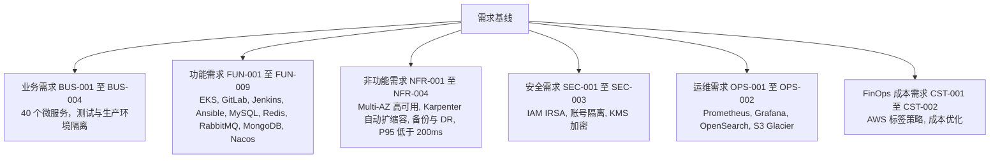

---

## 3. Master 端到端 5 层平台架构 (Master 5-Layer Platform Architecture)

### 3.1 统一 Master 架构图 (Unified Master Architecture Diagram)
下方的 Master 主图将整个 AWS 云平台跨所有 5 个架构层级进行了统一：

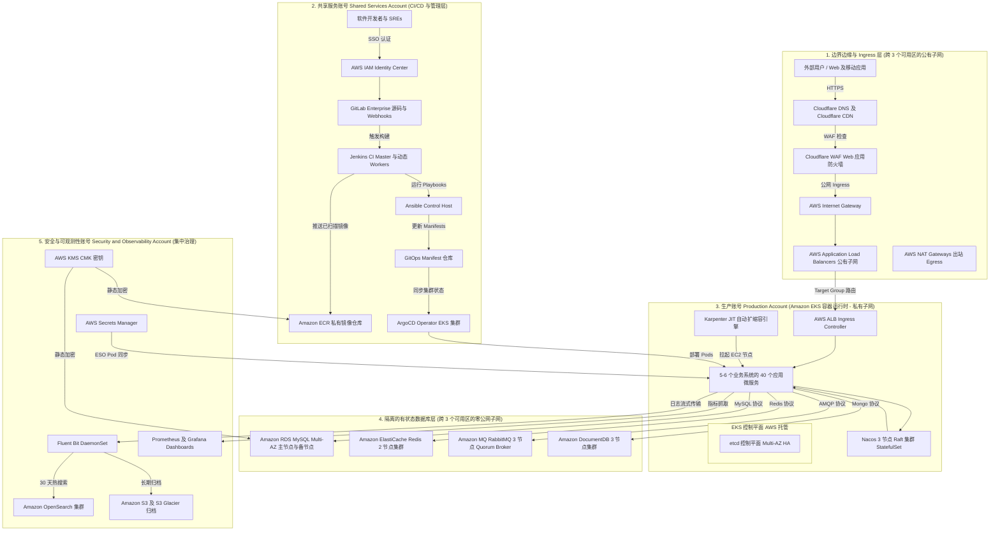

---

### 3.2 Master 系统交互与流量矩阵 (Master System Interaction & Flow Matrix)

| 流量分类 | 源头 / 触发点 | 中间路径与处理 | 目的地 / 目标 | 安全与韧性机制 |
| :--- | :--- | :--- | :--- | :--- |
| **1. 用户请求流量** | 外部 Web / 移动客户端 | Cloudflare DNS $\rightarrow$ Cloudflare CDN $\rightarrow$ Cloudflare WAF $\rightarrow$ 公网 ALB $\rightarrow$ ALB Ingress Controller | 40 个微服务 Pods (私有子网) | 受 Cloudflare WAF OWASP 规则防护；传输中 TLS 1.3 加密 |
| **2. CI/CD 部署流量** | 开发者 Commit / MR | GitLab $\rightarrow$ Jenkins Master $\rightarrow$ 动态 Worker (Trivy 扫描) $\rightarrow$ ECR $\rightarrow$ Ansible | GitOps Repo $\rightarrow$ ArgoCD $\rightarrow$ EKS Pod 部署 | 零静态凭据；通过 IRSA 使用短期 OIDC Tokens |
| **3. 微服务数据流量** | 微服务 Pod | 集群内部路由 / Nacos 服务发现 | RDS MySQL / ElastiCache / RabbitMQ / DocumentDB | 数据库子网完全隔离，零公网出站路由 |
| **4. 密钥注入流量** | Pod 初始化 | External Secrets Operator (ESO Pod) 同步 | AWS Secrets Manager (安全账号) | Pod 接收临时 Secrets；使用 KMS CMK 静态加密 |
| **5. 可观测性与日志流量** | Pod stdout / stderr | EC2 节点上的 Fluent Bit DaemonSet | OpenSearch (30 天热查) $\rightarrow$ S3 Glacier (长期归档) | 加密的 S3 Bucket，具备 AWS Backup Vault Lock 不可变性 |
| **6. 动态扩缩容流量** | Pod 负载 (CPU > 70%) | HPA 扩容副本 $\rightarrow$ Pods 进入 Pending 状态 | Karpenter JIT 拉起 EC2 工作节点 (< 60s) | 使用 TopologySpread 跨 3 个可用区均衡 EC2 实例 |

---

## 4. 低级设计 (LLD) 模块化架构图 (LLD Modular Architecture Diagrams)

### 4.1 模块 1: Ingress 路由与动态 Pod 扩缩容拓扑
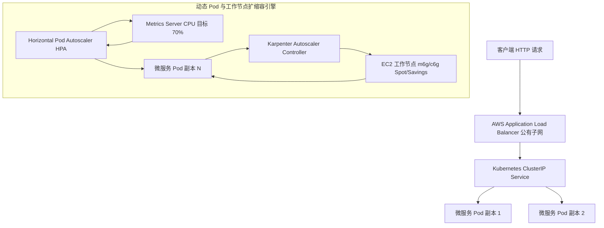

---

### 4.2 模块 2: CI/CD 工具链与 GitOps 部署拓扑
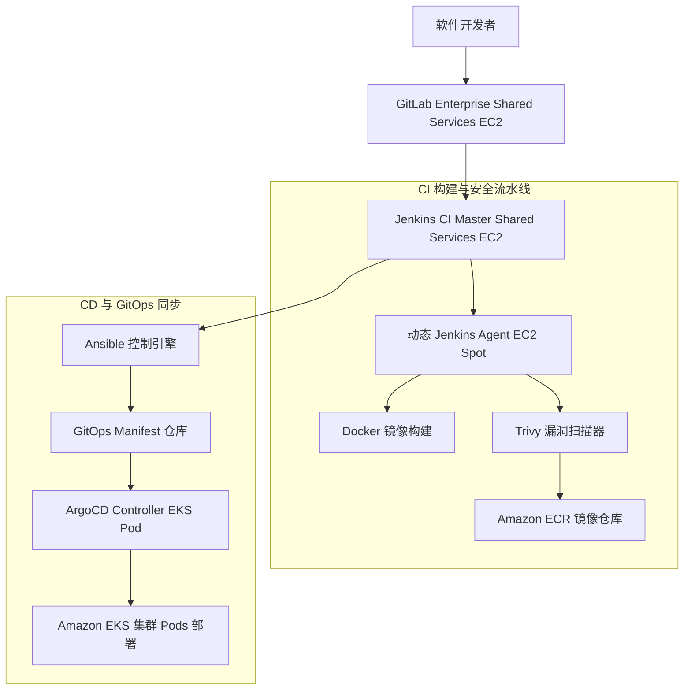

---

### 4.3 模块 3: 有状态中间件与密钥注入拓扑
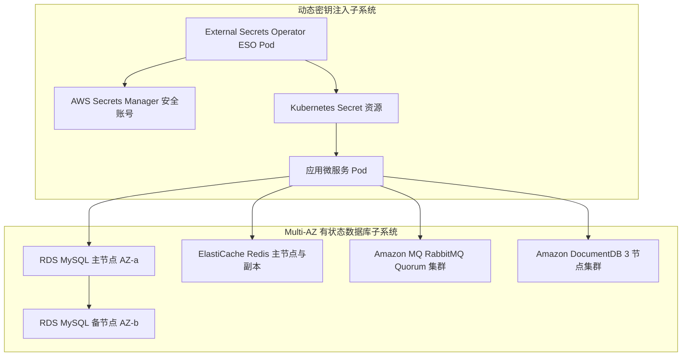

---

### 4.4 模块 4: 可观测性、日志归档与指标流水线
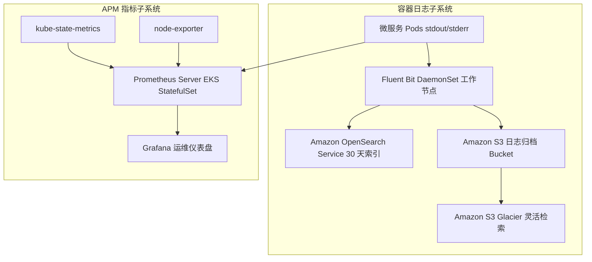

---

## 5. 低级设计 (LLD) 组件部署表 (LLD Component Deployment Tables)

### 5.1 组 1: EKS 集群工作负载 (Kubernetes Pods)

| 组件名称 | 工作负载类型 | 计算与 Pod 规格 | 子网与存储卷规格 | 高可用与备份 |
| :--- | :--- | :--- | :--- | :--- |
| **40 个微服务** | `Deployment` | XS–XL (0.1–1 vCPU, 0.25–2GB RAM) | 私有应用子网 \| 临时存储 / PVC | HPA (70% CPU) + Karpenter JIT \| Velero S3 快照 |
| **Nacos 集群** | `StatefulSet` | 3 副本 (0.5 vCPU / 1GB RAM) | 私有应用子网 \| 10 GB EBS `gp3` PVC | 3 节点 Raft 集群 (3 AZs) \| 由 RDS MySQL 提供支持 |
| **ArgoCD Controller** | `Deployment` | 2 副本 (0.5 vCPU / 1GB RAM) | 私有应用子网 \| 无状态 | Multi-AZ Pod 反亲和性 \| Git 历史 |
| **External Secrets (ESO)** | `Deployment` | 2 副本 (0.1 vCPU / 256MB RAM)| 私有应用子网 \| 无状态 | Multi-AZ Pod 反亲和性 \| Velero Manifest 备份 |
| **Prometheus & Grafana** | `StatefulSet` | Prom (1vCPU/4GB), Grafana (0.5vCPU/1GB) | 私有应用子网 \| 50 GB EBS `gp3` PVC | Multi-AZ Pod 反亲和性 \| EBS 快照 + S3 导出 |
| **Fluent Bit 日志记录** | `DaemonSet` | 每 EKS 工作节点 1 个 Pod | 本地节点 Buffer 缓冲区 | 按节点自动配置 \| 流式传输至 OpenSearch & S3 |
| **Velero Operator** | `Deployment` | 1 副本 (0.2 vCPU / 512MB RAM) | 私有应用子网 \| 无状态 | 单 Pod 自动重启 \| S3 凭证 Vault |

---

### 5.2 组 2: AWS 托管服务 (AWS Managed Services)

| AWS 服务 | 服务等级 | 实例 / 规格等级 | 子网边界 | 高可用与备份策略 |
| :--- | :--- | :--- | :--- | :--- |
| **EKS 控制平面** | Amazon EKS | 托管 EKS 控制平面 (`v1.30+`) | AWS 托管 VPC 边界 | Multi-AZ etcd Quorum 仲裁 \| AWS 托管持续备份 |
| **MySQL 数据库** | Amazon RDS | RDS MySQL (`db.m6g.xlarge` Multi-AZ) | 隔离数据库子网 | 主/备 (< 60s 故障转移) \| 快照 + 30 天 PITR |
| **Redis 缓存** | Amazon ElastiCache | ElastiCache Redis (`cache.m6g.large`) | 隔离数据库子网 | 2 节点 Multi-AZ 组 \| 每日 RDB 快照至 S3 |
| **RabbitMQ 代理** | Amazon MQ | Amazon MQ RabbitMQ (`mq.m6g.large`) | 隔离数据库子网 | 3 节点 Multi-AZ Quorum Broker \| 自动化 EBS 快照 |
| **MongoDB 存储** | Amazon DocumentDB | DocumentDB (`db.r6g.xlarge` 3 节点) | 隔离数据库子网 | 3 节点集群 (3 AZs) \| 30 天持续 PITR |
| **AWS Secrets Manager** | Secrets Manager | 托管键值 Vault | 安全账号 / 私有访问 | 多区域 VPC 端点访问 \| AWS 托管复制 |
| **Amazon OpenSearch** | OpenSearch Service | `2 节点 r6g.large.search` 集群 | 私有应用子网 | 2-AZ 搜索分布 \| 自动化每日快照 |
| **Amazon S3 / Glacier** | S3 / Glacier | Standard & Glacier Flexible | 区域端点 | Multi-AZ 区域持久性 \| S3 版本控制与 Lock |
| **App 负载均衡器** | Application Load Balancer| 托管 ALB Ingress Controller | 公网 Internet 子网 | Active-Active Multi-AZ 路由 \| AWS 基础设施托管 |

---

### 5.3 组 3: 独立与动态 EC2 工具链实例 (Standalone EC2 Instances)

| EC2 服务器 | 组件角色 | 实例类型 / 计算 | 子网与存储规格 | 高可用与备份策略 |
| :--- | :--- | :--- | :--- | :--- |
| **Karpenter 工作节点** | 动态 EKS 工作节点 | `m6g.large`, `c6g.large`, `r6g.large` | 私有应用子网 \| 50 GB EBS `gp3` | Karpenter JIT NodePools (3 AZs) \| 无状态替换 |
| **GitLab Enterprise** | 源码控制与 Webhooks | `m6g.xlarge` (4 vCPU / 16GB RAM) | 共享服务私有子网 \| 200 GB EBS `gp3`| 备用 AMI 快照恢复 \| 每日 AWS Backup AMI |
| **Jenkins Master 服务器** | CI 构建编排 | `m6g.xlarge` (4 vCPU / 16GB RAM) | 共享服务私有子网 \| 100 GB EBS `gp3`| 单节点自动恢复 ASG \| 每日 AWS Backup AMI |
| **Jenkins 动态 Workers**| 临时构建 Agents | `c6g.large` EC2 Spot 实例 | 共享服务私有子网 \| 30 GB 临时存储 | 任务完成后自动终止 \| 无状态 |
| **Ansible 控制引擎** | 配置与 Playbooks | `t3.medium` (2 vCPU / 4GB RAM) | 共享服务私有子网 \| 30 GB EBS `gp3`| 备用 AMI 快照恢复 \| Git 仓库备份 |

---

## 6. 核心架构决策 (ADR 决策包摘要)

本架构受 15 个架构决策记录 ([`ADR-REGISTER.md`](03-decisions/ADR-REGISTER.md)) 治理：

| ADR ID | 决策主题 | 选定的架构方案 | 依据与核心权衡取舍 |
| :--- | :--- | :--- | :--- |
| [`ADR-001`](03-decisions/ADR-001-aws-account-strategy.md) | AWS 账号结构 | 多账号 Landing Zone | 严格隔离爆炸半径与清晰的计费边界 |
| [`ADR-002`](03-decisions/ADR-002-environment-isolation.md) | 环境隔离架构 | 物理账号与 EKS 集群隔离 | 彻底消除测试与生产之间的共享集群风险 |
| [`ADR-003`](03-decisions/ADR-003-kubernetes-platform.md) | K8s 引擎选型 | Amazon EKS (`v1.30+`) | AWS 托管控制平面 etcd 高可用，具备原生 IRSA/VPC 支持 |
| [`ADR-004`](03-decisions/ADR-004-cicd-operating-model.md) | CI/CD 运维模式 | 混合覆盖模型 (Hybrid Overlay) | GitLab 触发 $\rightarrow$ Jenkins 构建 $\rightarrow$ Ansible $\rightarrow$ ArgoCD GitOps 同步 |
| [`ADR-005`](03-decisions/ADR-005-node-autoscaling.md) | 节点自动扩缩容引擎 | Karpenter JIT Autoscaler | 亚分钟级 EC2 节点拉起，无预分配 ASG 资源浪费 |
| [`ADR-006`](03-decisions/ADR-006-mysql-deployment.md) | 关系型数据库 | Amazon RDS MySQL Multi-AZ | 完全托管的自动故障转移与 30 天 PITR 保留 |
| [`ADR-007`](03-decisions/ADR-007-redis-deployment.md) | 内存级缓存 | Amazon ElastiCache Redis | 亚毫秒级延迟，具备自动主节点故障转移 |
| [`ADR-008`](03-decisions/ADR-008-rabbitmq-deployment.md) | 消息队列代理 | Amazon MQ for RabbitMQ | 托管 Multi-AZ Quorum 队列代理，剥离维护负担 |
| [`ADR-009`](03-decisions/ADR-009-mongodb-deployment.md) | 文档数据库 | Amazon DocumentDB (待审计) | 托管 MongoDB API 兼容性；受查询兼容性审计约束 |
| [`ADR-010`](03-decisions/ADR-010-nacos-deployment.md) | 服务发现/配置中心 | EKS 上部署 Nacos StatefulSet | 由 MySQL 存储提供支持的 EKS 上 3 节点 Raft 集群 |
| [`ADR-011`](03-decisions/ADR-011-secrets-management.md) | 密钥管理架构 | AWS Secrets Manager + ESO | Git 中零明文密钥；自动化的 Pod 密钥同步 |
| [`ADR-012`](03-decisions/ADR-012-observability.md) | 可观测性 Stack | Prometheus/Grafana + OpenSearch | 指标仪表盘 + 30 天 S3 Glacier 归档的热日志搜索 |
| [`ADR-013`](03-decisions/ADR-013-backup-strategy.md) | 备份与保留策略 | 数据库 PITR + Velero S3 | 30 天数据库持续恢复 + 集群 Manifest Velero 快照 |
| [`ADR-014`](03-decisions/ADR-014-disaster-recovery.md) | 灾难恢复策略 | 区域 Pilot Light / 备用 | 目标 RTO < 4h 及 RPO < 15m 的跨区域故障转移 |
| [`ADR-015`](03-decisions/ADR-015-infrastructure-as-code.md) | 基础设施即代码 | 模块化 Terraform + Helm | 带有 `terraform plan` 审计的声明式 AWS 基础设施预置 |

---

## 7. 安全、高可用性与灾难恢复 (Security, HA & DR)

### 7.1 安全架构 (Security Architecture)
1. **零静态凭据**: 开发者与流水线访问通过 AWS IAM Identity Center (SSO) 进行联邦认证。EKS Pod 权限利用 IAM Roles for Service Accounts (IRSA) 及短期 OIDC Tokens (`SEC-001`)。
2. **网络边界防御**: 数据库子网完全隔离，发往公网的路由路径为零 (`SEC-002`)。公网流量严格通过由 AWS WAF 防护的 AWS Application Load Balancers (ALB) 进入。
3. **数据加密标准**: 100% 的 EBS 卷、RDS 实例、S3 Buckets 及 Secrets Manager 条目在静态时使用 AWS KMS 客户托管密钥 (CMK) 加密，且传输中强行实施 TLS 1.3 加密 (`SEC-003`)。

### 7.2 高可用性与韧性 (High Availability & Resiliency)
- **控制平面**: 托管 Amazon EKS 控制平面跨 3 个可用区进行副本复制。
- **工作节点**: Karpenter 使用 Kubernetes `topologySpreadConstraints` 跨 3 个可用区均衡 EC2 实例分配。
- **数据库 HA**: Multi-AZ 主/备同步复制，在 60 秒内完成自动故障转移 (`NFR-001`)。

### 7.3 备份与灾难恢复策略 (Backup & DR Strategy)
- **时间点恢复 (PITR)**: Amazon RDS 持续交易日志记录允许将数据库恢复至过去 30 天内的任意精确秒数 (`ADR-013`)。
- **集群状态备份**: 自动化的每日 Velero 快照将 Kubernetes Manifests、CRDs 及 EBS 卷状态备份至带有 AWS Backup Vault Lock 的加密跨账号 S3 Buckets 中 (`SEC-003`)。
- **灾难恢复 SLA 目标**: 设计用于实现 **RTO < 4 小时** 及 **RPO < 15 分钟** 的 Pilot Light / 备用跨区域架构 (`ADR-014`)。

---

## 8. 实施交付路线图与治理门槛 (Implementation Roadmap & Gates)

实施规划 ([`IMPLEMENTATION-ROADMAP.md`](04-planning/IMPLEMENTATION-ROADMAP.md)) 跨越 **11 个相对阶段**，包含 **20 个工作包 (`WP-001` 至 `WP-020`)**，受 **10 个验收门槛 (`GATE-01` 至 `GATE-10`)** 治理：

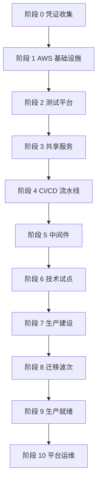

---

## 9. FinOps 成本架构与规范化 4 场景财务模型 (FinOps Cost Architecture)

根据需求 `BUS-004` 及 [`COST-SCENARIOS.md`](05-cost/COST-SCENARIOS.md)，云端支出跨 **4 个规范化的企业财务场景** 进行建模：

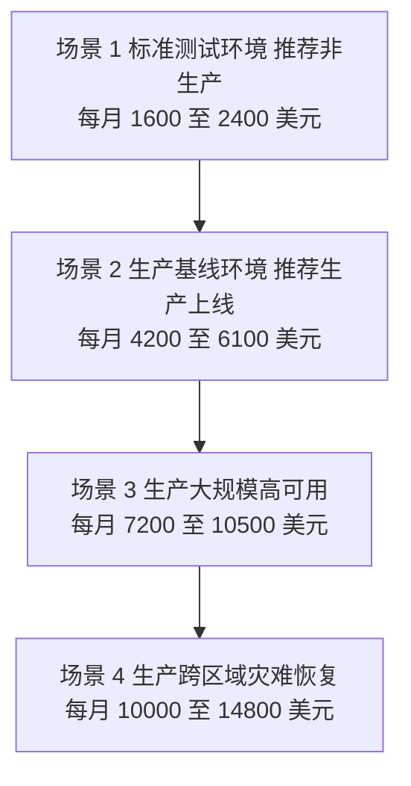

---

### 9.1 场景 1: 标准测试环境 — 推荐非生产 (`~$1,600 – $2,400 / 月`)
* **目标**: 2-AZ 高可用非生产环境，具备 Karpenter 自动扩缩容、专用 CI/CD 及托管服务。

*图 9.1: 场景 1 架构图 — 标准测试环境 ($1,600 – $2,400 / 月).*

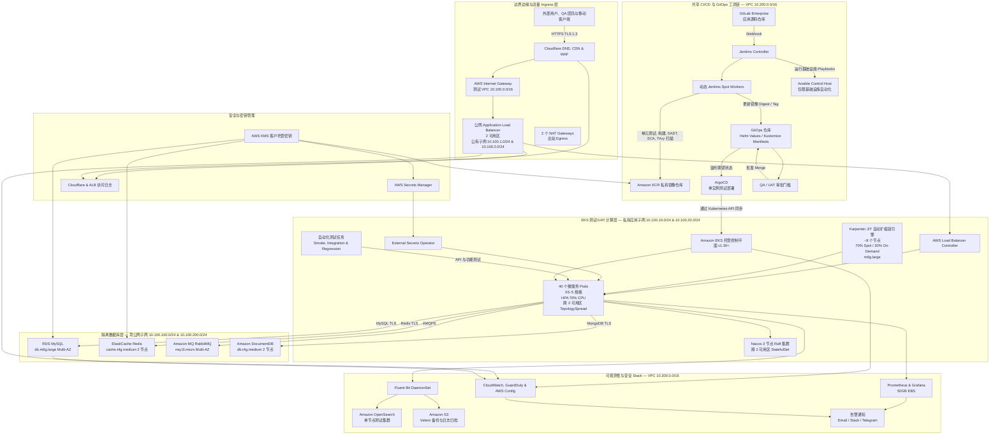

| AWS 组件分类 | 实例 / 资源等级 | 数量 / 分配 | 单价规格与定价 | 月度小计 |
| :--- | :--- | :--- | :--- | :--- |
| **EKS 控制平面** | Amazon EKS 集群 (`v1.30+`) | 1 个集群 | $0.10 / 小时 | $73 / 月 |
| **工作计算节点** | EC2 Spot (70%) & On-Demand (30%) (`m6g.large`) | ~8 个节点实例 (动态) | ~$0.023 / 小时 (Spot 混部) | $450 / 月 |
| **关系型数据库** | Amazon RDS MySQL (`db.m6g.large` Multi-AZ) | 2 个实例 (主节点 + 备节点)| $0.24 / 小时 | $240 / 月 |
| **内存级缓存** | Amazon ElastiCache Redis (`cache.t4g.medium`) | 2 个节点 (2 个 AZ) | $0.034 / 小时 | $50 / 月 |
| **消息队列** | Amazon MQ RabbitMQ (`mq.t3.micro` Multi-AZ) | 2 个 Broker 节点 | $0.03 / 小时 | $45 / 月 |
| **文档数据库** | Amazon DocumentDB (`db.t4g.medium` 2 节点) | 2 个副本节点 | $0.078 / 小时 | $110 / 月 |
| **CI/CD 工具链 Stack** | GitLab 主机 ($60) + Jenkins Master/Workers ($70) + Ansible ($30) + ECR ($20) | 3 个 EC2 实例 + ECR 存储 | 独立 EC2 + ECR | **$180 / 月** |
| **可观测性与安全**| OpenSearch (`search.m6g.large` $120) + Prom PVC ($16) + CloudWatch ($35) + GuardDuty ($30) | OpenSearch + EBS + CloudWatch | 托管可观测性 | **$201 / 月** |
| **网络与出站** | NAT Gateways (2 个 AZ) + 跨 AZ 流量 | 2 个 NAT Gateways | $0.045/小时 x 2 | $99 / 月 |
| **存储与备份** | EBS `gp3` (500GB) + S3 Velero 备份 | 500 GB 存储 + S3 | $0.08 / GB | $120 / 月 |
| **预估月度总支出** | **标准非生产测试基线** | — | — | **~$1,600 – $2,400 / 月** |

---

### 9.2 场景 2: 生产基线环境 — 推荐生产上线 (`~$4,200 – $6,100 / 月`)
* **目标**: 3-AZ 企业级生产环境，具备 Compute Savings Plans、企业级 CI/CD 及全栈可观测性 Stack。

*图 9.2: 场景 2 架构图 — 生产基线环境 ($4,200 – $6,100 / 月).*

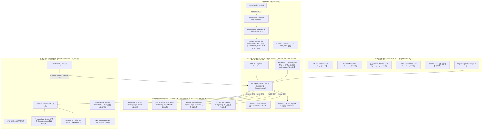

| AWS 组件分类 | 实例 / 资源等级 | 数量 / 分配 | 单价规格与定价 | 月度小计 |
| :--- | :--- | :--- | :--- | :--- |
| **EKS 控制平面** | Amazon EKS 集群 (`v1.30+`) | 1 个集群 | $0.10 / 小时 | $73 / 月 |
| **工作计算节点** | EC2 Karpenter JIT (3 年 SP `m6g.xlarge`)| ~16 个节点实例 | ~$0.084 / 小时 (3 年 SP) | $1,800 / 月 |
| **关系型数据库** | Amazon RDS MySQL (`db.m6g.xlarge` Multi-AZ) | 2 个实例 (主节点 + 备节点)| $0.48 / 小时 | $700 / 月 |
| **内存级缓存** | Amazon ElastiCache Redis (`cache.m6g.large` Multi-AZ)| 2 个节点 (Multi-AZ 组) | $0.136 / 小时 | $200 / 月 |
| **消息队列** | Amazon MQ RabbitMQ (`mq.m6g.large` Quorum) | 3 个 Broker 节点 | $0.26 / 小时 | $280 / 月 |
| **文档数据库** | Amazon DocumentDB (`db.r6g.xlarge` 3 节点集群) | 3 个节点 (3 个 AZ) | $0.46 / 小时 | $680 / 月 |
| **CI/CD 工具链 Stack** | GitLab Enterprise (`m6g.xlarge` $136) + Jenkins Master (`m6g.xlarge` $128) + Spot Workers ($25) + Ansible ($32) + ECR ($50) | 4 台 EC2 服务器 + ECR 仓库 | 专用共享服务 | **$371 / 月** |
| **可观测性与安全**| OpenSearch (`2 节点 r6g.large` $360) + Prom PVC ($40) + CloudWatch ($120) + X-Ray ($40) + GuardDuty/Config ($90) | 2 个 OpenSearch 节点 + APM | 全栈可观测性 | **$650 / 月** |
| **网络与出站** | NAT Gateways (3 个 AZ) + VPC 数据传输 | 3 个 NAT Gateways | $0.045/小时 x 3 | $99 / 月 |
| **存储与备份** | EBS `gp3` (1.5TB) + RDS 快照 + Velero S3 | 1.5 TB 存储 + AWS Backup | $0.08 / GB | $350 / 月 |
| **预估月度总支出** | **生产基线标准** | — | — | **~$4,200 – $6,100 / 月** |

---

### 9.3 场景 3: 生产大规模高可用 (`~$7,200 – $10,500 / 月`)

* **目标**: 高吞吐量 3-AZ 生产环境，具备 Amazon Aurora、高可用 CI/CD 集群及全量安全审计 Stack。

*图 9.3: 场景 3 架构图 — 生产大规模高可用 ($7,200 – $10,500 / 月).*

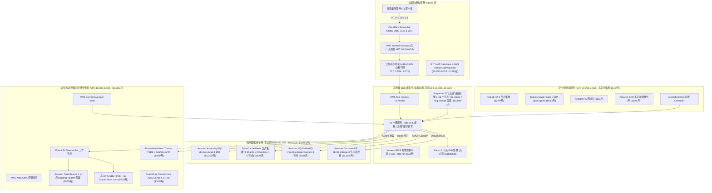

| AWS 组件分类 | 实例 / 资源等级 | 数量 / 分配 | 单价规格与定价 | 月度小计 |
| :--- | :--- | :--- | :--- | :--- |
| **EKS 控制平面** | Amazon EKS 集群 (`v1.30+`) | 1 个集群 | $0.10 / 小时 | $73 / 月 |
| **工作计算节点** | EC2 Karpenter JIT (`r6g.xlarge` / `c6g.2xlarge`) | ~28 个节点实例 | Savings Plan + On-Demand | $2,800 / 月 |
| **关系型数据库** | Amazon Aurora MySQL Multi-AZ (`db.r6g.xlarge`) | 3 个副本 (自动扩缩容) | $0.52 / 小时 | $1,350 / 月 |
| **内存级缓存** | Amazon ElastiCache Redis 集群 (多节点分片)| 6 个节点 (3 Shards x 2 Replicas)| $0.136 / 小时 x 6 | $600 / 月 |
| **消息队列** | Amazon MQ RabbitMQ (`mq.m6g.xlarge` Quorum Broker)| 3 个高内存节点 | $0.52 / 小时 | $550 / 月 |
| **文档数据库** | Amazon DocumentDB (`db.r6g.2xlarge` 3 节点) | 3 个高规格节点 | $0.92 / 小时 | $1,300 / 月 |
| **CI/CD 工具链 Stack** | GitLab HA 集群 ($270) + Jenkins Master ASG ($180) + Ansible HA ($60) + ECR 多区域 ($100) | 企业级 CI/CD 集群 | 多实例高可用 Stack | **$610 / 月** |
| **可观测性与安全**| OpenSearch (`4 节点 r6g.large` $850) + Prom HA/Thanos ($120) + CloudWatch ($280) + X-Ray ($120) + SecurityHub/GuardDuty ($180) | 4 个 OpenSearch 节点 + APM | 高规模可观测性 | **$1,550 / 月** |
| **网络与出站** | 多 VPC Transit Gateway + NAT Gateways (3 个 AZ) | Transit Gateway + 3 个 NATs | AWS Transit 网络 | $198 / 月 |
| **存储与备份** | 高 IOPS EBS `gp3` (3TB) + AWS Backup Vault Lock | 3 TB 高 IOPS 存储 | $0.12 / GB + IOPS | $600 / 月 |
| **预估月度总支出** | **增强型高吞吐生产环境** | — | — | **~$7,200 – $10,500 / 月** |

---

### 9.4 场景 4: 生产带跨区域灾难恢复 (`~$10,000 – $14,800 / 月`)

* **目标**: 主区域生产环境 + 备用区域 Pilot Light 灾难恢复 (RTO < 4h, RPO < 15m)。

*图 9.4: 场景 4 架构图 — 生产带跨区域灾难恢复 ($10,000 – $14,800 / 月).*

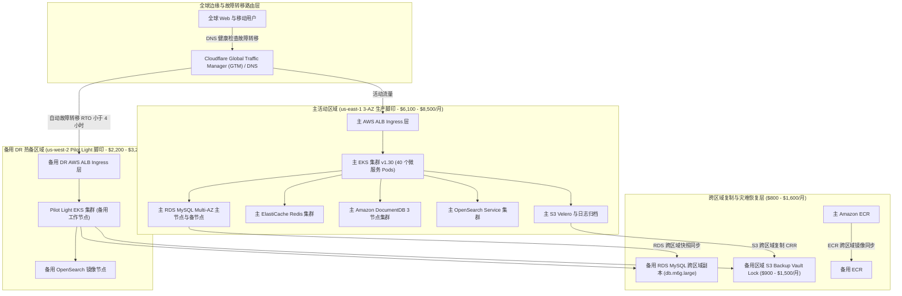

| AWS 区域领域 | 资源与组件拆解 | 托管模型 / SLA | 月度小计 |
| :--- | :--- | :--- | :--- |
| **主区域 (`us-east-1`)**| 场景 2 / 场景 3 生产基线基础设施 (计算 + DB + CI/CD + 可观测性) | 活动 3-AZ 生产环境 | $6,100 – $8,500 / 月 |
| **备用 DR 区域 (`us-west-2`)**| 备用 EKS 控制平面 + 备用 RDS 副本 (`db.m6g.large`) + 备用 OpenSearch 镜像 | Pilot Light DR 热备 | $2,200 – $3,200 / 月 |
| **跨区域复制** | S3 跨区域复制 (CRR) + RDS 快照跨区域 + ECR 镜像同步 | 持续异步同步 | $800 – $1,600 / 月 |
| **DR 可观测性与 Vault** | 备用区域 AWS Backup Vault + S3 凭证备份 + 备用 CloudWatch | 跨区域不可变备份 | $900 – $1,500 / 月 |
| **预估月度总支出** | **多区域灾难恢复脚印** | **RTO < 4h \| RPO < 15m** | **~$10,000 – $14,800 / 月** |

---

### 9.5 场景 5: 企业级多账号隔离架构 (`~$12,000 – $18,500 / 月`)
* **目标**: 5 账号 AWS Landing Zone 隔离模型，具备双入口反向代理 (Entry A / Entry B)、AWS Transit Gateway Hub、生产 Core 账号、共享服务账号及严格隔离的 Dev/Test 账号。

*图 9.5: 场景 5 架构图 — 企业级多账号隔离架构 ($12,000 – $18,500 / 月).*

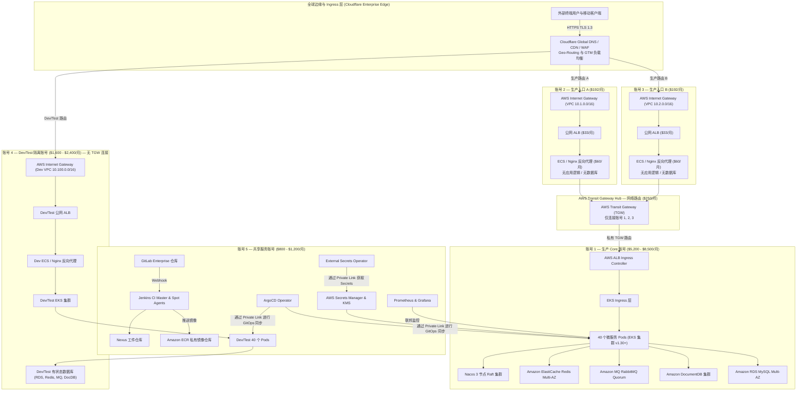

| AWS 账号 (账号 ID / 范围) | 基础设施范围与运维服务 | 隔离与连接模型 | 月度总成本 |
| :--- | :--- | :--- | :--- |
| **账号 1: 生产 Core 账号** | 核心 EKS 集群, 40 个微服务, 托管数据库 (RDS, Redis, MQ, DocumentDB, Nacos) | 零直接公网 Ingress；仅通过 TGW 及共享服务访问 | $5,200 – $8,500 / 月 |
| **账号 2: 生产入口 A 账号** | Internet Gateway, 公网 ALB, ECS / Nginx 反向代理 | 仅接收来自 Cloudflare 的 Ingress；通过 Transit Gateway 转发 | $192 / 月 |
| **账号 3: 生产入口 B 账号** | Internet Gateway, 公网 ALB, ECS / Nginx 反向代理 (Active-Active / Active-Standby) | 仅接收来自 Cloudflare 的 Ingress；通过 Transit Gateway 转发 | $192 / 月 |
| **AWS Transit Gateway Hub** | 账号 1, 2, 3 的集中网络路由连接 | **禁止连接** 账号 4 (Dev/Test) 及账号 5 (共享服务) | $250 / 月 |
| **账号 4: Dev/Test 隔离账号** | 标准场景 1 独立 Stack (Dev EKS, 本地 DBs, Dev 代理) | **100% 隔离**: 无 TGW, 无 Peering, 无生产访问权限 | $1,600 – $2,400 / 月 |
| **账号 5: 共享服务账号** | 集中式 GitLab, Jenkins, Nexus, ECR 仓库, ArgoCD, Secrets Manager, 可观测性 | 通往账号 1 与账号 4 的私有流量连接；零公网 Ingress | $800 – $1,200 / 月 |
| **预估月度总支出** | **企业级多账号隔离架构** | **严格的多账号 Landing Zone 隔离** | **~$12,000 – $18,500 / 月** |

#### 9.5.1 详细 12 个连接流量与安全边界规则:

1. **边缘 Ingress 边界 (Cloudflare Enterprise Edge)**: `Internet` $\rightarrow$ `HTTPS TLS 1.3` $\rightarrow$ `Cloudflare DNS / CDN / WAF`。Cloudflare 通过 Geo-Routing / GTM 负载均衡将流量分发至账号 2 (Prod 入口 A)、账号 3 (Prod 入口 B) 或账号 4 (Dev/Test 入口)。严禁从 Internet 直接连接到生产 Core 账号 1。
2. **生产入口 A Ingress 层 (账号 2)**: `Cloudflare` $\rightarrow$ `Internet Gateway` $\rightarrow$ `公网 ALB` $\rightarrow$ `ECS / Nginx 反向代理` $\rightarrow$ `Transit Gateway Attachment`。反向代理仅执行 TLS 终结、Header 校验及请求转发。不包含应用代码和数据库。
3. **生产入口 B Ingress 层 (账号 3)**: `Cloudflare` $\rightarrow$ `Internet Gateway` $\rightarrow$ `公网 ALB` $\rightarrow$ `ECS / Nginx 反向代理` $\rightarrow$ `Transit Gateway Attachment`。充当入口 A 的 Active-Active 或 Active-Standby 冗余。不包含应用代码和数据库。
4. **AWS Transit Gateway 网络路由 Hub**: Transit Gateway 仅连接: **账号 2 (入口 A)** $\leftrightarrow$ **账号 1 (Prod Core)** $\leftrightarrow$ **账号 3 (入口 B)**。禁止连接账号 4 (Dev/Test) 和账号 5 (共享服务)，以实现绝对的网络安全隔离。
5. **生产 Core 账号内部流量 (账号 1)**: `AWS Transit Gateway` $\rightarrow$ `AWS Load Balancer Controller` $\rightarrow$ `EKS Ingress` $\rightarrow$ `40 个微服务 Pods` $\rightarrow$ `Nacos 服务发现` $\rightarrow$ `有状态数据库` (`RDS MySQL`, `ElastiCache Redis`, `RabbitMQ`, `DocumentDB`)。
6. **生产 Core $\rightarrow$ 共享服务私有连接**: 账号 1 (Prod Core) 仅通过私有连接 (AWS PrivateLink / 私有 VPC 连接) 连接到账号 5 (共享服务): ArgoCD (GitOps 同步)、Jenkins (推送 ECR)、GitLab (Webhook)、Nexus (依赖)、External Secrets Operator (ESO 密钥)、Prometheus Federation (指标)。
7. **共享服务账号安全原则 (账号 5)**: **零公网 Ingress**。账号 5 绝不直接接收来自 Internet 的流量。仅通过内部私有网络接收来自开发者和 CI/CD 构建 Agent 的私有流量。
8. **Dev/Test 独立环境流量 (账号 4)**: `Cloudflare` $\rightarrow$ `Internet Gateway` $\rightarrow$ `公网 ALB` $\rightarrow$ `ECS / Nginx 反向代理` $\rightarrow$ `Dev EKS 集群` $\rightarrow$ `Dev Pods` $\rightarrow$ `Dev 数据库`。这是一个与场景 1 脚印完全相同的独立基础设施 Stack。
9. **Dev/Test 严格隔离矩阵**: 账号 4 Dev/Test: 无 Transit Gateway 连接、无生产 Core 连接、无生产数据库访问权限、无生产 VPC Peering。
10. **共享服务构建与部署工作流**: `开发者` $\rightarrow$ `GitLab Commit` $\rightarrow$ `Jenkins Webhook` $\rightarrow$ `构建与测试` $\rightarrow$ `Nexus 依赖` $\rightarrow$ `推送 ECR 镜像` $\rightarrow$ `ArgoCD 同步` $\rightarrow$ `部署 EKS Prod (账号 1)` 或 `部署 EKS Dev (账号 4)`。
11. **安全与可观测性流水线**: 日志 (`Pods` $\rightarrow$ `Fluent Bit` $\rightarrow$ `OpenSearch` $\rightarrow$ `Grafana`)、指标 (`Pods` $\rightarrow$ `Prometheus` $\rightarrow$ `Grafana`)、密钥 (`AWS Secrets Manager` $\rightarrow$ `ESO` $\rightarrow$ `Pods`)。
12. **端到端流量汇总矩阵**:
    - **生产流量**: `用户` $\rightarrow$ `Cloudflare` $\rightarrow$ `入口 A / 入口 B` $\rightarrow$ `AWS Transit Gateway` $\rightarrow$ `生产 Core` $\rightarrow$ `数据库` $\leftarrow$ `共享服务`。
    - **Dev/Test 流量**: `用户` $\rightarrow$ `Cloudflare` $\rightarrow$ `Dev/Test 入口` $\rightarrow$ `Dev/Test Core` (100% 隔离)。

---

## 10. 运维模型与服务所有权 (Operational Model & Service Ownership)

运维治理 ([`OPERATING-MODEL.md`](06-operations/OPERATING-MODEL.md)) 建立了统一的 RACI 所有权矩阵，在单一 **云平台 SRE & DevSecOps 团队** 下组合了 SRE、DevOps 及安全力量：

| 运维领域与范围 | 云平台 SRE & DevSecOps 团队 | 数据库管理团队 (DBA) | 应用开发团队 (App Dev) | 企业运维与支持团队 (Ops) |
| :--- | :--- | :--- | :--- | :--- |
| **AWS Landing Zone & VPC 子网** | **最终负责 / 负责执行** | 知会 | 知会 | 知会 |
| **EKS 控制平面与工作节点** | **最终负责 / 负责执行** | 知会 | 知会 | 知会 |
| **CI/CD 流水线与 GitOps ArgoCD** | **最终负责 / 负责执行** | 知会 | 咨询 | 知会 |
| **数据库与有状态层 (RDS/Redis/DocumentDB/RabbitMQ)**| 咨询 | **最终负责 / 负责执行** | 咨询 | 知会 |
| **微服务应用代码与 Pod 规格** | 咨询 | 知会 | **最终负责 / 负责执行** | 知会 |
| **可观测性、安全审计与日志流水线** | **最终负责 / 负责执行** | 知会 | 知会 | 知会 |
| **24/7 事故响应与紧急升级** | **最终负责 / 负责执行** | 咨询 | 咨询 | **负责执行** |

---

## 11. 风险管理与生产阻断项 (Risk Management & Blockers)

在获得 CAB 批准 (`GATE-07`) 以创建 `DataBlue-Prod-Account` 之前，必须在阶段 0 和阶段 1 解决以下 **5 个关键生产阻断项**：

1. **`RSK-UNC-001`**: 向应用团队征集并验证微服务 CPU 与内存容量 Profiles。
2. **`RSK-DAT-001`**: 完成针对 Amazon DocumentDB 的 MongoDB 传输协议查询兼容性审计。
3. **`RSK-UNC-003`**: 获得业务产品负责人对目标 RTO (< 4h) 和 RPO (< 15m) SLA 指标的正式签署。
4. **`RSK-SEC-003`**: 审计并验证 Landing Zone 多账号边界，确保跨账号 VPC Peering 为零。
5. **`RSK-SCL-001`**: 完成在 `GATE-06` 获得验收通过的技术试点压力测试基准。

---

## 12. 结论与建议 (Conclusion & Recommendation)

**DataBlue 下一代基础设施平台** 建议书提供了一个完全可追溯、可防御且模块化的架构，专为高可用性、安全性及财务可预测性而设计。

我们建议批准 **阶段 3 ADR 决策包**，并授权开展 **阶段 0 凭证收集**，以解决悬而未决的工作负载容量参数，并解锁阶段 1 AWS Landing Zone 的建设。
