# Đề xuất Tổng thể Kiến trúc & Chi phí: Nền tảng Hạ tầng Thế hệ mới DataBlue (DataBlue Next-Gen Infrastructure Platform)

**Mã Dự án**: `datablue-nextgen-infra-platform`  
**Phiên bản Tài liệu**: 2.5 (Bản Đề xuất Hợp nhất Vai trò SRE & DevSecOps & Kiến trúc Master)  
**Tiêu chuẩn Quản trị**: Tiêu chuẩn Quản trị Hướng Kiến trúc

---

## 1. Tóm tắt Dành cho Ban Giám đốc (Executive Summary)

Bản đề xuất này trình bày toàn bộ quy cách kỹ thuật, vận hành, và tài chính để xây dựng **Nền tảng Hạ tầng Thế hệ mới DataBlue (DataBlue Next-Gen Infrastructure Platform)** (`datablue-nextgen-infra-platform`).

Khách hàng yêu cầu một nền tảng Kubernetes chuẩn doanh nghiệp, cloud-native thiết kế để vận hành khoảng **40 microservices** trên **5 đến 6 hệ thống nghiệp vụ**, với sự cô lập nghiêm ngặt giữa hai môi trường **Test** và **Production**, tự động hóa triển khai CI/CD sử dụng GitLab, Jenkins, và Ansible, cùng hạ tầng middleware mạnh mẽ (MySQL, RabbitMQ, MongoDB, Redis, và Nacos).

### Các Điểm sáng Kiến trúc Cốt lõi
* **AWS Landing Zone Đa Tài khoản**: Cô lập tài khoản vật lý trên các Account `DataBlue-Test-Account`, `DataBlue-Prod-Account`, `Shared-Services-Account`, và `Security-Account` (`ADR-001`, `ADR-002`).
* **Sơ đồ Kiến trúc Tổng thể 5 Tầng Trực quan Master**: Sơ đồ Mermaid hợp nhất 5 tầng kết nối toàn hệ thống từ Vành đai Traffic Ingress, Dịch vụ CI/CD Dùng chung, Runtime EKS Pods, Tầng Cơ sở Dữ liệu Cô lập, đến Phân hệ Bảo mật/Observability Trung tâm.
* **Hợp nhất Mô hình Quản trị Vận hành Cloud Platform SRE & DevSecOps**: Gộp chung quyền sở hữu vận hành hạ tầng, CI/CD và an ninh mạng dưới một đội ngũ kỹ thuật hợp nhất trong Mục 10.
* **Chuẩn hóa 4 Kịch bản Tài chính FinOps Doanh nghiệp**: Phân loại và đánh số lại chuẩn hóa thành 4 Kịch bản vận hành thực tế (Kịch bản 1 đến Kịch bản 4) gồm Non-Prod, Prod Cơ sở, Prod HA Nâng cao, và Khôi phục Thảm họa Xuyên Vùng.
* **Ma trận LLD Phân rã Theo 3 Nhóm Rõ ràng**: Phân loại kiến trúc trực quan tách biệt giữa **Nhóm Workloads Pod EKS**, **Nhóm Dịch vụ Managed AWS**, và **Nhóm Máy chủ EC2 Độc lập**.
* **Engine Managed EKS kết hợp Karpenter**: Control plane Amazon EKS (`v1.30+`) kết hợp với engine tự động mở rộng node Karpenter JIT, cho phép cấp phát node mới dưới 60 giây (`ADR-003`, `ADR-005`).
* **Mô hình CI/CD Lai (Hybrid Overlay Model)**: Quy trình triển khai đa công cụ an toàn tích hợp mã nguồn GitLab, quét an ninh container Jenkins (Trivy), playbooks cấu hình Ansible, và đồng bộ GitOps ArgoCD (`ADR-004`).
* **Không lưu Credentials Tĩnh**: Thực thi định danh IAM Roles for Service Accounts (IRSA) với liên minh OIDC và tích hợp AWS Secrets Manager qua External Secrets Operator (`ADR-011`).

---

## 2. Bối cảnh Dự án & Yêu cầu Cơ sở

Các yêu cầu hệ thống đã được chuẩn hóa thành các phân loại tiêu chuẩn (`BUS`, `FUN`, `NFR`, `SEC`, `OPS`, `CST`) trong [`REQUIREMENTS-REGISTER.md`](01-requirements/REQUIREMENTS-REGISTER.md):

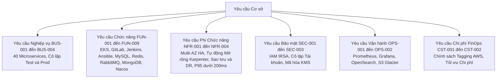

---

## 3. Kiến trúc Tổng thể Master Nền tảng 5 Tầng (Master Architecture)

### 3.1 Sơ đồ Kiến trúc Tổng thể Master Nền tảng AWS
Sơ đồ Master dưới đây hợp nhất toàn bộ nền tảng đám mây AWS xuyên suốt 5 tầng kiến trúc:

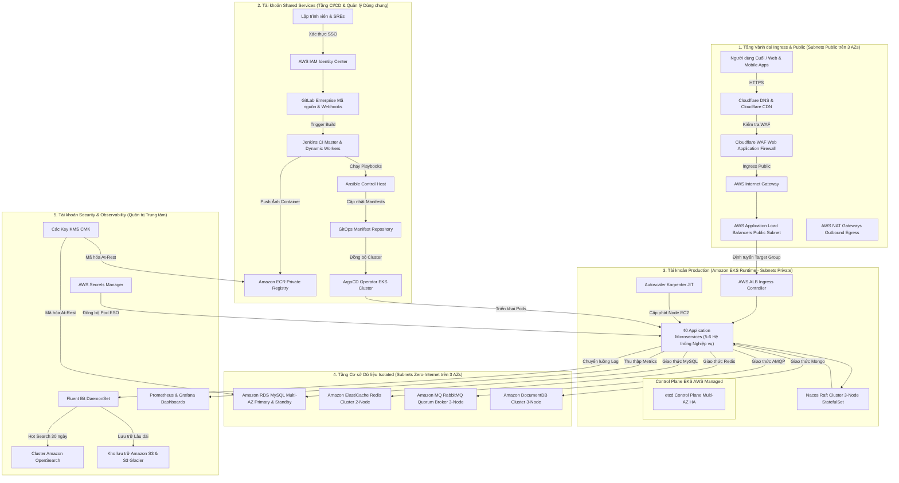

---

### 3.2 Ma trận Luồng Giao tiếp Master Hệ thống (Master Interaction Matrix)

| Danh mục Luồng | Nguồn Khởi tạo / Trigger | Tuyến Trung gian & Xử lý | Đích đến / Target | Cơ chế Bảo mật & Sẵn sàng Cao (HA) |
| :--- | :--- | :--- | :--- | :--- |
| **1. Luồng Truy vấn Người dùng** | External Web / Mobile Client | Cloudflare DNS → Cloudflare CDN → Cloudflare WAF → Public ALB → ALB Ingress Controller | 40 Pod Microservices (Private Subnet) | Bảo vệ bởi quy tắc Cloudflare WAF OWASP; mã hóa TLS 1.3 in-transit |
| **2. Luồng Triển khai CI/CD** | Lập trình viên Commit / MR | GitLab → Jenkins Master → Dynamic Worker (Quét Trivy) → ECR → Ansible | Repo GitOps → ArgoCD → EKS Pod Deployment | 0 static credential; token OIDC ngắn hạn qua IRSA |
| **3. Luồng Dữ liệu Microservice** | Pod Microservice | Định tuyến Nội bộ Cluster / Nacos Service Discovery | RDS MySQL / ElastiCache / RabbitMQ / DocumentDB | Subnet database cô lập KHÔNG CÓ tuyến đường ra internet |
| **4. Luồng Nạp Secrets** | Khởi tạo Pod | External Secrets Operator (ESO Pod) đồng bộ | AWS Secrets Manager (Tài khoản Security) | Pod nhận secret động ngắn hạn; mã hóa at-rest với KMS CMK |
| **5. Luồng Logging & Metrics** | Pod stdout / stderr | Fluent Bit DaemonSet trên node EC2 | OpenSearch (30 ngày hot) → S3 Glacier (Dài hạn) | Bucket S3 mã hóa với AWS Backup Vault Lock bất biến |
| **6. Luồng Tự động Mở rộng** | Tải Pod (CPU > 70%) | HPA mở rộng replicas → Pods vào trạng thái Pending | Karpenter JIT bật node EC2 Worker (< 60s) | Cân bằng instance EC2 trên 3 AZs sử dụng TopologySpread |

---

## 4. Thiết kế Mức Thấp (LLD) Các Sơ đồ Module Chi tiết

### 4.1 Module 1: Sơ đồ Định tuyến Ingress & Tự động Mở rộng Pods (LLD Topology)
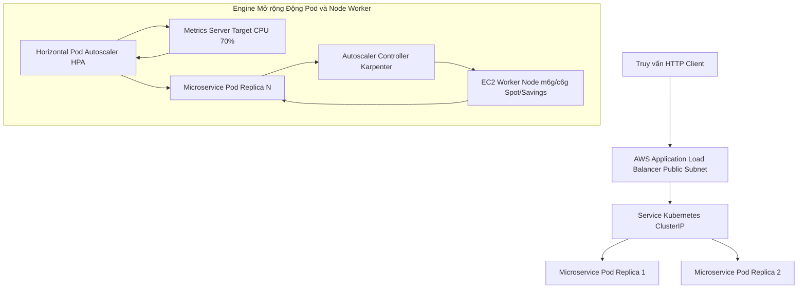

---

### 4.2 Module 2: Sơ đồ Bộ Công cụ CI/CD & Triển khai GitOps (LLD Topology)
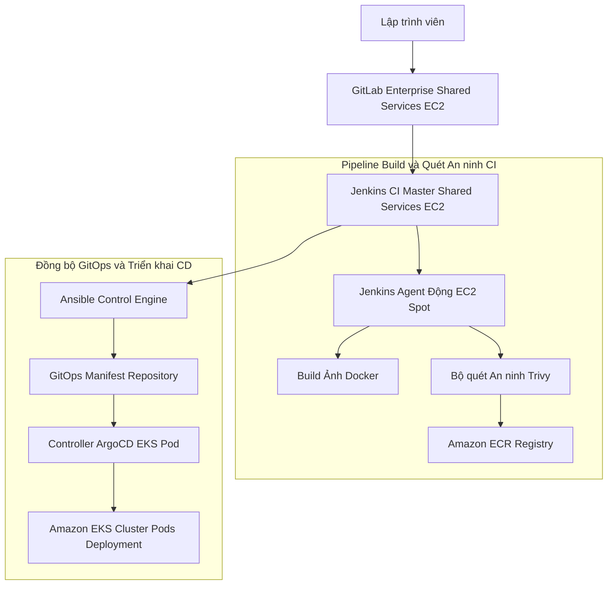

---

### 4.3 Module 3: Sơ đồ Tầng Dữ liệu Stateful & Nạp Secrets (LLD Topology)
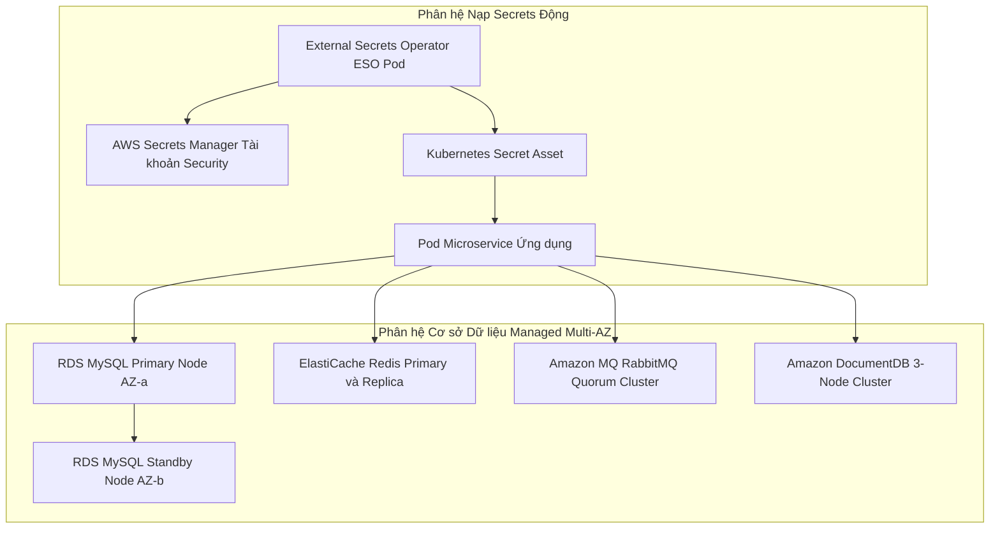

---

### 4.4 Module 4: Sơ đồ Bộ Khả năng Quan sát, Lưu trữ Log & Metrics (LLD Topology)
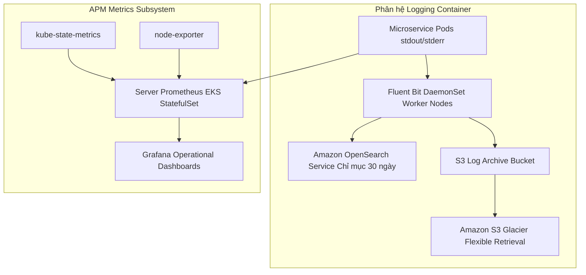

---

## 5. Thiết kế Mức Thấp (LLD) Phân rã Triển khai Thành phần

### 5.1 Nhóm 1: Các Component chạy trên EKS (Container Workloads / Pods)

| Thành phần | Loại Workload | Cấu hình Compute / Pod | Subnet & Volume Spec | Cơ chế HA & Sao lưu |
| :--- | :--- | :--- | :--- | :--- |
| **40 Application Microservices** | `Deployment` | XS–XL (0.1–1 vCPU, 0.25–2GB RAM) | Private App Subnet \| Ephemeral / PVC | HPA (70% CPU) + Karpenter JIT \| Snapshot S3 Velero |
| **Nacos Cluster** | `StatefulSet` | 3 Replicas (0.5 vCPU / 1GB RAM) | Private App Subnet \| 10 GB EBS `gp3` PVC | Raft Cluster 3-Node (3 AZs) \| Backup từ RDS MySQL |
| **ArgoCD Controller** | `Deployment` | 2 Replicas (0.5 vCPU / 1GB RAM) | Private App Subnet \| Stateless | Multi-AZ Pod Anti-Affinity \| Lịch sử Git Repository |
| **External Secrets (ESO)** | `Deployment` | 2 Replicas (0.1 vCPU / 256MB RAM)| Private App Subnet \| Stateless | Multi-AZ Pod Anti-Affinity \| Velero Manifest Backup |
| **Prometheus & Grafana** | `StatefulSet` | Prom (1vCPU/4GB), Grafana (0.5vCPU/1GB) | Private App Subnet \| 50 GB EBS `gp3` PVC | Multi-AZ Pod Anti-Affinity \| EBS Snapshot + S3 Export |
| **Fluent Bit Logging Agent** | `DaemonSet` | 1 Pod / EKS Worker Node | Local Node Buffer | Tự động chạy theo node \| Stream log OpenSearch & S3 |
| **Velero Backup Operator** | `Deployment` | 1 Replica (0.2 vCPU / 512MB RAM) | Private App Subnet \| Stateless | Single pod auto-restart \| Store trạng thái S3 Vault |

---

### 5.2 Nhóm 2: Các Dịch vụ AWS Managed (AWS Managed Services)

| Dịch vụ AWS | Loại Service | Cấu hình Service Class | Subnet Mạng | Cơ chế HA & Chính sách Sao lưu |
| :--- | :--- | :--- | :--- | :--- |
| **EKS Control Plane** | Amazon EKS | EKS Managed (`v1.30+`) | AWS Managed VPC Boundary | Multi-AZ etcd Quorum \| AWS Continuous Backup |
| **MySQL Database** | Amazon RDS | RDS MySQL (`db.m6g.xlarge` Multi-AZ) | Isolated Database Subnet | Primary/Standby (< 60s failover) \| Snapshots + PITR 30 ngày |
| **Redis Cache** | Amazon ElastiCache | ElastiCache Redis (`cache.m6g.large`) | Isolated Database Subnet | Group Nhân bản 2-Node Multi-AZ \| Snapshot RDB S3 hàng ngày |
| **RabbitMQ Broker** | Amazon MQ | Amazon MQ RabbitMQ (`mq.m6g.large`) | Isolated Database Subnet | 3-Node Multi-AZ Quorum Broker \| Snapshots EBS tự động |
| **MongoDB Store** | Amazon DocumentDB | DocumentDB (`db.r6g.xlarge` 3-Node) | Isolated Database Subnet | 3-Node Cluster (3 AZs) \| PITR 30 ngày liên tục |
| **AWS Secrets Manager** | Secrets Manager | Key-Value Vault Managed | Security Account / Private | Multi-Region VPC Endpoint Access \| AWS Managed Replication |
| **Amazon OpenSearch** | OpenSearch Service | `2-node r6g.large.search` Cluster | Private Application Subnet | Phân bổ Search Node 2-AZ \| OpenSearch Snapshots hàng ngày |
| **Amazon S3 / Glacier** | S3 / Glacier | Standard & Glacier Flexible | Regional Endpoint | Multi-AZ Durability (99.999999999%) \| S3 Versioning & Lock |
| **App Load Balancer** | Application Load Balancer| Managed ALB Ingress Controller | Public Internet Subnet | Active-Active Multi-AZ Routing \| AWS Infrastructure Managed |

---

### 5.3 Nhóm 3: Các Máy chủ EC2 Độc lập (Standalone & Dynamic EC2 Instances)

| Máy chủ EC2 | Vai trò / Chức năng | Cấu hình Instance | Subnet & Volume Spec | Cơ chế HA & Chính sách Sao lưu |
| :--- | :--- | :--- | :--- | :--- |
| **Karpenter Worker Nodes** | Worker Node EKS Động | `m6g.large`, `c6g.large`, `r6g.large` | Private App Subnet \| 50 GB EBS `gp3` | Karpenter JIT NodePools (3 AZs) \| Thay thế stateless |
| **GitLab Enterprise** | Quản lý Mã & Webhooks | `m6g.xlarge` (4 vCPU / 16GB RAM) | Shared Services Private \| 200 GB EBS `gp3`| Standby AMI Snapshot Recovery \| Daily AWS Backup AMI |
| **Jenkins Master Server** | Điều phối Build CI | `m6g.xlarge` (4 vCPU / 16GB RAM) | Shared Services Private \| 100 GB EBS `gp3`| Single-Node Auto-Recovery ASG \| Daily AWS Backup AMI |
| **Jenkins Dynamic Workers**| Ephemeral Build Agents | `c6g.large` EC2 Spot Instances | Shared Services Private \| 30 GB Ephemeral | Auto-terminated khi xong job \| Stateless execution |
| **Ansible Control Engine** | Cấu hình & Playbooks | `t3.medium` (2 vCPU / 4GB RAM) | Shared Services Private \| 30 GB EBS `gp3`| Standby AMI Snapshot Recovery \| Git Repository Backup |

---

## 6. Các Quyết định Kiến trúc Cốt lõi (Tóm tắt Gói ADR)

Kiến trúc được quản trị bởi 15 Hồ sơ Quyết định Kiến trúc ([`ADR-REGISTER.md`](03-decisions/ADR-REGISTER.md)):

| Mã ADR | Chủ đề Quyết định | Phương án Kiến trúc Được chọn | Lý do & Đánh đổi Cốt lõi |
| :--- | :--- | :--- | :--- |
| [`ADR-001`](03-decisions/ADR-001-aws-account-strategy.md) | Cấu trúc Tài khoản AWS | Multi-Account Landing Zone | Cô lập nghiêm ngặt bán kính ảnh hưởng & ranh giới thanh toán riêng biệt |
| [`ADR-002`](03-decisions/ADR-002-environment-isolation.md) | Cô lập Môi trường | Cô lập Account & EKS Vật lý | Loại bỏ rủi ro cluster dùng chung giữa Test và Production |
| [`ADR-003`](03-decisions/ADR-003-kubernetes-platform.md) | Lựa chọn Engine K8s | Amazon EKS (`v1.30+`) | Control plane etcd HA do AWS quản lý với hỗ trợ IRSA/VPC bản địa |
| [`ADR-004`](03-decisions/ADR-004-cicd-operating-model.md) | Mô hình Vận hành CI/CD | Mô hình Phủ Phân tầng Lai | Trigger GitLab → Build Jenkins → Ansible → Đồng bộ GitOps ArgoCD |
| [`ADR-005`](03-decisions/ADR-005-node-autoscaling.md) | Engine Mở rộng Node | Karpenter JIT Autoscaler | Cấp phát node EC2 dưới 1 phút không lãng phí ASG cấp phát trước |
| [`ADR-006`](03-decisions/ADR-006-mysql-deployment.md) | Cơ sở Dữ liệu Quan hệ | Amazon RDS MySQL Multi-AZ | Failover tự động hoàn toàn & thời hạn lưu trữ PITR 30 ngày |
| [`ADR-007`](03-decisions/ADR-007-redis-deployment.md) | In-Memory Cache | Amazon ElastiCache Redis | Độ trễ dưới milisecond với failover node primary tự động |
| [`ADR-008`](03-decisions/ADR-008-rabbitmq-deployment.md) | Message Queue Broker | Amazon MQ for RabbitMQ | Managed Multi-AZ quorum queue broker giải phóng công việc bảo trì |
| [`ADR-009`](03-decisions/ADR-009-mongodb-deployment.md) | DB Lưu trữ Tài liệu | Amazon DocumentDB (Chờ Kiểm toán)| Tương thích API MongoDB managed; chờ kiểm toán truy vấn |
| [`ADR-010`](03-decisions/ADR-010-nacos-deployment.md) | Service Discovery/Cấu hình | Nacos StatefulSet trên EKS | Raft cluster 3-node trên EKS backed bởi lưu trữ MySQL |
| [`ADR-011`](03-decisions/ADR-011-secrets-management.md) | Quản lý Secrets | AWS Secrets Manager + ESO | 0 secret plain-text trong Git; đồng bộ pod tự động |
| [`ADR-012`](03-decisions/ADR-012-observability.md) | Bộ Khả năng Quan sát | Prometheus/Grafana + OpenSearch | Dashboards metric + tìm kiếm log hot có lưu trữ S3 Glacier 30 ngày |
| [`ADR-013`](03-decisions/ADR-013-backup-strategy.md) | Chiến lược Sao lưu | DB PITR + Velero S3 | Khôi phục DB liên tục 30 ngày + snapshots trạng thái Velero |
| [`ADR-014`](03-decisions/ADR-014-disaster-recovery.md) | Khôi phục Thảm họa | Pilot Light / Standby Vùng | Failover xuyên vùng hướng tới RTO < 4h và RPO < 15m |
| [`ADR-015`](03-decisions/ADR-015-infrastructure-as-code.md) | Hạ tầng dạng Mã (IaC) | Terraform mô-đun + Helm | Cấp phát hạ tầng AWS khai báo với kiểm toán `terraform plan` dry-run |

---

## 7. Bảo mật, Sẵn sàng Cao & Khôi phục Thảm họa

### 7.1 Kiến trúc Bảo mật
1. **Không lưu Credentials Tĩnh**: Quyền truy cập của lập trình viên và pipeline được liên minh qua AWS IAM Identity Center (SSO). Quyền pod EKS sử dụng IAM Roles for Service Accounts (IRSA) với tokens OIDC ngắn hạn (`SEC-001`).
2. **Bảo vệ Vành đai Mạng**: Các subnet database được cô lập hoàn toàn không có tuyến đường ra internet (`SEC-002`). Lưu lượng public đi vào nghiêm ngặt qua AWS Application Load Balancers (ALB) được bảo vệ bởi AWS WAF.
3. **Tiêu chuẩn Mã hóa Dữ liệu**: 100% các volume EBS, RDS instances, S3 buckets, và Secrets Manager được mã hóa at rest sử dụng AWS KMS Customer-Managed Keys (CMK) và thực thi TLS 1.3 in transit (`SEC-003`).

### 7.2 Sẵn sàng Cao & Chịu lỗi
- **Control Plane**: Managed Amazon EKS control plane nhân bản trên 3 Availability Zones.
- **Worker Nodes**: Karpenter cân bằng cấp phát EC2 instance trên 3 AZs sử dụng Kubernetes `topologySpreadConstraints`.
- **Database HA**: Multi-AZ Primary/Standby nhân bản đồng bộ với failover tự động trong dưới 60 giây (`NFR-001`).

### 7.3 Chiến lược Sao lưu & Khôi phục Thảm họa
- **Point-in-Time Recovery (PITR)**: Amazon RDS continuous transaction logging cho phép khôi phục cơ sở dữ liệu về chính xác từng giây trong 30 ngày trước đó (`ADR-013`).
- **Sao lưu Trạng thái Cluster**: Velero snapshots tự động hàng ngày sao lưu các manifest Kubernetes, CRDs, và trạng thái volume EBS sang S3 bucket mã hóa xuyên tài khoản với AWS Backup Vault Lock (`SEC-003`).
- **Mục tiêu SLA Khôi phục Thảm họa**: Kiến trúc Pilot Light / Standby xuyên vùng được thiết kế để đạt **RTO < 4 giờ** và **RPO < 15 phút** (`ADR-014`).

---

## 8. Lộ trình Triển khai & Các Cổng Quản trị

Kế hoạch triển khai ([`IMPLEMENTATION-ROADMAP.md`](04-planning/IMPLEMENTATION-ROADMAP.md)) trải dài **11 giai đoạn tương đối** chứa **20 Gói Công việc (`WP-001` đến `WP-020`)**, được bảo vệ bởi **10 Cổng Nghiệm thu (`CỔNG-01` đến `CỔNG-10`)**:

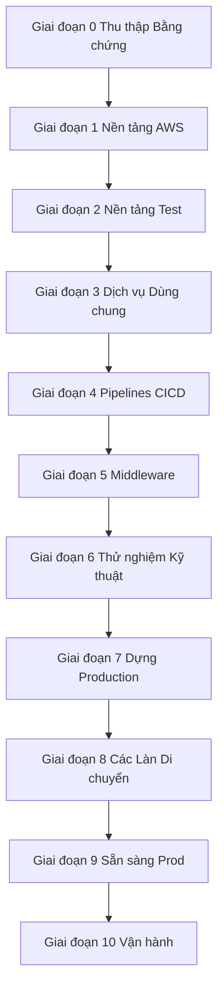

---

## 9. Kiến trúc Chi phí FinOps & Chuẩn hóa 4 Kịch bản Tài chính Doanh nghiệp

Theo đúng yêu cầu `BUS-004` và [`COST-SCENARIOS.md`](05-cost/COST-SCENARIOS.md), chi tiêu đám mây được mô hình hóa trên **4 kịch bản tài chính doanh nghiệp chuẩn hóa**:

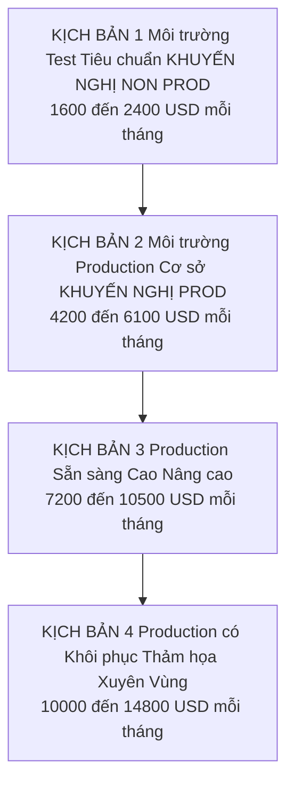

---

### 9.1 Kịch bản 1: Môi trường Test Tiêu chuẩn — KHUYẾN NGHỊ NON-PROD (`~$1,600 – $2,400 / tháng`)
* **Mục tiêu**: Môi trường Non-Prod Sẵn sàng Cao trên 2-AZ với Tự động Mở rộng Karpenter, Bộ CI/CD Chuyên dụng & Managed Services.

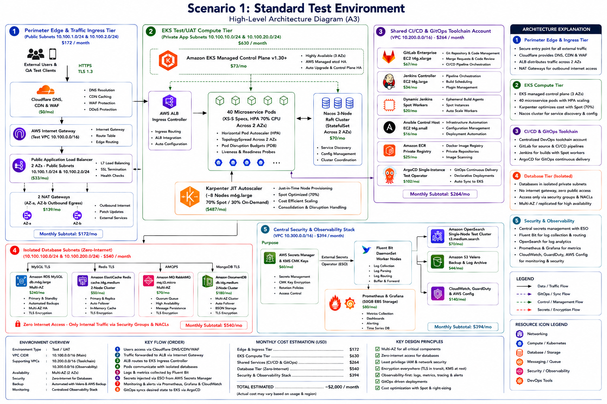
*Hình 9.1: Sơ đồ Kiến trúc Kịch bản 1 — Môi trường Test Tiêu chuẩn ($1,600 – $2,400 / tháng).*

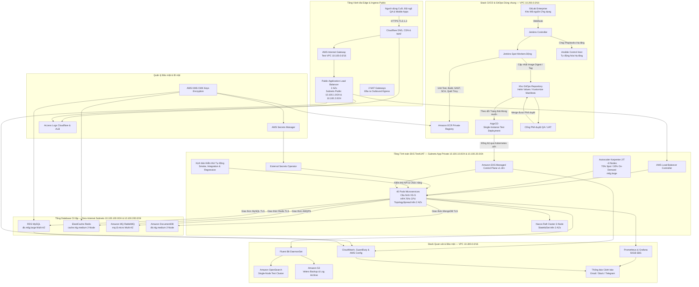

| Danh mục Thành phần AWS | Quy cách Hạng Resource / Instance | Số lượng / Phân bổ | Quy cách Đơn giá | Tổng Chi phí Hàng tháng |
| :--- | :--- | :--- | :--- | :--- |
| **EKS Control Plane** | Amazon EKS Cluster (`v1.30+`) | 1 Cluster | $0.10 / giờ | $73 / tháng |
| **Nodes Tính toán Worker** | EC2 Spot (70%) & On-Demand (30%) (`m6g.large`) | ~8 Instance Nodes (Động) | ~$0.023 / giờ (Spot Mix) | $450 / tháng |
| **Cơ sở Dữ liệu Quan hệ** | Amazon RDS MySQL (`db.m6g.large` Multi-AZ) | 2 Instances (Primary + Standby)| $0.24 / giờ | $240 / tháng |
| **In-Memory Cache** | Amazon ElastiCache Redis (`cache.t4g.medium`) | 2 Nodes (2 AZs) | $0.034 / giờ | $50 / tháng |
| **Message Queue** | Amazon MQ RabbitMQ (`mq.t3.micro` Multi-AZ) | 2 Broker Nodes | $0.03 / giờ | $45 / tháng |
| **Document Store** | Amazon DocumentDB (`db.t4g.medium` 2-Node) | 2 Replica Nodes | $0.078 / giờ | $110 / tháng |
| **Stack Công cụ CI/CD** | GitLab Host ($60) + Jenkins Master/Workers ($70) + Ansible ($30) + ECR ($20) | 3 Instance EC2 + ECR Storage | EC2 Độc lập + ECR | **$180 / tháng** |
| **Quan sát & Bảo mật** | OpenSearch (`search.m6g.large` $120) + Prom PVC ($16) + CloudWatch ($35) + GuardDuty ($30) | OpenSearch + EBS + CloudWatch | Quan sát Managed | **$201 / tháng** |
| **Mạng & Data Egress** | NAT Gateways (2 AZs) + Lưu lượng Inter-AZ | 2 NAT Gateways | $0.045/giờ x 2 | $99 / tháng |
| **Lưu trữ & Sao lưu** | EBS `gp3` (500GB) + S3 Velero Backups | 500 GB Storage + S3 | $0.08 / GB | $120 / tháng |
| **Tổng Chi tiêu Ước tính** | **Test Tiêu chuẩn Cơ sở** | — | — | **~$1,600 – $2,400 / tháng** |

---

### 9.2 Kịch bản 2: Môi trường Production Cơ sở — KHUYẾN NGHỊ PROD (`~$4,200 – $6,100 / tháng`)
* **Mục tiêu**: Môi trường Production Doanh nghiệp 3-AZ với Compute Savings Plans, CI/CD Enterprise & Bộ Quan sát Toàn diện.

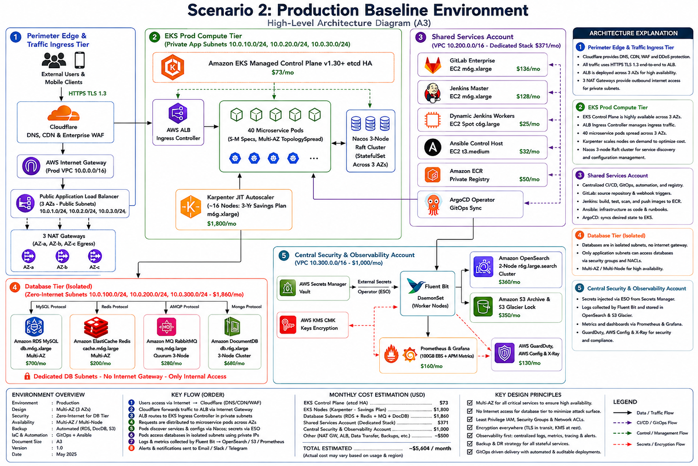
*Hình 9.2: Sơ đồ Kiến trúc Kịch bản 2 — Môi trường Production Cơ sở ($4,200 – $6,100 / tháng).*

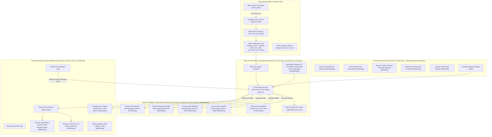

| Danh mục Thành phần AWS | Quy cách Hạng Resource / Instance | Số lượng / Phân bổ | Quy cách Đơn giá | Tổng Chi phí Hàng tháng |
| :--- | :--- | :--- | :--- | :--- |
| **EKS Control Plane** | Amazon EKS Cluster (`v1.30+`) | 1 Cluster | $0.10 / giờ | $73 / tháng |
| **Nodes Tính toán Worker** | EC2 Karpenter JIT (Savings Plan 3 năm `m6g.xlarge`)| ~16 Instance Nodes | ~$0.084 / giờ (3-Yr SP) | $1,800 / tháng |
| **Cơ sở Dữ liệu Quan hệ** | Amazon RDS MySQL (`db.m6g.xlarge` Multi-AZ) | 2 Instances (Primary + Standby)| $0.48 / giờ | $700 / tháng |
| **In-Memory Cache** | Amazon ElastiCache Redis (`cache.m6g.large` Multi-AZ)| 2 Nodes (Multi-AZ Group) | $0.136 / giờ | $200 / tháng |
| **Message Queue** | Amazon MQ RabbitMQ (`mq.m6g.large` Quorum) | 3 Broker Nodes | $0.26 / giờ | $280 / tháng |
| **Document Store** | Amazon DocumentDB (`db.r6g.xlarge` Cluster 3-Node) | 3 Nodes (3 AZs) | $0.46 / giờ | $680 / tháng |
| **Stack Công cụ CI/CD** | GitLab Enterprise (`m6g.xlarge` $136) + Jenkins Master (`m6g.xlarge` $128) + Spot Workers ($25) + Ansible ($32) + ECR ($50) | 4 Máy chủ EC2 + ECR Registry | Dịch vụ Dùng chung | **$371 / tháng** |
| **Quan sát & Bảo mật** | OpenSearch (`2-node r6g.large` $360) + Prom PVC ($40) + CloudWatch ($120) + X-Ray ($40) + GuardDuty/Config ($90) | 2 Nodes OpenSearch + APM | Observability Full Stack | **$650 / tháng** |
| **Mạng & Data Egress** | NAT Gateways (3 AZs) + VPC Data Transfer | 3 NAT Gateways | $0.045/giờ x 3 | $99 / tháng |
| **Lưu trữ & Sao lưu** | EBS `gp3` (1.5TB) + RDS Snapshots + Velero S3 | 1.5 TB Storage + AWS Backup | $0.08 / GB | $350 / tháng |
| **Tổng Chi tiêu Ước tính** | **Production Baseline Chuẩn** | — | — | **~$4,200 – $6,100 / tháng** |

---

### 9.3 Kịch bản 3: Production Sẵn sàng Cao Nâng cao (`~$7,200 – $10,500 / tháng`)
* **Mục tiêu**: Môi trường Production 3-AZ Tải cao / Thông lượng lớn với Amazon Aurora, Cluster CI/CD HA & Bộ Kiểm toán Bảo mật Cao cấp.

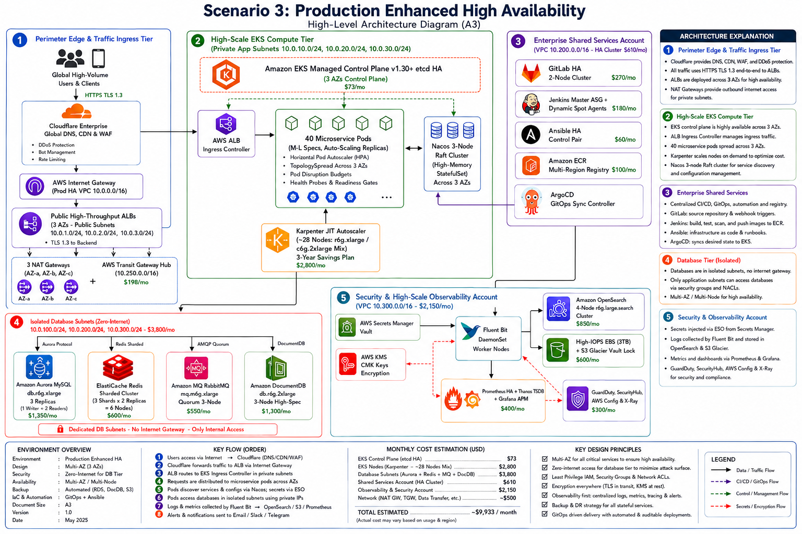
*Hình 9.3: Sơ đồ Kiến trúc Kịch bản 3 — Production Sẵn sàng Cao Nâng cao ($7,200 – $10,500 / tháng).*

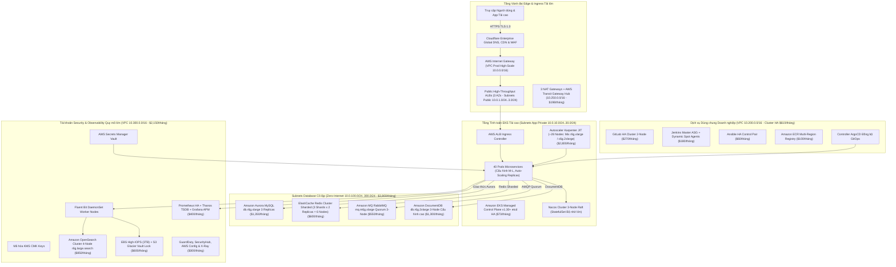

| Danh mục Thành phần AWS | Quy cách Hạng Resource / Instance | Số lượng / Phân bổ | Quy cách Đơn giá | Tổng Chi phí Hàng tháng |
| :--- | :--- | :--- | :--- | :--- |
| **EKS Control Plane** | Amazon EKS Cluster (`v1.30+`) | 1 Cluster | $0.10 / giờ | $73 / tháng |
| **Nodes Tính toán Worker** | EC2 Karpenter JIT (`r6g.xlarge` / `c6g.2xlarge`) | ~28 Instance Nodes | Savings Plan + On-Demand | $2,800 / tháng |
| **Cơ sở Dữ liệu Quan hệ** | Amazon Aurora MySQL Multi-AZ (`db.r6g.xlarge`) | 3 Replicas (Tự động mở rộng) | $0.52 / giờ | $1,350 / tháng |
| **In-Memory Cache** | Cluster Amazon ElastiCache Redis (Sharded Multi-Node)| 6 Nodes (3 Shards x 2 Replicas)| $0.136 / giờ x 6 | $600 / tháng |
| **Message Queue** | Amazon MQ RabbitMQ (`mq.m6g.xlarge` Quorum Broker)| 3 Nodes Bộ nhớ lớn | $0.52 / giờ | $550 / tháng |
| **Document Store** | Amazon DocumentDB (`db.r6g.2xlarge` 3-Node) | 3 Nodes Cấu hình cao | $0.92 / giờ | $1,300 / tháng |
| **Stack Công cụ CI/CD** | GitLab HA Cluster ($270) + Jenkins Master ASG ($180) + Ansible HA ($60) + ECR Multi-Region ($100) | Cluster CI/CD Enterprise | Stack HA Đa Instance | **$610 / tháng** |
| **Quan sát & Bảo mật** | OpenSearch (`4-node r6g.large` $850) + Prom HA/Thanos ($120) + CloudWatch ($280) + X-Ray ($120) + SecurityHub/GuardDuty ($180) | 4 Nodes OpenSearch + APM | Observability Quy mô lớn | **$1,550 / tháng** |
| **Mạng & Data Egress** | Multi-VPC Transit Gateway + NAT Gateways (3 AZs) | Transit Gateway + 3 NATs | Mạng AWS Transit | $198 / tháng |
| **Lưu trữ & Sao lưu** | High-IOPS EBS `gp3` (3TB) + AWS Backup Vault Lock | 3 TB Lưu trữ IOPS cao | $0.12 / GB + IOPS | $600 / tháng |
| **Tổng Chi tiêu Ước tính** | **Production Thông lượng Cao Nâng cao**| — | — | **~$7,200 – $10,500 / tháng** |

---

### 9.4 Kịch bản 4: Production có Khôi phục Thảm họa Xuyên Vùng (`~$10,000 – $14,800 / tháng`)
* **Mục tiêu**: Vùng Chính Production + Vùng Thứ hai Pilot Light Disaster Recovery (RTO < 4h, RPO < 15m).

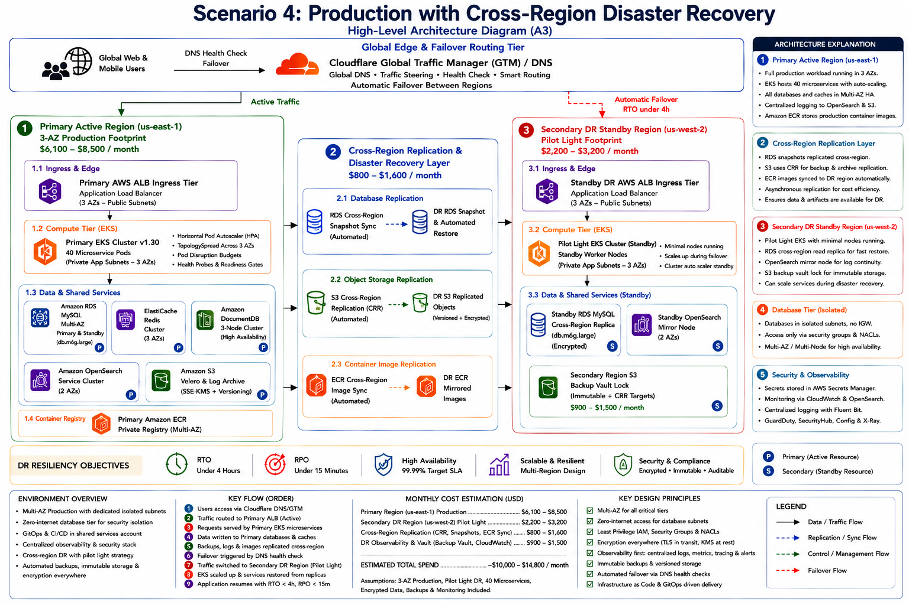
*Hình 9.4: Sơ đồ Kiến trúc Kịch bản 4 — Production Khôi phục Thảm họa Xuyên Vùng ($10,000 – $14,800 / tháng).*

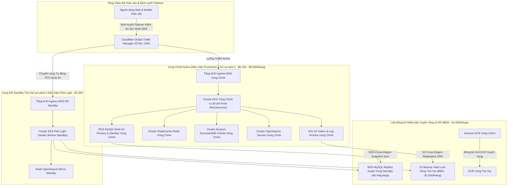

| Miền Vùng AWS | Phân rã Resource & Thành phần | Mô hình Lưu trữ / SLA | Tổng Chi phí Hàng tháng |
| :--- | :--- | :--- | :--- |
| **Vùng Chính (`us-east-1`)**| Hạ tầng Production Baseline Kịch bản 2 / Kịch bản 3 (Compute + DB + CI/CD + Observability) | Production Active 3-AZ | $6,100 – $8,500 / tháng |
| **Vùng DR Thứ hai (`us-west-2`)**| Control Plane EKS Standby + Replica RDS Standby (`db.m6g.large`) + Mirror OpenSearch Standby | Pilot Light DR Standby | $2,200 – $3,200 / tháng |
| **Nhân bản Xuyên Vùng** | S3 Cross-Region Replication (CRR) + Snapshot RDS Cross-Region + ECR Image Sync | Đồng bộ Bất đồng bộ Liên tục | $800 – $1,600 / tháng |
| **DR Observability & Vault** | AWS Backup Vault Vùng Thứ hai + Sao lưu Bằng chứng S3 + Secondary CloudWatch | Sao lưu Bất biến Xuyên Vùng | $900 – $1,500 / tháng |
| **Tổng Chi tiêu Ước tính** | **Dấu chân Khôi phục Thảm họa Đa Vùng** | **RTO < 4h \| RPO < 15m** | **~$10,000 – $14,800 / tháng** |

---

### 9.5 Kịch bản 5: Kiến trúc Đa Tài khoản Cô lập Doanh nghiệp (`~$12,000 – $18,500 / tháng`)
* **Mục tiêu**: Mô hình Cô lập Đa Tài khoản AWS Landing Zone (5 Accounts) với Tầng Ingress Reverse Proxy Kép (Entry A / Entry B), AWS Transit Gateway, Production Core, Shared Services và Môi trường Dev/Test Cô lập Tuyệt đối.

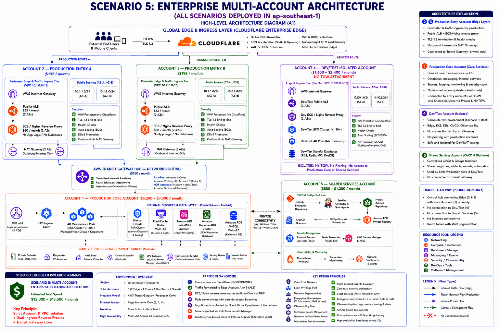
*Hình 9.5: Sơ đồ Kiến trúc Kịch bản 5 — Kiến trúc Đa Tài khoản Cô lập Doanh nghiệp ($12,000 – $18,500 / tháng).*

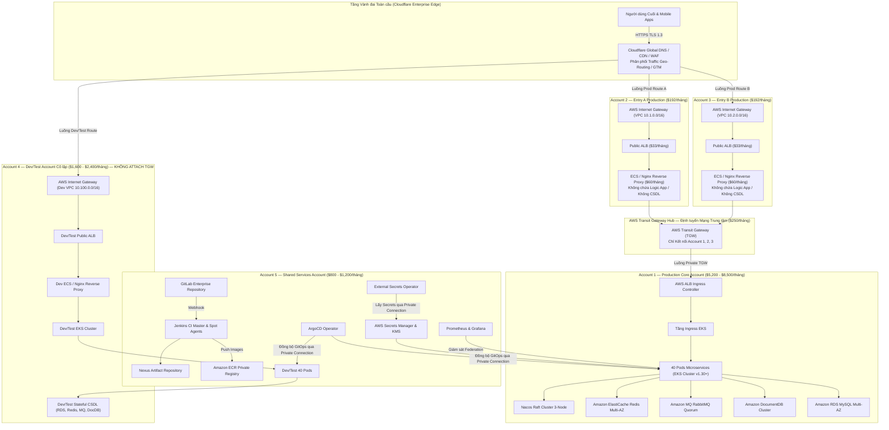

| Tài khoản AWS (Account ID / Scope) | Phạm vi Hạ tầng & Dịch vụ Vận hành | Mô hình Cô lập & Kết nối | Tổng Chi phí Hàng tháng |
| :--- | :--- | :--- | :--- |
| **Account 1: Production Core Account** | Core EKS Cluster, 40 Microservices, Managed CSDL (RDS, Redis, MQ, DocumentDB, Nacos) | Không Internet Ingress; Chỉ kết nối qua TGW & Shared Services | $5,200 – $8,500 / tháng |
| **Account 2: Production Entry A Account** | Internet Gateway, Public ALB, ECS / Nginx Reverse Proxy | Chỉ nhận Ingress từ Cloudflare; Forward qua Transit Gateway | $192 / tháng |
| **Account 3: Production Entry B Account** | Internet Gateway, Public ALB, ECS / Nginx Reverse Proxy (Active-Active / Active-Standby) | Chỉ nhận Ingress từ Cloudflare; Forward qua Transit Gateway | $192 / tháng |
| **AWS Transit Gateway Hub** | Central Network Routing Attachment cho Account 1, 2, 3 | Cấm Attach Account 4 (Dev/Test) & Account 5 (Shared Services) | $250 / tháng |
| **Account 4: Dev/Test Account Cô lập** | Stack Độc lập Tiêu chuẩn Kịch bản 1 (EKS Dev, Local DBs, Dev Proxy) | **Cô lập 100%**: KHÔNG TGW, KHÔNG Peering, KHÔNG kết nối Prod | $1,600 – $2,400 / tháng |
| **Account 5: Shared Services Account** | Centralized GitLab, Jenkins, Nexus, ECR Registry, ArgoCD, Secrets Manager, Observability | Chỉ kết nối Private Traffic tới Account 1 & Account 4; KHÔNG Internet Ingress | $800 – $1,200 / tháng |
| **Tổng Chi tiêu Ước tính** | **Kiến trúc Đa Tài khoản Cô lập Doanh nghiệp** | **Cô lập Tuyệt đối Multi-Account Landing Zone** | **~$12,000 – $18,500 / tháng** |

#### 9.5.1 Chi tiết 12 Luồng Kết nối & Quy tắc Ranh giới Bảo mật (Connectivity & Security Boundaries):

1. **Vành đai Ingress Edge (Cloudflare Enterprise Edge)**: `Internet` $\rightarrow$ `HTTPS TLS 1.3` $\rightarrow$ `Cloudflare DNS / CDN / WAF`. Cloudflare phân phối lưu lượng qua Geo-Routing / GTM Load Balancing đến Account 2 (Prod Entry A), Account 3 (Prod Entry B) hoặc Account 4 (Dev/Test Entry). Tuyệt đối không có kết nối trực tiếp từ Internet vào Production Core Account 1.
2. **Tầng Ingress Production Entry A (Account 2)**: `Cloudflare` $\rightarrow$ `Internet Gateway` $\rightarrow$ `Public ALB` $\rightarrow$ `ECS / Nginx Reverse Proxy` $\rightarrow$ `Transit Gateway Attachment`. Reverse Proxy chỉ thực hiện giải mã TLS, kiểm tra Header và forward request. Không chứa mã nguồn ứng dụng và không truy cập CSDL.
3. **Tầng Ingress Production Entry B (Account 3)**: `Cloudflare` $\rightarrow$ `Internet Gateway` $\rightarrow$ `Public ALB` $\rightarrow$ `ECS / Nginx Reverse Proxy` $\rightarrow$ `Transit Gateway Attachment`. Đóng vai trò Active-Active hoặc Active-Standby dự phòng sự cố cho Entry A. Không chứa mã nguồn ứng dụng và không truy cập CSDL.
4. **Trục Định tuyến Mạng Trung tâm AWS Transit Gateway**: Transit Gateway chỉ kết nối: **Account 2 (Entry A)** $\leftrightarrow$ **Account 1 (Prod Core)** $\leftrightarrow$ **Account 3 (Entry B)**. KHÔNG attach Account 4 (Dev/Test) và KHÔNG attach Account 5 (Shared Services) để bảo đảm cô lập an ninh mạng tuyệt đối.
5. **Luồng Truyền Tải Nội bộ Production Core (Account 1)**: `AWS Transit Gateway` $\rightarrow$ `AWS Load Balancer Controller` $\rightarrow$ `EKS Ingress` $\rightarrow$ `40 Microservice Pods` $\rightarrow$ `Nacos Service Discovery` $\rightarrow$ `Stateful Databases` (`RDS MySQL`, `ElastiCache Redis`, `RabbitMQ`, `DocumentDB`).
6. **Kết nối Nội bộ Production Core $\rightarrow$ Shared Services**: Production Core (Account 1) kết nối tới Shared Services (Account 5) qua kết nối riêng tư (AWS PrivateLink / Private VPC Connection): ArgoCD (GitOps Sync), Jenkins (Push ECR), GitLab (Webhook), Nexus (Dependencies), External Secrets Operator (ESO Secrets), Prometheus Federation (Metrics).
7. **Nguyên tắc Bảo mật Shared Services Account (Account 5)**: **Zero Internet Ingress**. Account 5 KHÔNG nhận bất kỳ lưu lượng nào trực tiếp từ Internet. Chỉ nhận Private Traffic qua đường truyền nội bộ từ Đội ngũ Phát triển và các Agent CI/CD.
8. **Luồng Môi trường Dev/Test Độc lập (Account 4)**: `Cloudflare` $\rightarrow$ `Internet Gateway` $\rightarrow$ `Public ALB` $\rightarrow$ `ECS / Nginx Reverse Proxy` $\rightarrow$ `Dev EKS Cluster` $\rightarrow$ `Dev Pods` $\rightarrow$ `Dev CSDL`. Đây là một bộ hạ tầng độc lập hoàn chỉnh tương đương Kịch bản 1.
9. **Ma trận Cô lập Tuyệt đối Môi trường Dev/Test**: Account 4 Dev/Test: KHÔNG kết nối Transit Gateway, KHÔNG kết nối Production Core, KHÔNG truy cập Production Database, KHÔNG Peering VPC Production.
10. **Quy trình Triển khai Phần mềm (Shared Services Deployment Flow)**: `Developer` $\rightarrow$ `GitLab Commit` $\rightarrow$ `Jenkins Webhook` $\rightarrow$ `Build & Test` $\rightarrow$ `Nexus Dependencies` $\rightarrow$ `Push ECR Image` $\rightarrow$ `ArgoCD Sync` $\rightarrow$ `Deploy EKS Prod (Account 1)` hoặc `Deploy EKS Dev (Account 4)`.
11. **Luồng Bảo mật & Quan sát (Security & Observability Flow)**: Logs (`Pods` $\rightarrow$ `Fluent Bit` $\rightarrow$ `OpenSearch` $\rightarrow$ `Grafana`), Metrics (`Pods` $\rightarrow$ `Prometheus` $\rightarrow$ `Grafana`), Secrets (`AWS Secrets Manager` $\rightarrow$ `ESO` $\rightarrow$ `Pods`).
12. **Luồng Lưu lượng Tổng thể (Traffic Flow Summary)**:
    - **Luồng Production**: `Users` $\rightarrow$ `Cloudflare` $\rightarrow$ `Entry A / Entry B` $\rightarrow$ `AWS Transit Gateway` $\rightarrow$ `Production Core` $\rightarrow$ `Databases` $\leftarrow$ `Shared Services`.
    - **Luồng Dev/Test**: `Users` $\rightarrow$ `Cloudflare` $\rightarrow$ `Dev/Test Entry` $\rightarrow$ `Dev/Test Core` (Cô lập 100%).

---

## 10. Mô hình Vận hành & Quyền Sở hữu Dịch vụ

Quản trị vận hành ([`OPERATING-MODEL.md`](06-operations/OPERATING-MODEL.md)) thiết lập ma trận RACI hợp nhất quyền sở hữu về **Đội Cloud Platform SRE & DevSecOps**:

| Miền Vận hành & Phạm vi Kỹ thuật | Đội Cloud Platform SRE & DevSecOps | Đội Quản trị Cơ sở Dữ liệu (DBA) | Đội Lập trình Ứng dụng (App Dev) | Đội Vận hành Doanh nghiệp (Ops) |
| :--- | :--- | :--- | :--- | :--- |
| **AWS Landing Zone & Subnets VPC** | **Accountable / Responsible** | Informed | Informed | Informed |
| **Control Plane EKS & Nodes Worker** | **Accountable / Responsible** | Informed | Informed | Informed |
| **Pipelines CI/CD & ArgoCD GitOps** | **Accountable / Responsible** | Informed | Consulted | Informed |
| **Tầng Database & Stateful (RDS/Redis/DocumentDB/RabbitMQ)**| Consulted | **Accountable / Responsible** | Consulted | Informed |
| **Mã nguồn Ứng dụng & Spec Pod Microservice** | Consulted | Informed | **Accountable / Responsible** | Informed |
| **Phân hệ Observability, Logging & Quét Bảo mật** | **Accountable / Responsible** | Informed | Informed | Informed |
| **Ứng cứu Sự cố 24/7 & Quy trình Thang cấp** | **Accountable / Responsible** | Consulted | Consulted | **Responsible** |

---

## 11. Quản lý Rủi ro & Các Vấn đề Chặn Production

Trước khi CAB phê duyệt (`CỔNG-07`) cấp phát `DataBlue-Prod-Account`, **5 Vấn đề Chặn Production Nghiêm trọng** sau đây bắt buộc phải được giải quyết trong Giai đoạn 0 & Giai đoạn 1:

1. **`RSK-UNC-001`**: Yêu cầu và xác minh hồ sơ định kích thước CPU và Bộ nhớ microservice từ các đội ứng dụng.
2. **`RSK-DAT-001`**: Hoàn thành kiểm toán tương thích truy vấn wire-protocol MongoDB so với Amazon DocumentDB.
3. **`RSK-UNC-003`**: Nhận ký duyệt chính thức các chỉ số SLA RTO (< 4h) và RPO (< 15m) mục tiêu từ Chủ sở hữu Sản phẩm Nghiệp vụ.
4. **`RSK-SEC-003`**: Kiểm toán và xác minh ranh giới đa tài khoản Landing Zone với zero VPC peering xuyên tài khoản.
5. **`RSK-SCL-001`**: Hoàn thành benchmark kiểm thử tải Thử nghiệm Kỹ thuật được chấp nhận tại `CỔNG-06`.

---

## 12. Kết luận & Đề xuất Bước tiếp theo

Bản đề xuất **DataBlue Next-Gen Infrastructure Platform** cung cấp một kiến trúc có khả năng truy xuất hoàn toàn, vững chắc, và mô-đun hóa được thiết kế cho sự sẵn sàng cao, bảo mật, và khả năng dự báo tài chính.

Chúng tôi đề xuất phê duyệt **Gói ADR Stage 3** và cấp phép thực thi **Thu thập Bằng chứng Giai đoạn 0** để giải quyết các tham số đo đạc tải chưa chốt và khai thông xây dựng AWS Landing Zone Giai đoạn 1.
