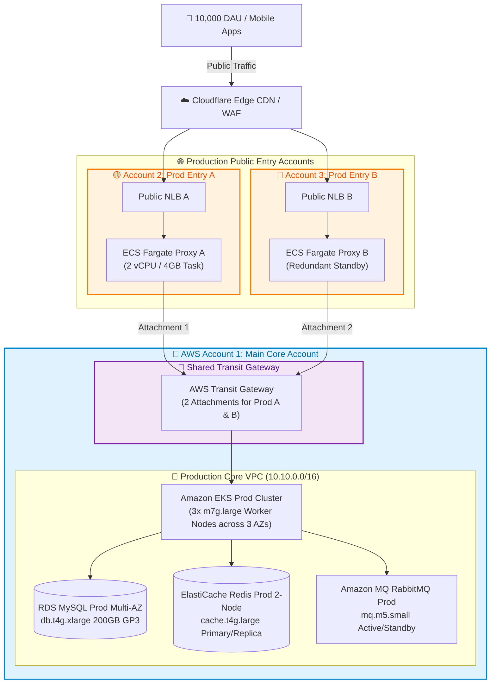
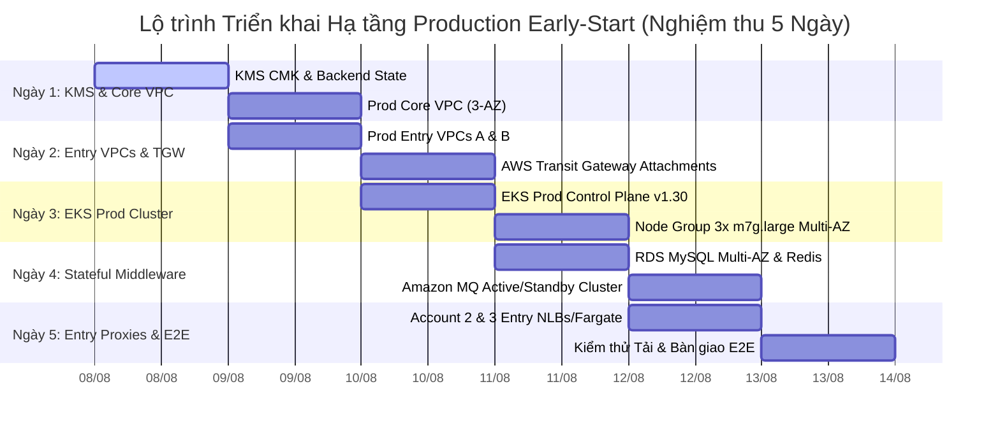

# 📋 TỔNG HỢP CẤU HÌNH CHI TIẾT TERRAFORM IAC — MÔI TRƯỜNG PRODUCTION EARLY-START
## (CONSOLIDATED TERRAFORM CONFIGURATION SPECS FOR PROD EARLY-START ENVIRONMENT)

---

## 🎨 1. SƠ ĐỒ ARCHITECTURE MÔI TRƯỜNG PROD EARLY-START (MERMAID DIAGRAM)

---

## 📊 2. BẢNG TỔNG HỢP CẤU HÌNH CHI TIẾT TÀI NGUYÊN PROD EARLY-START (RESOURCE MATRIX)

| Hạng mục Dịch vụ | Thành phần Hạ tầng | Cấu hình Chi tiết / Identifier | Số lượng | vCPU / RAM | Chi phí Hàng tháng | Ghi chú Tối ưu & Thiết lập Kỹ thuật |
| :--- | :--- | :--- | :---: | :---: | :---: | :--- |
| **Networking** | **Prod Core VPC** | `10.10.0.0/16` (Account 1) | 1 VPC | - | $114.94 | 3-AZ (`ap-southeast-1a/b/c`), NAT Gateways, Subnets |
| **Networking** | **Prod Entry VPC A** | `10.20.0.0/16` (Account 2) | 1 VPC | - | $80.00 | Public NLB A + ECS Fargate Proxy A Task |
| **Networking** | **Prod Entry VPC B** | `10.30.0.0/16` (Account 3) | 1 VPC | - | $80.00 | Public NLB B + ECS Fargate Proxy B Standby |
| **Networking** | **Transit Gateway** | AWS TGW (Account 1 Shared) | 2 Attachments | - | $173.00 | Nối Prod Entry A & B sang Production Core VPC |
| **Security** | **AWS KMS Key** | Customer Managed Key (CMK) | 1 Key | - | $3.00 | Mã hóa tĩnh At-Rest cho RDS, EKS, Redis, MQ & S3 |
| **Compute** | **Amazon EKS Cluster** | `DataBlue-Prod-EKS` | 1 Cluster | AWS Managed | $73.00 | Kubernetes v1.30 Control Plane Standard Support |
| **Compute** | **EKS Worker Node Group** | `m7g.large` (Graviton3 ARM64) | 3 Nodes | 6 vCPU / 24 GiB | $379.50 | 3 Nodes trải dài 3 AZs (đáp ứng 3k WebSockets) |
| **Database** | **Amazon RDS MySQL** | `datablue-prod-mysql` | Multi-AZ | 4 vCPU / 16 GiB | $360.00 | `db.t4g.xlarge` Multi-AZ + 200GB đĩa GP3 ($29.00) |
| **Cache** | **ElastiCache Redis** | `datablue-prod-redis` | 2 Nodes | 4 vCPU / 12.7 GiB | $240.00 | `cache.t4g.large` Primary/Replica (TTL 1 giờ) |
| **Messaging** | **Amazon MQ RabbitMQ** | `datablue-prod-rabbitmq` | 2 Brokers | 4 vCPU / 4 GiB | $190.00 | `mq.m5.small` Active/Standby Event Buffer |
| **Storage & Logs** | **S3 & CloudWatch** | S3 Auto-Delete + CloudWatch | Shared | - | $479.30 | S3 1-Hour Media Auto-Delete + 50GB Logs |
| **TỔNG CỘNG** | **PROD EARLY-START** | **Production Core & 2 Entry Accounts** | **15 Tài nguyên** | **18 vCPU / 56 GiB** | 💰 **$2,096.49/tháng** | **Cấu hình tối ưu chi phí cho môi trường Production Early-Start** |

---

## 🏛️ 3. ĐẶC TẢ CHI TIẾT CÁC TERRAFORM MODULES THIẾT KẾ (MODULE SPECIFICATIONS)

### 1. Module Mạng VPC
- **Mục tiêu:** Khởi tạo mạng Production 3-AZ (`ap-southeast-1a/b/c`) phân cấp 3 lớp chuẩn bảo mật.
- **Thành phần:**
  - `aws_vpc`: Khởi tạo Production Core VPC (`10.10.0.0/16`), Entry VPC A (`10.20.0.0/16`), Entry VPC B (`10.30.0.0/16`).
  - `aws_ec2_transit_gateway`: Khởi tạo Transit Gateway tại Account 1 và 2 VPC Attachments sang Account 2 & Account 3.
  - **Auto-Discovery Tags:** Đánh nhãn `kubernetes.io/role/elb = 1` và `karpenter.sh/discovery = DataBlue-Prod-EKS`.

### 2. Module Kubernetes EKS
- **Mục tiêu:** Cụm Kubernetes Production chịu tải 10,000 DAU & 3,000 WebSocket connections.
- **Thành phần:**
  - `aws_eks_cluster`: Control Plane v1.30 tích hợp KMS mã hóa đĩa và CloudWatch Audit Logs.
  - `aws_eks_node_group`: 3x node Graviton3 `m7g.large` (6 vCPU / 24GB RAM) trải rộng 3 AZs.

### 3. Module Database RDS MySQL
- **Mục tiêu:** Cơ sở dữ liệu quan hệ Production tính khả dụng cao Multi-AZ.
- **Thành phần:**
  - `aws_db_instance`: Cấu hình `db.t4g.xlarge` Multi-AZ (4 vCPU / 16GB RAM), lưu trữ đĩa GP3 200GB (tự động dọn dẹp theo chính sách 1 giờ).

### 4. Module Cache ElastiCache Redis
- **Mục tiêu:** Cụm Redis Primary/Replica lưu trữ Session và WebSocket State.
- **Thành phần:**
  - `aws_elasticache_replication_group`: `cache.t4g.large` 2-Node Cluster hỗ trợ mã hóa TLS/KMS và TTL 1 giờ.

### 5. Module Message Broker Amazon MQ
- **Mục tiêu:** Hàng đợi tin nhắn RabbitMQ đảm bảo không mất dữ liệu sự kiện.
- **Thành phần:**
  - `aws_mq_broker`: Chạy `mq.m5.small` chế độ `CLUSTER_MULTI_AZ` (Active/Standby).

### 6. Module Bảo mật AWS KMS CMK
- **Mục tiêu:** Quản lý khóa mã hóa tĩnh dùng riêng cho toàn bộ môi trường Production.

---

## 🚀 4. KẾ HOẠCH VÀ LỘ TRÌNH TRIỂN KHAI NGHỆM THU (5 NGÀY)

### Các Bước Thực Hiện Chi Tiết Theo Ngày (5-Day Execution Plan):

#### 📅 NGÀY 1: KHỞI TẠO BACKEND, KHÓA BẢO MẬT & PROD CORE VPC
- **Sáng (08:00 – 12:00):** Khởi tạo S3 Backend `datablue-prod-tfstate-ap-southeast-1` và Bảng DynamoDB Locks; triển khai Module `kms` tạo Customer Managed Key (CMK).
- **Chiều (13:00 – 18:00):** Triển khai Prod Core VPC (`10.10.0.0/16`) trên 3 Availability Zones (`ap-southeast-1a/b/c`) cùng các subnets phân tầng.

#### 📅 NGÀY 2: MẠNG ENTRY ACCOUNT A/B & TRANSIT GATEWAY HUB
- **Sáng (08:00 – 12:00):** Khởi tạo Entry VPC A (`10.20.0.0/16` - Account 2) và Entry VPC B (`10.30.0.0/16` - Account 3).
- **Chiều (13:00 – 18:00):** Khởi tạo AWS Transit Gateway tại Account 1, tạo 2 Attachments nối sang Account 2 & Account 3, cấu hình routing tables xuyên VPC.

#### 📅 NGÀY 3: CỤM KUBERNETES EKS PROD MULTI-AZ & POD IDENTITIES
- **Sáng (08:00 – 12:00):** Khởi tạo EKS Control Plane v1.30 tích hợp mã hóa đĩa KMS CMK và CloudWatch Audit Logs.
- **Chiều (13:00 – 18:00):** Cấp phát Managed Node Group 3x `m7g.large` (Graviton3 ARM64) trải đều 3 AZs; cấu hình IAM Roles for Service Accounts (IRSA).

#### 📅 NGÀY 4: TẦNG DỊCH VỤ MIDDLEWARE STATEFUL PRODUCTION
- **Sáng (08:00 – 12:00):** Triển khai RDS MySQL `db.t4g.xlarge` Multi-AZ + 200GB GP3 có mã hóa KMS và sao lưu PITR.
- **Chiều (13:00 – 18:00):** Triển khai ElastiCache Redis `cache.t4g.large` 2-Node Cluster & Amazon MQ RabbitMQ `mq.m5.small` Active/Standby.

#### 📅 NGÀY 5: PUBLIC ENTRY CONTROLLERS, KIỂM THỬ TẢI & NGHIỆM THU E2E
- **Sáng (08:00 – 12:00):** Triển khai Public NLB & ECS Fargate Proxy Tasks tại Account 2 & Account 3; liên kết Cloudflare Edge WAF/CDN.
- **Chiều (13:00 – 18:00):** Thực thi bộ kiểm thử tải 3,000 WebSocket connections, giả lập failover AZ & kiểm thử khôi phục sao lưu; hoàn tất nghiệm thu bàn giao Production.

