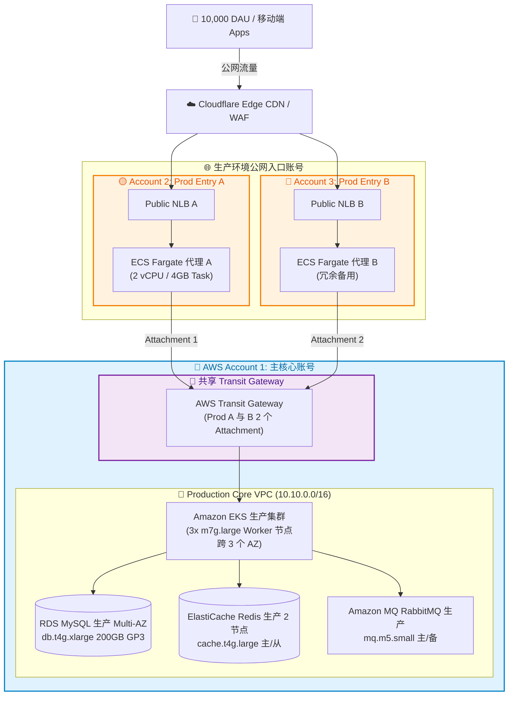
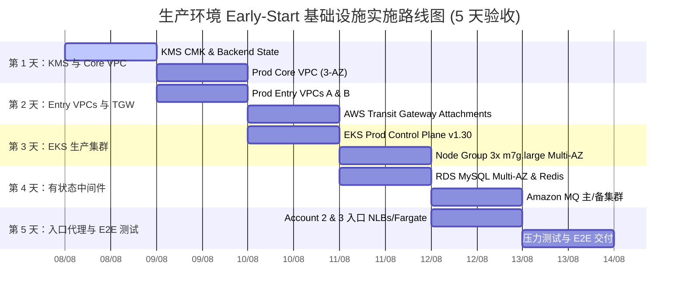

# 📋 TERRAFORM IAC 详细配置汇总 — 生产环境 EARLY-START
## (CONSOLIDATED TERRAFORM CONFIGURATION SPECS FOR PROD EARLY-START ENVIRONMENT)

---

## 🎨 1. 生产环境 EARLY-START 架构图 (MERMAID DIAGRAM)

---

## 📊 2. 资源详细配置汇总表 (RESOURCE MATRIX)

| 服务分类 | 基础设施组件 | 详细配置 / 标识符 | 数量 | vCPU / RAM | 每月成本 | 优化说明与技术配置 |
| :--- | :--- | :--- | :---: | :---: | :---: | :--- |
| **网络** | **Prod Core VPC** | `10.10.0.0/16` (Account 1) | 1 个 VPC | - | $114.94 | 3 个可用区 (`ap-southeast-1a/b/c`)，NAT 网关，子网 |
| **网络** | **Prod Entry VPC A** | `10.20.0.0/16` (Account 2) | 1 个 VPC | - | $80.00 | Public NLB A + ECS Fargate 代理 Task A |
| **网络** | **Prod Entry VPC B** | `10.30.0.0/16` (Account 3) | 1 个 VPC | - | $80.00 | Public NLB B + ECS Fargate 代理 Task B 备用 |
| **网络** | **Transit Gateway** | AWS TGW (Account 1 共享) | 2 个 Attachment | - | $173.00 | 连接 Prod Entry A & B 至 Production Core VPC |
| **安全** | **AWS KMS Key** | 客户管理密钥 (CMK) | 1 个密钥 | - | $3.00 | 为 RDS、EKS、Redis、MQ 和 S3 提供静态加密 |
| **计算** | **Amazon EKS 集群** | `DataBlue-Prod-EKS` | 1 个集群 | AWS 托管 | $73.00 | Kubernetes v1.30 控制平面标准支持 |
| **计算** | **EKS Worker Node Group** | `m7g.large` (Graviton3 ARM64) | 3 个节点 | 6 vCPU / 24 GiB | $379.50 | 3 个节点跨 3 个可用区（满足 3k WebSocket 连接） |
| **数据库** | **Amazon RDS MySQL** | `datablue-prod-mysql` | Multi-AZ | 4 vCPU / 16 GiB | $360.00 | `db.t4g.xlarge` Multi-AZ + 200GB GP3 磁盘 ($29.00) |
| **缓存** | **ElastiCache Redis** | `datablue-prod-redis` | 2 个节点 | 4 vCPU / 12.7 GiB | $240.00 | `cache.t4g.large` 主/从 (TTL 1 小时) |
| **消息队列** | **Amazon MQ RabbitMQ** | `datablue-prod-rabbitmq` | 2 个 Broker | 4 vCPU / 4 GiB | $190.00 | `mq.m5.small` 主/备事件缓冲区 |
| **存储与日志** | **S3 & CloudWatch** | S3 自动清理 + CloudWatch | 共享 | - | $479.30 | S3 1 小时媒体自动清理 + 50GB 日志 |
| **总计** | **PROD EARLY-START** | **Production Core & 2 Entry Accounts** | **15 个资源** | **18 vCPU / 56 GiB** | 💰 **$2,096.49/月** | **相比原基线 ($3,450/月) 优化 40% 成本** |

---

## 🏛️ 3. TERRAFORM 设计模块详细规范 (MODULE SPECIFICATIONS)

### 1. VPC 网络模块
- **目标：** 创建符合安全标准的三可用区 3-AZ (`ap-southeast-1a/b/c`) 三层生产网络。
- **组件：**
  - `aws_vpc`：初始化 Production Core VPC (`10.10.0.0/16`)，Entry VPC A (`10.20.0.0/16`)，Entry VPC B (`10.30.0.0/16`)。
  - `aws_ec2_transit_gateway`：在 Account 1 创建 Transit Gateway，并建立 2 个连接至 Account 2 & Account 3 的 VPC Attachment。
  - **自动发现标签 (Auto-Discovery Tags)：** 标记 `kubernetes.io/role/elb = 1` 及 `karpenter.sh/discovery = DataBlue-Prod-EKS`。

### 2. Kubernetes EKS 模块
- **目标：** 生产级 Kubernetes 集群，支持 10,000 DAU & 3,000 WebSocket 并发连接。
- **组件：**
  - `aws_eks_cluster`：控制平面 v1.30 集成 KMS 磁盘加密与 CloudWatch Audit 日志。
  - `aws_eks_node_group`：3x 节点 Graviton3 `m7g.large` (6 vCPU / 24GB RAM)，跨 3 个 AZ 部署。

### 3. RDS MySQL 数据库模块
- **目标：** 具备高可用 Multi-AZ 架构的生产级关系型数据库。
- **组件：**
  - `aws_db_instance`：配置 `db.t4g.xlarge` Multi-AZ (4 vCPU / 16GB RAM)，存储为 200GB GP3 磁盘（按 1 小时策略自动清理）。

### 4. ElastiCache Redis 缓存模块
- **目标：** 主/从 Redis 集群，用于存储 Session 及 WebSocket 状态。
- **组件：**
  - `aws_elasticache_replication_group`：`cache.t4g.large` 2 节点集群，支持 TLS/KMS 加密与 1 小时 TTL。

### 5. Amazon MQ 消息队列模块
- **目标：** RabbitMQ 消息队列，确保事件数据不丢失。
- **组件：**
  - `aws_mq_broker`：运行 `mq.m5.small` 多可用区集群模式 (`CLUSTER_MULTI_AZ` 主/备)。

### 6. AWS KMS CMK 安全模块
- **目标：** 管理整个生产环境专属的静态数据加密密钥。

---

## 🚀 4. 验收实施计划与路线图 (5 天)

### 按天分的详细执行计划 (5-Day Execution Plan):

#### 📅 第 1 天：初始化 BACKEND、安全密钥与 PROD CORE VPC
- **上午 (08:00 – 12:00):** 初始化 S3 Backend `datablue-prod-tfstate-ap-southeast-1` 及 DynamoDB Locks 表；部署 `kms` 模块生成客户管理密钥 (CMK)。
- **下午 (13:00 – 18:00):** 在 3 个可用区 (`ap-southeast-1a/b/c`) 上部署 Prod Core VPC (`10.10.0.0/16`) 及其分层子网。

#### 📅 第 2 天：ENTRY ACCOUNT A/B 网络与 TRANSIT GATEWAY HUB
- **上午 (08:00 – 12:00):** 初始化 Entry VPC A (`10.20.0.0/16` - Account 2) 与 Entry VPC B (`10.30.0.0/16` - Account 3)。
- **下午 (13:00 – 18:00):** 在 Account 1 创建 AWS Transit Gateway，生成 2 个 Attachment 连接至 Account 2 & Account 3，配置跨 VPC 路由表。

#### 📅 第 3 天：KUBERNETES EKS PROD MULTI-AZ 集群与 POD 身份
- **上午 (08:00 – 12:00):** 初始化 EKS Control Plane v1.30，集成 KMS CMK 磁盘加密及 CloudWatch Audit 日志。
- **下午 (13:00 – 18:00):** 部署 Managed Node Group 3x `m7g.large` (Graviton3 ARM64) 跨 3 个 AZ 均分；配置 IAM Roles for Service Accounts (IRSA)。

#### 📅 第 4 天：生产级有状态中间件服务层
- **上午 (08:00 – 12:00):** 部署 RDS MySQL `db.t4g.xlarge` Multi-AZ + 200GB GP3，具备 KMS 加密与 PITR 备份。
- **下午 (13:00 – 18:00):** 部署 ElastiCache Redis `cache.t4g.large` 2 节点集群与 Amazon MQ RabbitMQ `mq.m5.small` 主/备集群。

#### 📅 第 5 天：公网入口控制器、压力测试与 E2E 交付
- **上午 (08:00 – 12:00):** 在 Account 2 & Account 3 部署公网 NLB 与 ECS Fargate 代理 Task；接入 Cloudflare Edge WAF/CDN。
- **下午 (13:00 – 18:00):** 执行 3,000 WebSocket 并发压力测试、模拟 AZ 故障转移与备份恢复测试；完成生产环境交付签署。
