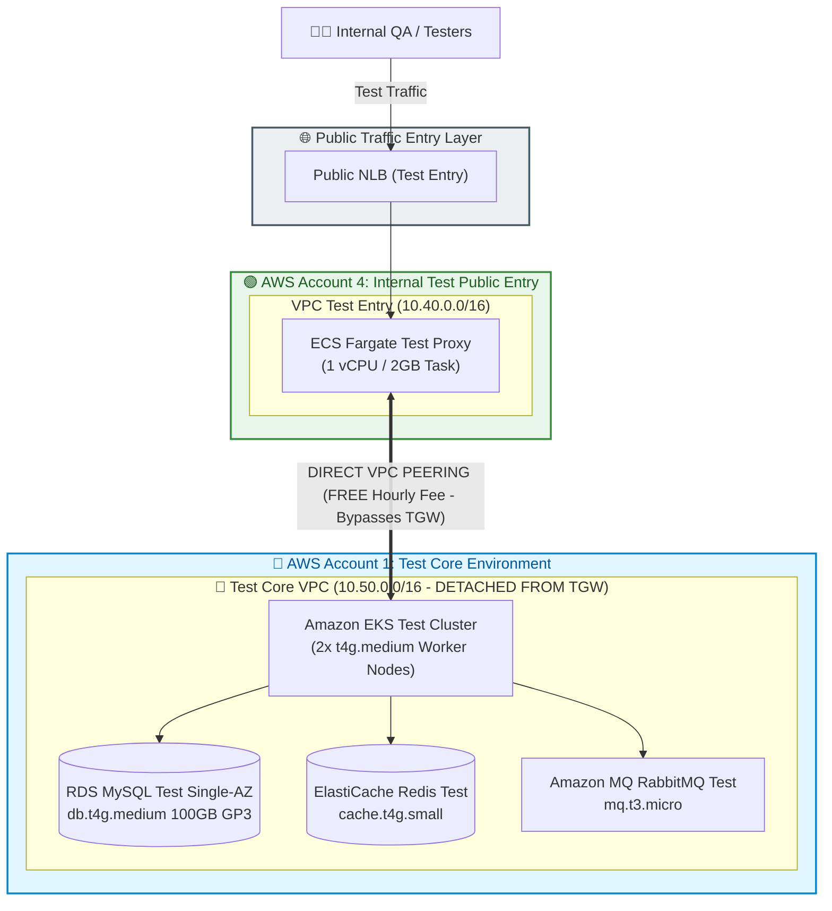
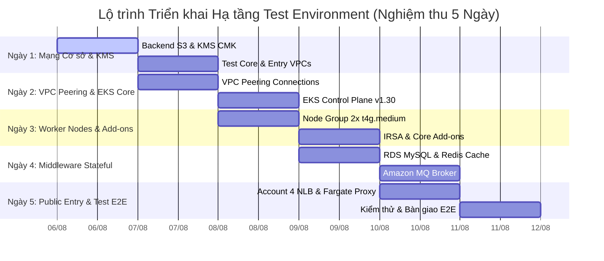

# 📋 TỔNG HỢP CẤU HÌNH CHI TIẾT TERRAFORM IAC — MÔI TRƯỜNG TEST
## (CONSOLIDATED TERRAFORM CONFIGURATION SPECS & MODULE DESIGN PLAN)

---

## 🎨 1. SƠ ĐỒ ARCHITECTURE MÔI TRƯỜNG TEST (MERMAID DIAGRAM)

---

## 📊 2. BẢNG TỔNG HỢP CẤU HÌNH CHI TIẾT TÀI NGUYÊN (RESOURCE SPECIFICATION MATRIX)

| Hạng mục Dịch vụ | Thành phần Hạ tầng | Cấu hình Chi tiết / Identifier | Số lượng | vCPU / RAM | Chi phí Hàng tháng | Ghi chú Tối ưu & Thiết lập Kỹ thuật |
| :--- | :--- | :--- | :---: | :---: | :---: | :--- |
| **Networking** | **Account 1: Test Core VPC** | `10.50.0.0/16` | 1 VPC | - | $43.07 | 2-AZ (`ap-southeast-1a/b`), Public, Private App, DB Subnets |
| **Networking** | **Account 4: Test Entry VPC** | `10.40.0.0/16` | 1 VPC | - | $0.00 | Public Subnets & Private App Subnets |
| **Networking** | **VPC Peering Trực tiếp** | `aws_vpc_peering_connection` | 1 Connection | - | **$0.00** | **Tách khỏi Transit Gateway** (Tiết kiệm $173/tháng phí TGW!) |
| **Security** | **AWS KMS Key** | Customer Managed Key (CMK) | 1 Key | - | $3.00 | Mã hóa tĩnh At-Rest cho RDS, EKS, Secrets Manager & S3 |
| **Compute** | **Amazon EKS Cluster** | `DataBlue-Test-EKS` | 1 Cluster | AWS Managed | $73.00 | Kubernetes v1.30 Control Plane Standard Support |
| **Compute** | **EKS Worker Node Group** | `t4g.medium` (ARM64 Graviton) | 2 Nodes | 2 vCPU / 4 GiB | $63.25 | On-Demand/Spot nodes (`desired: 2`, `min: 2`, `max: 4`) |
| **Database** | **Amazon RDS MySQL** | `datablue-test-mysql` | 1 Instance | 2 vCPU / 4 GiB | $90.00 | `db.t4g.medium` Single-AZ + 100GB đĩa GP3 ($14.50) |
| **Cache** | **ElastiCache Redis** | `datablue-test-redis` | 1 Node | 2 vCPU / 1.37 GiB | $35.00 | `cache.t4g.small` Single Node Cluster |
| **Messaging** | **Amazon MQ RabbitMQ** | `datablue-test-rabbitmq` | 1 Broker | 2 vCPU / 1 GiB | $20.00 | `mq.t3.micro` Single Instance Broker |
| **Entry Proxy** | **Public NLB + Fargate** | `DataBlue-Test-Entry-NLB` | 1 NLB | 1 vCPU / 2 GiB | $55.00 | Fargate Proxy Task + Public Network Load Balancer |
| **TỔNG CỘNG** | **MÔI TRƯỜNG TEST** | **Test Core & Test Entry** | **11 Tài nguyên** | **8 vCPU / 16 GiB** | 💰 **$362.03/tháng** | **Cấu hình tối ưu chi phí cho môi trường Test** |

---

## 🏛️ 3. ĐẶC TẢ CHI TIẾT CÁC TERRAFORM MODULES THIẾT KẾ (MODULE SPECIFICATIONS)

Hệ thống mã nguồn IaC được thiết kế theo cấu trúc Mô-đun (Modular Pattern), chia nhỏ các tài nguyên để tái sử dụng và dễ dàng nâng cấp từ môi trường Test lên Prod:

### 1. Module Mạng VPC
- **Mục tiêu:** Tạo dải mạng phân cấp 3 lớp (3-Tier Topology) hoàn toàn biệt lập.
- **Thành phần:**
  - `aws_vpc`: Khởi tạo VPC với `enable_dns_hostnames = true` và `enable_dns_support = true`.
  - `aws_subnet.public`: Phục vụ Load Balancer (ALB/NLB) và NAT Gateways.
  - `aws_subnet.private_app`: Phục vụ EKS Worker Nodes, microservices và pod networking.
  - `aws_subnet.database`: Phục vụ Database (RDS, Redis, RabbitMQ) - **Cách ly 100% không có đường dẫn ra Internet**.
  - `aws_vpc_peering_connection`: Nối VPC Test Entry (`10.40.0.0/16`) với Test Core VPC (`10.50.0.0/16`).
  - **Auto-Discovery Tags:** Đánh nhãn `kubernetes.io/role/elb = 1` cho Public Subnets và `karpenter.sh/discovery` cho Private Subnets.

### 2. Module Kubernetes EKS
- **Mục tiêu:** Khởi tạo Kubernetes Control Plane v1.30+ và Managed Node Groups.
- **Thành phần:**
  - `aws_eks_cluster`: Control Plane tích hợp mã hóa đĩa KMS CMK và bật Log Audit CloudWatch.
  - `aws_eks_node_group`: Node Group chạy ARM64 Graviton `t4g.medium` (2 vCPU / 4GB RAM) cài đặt tự động scale 2-4 nodes.
  - `aws_iam_role`: Tạo IAM Role OIDC Provider (IRSA) và role cho Karpenter JIT Autoscaler.

### 3. Module Database RDS MySQL
- **Mục tiêu:** Cơ sở dữ liệu quan hệ MySQL 8.0 tối ưu dung lượng và bảo mật.
- **Thành phần:**
  - `aws_db_instance`: Cấu hình `db.t4g.medium` Single-AZ cho môi trường Test, lưu trữ đĩa GP3 100GB có mã hóa KMS.
  - `aws_db_subnet_group`: Đặt DB nằm hoàn toàn trong Subnet cách ly.
  - `aws_security_group`: Chỉ cho phép kết nối từ dải Private App Subnets (`10.50.10.0/24`, `10.50.20.0/24`).

### 4. Module Cache ElastiCache Redis
- **Mục tiêu:** Cung cấp In-Memory Cache lưu trữ Session và dữ liệu chat ngắn hạn (TTL 1 giờ).
- **Thành phần:**
  - `aws_elasticache_replication_group`: Khởi tạo Redis 7.x Single-Node `cache.t4g.small` với mã hóa At-Rest và In-Transit (TLS).

### 5. Module Message Broker Amazon MQ
- **Mục tiêu:** Quản lý hàng đợi tin nhắn bất đồng bộ (Async Event Broker).
- **Thành phần:**
  - `aws_mq_broker`: Chạy RabbitMQ 3.13 quy mô `mq.t3.micro` chế độ `SINGLE_INSTANCE` cho môi trường Test.

### 6. Module Bảo mật AWS KMS CMK
- **Mục tiêu:** Khóa mã hóa dùng riêng quản lý bởi khách hàng (Customer Managed Key).
- **Thành phần:**
  - `aws_kms_key`: Khóa mã hóa tích hợp tự động xoay vòng (Automatic Key Rotation) mã hóa cho RDS, EKS, Secrets Manager, S3 và CloudWatch.

---

## 🚀 4. KẾ HOẠCH VÀ LỘ TRÌNH TRIỂN KHAI NGHỆM THU (5 NGÀY)

### Các Bước Thực Hiện Chi Tiết Theo Ngày (5-Day Execution Plan):

#### 📅 NGÀY 1: NỀN TẢNG MẠNG & BẢO MẬT BAN ĐẦU
- **Sáng (08:00 – 12:00):** Khởi tạo S3 Backend `datablue-tfstate-ap-southeast-1` (`env/test/terraform.tfstate`) và Bảng DynamoDB Locks; triển khai Module `kms` tạo khóa mã hóa dữ liệu tĩnh CMK.
- **Chiều (13:00 – 18:00):** Khởi tạo Test Core VPC (`10.50.0.0/16`) & Test Entry VPC (`10.40.0.0/16`) cùng các subnet phân tầng (Public, Private App, Isolated DB).

#### 📅 NGÀY 2: LIÊN KẾT MẠNG PEERING & KUBERNETES EKS CONTROL PLANE
- **Sáng (08:00 – 12:00):** Khởi tạo `aws_vpc_peering_connection` nối trực tiếp Account 4 & Account 1 (Tách TGW tối ưu chi phí).
- **Chiều (13:00 – 18:00):** Triển khai EKS Control Plane v1.30 tích hợp KMS encryption và CloudWatch audit logs.

#### 📅 NGÀY 3: WORKER NODE GROUPS & CÔNG CỤ NỀN TẢNG KUBERNETES
- **Sáng (08:00 – 12:00):** Cấp phát Node Group 2x `t4g.medium` ARM64 Graviton và cấu hình IAM OIDC Provider (IRSA).
- **Chiều (13:00 – 18:00):** Cài đặt AWS VPC CNI, CoreDNS, kube-proxy, và AWS Load Balancer Controller.

#### 📅 NGÀY 4: TẦNG DỊCH VỤ MIDDLEWARE STATEFUL
- **Sáng (08:00 – 12:00):** Triển khai RDS MySQL `db.t4g.medium` Single-AZ + 100GB GP3 trong dải DB Subnet cách ly.
- **Chiều (13:00 – 18:00):** Triển khai ElastiCache Redis `cache.t4g.small` (Single-Node) & Amazon MQ RabbitMQ `mq.t3.micro`.

#### 📅 NGÀY 5: CỔNG VÀO PUBLIC ENTRY, KIỂM THỬ E2E & NGHIỆM THU BÀN GIAO
- **Sáng (08:00 – 12:00):** Khởi tạo Public Network Load Balancer (NLB) ở Account 4 & ECS Fargate Test Proxy Task.
- **Chiều (13:00 – 18:00):** Thực thi bộ kiểm thử E2E: `terraform validate`, `terraform plan`, ping kiểm tra đường truyền VPC Peering và truy vấn thử RDS/Redis; hoàn tất ký duyệt nghiệm thu bàn giao môi trường Test.

