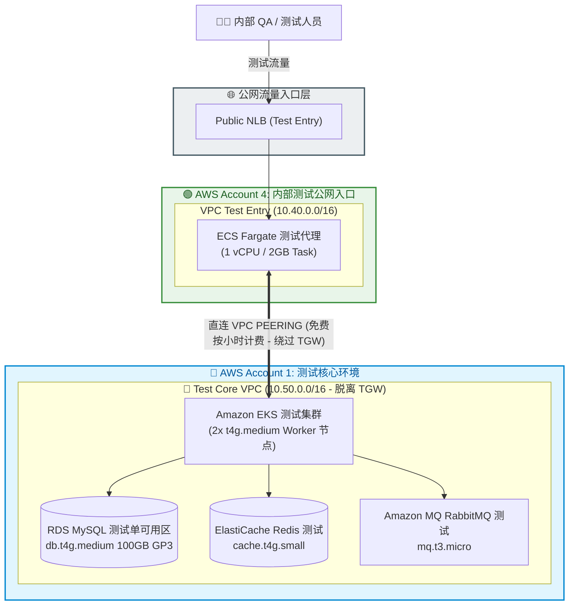
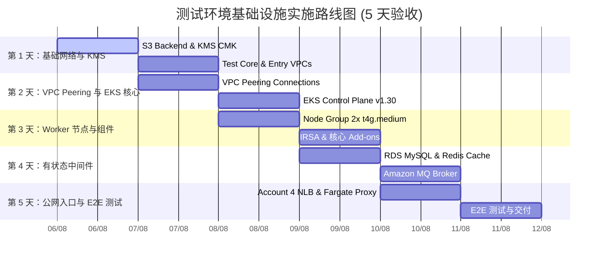

# 📋 TERRAFORM IAC 详细配置汇总 — 测试环境
## (CONSOLIDATED TERRAFORM CONFIGURATION SPECS & MODULE DESIGN PLAN)

---

## 🎨 1. 测试环境架构图 (MERMAID DIAGRAM)

---

## 📊 2. 资源详细配置汇总表 (RESOURCE SPECIFICATION MATRIX)

| 服务分类 | 基础设施组件 | 详细配置 / 标识符 | 数量 | vCPU / RAM | 每月成本 | 优化说明与技术配置 |
| :--- | :--- | :--- | :---: | :---: | :---: | :--- |
| **网络** | **Account 1: Test Core VPC** | `10.50.0.0/16` | 1 个 VPC | - | $43.07 | 2 个可用区 (`ap-southeast-1a/b`)，公网、私网应用、数据库子网 |
| **网络** | **Account 4: Test Entry VPC** | `10.40.0.0/16` | 1 个 VPC | - | $0.00 | 公网子网与私网应用子网 |
| **网络** | **直连 VPC Peering** | `aws_vpc_peering_connection` | 1 个连接 | - | **$0.00** | **脱离 Transit Gateway**（每月节省 $173 TGW 费用！） |
| **安全** | **AWS KMS Key** | 客户管理密钥 (CMK) | 1 个密钥 | - | $3.00 | 为 RDS、EKS、Secrets Manager 和 S3 提供静态加密 (At-Rest) |
| **计算** | **Amazon EKS 集群** | `DataBlue-Test-EKS` | 1 个集群 | AWS 托管 | $73.00 | Kubernetes v1.30 控制平面标准支持 |
| **计算** | **EKS Worker Node Group** | `t4g.medium` (ARM64 Graviton) | 2 个节点 | 2 vCPU / 4 GiB | $63.25 | 按需/Spot 节点 (`desired: 2`, `min: 2`, `max: 4`) |
| **数据库** | **Amazon RDS MySQL** | `datablue-test-mysql` | 1 个实例 | 2 vCPU / 4 GiB | $90.00 | `db.t4g.medium` 单可用区 + 100GB GP3 磁盘 ($14.50) |
| **缓存** | **ElastiCache Redis** | `datablue-test-redis` | 1 个节点 | 2 vCPU / 1.37 GiB | $35.00 | `cache.t4g.small` 单节点集群 |
| **消息队列** | **Amazon MQ RabbitMQ** | `datablue-test-rabbitmq` | 1 个 Broker | 2 vCPU / 1 GiB | $20.00 | `mq.t3.micro` 单实例 Broker |
| **入口代理** | **Public NLB + Fargate** | `DataBlue-Test-Entry-NLB` | 1 个 NLB | 1 vCPU / 2 GiB | $55.00 | Fargate 代理 Task + 公网网络负载均衡器 (NLB) |
| **总计** | **测试环境** | **Test Core & Test Entry** | **11 个资源** | **8 vCPU / 16 GiB** | 💰 **$362.03/月** | **测试环境成本优化配置** |

---

## 🏛️ 3. TERRAFORM 设计模块详细规范 (MODULE SPECIFICATIONS)

IaC 代码库采用模块化模式 (Modular Pattern) 设计，拆分资源以便复用并轻松从测试环境升级至生产环境：

### 1. VPC 网络模块
- **目标：** 创建完全隔离的三层网络拓扑 (3-Tier Topology)。
- **组件：**
  - `aws_vpc`：初始化 VPC，设置 `enable_dns_hostnames = true` 与 `enable_dns_support = true`。
  - `aws_subnet.public`：服务于负载均衡器 (ALB/NLB) 及 NAT 网关。
  - `aws_subnet.private_app`：服务于 EKS Worker 节点、微服务及 Pod 网络。
  - `aws_subnet.database`：服务于数据库 (RDS、Redis、RabbitMQ) — **100% 隔离，无公网路由路径**。
  - `aws_vpc_peering_connection`：连接 Test Entry VPC (`10.40.0.0/16`) 与 Test Core VPC (`10.50.0.0/16`)。
  - **自动发现标签 (Auto-Discovery Tags)：** 公网子网打标签 `kubernetes.io/role/elb = 1`，私网子网打标签 `karpenter.sh/discovery`。

### 2. Kubernetes EKS 模块
- **目标：** 初始化 Kubernetes 控制平面 v1.30+ 及托管节点组 (Managed Node Groups)。
- **组件：**
  - `aws_eks_cluster`：控制平面集成 KMS CMK 磁盘加密，并开启 CloudWatch Audit 日志。
  - `aws_eks_node_group`：节点组运行 ARM64 Graviton `t4g.medium` (2 vCPU / 4GB RAM)，配置自动扩缩容 2-4 节点。
  - `aws_iam_role`：创建 IAM Role OIDC Provider (IRSA) 及 Karpenter JIT Autoscaler 角色。

### 3. RDS MySQL 数据库模块
- **目标：** 容量与安全优化的 MySQL 8.0 关系型数据库。
- **组件：**
  - `aws_db_instance`：测试环境配置 `db.t4g.medium` 单可用区，存储采用 100GB GP3 磁盘及 KMS 加密。
  - `aws_db_subnet_group`：数据库完全置于隔离子网内。
  - `aws_security_group`：仅允许来自私网应用子网 (`10.50.10.0/24`, `10.50.20.0/24`) 的连接。

### 4. ElastiCache Redis 缓存模块
- **目标：** 提供内存缓存，用于存储 Session 及短期聊天数据 (TTL 1 小时)。
- **组件：**
  - `aws_elasticache_replication_group`：初始化 Redis 7.x 单节点 `cache.t4g.small`，具备静态加密及传输加密 (TLS)。

### 5. Amazon MQ 消息队列模块
- **目标：** 管理异步消息队列 (Async Event Broker)。
- **组件：**
  - `aws_mq_broker`：测试环境运行 RabbitMQ 3.13，规格为 `mq.t3.micro` 单实例模式 (`SINGLE_INSTANCE`)。

### 6. AWS KMS CMK 安全模块
- **目标：** 客户管理的专属加密密钥 (Customer Managed Key)。
- **组件：**
  - `aws_kms_key`：集成自动密钥轮换 (Automatic Key Rotation) 的加密密钥，为 RDS、EKS、Secrets Manager、S3 及 CloudWatch 提供加密。

---

## 🚀 4. 验收实施计划与路线图 (5 天)

### 按天分的详细执行计划 (5-Day Execution Plan):

#### 📅 第 1 天：基础网络与初始安全配置
- **上午 (08:00 – 12:00):** 初始化 S3 Backend `datablue-test-tfstate-ap-southeast-1` 与 DynamoDB Locks 表；部署 `kms` 模块生成静态数据加密 CMK 密钥。
- **下午 (13:00 – 18:00):** 初始化 Test Core VPC (`10.50.0.0/16`) & Test Entry VPC (`10.40.0.0/16`) 及其分层子网（公网、私网应用、隔离数据库）。

#### 📅 第 2 天：网络 PEERING 连接与 KUBERNETES EKS 控制平面
- **上午 (08:00 – 12:00):** 创建 `aws_vpc_peering_connection` 直连 Account 4 与 Account 1（脱离 TGW 以降低成本）。
- **下午 (13:00 – 18:00):** 部署 EKS Control Plane v1.30，集成 KMS 加密与 CloudWatch 审计日志。

#### 📅 第 3 天：WORKER 节点组与 KUBERNETES 基础组件
- **上午 (08:00 – 12:00):** 部署 Node Group 2x `t4g.medium` ARM64 Graviton，配置 IAM OIDC Provider (IRSA)。
- **下午 (13:00 – 18:00):** 安装 AWS VPC CNI、CoreDNS、kube-proxy 以及 AWS Load Balancer Controller。

#### 📅 第 4 天：有状态中间件服务层
- **上午 (08:00 – 12:00):** 在隔离数据库子网内部署 RDS MySQL `db.t4g.medium` 单可用区 + 100GB GP3。
- **下午 (13:00 – 18:00):** 部署 ElastiCache Redis `cache.t4g.small` (单节点) 与 Amazon MQ RabbitMQ `mq.t3.micro`。

#### 📅 第 5 天：公网入口、E2E 测试与交付验收
- **上午 (08:00 – 12:00):** 在 Account 4 创建公网网络负载均衡器 (NLB) 与 ECS Fargate 测试代理 Task。
- **下午 (13:00 – 18:00):** 执行 E2E 测试套件：`terraform validate`、`terraform plan`、VPC Peering 连通性测试及 RDS/Redis 试查；完成测试环境交付签署。
