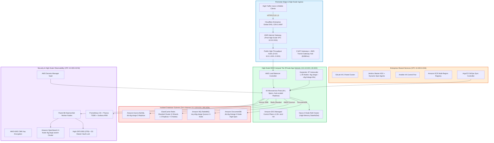

# Scenario 3 Operational Runbook: Production Enhanced High Availability

**Project Identifier**: `datablue-nextgen-infra-platform`  
**Target Environment**: Production High-Scale HA (`DataBlue-Prod-Account`)  
**Target Monthly Budget**: `$7,200 – $10,500 / month`  
**Governance Standard**: Architecture-First Governance Standard (`OPERATING-MODEL.md`)

---

## 1. Architecture Diagram & Infrastructure Topology

Scenario 3 delivers a high-throughput 3-AZ production environment featuring Amazon Aurora MySQL (3 Replicas), ElastiCache Redis Sharded Cluster (6 Nodes), Amazon MQ RabbitMQ Quorum Broker, and Amazon OpenSearch (4 Nodes):



---

## 2. Terraform Provisioning Workflow

```bash
# 1. Navigate to Scenario 3 directory
cd scenarios/scenario-3-prod-high-scale-ha

# 2. Initialize Terraform modules and backend
terraform init

# 3. Validate configuration
terraform validate

# 4. Generate execution plan
terraform plan -out=tfplan-prod-ha

# 5. Apply configuration (GATE-07 CAB authorization required)
terraform apply tfplan-prod-ha
```

---

## 3. High-Throughput Cluster Operations

### 3.1 Aurora MySQL Auto-Scaling & Read Endpoint Verification
```bash
# Verify Aurora Cluster endpoints and reader replicas
aws rds describe-db-clusters --db-cluster-identifier databue-aurora-mysql-cluster \
  --query 'DBClusters[0].[Endpoint,ReaderEndpoint,Status]'
```

### 3.2 Redis Sharded Cluster Health Check
```bash
# Verify ElastiCache Redis 6-node cluster status
aws elasticache describe-replication-groups --replication-group-id databue-prod-ha-redis \
  --query 'ReplicationGroups[0].[Status,NodeGroups[*].NodeGroupMembers[*].ReadEndpoint.Address]'
```

---

## 4. Load Testing & Performance Benchmark Validation

Validate 10,000 concurrent user load test benchmarks (`PERFORMANCE-VALIDATION.md`):
* **k6 Load Test Execution**:
  ```bash
  k6 run --vus 10000 --duration 30m tests/load/k6-microservices-benchmark.js
  ```
* **Target SLAs**: P95 Latency < 200ms, Error Rate < 0.01%, Karpenter node provisioning < 60s.

---

## 5. Day-2 High-Scale Troubleshooting Guide

### 5.1 Issue 1: Aurora MySQL Read Replica Lag & Lock Contention
* **Symptom**: Replica Lag metric increases > 100ms during peak load spikes.
* **Root Cause**: High-volume write transactions blocking Aurora storage nodes.
* **Troubleshooting & Remediation**:
  1. Inspect Aurora replica lag metric in CloudWatch:
     ```bash
     aws cloudwatch get-metric-statistics --namespace AWS/RDS --metric-name ReplicaLag \
       --dimensions Name=DBClusterIdentifier,Value=databue-aurora-mysql-cluster \
       --start-time $(date -u -v-1H +%Y-%m-%dT%H:%M:%SZ) --end-time $(date -u +%Y-%m-%dT%H:%M:%SZ) \
       --period 60 --statistics Average
     ```
  2. Enable Aurora Auto-Scaling for Read Replicas: configure Aurora Auto Scaling Policy based on Average CPU Utilization (> 70%).

### 5.2 Issue 2: ElastiCache Redis Memory Eviction Spikes (`OOM command not allowed`)
* **Symptom**: Redis returns `OOM command not allowed when used memory > 'maxmemory'`.
* **Root Cause**: Unbounded key expiration policies or improper cache eviction configuration.
* **Troubleshooting & Remediation**:
  1. Verify Redis maxmemory-policy is set to `volatile-lru` or `allkeys-lru` in `aws_elasticache_parameter_group.this`.
  2. Scale up Redis cluster shard count or node type (`cache.r6g.xlarge`).

### 5.3 Issue 3: RabbitMQ Quorum Queue Desynchronization / High Memory High Watermark
* **Symptom**: RabbitMQ Broker logs indicate `memory resource limit alarm set` and stops accepting messages.
* **Root Cause**: Unconsumed queue messages accumulating in RabbitMQ Quorum Queues.
* **Troubleshooting & Remediation**:
  1. Inspect RabbitMQ Management API queue depth:
     ```bash
     curl -u databue_mq_admin:password https://${RABBITMQ_ENDPOINT}:15671/api/queues
     ```
  2. Scale out application consumer Pod replicas using HPA based on custom RabbitMQ queue depth metrics.
