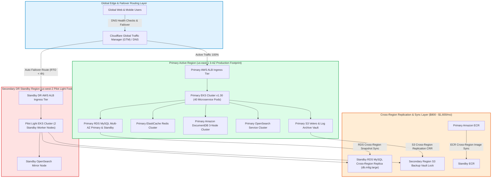

# Scenario 4 Operational Runbook: Production Cross-Region Disaster Recovery

**Project Identifier**: `datablue-nextgen-infra-platform`  
**Target Environment**: Primary Active (`us-east-1`) + Secondary Standby Pilot Light DR (`us-west-2`)  
**Target Monthly Budget**: `$10,000 – $14,800 / month`  
**Target Disaster Recovery SLAs**: **RTO < 4 Hours | RPO < 15 Minutes** (`ADR-014`)

---

## 1. Architecture Diagram & Infrastructure Topology

Scenario 4 implements a Multi-Region Pilot Light Disaster Recovery architecture. The primary active region (`us-east-1`) handles 100% of live traffic, while the secondary standby region (`us-west-2`) maintains a pilot light EKS cluster, asynchronous S3 Cross-Region Replication (CRR), and RDS cross-region read replicas:



---

## 2. Terraform Dual-Region Provisioning Workflow

```bash
# 1. Navigate to Scenario 4 directory
cd scenarios/scenario-4-prod-cross-region-dr

# 2. Initialize Terraform dual-region backend
terraform init

# 3. Generate execution plan for both regions
terraform plan -out=tfplan-cross-region-dr

# 4. Apply cross-region deployment
terraform apply tfplan-cross-region-dr
```

---

## 3. Disaster Recovery Failover & Drill Runbook

In the event of a total AWS regional outage in `us-east-1`:

### Step 1: Declare Regional Disaster (SRE Lead / CAB Decision)
* Verify primary region outage via CloudWatch / AWS Health Dashboard.
* Formal declaration of regional failover.

### Step 2: Scale Up Pilot Light EKS Compute Nodes (`us-west-2`)
```bash
# Connect to secondary DR cluster
aws eks update-kubeconfig --region us-west-2 --name DataBlue-StandbyDR-EKS

# Scale EKS NodePool from Pilot Light (2 nodes) to Production (16+ nodes)
kubectl scale deployment/karpenter -n karpenter --replicas=3
```

### Step 3: Promote Secondary RDS Read Replica to Primary
```bash
# Promote us-west-2 RDS Read Replica to standalone master
aws rds promote-read-replica --region us-west-2 \
  --db-instance-identifier databue-secondary-dr-mysql
```

### Step 4: Update Cloudflare Global Traffic Manager (GTM) Route
* Switch Cloudflare GTM DNS routing policy to point `100%` of ingress traffic to `us-west-2` Application Load Balancer.
* Target Total Failover Time: **< 4 Hours (RTO Pass)**.
* Maximum Data Loss: **< 15 Minutes (RPO Pass)**.

---

## 4. DR Fallback / Failback Runbook (Post-Outage Resolution)

Once `us-east-1` is fully restored and healthy:
1. Re-establish S3 Cross-Region Replication from `us-west-2` back to `us-east-1`.
2. Sync RDS transaction log diffs back to primary region.
3. Switch Cloudflare GTM DNS routing back to `us-east-1`.
4. Scale down `us-west-2` EKS node count back to 2 Pilot Light nodes.

---

## 5. Day-2 Disaster Recovery Troubleshooting Guide

### 5.1 Issue 1: S3 Cross-Region Replication (CRR) Lag Exceeds 15 Minutes (RPO Breach Risk)
* **Symptom**: `ReplicationLatency` metric in CloudWatch increases > 900 seconds.
* **Root Cause**: High-volume log or backup file upload saturating S3 replication bandwidth.
* **Troubleshooting & Remediation**:
  1. Inspect S3 Replication Metrics:
     ```bash
     aws cloudwatch get-metric-statistics --namespace AWS/S3 --metric-name ReplicationLatency \
       --dimensions Name=BucketName,Value=datablue-primary-backup-vault-us-east-1 Name=RuleId,Value=CRR-Rule \
       --start-time $(date -u -v-1H +%Y-%m-%dT%H:%M:%SZ) --end-time $(date -u +%Y-%m-%dT%H:%M:%SZ) \
       --period 60 --statistics Maximum
     ```
  2. Enable S3 Replication Time Control (RTC) to guarantee 99.9% of objects replicate within 15 minutes.

### 5.2 Issue 2: Promoted DR RDS Read Replica Fails to Accept Write Traffic
* **Symptom**: Application Pods in `us-west-2` encounter `ERROR 1290 (HY000): The MySQL server is running with the --read-only option`.
* **Root Cause**: RDS Read Replica promotion script did not complete or `read_only` parameter group remained set to `1`.
* **Troubleshooting & Remediation**:
  1. Verify promotion status:
     ```bash
     aws rds describe-db-instances --region us-west-2 --db-instance-identifier databue-secondary-dr-mysql \
       --query 'DBInstances[0].Status'
     ```
  2. Force `read_only` parameter to `0` in target parameter group:
     ```bash
     aws rds modify-db-parameter-group --region us-west-2 \
       --db-parameter-group-name databue-secondary-dr-mysql-params \
       --parameters "ParameterName=read_only,ParameterValue=0,ApplyMethod=immediate"
     ```
