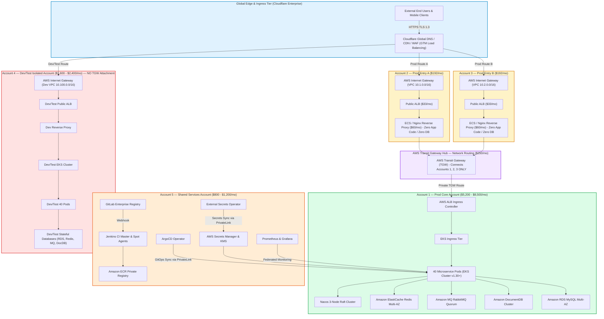

# Scenario 5 Operational Runbook: Enterprise Multi-Account Isolation Architecture

**Project Identifier**: `datablue-nextgen-infra-platform`  
**Target Environment**: 5 AWS Accounts Landing Zone (`Prod Core`, `Prod Entry A`, `Prod Entry B`, `Dev/Test Isolated`, `Shared Services`)  
**Target Monthly Budget**: `$12,000 – $18,500 / month`  
**Governance Standard**: Architecture-First Governance Standard (`ADR-001`, `ADR-002`)

---

## 1. Architecture Diagram & Landing Zone Isolation Topology

Scenario 5 deploys a strict 5-account AWS Landing Zone architecture with dual Entry reverse proxies, AWS Transit Gateway Hub, and 100% isolation for Dev/Test:



---

## 2. Multi-Account Terraform Provisioning Workflow

### 2.1 Multi-Account IAM Credentials Setup
Set up AWS CLI profiles for each of the 5 AWS Accounts using IAM Identity Center (SSO):
```bash
aws configure sso --profile datablue-prod-core
aws configure sso --profile datablue-prod-entry-a
aws configure sso --profile datablue-prod-entry-b
aws configure sso --profile datablue-dev-test
aws configure sso --profile datablue-shared-services
```

### 2.2 Terraform Multi-Provider Execution
```bash
# 1. Navigate to Scenario 5 directory
cd scenarios/scenario-5-enterprise-multi-account

# 2. Initialize Landing Zone backend
terraform init

# 3. Generate multi-account plan
terraform plan -out=tfplan-landing-zone

# 4. Apply Landing Zone configuration (GATE-07 CAB sign-off required)
terraform apply tfplan-landing-zone
```

---

## 3. Security Boundary & Connectivity Audit

### Rule 1: Dev/Test Isolation Audit (`Account 4`)
Verify that `Account 4 (Dev/Test)` has **ZERO** Transit Gateway attachments, **ZERO** VPC Peering connections, and **ZERO** access permissions to `Account 1 (Prod Core)`:
```bash
# Verify no TGW attachments exist in Account 4 Dev/Test
aws ec2 describe-transit-gateway-attachments --profile datablue-dev-test
# Expected output: [] (Empty)
```

### Rule 2: Shared Services Private Ingress Audit (`Account 5`)
Verify that `Account 5 (Shared Services)` has **ZERO** direct Public Internet Ingress routes. All access must be via AWS PrivateLink or internal VPC routing.

### Rule 3: Entry Proxy Reverse Proxy Health Check (`Account 2 & 3`)
Verify Nginx reverse proxy containers in Entry A and Entry B perform TLS termination and forwarding over AWS Transit Gateway Hub to `Account 1 Prod Core`:
```bash
curl -Iv https://entry-a.datablue.internal/healthz
curl -Iv https://entry-b.datablue.internal/healthz
```

---

## 4. Emergency Incident Runbook

### Emergency Isolation Protocol
In the event of an identified security breach in Entry A (`Account 2`):
1. Immediately detach Transit Gateway Attachment for `Account 2`:
   ```bash
   aws ec2 delete-transit-gateway-vpc-attachment --profile datablue-prod-core \
     --transit-gateway-attachment-id tgw-attach-entry-a-xxx
   ```
2. Cloudflare GTM automatically shifts 100% of ingress traffic to Entry B (`Account 3`).
3. Production Core (`Account 1`) remains 100% operational and protected.

---

## 5. Day-2 Multi-Account Troubleshooting Guide

### 5.1 Issue 1: Transit Gateway Packet Loss / Cross-Account Route Table Mismatch
* **Symptom**: Entry A (`Account 2`) reverse proxy receives HTTP 504 Gateway Timeout when forwarding traffic to Prod Core (`Account 1`).
* **Root Cause**: Transit Gateway Route Table missing static route entry for Prod Core VPC CIDR (`10.0.0.0/16`).
* **Troubleshooting & Remediation**:
  1. Inspect Transit Gateway Route Table in Prod Core Account (`Account 1`):
     ```bash
     aws ec2 describe-transit-gateway-route-tables --profile datablue-prod-core
     ```
  2. Add static route for `10.0.0.0/16` targeting Prod Core VPC Attachment.

### 5.2 Issue 2: Unauthorized Cross-Account Access Attempt Detected in GuardDuty
* **Symptom**: GuardDuty finding `UnauthorizedAccess:IAMUser/InstanceCredentialExfiltration` triggered in Account 4 (Dev/Test).
* **Root Cause**: Dev/Test IAM role attempted to call STS AssumeRole targeting Prod Core Account.
* **Troubleshooting & Remediation**:
  1. Verify Service Control Policies (SCP) in AWS Organizations: ensure SCP `DenyCrossAccountAssumeRoleDevToProd` is enforced on Organizational Unit `OU-DevTest`.
  2. Audit IAM Roles in Account 4 Dev/Test to revoke unapproved IAM trust policies.
